# 🏗️ System Design Blueprints

> A curated collection of **production-grade system design blueprints** with architecture diagrams, API specs, and AWS service mappings. Built for engineers preparing for system design interviews and building real-world distributed systems.

---

## ⚡ Interactive Architecture Explorer

We have built a premium, interactive web dashboard to explore all 18 completed distributed architectures in real-time.

* **🚀 Launch Live Dashboard:** [https://udaysingh-system-design.web.app](https://udaysingh-system-design.web.app)
* **💻 Run Locally:** [Launch locally (http://localhost:8000)](http://localhost:8000) (when serving from your local server port `8000`)
* **Features:**
  * **Clickable Diagram Nodes:** Select any service icon (like ALB, ECS, DynamoDB, OpenSearch, etc.) to immediately inspect its operational role, live JSON data payloads, and matching AWS Terraform configuration blocks.
  * **Traffic Simulator:** Toggle live neon data packet flow animations to trace queries passing through VPC subnet boundaries.

---

## 📋 Table of Contents

- [🗺️ System Design Roadmap](#️-system-design-roadmap)
- [📂 Completed Blueprints](#-completed-blueprints)
  - **Level 1 – Core System Design**
    - [🔗 URL Shortener System Design](#11-url-shortener-system-design)
    - [📋 Pastebin System Design](#12-pastebin-system-design)
    - [🗄️ Distributed File Storage System Design](#13-distributed-file-storage-system-design)
    - [📂 Dropbox System Design](#14-dropbox-system-design)
    - [🅿️ Smart Parking Lot System Design](#15-smart-parking-lot-system-design)
    - [📚 Smart Library Management System Design](#16-smart-library-management-system-design)
    - [🏧 Automated Teller Machine (ATM) System Design](#17-automated-teller-machine-atm-system-design)
    - [🛗 Smart Multi-Elevator Control System Design](#18-smart-multi-elevator-control-system-design)
    - [🏨 Global Hotel Booking System Design](#19-global-hotel-booking-system-design)
  - **Level 4 – Ride Sharing & Delivery**
    - [🍔 Food Delivery System Design](#41-food-delivery-system-design)
  - **Level 7 – AI Systems**
    - [🧠 RAG Pipeline System Design](#71-rag-pipeline-system-design)
    - [💾 Vector Database System Design](#72-vector-database-system-design)
    - [🤖 ChatGPT System Design](#73-chatgpt-system-design)
    - [🤖 AI Agent Framework System Design](#74-ai-agent-framework-system-design)
    - [🌐 LLM Gateway System Design](#75-llm-gateway-system-design)
    - [🔍 Semantic Search System Design](#76-semantic-search-system-design)
    - [⚡ Token Streaming System Design](#77-token-streaming-system-design)
  - **Level 8 – Distributed Systems**
    - [🌐 API Gateway System Design](#81-api-gateway-system-design)
- [☕ Support](#-support)

## 🗺️ System Design Roadmap

A comprehensive roadmap of **100+ system design questions** organized by difficulty level. Topics with ✅ have detailed blueprints available — click the link to explore.

> **Legend:** ✅ Completed (with link) · ⬜ Planned

---

### Level 1 – Core System Design

| # | Topic | Status |
|---|-------|--------|
| 1 | Design a URL Shortener | ✅ [Blueprint](./level_1_core_system_design/url_shortener/url_shortener_system_design.md) |
| 2 | Design Pastebin | ✅ [Blueprint](./level_1_core_system_design/pastebin/pastebin_system_design.md) |
| 3 | Design File Storage System | ✅ [Blueprint](./level_1_core_system_design/file_storage/file_storage_system_design.md) |
| 4 | Design Dropbox | ✅ [Blueprint](./level_1_core_system_design/dropbox/dropbox_system_design.md) |
| 5 | Design Parking Lot | ✅ [Blueprint](./level_1_core_system_design/parking_lot/parking_lot_system_design.md) |
| 6 | Design Library Management System | ✅ [Blueprint](./level_1_core_system_design/library_management/library_management_system_design.md) |
| 7 | Design ATM System | ✅ [Blueprint](./level_1_core_system_design/atm/atm_system_design.md) |
| 8 | Design Elevator System | ✅ [Blueprint](./level_1_core_system_design/elevator_system/elevator_system_design.md) |
| 9 | Design Hotel Booking System | ✅ [Blueprint](./level_1_core_system_design/hotel_booking/hotel_booking_system_design.md) |

---

### Level 2 – Popular Real-world Systems

| # | Topic | Status |
|---|-------|--------|
| 1 | Design WhatsApp | ⬜ Planned |
| 2 | Design Facebook Messenger | ⬜ Planned |
| 3 | Design Slack | ⬜ Planned |
| 4 | Design Gmail | ⬜ Planned |
| 5 | Design Zoom | ⬜ Planned |
| 6 | Design Netflix | ⬜ Planned |
| 7 | Design YouTube | ⬜ Planned |
| 8 | Design Spotify | ⬜ Planned |
| 9 | Design Instagram | ⬜ Planned |

---

### Level 3 – E-commerce

| # | Topic | Status |
|---|-------|--------|
| 1 | Design Amazon | ⬜ Planned |
| 2 | Design Shopping Cart | ⬜ Planned |
| 3 | Design Checkout Service | ⬜ Planned |
| 4 | Design Inventory Management | ⬜ Planned |
| 5 | Design Product Search | ⬜ Planned |
| 6 | Design Recommendation Engine | ⬜ Planned |
| 7 | Design Order Management | ⬜ Planned |
| 8 | Design Payment Gateway | ⬜ Planned |
| 9 | Design Coupon Service | ⬜ Planned |

---

### Level 4 – Ride Sharing & Delivery

| # | Topic | Status |
|---|-------|--------|
| 1 | Design Uber | ⬜ Planned |
| 2 | Design Food Delivery Platform | ✅ [Blueprint](./level_4_ride_sharing_delivery/food_delivery/food_delivery_system_design.md) |
| 3 | Design Blinkit / Zepto | ⬜ Planned |
| 4 | Design Rider Dispatch | ⬜ Planned |
| 5 | Design ETA Calculation | ⬜ Planned |

---

### Level 5 – Social Media

| # | Topic | Status |
|---|-------|--------|
| 1 | Design Facebook | ⬜ Planned |
| 2 | Design Twitter / X | ⬜ Planned |
| 3 | Design LinkedIn | ⬜ Planned |
| 4 | Design Reddit | ⬜ Planned |
| 5 | Design News Feed | ⬜ Planned |
| 6 | Design Trending Topics | ⬜ Planned |

---

### Level 6 – Streaming

| # | Topic | Status |
|---|-------|--------|
| 1 | Design Video Streaming Platform | ⬜ Planned |
| 2 | Design Live Streaming | ⬜ Planned |
| 3 | Design CDN | ⬜ Planned |
| 4 | Design Video Encoding | ⬜ Planned |
| 5 | Design Adaptive Bitrate Streaming | ⬜ Planned |

---

### Level 7 – AI Systems

| # | Topic | Status |
|---|-------|--------|
| 1 | Design ChatGPT | ✅ [Blueprint](./level_7_ai_systems/chat_gpt/chatgpt_system_design.md) |
| 2 | Design RAG Pipeline | ✅ [Blueprint](./level_7_ai_systems/rag_pipeline/rag_pipeline_system_design.md) |
| 3 | Design Vector Database | ✅ [Blueprint](./level_7_ai_systems/vector_database/vector_database_system_design.md) |
| 4 | Design AI Agent Framework | ✅ [Blueprint](./level_7_ai_systems/ai_agent_framework/ai_agent_framework_system_design.md) |
| 5 | Design LLM Gateway | ✅ [Blueprint](./level_7_ai_systems/llm_gateway/llm_gateway_system_design.md) |
| 6 | Design Semantic Search | ✅ [Blueprint](./level_7_ai_systems/semantic_search/semantic_search_system_design.md) |
| 7 | Design Token Streaming | ✅ [Blueprint](./level_7_ai_systems/token_streaming/token_streaming_system_design.md) |

---

### Level 8 – Distributed Systems

| # | Topic | Status |
|---|-------|--------|
| 1 | Distributed Cache | ⬜ Planned |
| 2 | Distributed Lock | ⬜ Planned |
| 3 | Distributed Queue | ⬜ Planned |
| 4 | API Gateway | ✅ [Blueprint](./level_8_distributed_systems/api_gateway/api_gateway_system_design.md) |
| 5 | Service Discovery | ⬜ Planned |
| 6 | Rate Limiter | ⬜ Planned |
| 7 | Circuit Breaker | ⬜ Planned |
| 8 | Saga Pattern | ⬜ Planned |
| 9 | CQRS | ⬜ Planned |
| 10 | Event Sourcing | ⬜ Planned |

---

### Level 9 – Storage Systems

| # | Topic | Status |
|---|-------|--------|
| 1 | Design Redis | ⬜ Planned |
| 2 | Design Cassandra | ⬜ Planned |
| 3 | Design DynamoDB | ⬜ Planned |
| 4 | Design Elasticsearch | ⬜ Planned |
| 5 | Design MongoDB | ⬜ Planned |
| 6 | Design Object Storage (S3) | ⬜ Planned |

---

### Level 10 – Search Systems

| # | Topic | Status |
|---|-------|--------|
| 1 | Design Google Search | ⬜ Planned |
| 2 | Search Autocomplete | ⬜ Planned |
| 3 | Spell Checker | ⬜ Planned |
| 4 | Web Crawler | ⬜ Planned |
| 5 | Search Ranking | ⬜ Planned |

---

### Level 11 – Financial Systems

| # | Topic | Status |
|---|-------|--------|
| 1 | Design PayPal | ⬜ Planned |
| 2 | Design UPI | ⬜ Planned |
| 3 | Design Wallet | ⬜ Planned |
| 4 | Design Fraud Detection | ⬜ Planned |
| 5 | Design Ledger Service | ⬜ Planned |

---

### Level 12 – Cloud Systems

| # | Topic | Status |
|---|-------|--------|
| 1 | Design AWS S3 | ⬜ Planned |
| 2 | Design AWS Lambda | ⬜ Planned |
| 3 | Design Kubernetes | ⬜ Planned |
| 4 | Design CI/CD Pipeline | ⬜ Planned |
| 5 | Design Service Mesh | ⬜ Planned |

---

### Level 13 – Notification Systems

| # | Topic | Status |
|---|-------|--------|
| 1 | Push Notifications | ⬜ Planned |
| 2 | Email Service | ⬜ Planned |
| 3 | SMS Gateway | ⬜ Planned |
| 4 | WebSocket Notifications | ⬜ Planned |
| 5 | OTP Service | ⬜ Planned |

---

### Level 14 – Observability

| # | Topic | Status |
|---|-------|--------|
| 1 | Logging Platform | ⬜ Planned |
| 2 | Metrics Collection | ⬜ Planned |
| 3 | Distributed Tracing | ⬜ Planned |
| 4 | Alert Manager | ⬜ Planned |
| 5 | Monitoring Dashboard | ⬜ Planned |

---

### Level 15 – Interview Favorites

| # | Topic | Status |
|---|-------|--------|
| 1 | Design Google Docs | ⬜ Planned |
| 2 | Design Google Maps | ⬜ Planned |
| 3 | Design Airbnb | ⬜ Planned |
| 4 | Design GitHub | ⬜ Planned |
| 5 | Design GitHub Actions | ⬜ Planned |
| 6 | Design Notion | ⬜ Planned |
| 7 | Design Figma | ⬜ Planned |

---

### 🔥 Advanced Topics

| # | Topic | Status |
|---|-------|--------|
| 1 | Consistent Hashing | ⬜ Planned |
| 2 | Sharding | ⬜ Planned |
| 3 | CAP Theorem | ⬜ Planned |
| 4 | Multi-Region Systems | ⬜ Planned |
| 5 | Kafka Event Streaming | ⬜ Planned |
| 6 | Feature Flags | ⬜ Planned |
| 7 | IAM | ⬜ Planned |
| 8 | OAuth2 & SSO | ⬜ Planned |
| 9 | Zero Trust | ⬜ Planned |
| 10 | Disaster Recovery | ⬜ Planned |

---

## 📊 Progress Tracker

| Level | Category | Total | Completed | Progress |
|-------|----------|-------|-----------|----------|
| 1 | Core System Design | 9 | 9 | ✅✅✅✅✅✅✅✅✅ |
| 2 | Popular Real-world Systems | 9 | 0 | ⬜⬜⬜⬜⬜⬜⬜⬜⬜ |
| 3 | E-commerce | 9 | 0 | ⬜⬜⬜⬜⬜⬜⬜⬜⬜ |
| 4 | Ride Sharing & Delivery | 5 | 1 | ✅⬜⬜⬜⬜ |
| 5 | Social Media | 6 | 0 | ⬜⬜⬜⬜⬜⬜ |
| 6 | Streaming | 5 | 0 | ⬜⬜⬜⬜⬜ |
| 7 | AI Systems | 7 | 7 | ✅✅✅✅✅✅✅ |
| 8 | Distributed Systems | 10 | 1 | ✅⬜⬜⬜⬜⬜⬜⬜⬜⬜ |
| 9 | Storage Systems | 6 | 0 | ⬜⬜⬜⬜⬜⬜ |
| 10 | Search Systems | 5 | 0 | ⬜⬜⬜⬜⬜ |
| 11 | Financial Systems | 5 | 0 | ⬜⬜⬜⬜⬜ |
| 12 | Cloud Systems | 5 | 0 | ⬜⬜⬜⬜⬜ |
| 13 | Notification Systems | 5 | 0 | ⬜⬜⬜⬜⬜ |
| 14 | Observability | 5 | 0 | ⬜⬜⬜⬜⬜ |
| 15 | Interview Favorites | 7 | 0 | ⬜⬜⬜⬜⬜⬜⬜ |
| 🔥 | Advanced Topics | 10 | 0 | ⬜⬜⬜⬜⬜⬜⬜⬜⬜⬜ |
| | **Total** | **108** | **18** | **16.7%** |

---

## 📂 Completed Blueprints

### Level 1 – Core System Design

#### 1.1 URL Shortener System Design
A production-grade system design for a high-scale URL shortening service like **Bitly** or **TinyURL**. Covers unique key generation (KGS), multi-layer caching (CDN → Redis → PostgreSQL), real-time click analytics, and 301 vs 302 redirect trade-offs.

* **Documentation:** [URL Shortener System Design (url_shortener_system_design.md)](./level_1_core_system_design/url_shortener/url_shortener_system_design.md)

#### URL Shortener Tech Stack Details (with AWS Service Mapping)
* **PostgreSQL (Amazon Aurora PostgreSQL):** Stores URL mappings with `short_code` as primary key for database-level uniqueness enforcement. Aurora Global Database provides cross-region replication with $< 1\text{s}$ lag.
* **Redis (Amazon ElastiCache for Redis):** In-memory URL cache serving redirect lookups in $< 1\text{ms}$. Cluster mode shards keys via hash slots for horizontal scaling. Also used for rate limiting with atomic `INCR` counters.
* **Apache Kafka (Amazon MSK):** Decouples the redirect hot path from analytics processing. Click events are buffered durably and consumed asynchronously by stream processors.
* **ClickHouse (Amazon Redshift Serverless):** Column-oriented OLAP store for real-time click analytics — aggregating billions of click events by country, device, referrer, and time.
* **CloudFront (CDN):** Edge-caches redirect responses at 400+ global locations, absorbing 60%+ of traffic for viral short URLs.

#### URL Shortener Architecture Diagrams

##### A. High-Level System Architecture
Overview of clients, CDN edge layer, API gateway, core services (Redirect, URL Creation, KGS), caching layer, and analytics pipeline.

##### B. Redirect Hot Path — Multi-Layer Cache Strategy
Visual flow showing the 3-layer caching strategy (CDN → Redis → PostgreSQL) with latency targets and async analytics event publishing.

---

---

#### 1.2 Pastebin System Design
A production-grade system design for a high-scale text sharing platform like **Pastebin** or **GitHub Gist**. Covers metadata/content separation (PostgreSQL + S3), multi-layer caching with syntax highlighting, content compression, expiration policies, and content moderation.

* **Documentation:** [Pastebin System Design (pastebin_system_design.md)](./level_1_core_system_design/pastebin/pastebin_system_design.md)

#### Pastebin Tech Stack Details (with AWS Service Mapping)
* **Amazon S3 (Content Store):** Stores compressed paste content (zstd) with 11 nines durability. S3 Intelligent-Tiering auto-moves old pastes to cheaper storage. Cross-Region Replication ensures DR readiness.
* **PostgreSQL (Amazon Aurora PostgreSQL):** Stores lean paste metadata (~200 bytes/record). Partial indexes optimize expiration cleanup and public paste discovery queries.
* **Redis (Amazon ElastiCache for Redis):** Three-tier cache storing metadata hashes, compressed content blobs, and pre-rendered syntax-highlighted HTML. Cluster mode provides horizontal scaling.
* **Elasticsearch (Amazon OpenSearch Service):** Full-text search over public paste titles and content snippets for paste discovery and trending features.
* **Apache Kafka (Amazon MSK):** Decouples the read/write paths from async tasks — content moderation scanning and view analytics processing.

#### Pastebin Architecture Diagrams

##### A. High-Level System Architecture
Overview of clients, CDN, gateway, core services (Read, Write, KGS, Search), data layer (Redis, PostgreSQL, S3), and analytics pipeline.

##### B. Paste Retrieval — Multi-Layer Cache & Content Assembly
Visual flow showing the 3-layer cache strategy (CDN → Redis → PostgreSQL + S3 parallel fetch) with content assembly and syntax highlighting.

---

---

#### 1.3 Distributed File Storage System Design
A production-grade distributed block/file storage system comparable to HDFS or GFS. Features complete separation of metadata (control plane) and physical data blocks (data plane), rack-aware replication pipelines, block report reconciliation, and sub-millisecond in-memory namespace operations.

* **Documentation:** [Distributed File Storage System Design (file_storage_system_design.md)](./level_1_core_system_design/file_storage/file_storage_system_design.md)

#### File Storage Tech Stack Details (with AWS Service Mapping)
* **Amazon ECS Fargate:** Hosts the stateless Master Cluster managing namespace lookup, leasing, and block reports.
* **Amazon EC2 Auto Scaling (i3en/d3 instances):** Runs the high-performance local NVMe storage nodes serving raw 64 MB block chunks.
* **Amazon DynamoDB:** Serves as the high-throughput transactional metadata registry for directory listings and block mappings.
* **Amazon S3:** Serves as the backup/cold storage tier for archiving snapshot states.

#### File Storage Architecture Diagrams

##### A. High-Level Distributed File Storage Architecture
Visual overview of the client, master metadata server, journaling log, and pipelined chunk server replicas.

---

---

#### 1.4 Dropbox System Design
A production-grade cloud file synchronization service modeled on Dropbox/Google Drive. Features variable-size Rabin fingerprint chunking, global metadata block-level deduplication, real-time sync notification push loops, and local SQLite device syncing indexes.

* **Documentation:** [Dropbox System Design (dropbox_system_design.md)](./level_1_core_system_design/dropbox/dropbox_system_design.md)

#### Dropbox Tech Stack Details (with AWS Service Mapping)
* **Amazon ECS Fargate:** Hosts the metadata and block ingest orchestration tasks.
* **Amazon S3 Buckets:** Provides high-durability object storage for blocks. Standard lifecycles archive versions.
* **Amazon Aurora PostgreSQL:** Tracks directory namespaces and versions map under serializable transaction isolates.
* **Amazon ElastiCache for Redis:** Indexes block hashes to coordinate low-latency dedupe checks.

#### Dropbox Architecture Diagrams

##### A. High-Level System Architecture & Client Sync Ingestion Flow
Visual layout showing Client Rabin fingerprint chunk pipelines, metadata, block servers, global dedup check, S3 block write, and WebSocket notification broadcasts.

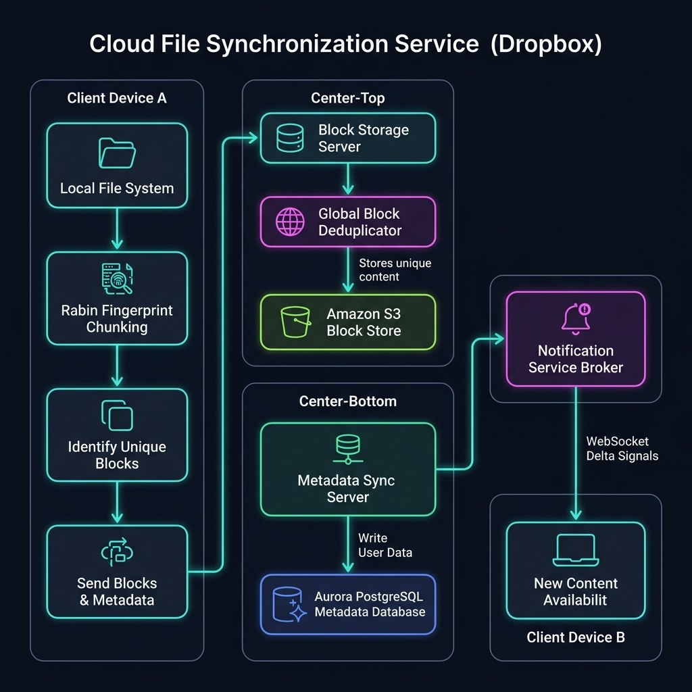

##### B. AWS Cloud-Native Dropbox Sync Layout
Cloud-native deployment showing public NLB gates, private VPC tiers, ECS pods, storage buckets, SQS queues, and WebSocket connection brokers.

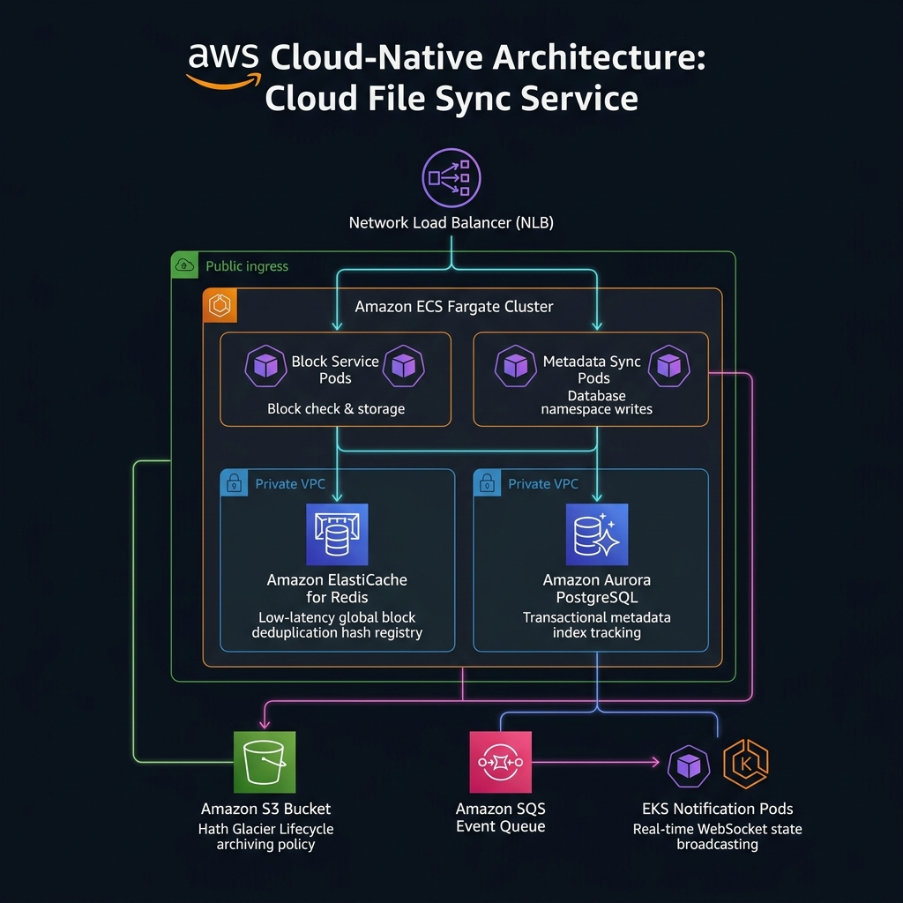

---

---

#### 1.5 Smart Parking Lot System Design
A production-grade, IoT-enabled Smart Parking System. Covers real-time bay sensor status MQTT routing, lock-free closest available spot allocations using optimistic concurrency versions, Automatic License Plate Recognition (ALPR) entry/exit gates, and payment gateway integration.

* **Documentation:** [Smart Parking Lot System Design (parking_lot_system_design.md)](./level_1_core_system_design/parking_lot/parking_lot_system_design.md)

#### Smart Parking Lot Tech Stack Details (with AWS Service Mapping)
* **AWS IoT Core:** Directs lightweight MQTT state updates from bay sensors.
* **AWS Lambda:** Processes raw sensor signals and updates Redis geospatial availability caches.
* **Amazon ECS Fargate:** Hosts the Rest API routing spot allocations for entry/exit gates.
* **Amazon ElastiCache for Redis:** Indexes vacant spots as geospatial metrics for rapid radial vacancy lookups.
* **Amazon Aurora PostgreSQL:** Implements ticket ledgers and invoice bookings under optimistic transaction checks.

#### Smart Parking Lot Architecture Diagrams

##### A. High-Level System Architecture & Sensor Ingestion Flow
Visual layout detailing Ultrasonic sensors, MQTT event streams, ALPR gates, Spot Allocation Engine, and WebSocket live maps updates.

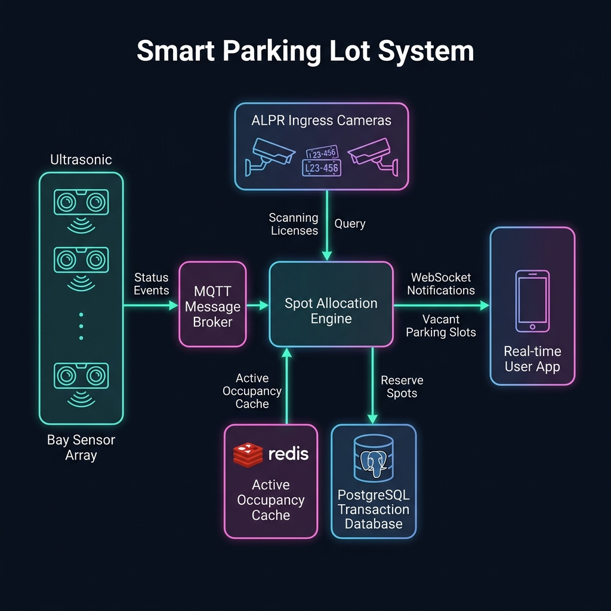

##### B. AWS Cloud-Native Smart Parking Architecture
Cloud-native layout showing edge gate ALPR cameras, AWS IoT Core, ECS Fargate allocation handlers, Lambda workers, Redis geohash caches, and DynamoDB/Aurora ticketing registries.

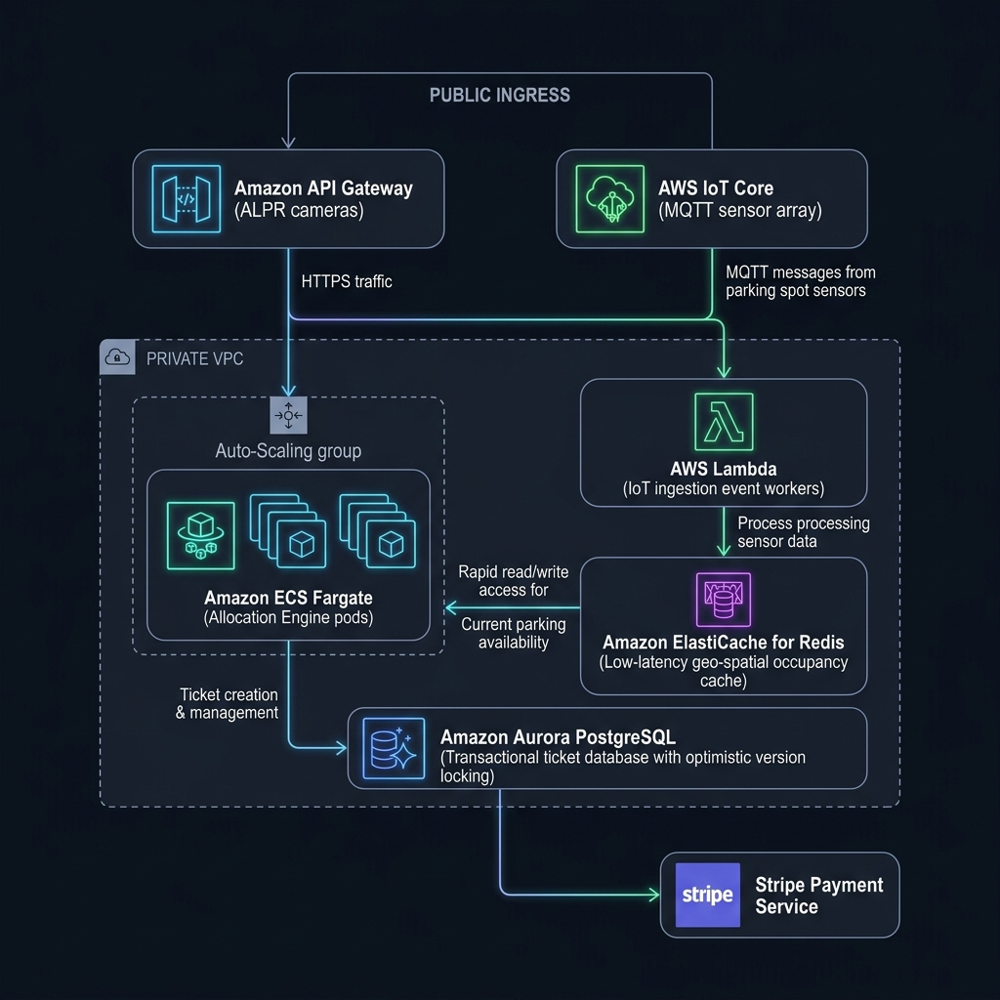

---

---

#### 1.6 Smart Library Management System Design
A production-grade Enterprise Library Management System. Features multi-branch catalog search indexing (OpenSearch + Redis), lock-free barcode item checkout using Optimistic Concurrency Control (PostgreSQL OCC), FIFO hold reservation queues (Redis Sorted Sets), and offline branch kiosk edge resilience.

* **Documentation:** [Smart Library Management System Design (library_management_system_design.md)](./level_1_core_system_design/library_management/library_management_system_design.md)

#### Smart Library Management Tech Stack Details (with AWS Service Mapping)
* **Amazon OpenSearch Service:** Inverted index powering full-text fuzzy title, author, and category catalog searches in $< 50\text{ms}$.
* **Amazon Aurora PostgreSQL:** Relational database enforcing ACID transactions and Optimistic Concurrency Control (`version` tags) for barcode checkouts.
* **Amazon ElastiCache for Redis:** Caches real-time book availability and manages FIFO hold reservation queues (`ZADD`/`ZPOPMIN`).
* **Amazon ECS Fargate:** Hosts containerized microservices for checkouts, returns, and hold reservation engines.
* **Amazon EventBridge + SQS/SNS:** Decouples checkout event streams from asynchronous member SMS/Email pickup notifications.

#### Smart Library Management Architecture Diagrams

##### A. High-Level System Architecture & Microservice Ingestion Flow
Visual layout detailing Kiosk/Mobile Ingress, API Gateway, Catalog Search Service, Borrowing & Inventory Engine, Hold Reservation Queue, and EventBridge Notification Workers.

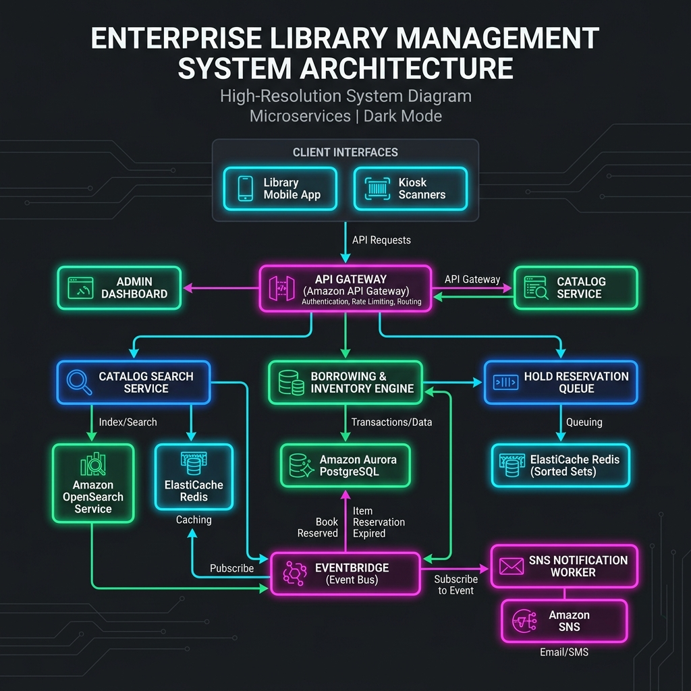

##### B. AWS Cloud-Native Smart Library Architecture
Cloud-native layout showing multi-AZ VPC subnets, Route 53, CloudFront/WAF, API Gateway, ALB, ECS Fargate tasks, Lambda CDC workers, Aurora PostgreSQL, ElastiCache Redis, and OpenSearch.

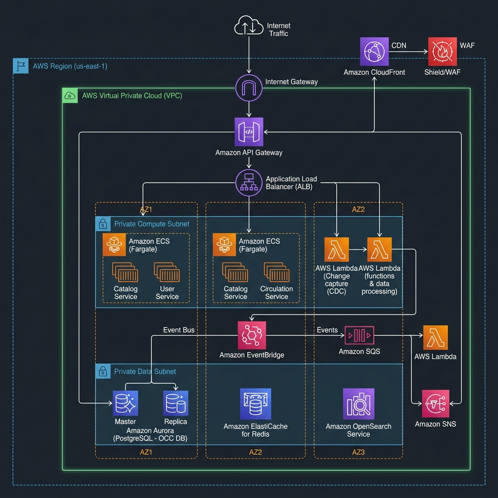

---

---

#### 1.7 Automated Teller Machine (ATM) System Design
A mission-critical, high-availability ATM Network & Core Banking Switch system design. Features ISO 8583 financial transaction messaging over encrypted TCP/TLS channels, Hardware Security Module (HSM) DUKPT PIN block encryption, Saga-based 2PC transaction coordination (guaranteeing zero double-dispense or double-debit), dynamic cassette note allocation algorithms, and encrypted offline hardware fallback mode.

* **Documentation:** [Automated Teller Machine (ATM) System Design (atm_system_design.md)](./level_1_core_system_design/atm/atm_system_design.md)

#### ATM System Tech Stack Details (with AWS Service Mapping)
* **AWS Network Load Balancer (NLB):** High-throughput TCP load balancing for 50,000+ persistent ATM terminal connections.
* **AWS CloudHSM:** FIPS 140-2 Level 3 dedicated hardware security module for DUKPT PIN decryption and PIN Block validation.
* **Amazon Aurora PostgreSQL:** Multi-AZ relational database guaranteeing ACID financial transaction consistency and optimistic ledger versioning.
* **Amazon ElastiCache for Redis:** Sub-millisecond in-memory tracking of note counts in individual ATM cassette slots across all terminals.
* **Amazon ECS Fargate:** Deploys containerized ISO 8583 message switch services and Saga Transaction Orchestrators.
* **Amazon EventBridge + SQS/SNS:** Asynchronously routes low-cash alerts, hardware jam notifications, and fraud detection streams.

#### ATM System Architecture Diagrams

##### A. High-Level System Architecture & ISO 8583 Message Flow
Visual layout detailing physical ATM terminals, ISO 8583 Message Switch, AWS CloudHSM, Saga Transaction Coordinator, Aurora PostgreSQL CBS ledger, Redis Cassette Inventory, and EventBridge Alert Workers.

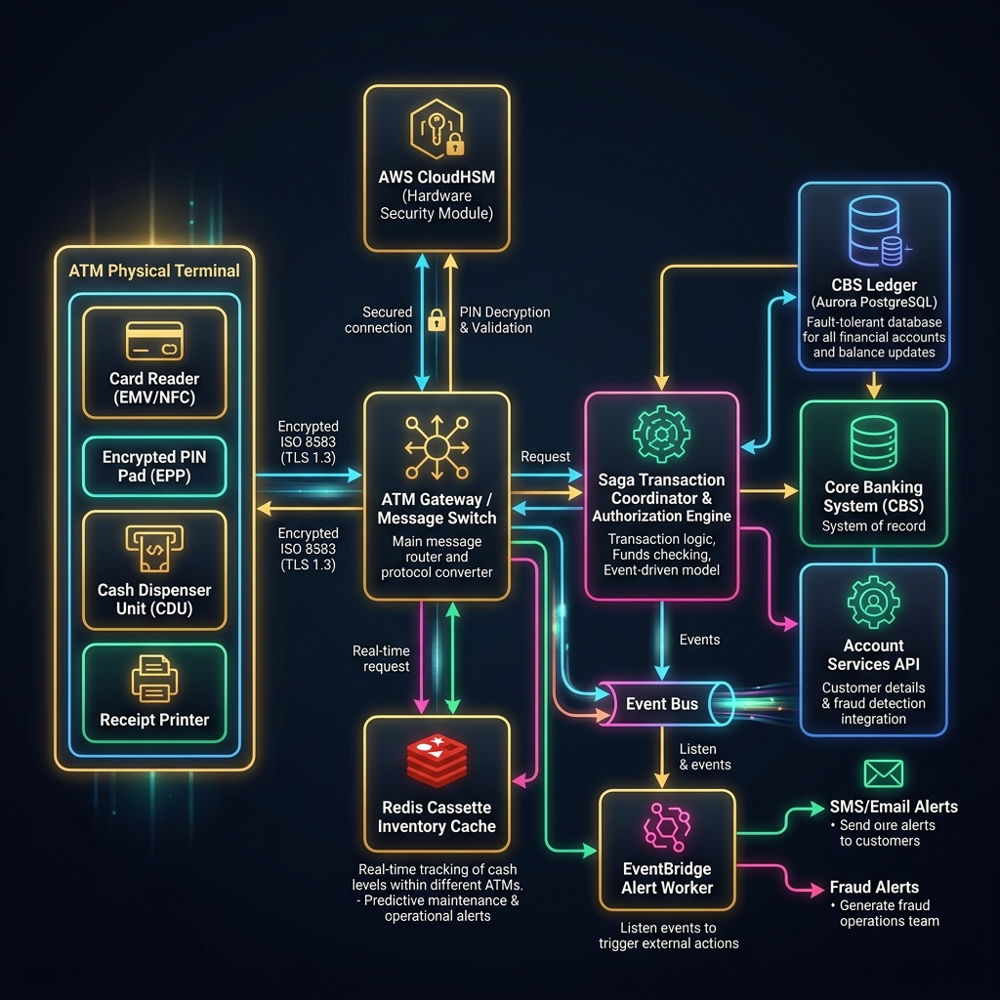

##### B. AWS Cloud-Native ATM Banking Architecture
Cloud-native layout showing NLB TCP ingress, private VPC compute subnets with CloudHSM and ECS Fargate switches, Aurora PostgreSQL master/replica ledgers, ElastiCache Redis, and EventBridge/SQS/SNS messaging networks.

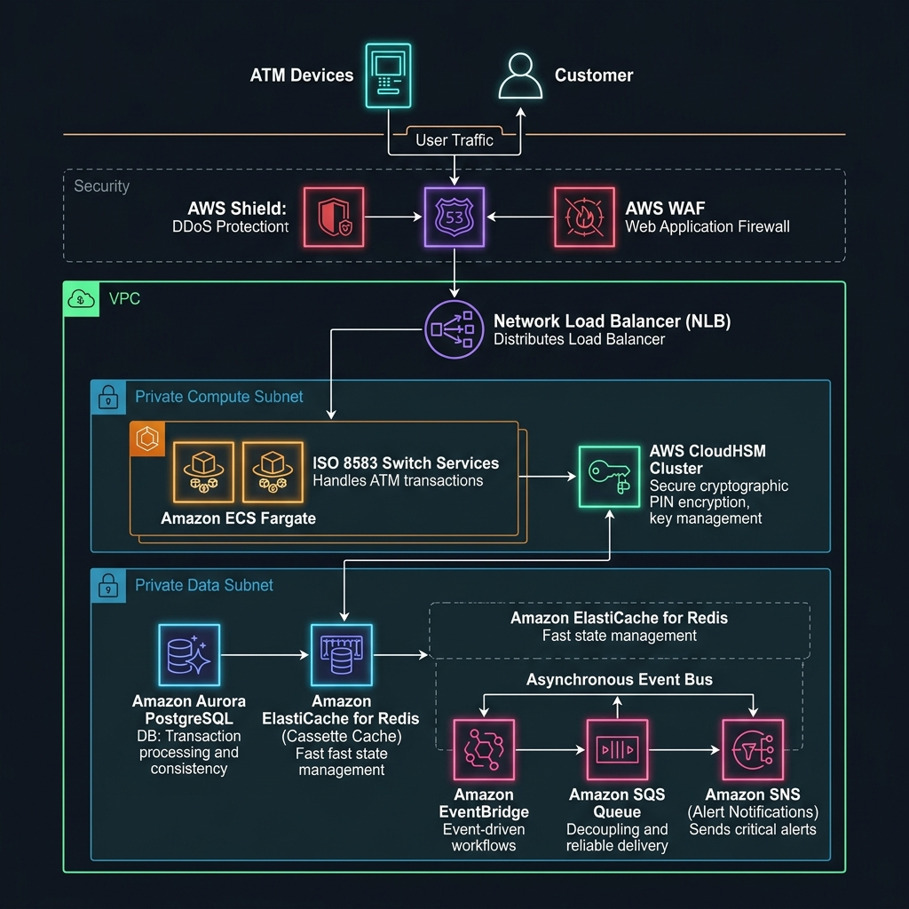

---

---

#### 1.8 Design Elevator System
A production-grade, IoT-enabled Multi-Elevator Control & Dispatch System for high-rise commercial skyscrapers and residential towers (e.g., 100 floors, 24 elevator cars across 4 zone banks). Features Destination Dispatch System (DDS), Minimum Estimated Time of Arrival (ETA) scheduling algorithms, finite state machine car control, lock-free Redis min-heap priority queues, 10 Hz MQTT telemetry ingestion, and AWS cloud-native edge-failover architecture.

* **Documentation:** [Smart Multi-Elevator Control System Design (elevator_system_design.md)](./level_1_core_system_design/elevator_system/elevator_system_design.md)
* **OpenAPI 3.0 API Spec:** [OpenAPI Contract (elevator_api_spec.yaml)](./level_1_core_system_design/elevator_system/elevator_api_spec.yaml)
* **Local Mock API Server:** [Mock Python Server (mock_server.py)](./level_1_core_system_design/elevator_system/mock_server.py) (run using `python3 level_1_core_system_design/elevator_system/mock_server.py`)

#### Elevator System Tech Stack Details (with AWS Service Mapping)
* **AWS IoT Core:** Managed MQTT message broker handling sub-100ms 10 Hz real-time telemetry streaming from 24+ elevator cars.
* **Amazon API Gateway:** HTTPS/gRPC REST API ingress for lobby destination kiosks and mobile elevator request endpoints.
* **AWS ECS Fargate:** Deploys containerized Destination Dispatch Engine microservices running Minimum ETA calculation algorithms.
* **Amazon ElastiCache for Redis:** Sub-millisecond in-memory cache holding real-time car state grids, min-heap stop priority queues, and atomic locks.
* **Amazon Aurora PostgreSQL:** Relational database for elevator car registries, passenger trip audit logs, and maintenance schedules.
* **Amazon Kinesis Data Streams + Lambda:** Real-time telemetry ingestion pipeline for predictive maintenance models and safety anomaly detection.

#### Elevator System Architecture Diagrams

##### A. High-Level System Architecture & Dispatch Ingestion Flow
Visual layout detailing Lobby Touch Kiosks, Edge Microcontrollers & PLC controllers, Destination Dispatch Engine, Redis State Grid, and IoT Telemetry Broker.

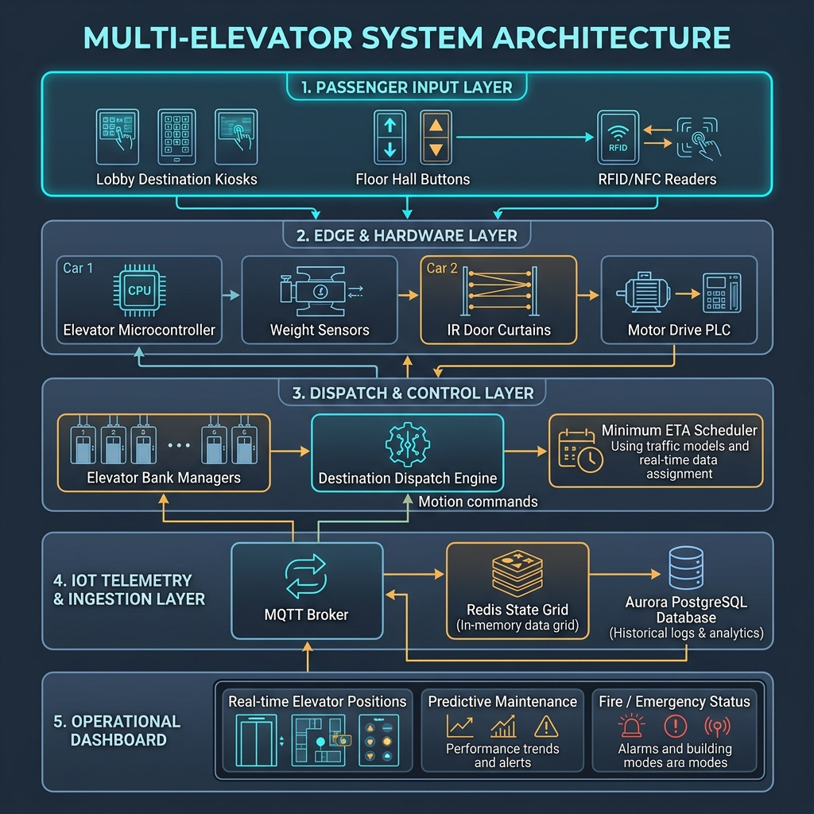

##### B. AWS Cloud-Native Smart Elevator Architecture
Cloud-native layout showing AWS IoT Core MQTT ingress, API Gateway, ECS Fargate Destination Dispatch Engine, ElastiCache Redis, Aurora PostgreSQL, Kinesis streaming analytics, and EventBridge alert routing.

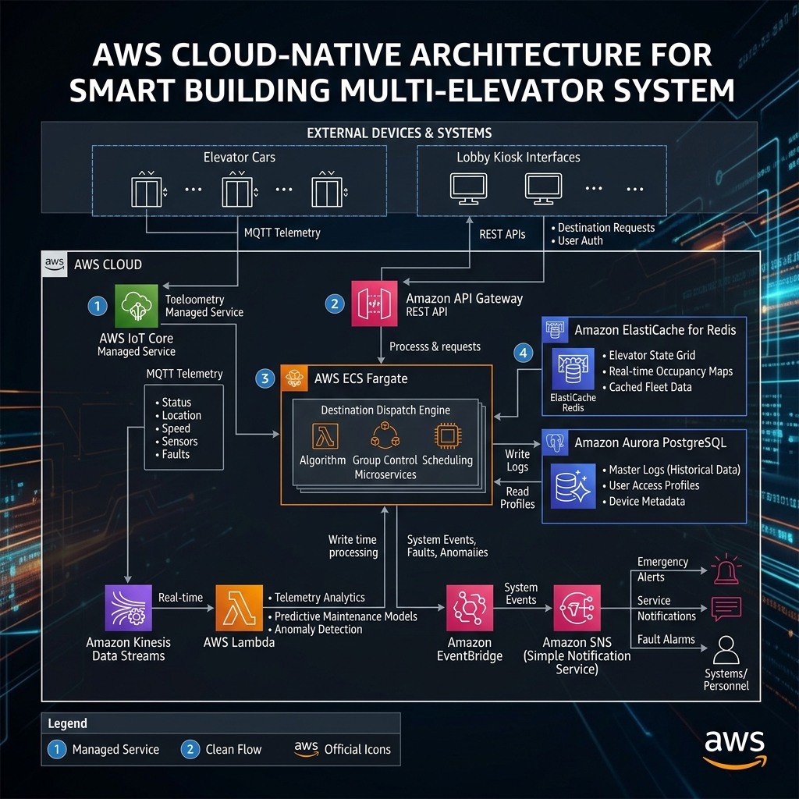

---

---

#### 1.9 Design Hotel Booking System
A production-grade, high-scale Global Hotel Booking System for managing 500,000+ hotels and 10,000,000+ rooms worldwide. Features geohash spatial hotel search, 10-minute temporary room hold locks, Optimistic Concurrency Control (OCC) for zero double-booking, Saga-based 2PC payment orchestration, dynamic surge pricing algorithms, and AWS cloud-native edge-failover architecture.

* **Documentation:** [Global Hotel Booking System Design (hotel_booking_system_design.md)](./level_1_core_system_design/hotel_booking/hotel_booking_system_design.md)
* **OpenAPI 3.0 API Spec:** [OpenAPI Contract (hotel_api_spec.yaml)](./level_1_core_system_design/hotel_booking/hotel_api_spec.yaml)
* **Local Mock API Server:** [Mock Python Server (mock_server.py)](./level_1_core_system_design/hotel_booking/mock_server.py) (run using `python3 level_1_core_system_design/hotel_booking/mock_server.py`)

#### Hotel Booking Tech Stack Details (with AWS Service Mapping)
* **Amazon CloudFront + AWS WAF:** Global CDN edge location caching and Web Application Firewall protection against DDoS surges and scraper bots.
* **Amazon OpenSearch Service:** Sub-50ms geohash spatial indexing and full-text hotel search over 500,000 hotel profiles.
* **AWS ECS Fargate:** Deploys containerized Search, Room Inventory Hold Engine, and Saga Payment Coordinator microservices.
* **Amazon ElastiCache for Redis:** Multi-node Redis cluster managing 10-minute temporary room hold locks (`hold:{reservation_id}`) and availability caches.
* **Amazon Aurora PostgreSQL:** Multi-AZ relational SQL database storing ACID room inventory records, OCC version tags, and booking ledgers.
* **Amazon EventBridge + SQS/SNS:** Asynchronous messaging stream for booking confirmation emails, SMS notifications, and partner portal inventory updates.

#### Hotel Booking System Architecture Diagrams

##### A. High-Level System Architecture & Hold Lock Ingestion Flow
Visual layout detailing Client Apps, API Gateway, Search Service, Room Inventory Hold Engine, Saga Payment Coordinator, OpenSearch Cluster, Redis Hold Cache, and Aurora PostgreSQL Master/Replicas.

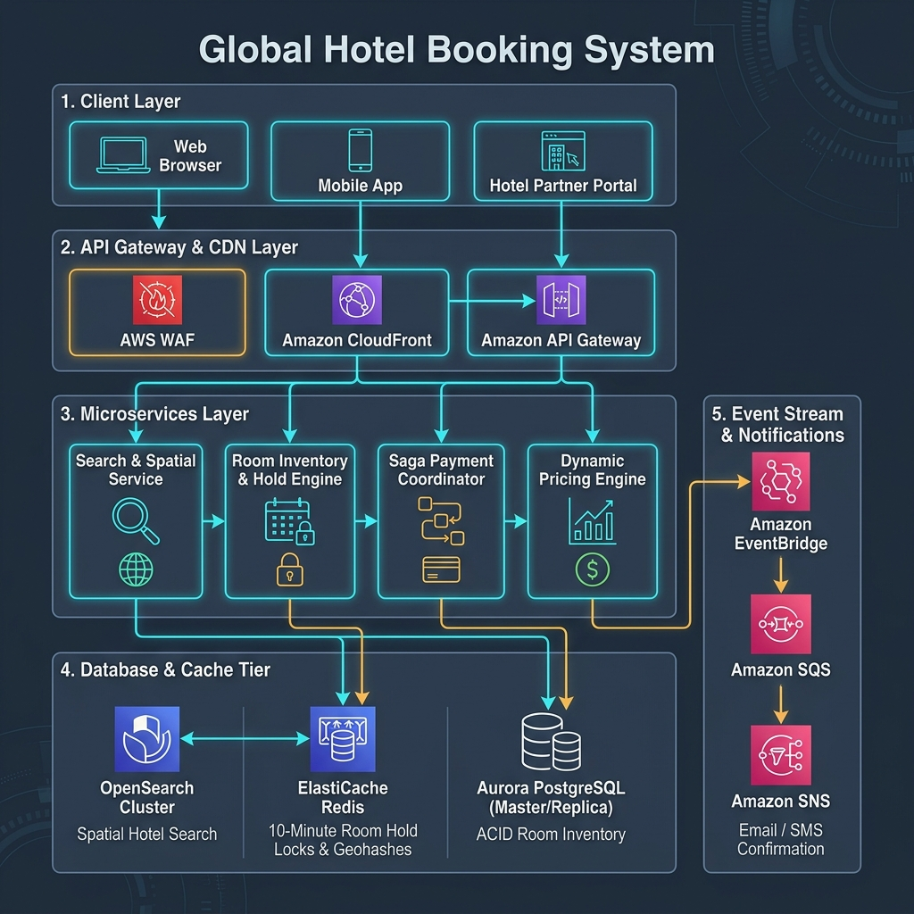

##### B. AWS Cloud-Native Global Hotel Booking Architecture
Cloud-native layout showing CloudFront/WAF ingress, API Gateway, ECS Fargate microservices across multi-AZ subnets, OpenSearch, ElastiCache Redis hold locks, Aurora PostgreSQL Master/Replicas, and EventBridge notification workers.

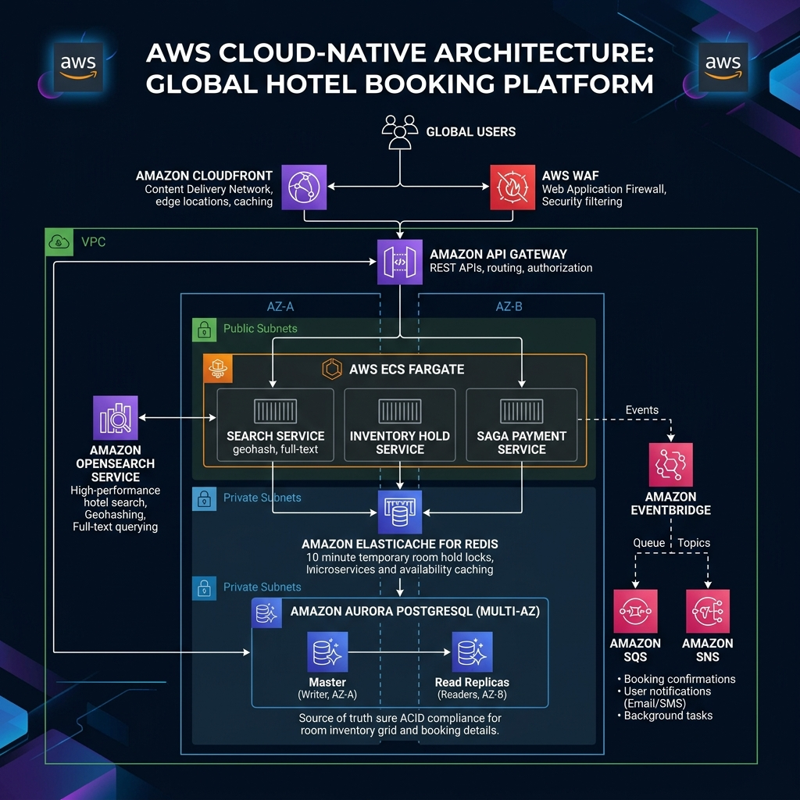

---

---

---

### Level 4 – Ride Sharing & Delivery

#### 4.1 Food Delivery System Design
A production-grade, end-to-end system design for a high-scale food delivery platform connecting Customers, Restaurants, and Delivery Partners.

* **Documentation:** [Food Delivery System Design (food_delivery_system_design.md)](./level_4_ride_sharing_delivery/food_delivery/food_delivery_system_design.md)
* **OpenAPI 3.0 API Spec:** [OpenAPI Contract (food_delivery_api_spec.yaml)](./level_4_ride_sharing_delivery/food_delivery/food_delivery_api_spec.yaml)
* **Local Mock API Server:** [Mock Python Server (mock_server.py)](./level_4_ride_sharing_delivery/food_delivery/mock_server.py) (run using `python3 food_delivery/mock_server.py`)

#### Food Delivery Tech Stack Details (with AWS Service Mapping)
* **PostgreSQL (Amazon Aurora PostgreSQL):** Handles critical transactional order lifecycle, payment ledger logs, and user metadata. Configured with Aurora Global Database for multi-region active-passive failover under 1 minute.
* **MongoDB (Amazon DocumentDB):** Houses restaurant profiles and dynamic menus. The document-oriented layout stores complex nested categories and add-on lists in a single document, avoiding costly SQL joins on reads.
* **Redis (Amazon ElastiCache for Redis):** Manages real-time driver coordinates using in-memory geospatial indexes (`GEOADD` / `GEORADIUS`) and broadcasts live location updates to WebSocket servers via Redis Pub/Sub.
* **Elasticsearch (Amazon OpenSearch Service):** Drives food search, text keyword autocomplete, and geospatial listing queries (e.g., "nearby restaurants within 5km") with sub-20ms latencies.
* **Apache Cassandra (Amazon Keyspaces):** Serverless wide-column database that digests heavy location coordinate write-streams (25k writes/sec) from active riders, storing location logs partitioned by `(rider_id, date)`.
* **Apache Kafka (Amazon MSK):** Managed streaming cluster that decouples checkout and order placement services from background notification tasks and driver assignment loops.

#### Food Delivery Architecture Diagrams

##### A. High-Level System Architecture (Generic)
Overview of clients, gateway, microservices layer, message brokers, and databases.

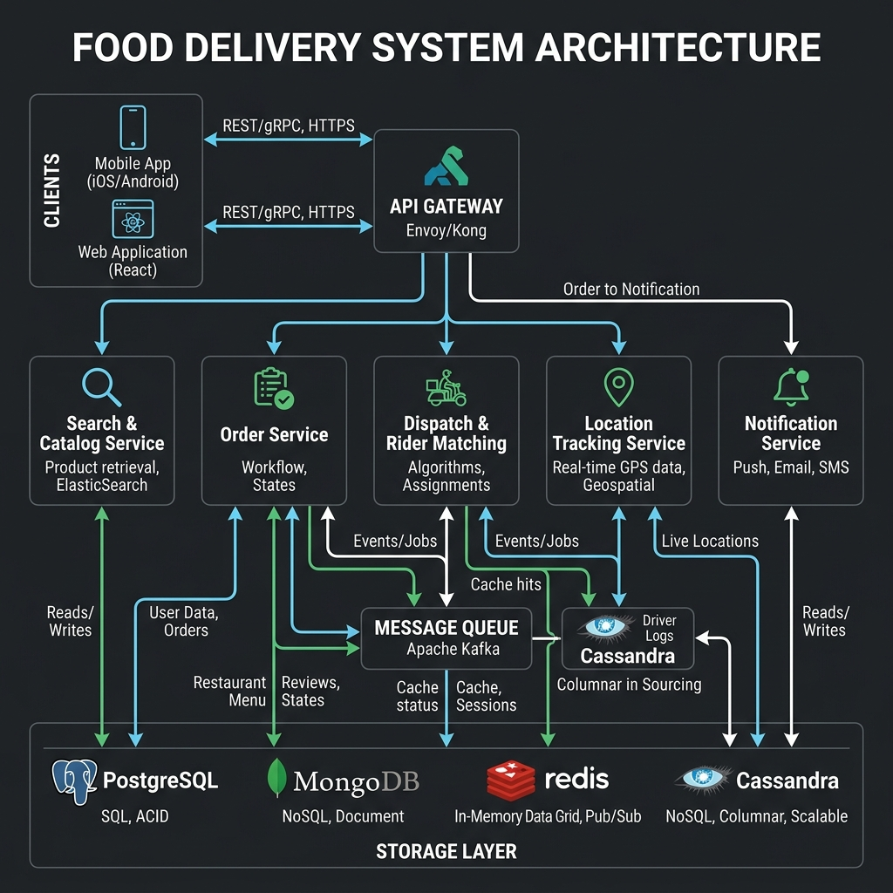

##### B. Real-Time Ingestion & Live Tracking Pipeline (Generic)
Visual flow of coordinates streamed from riders to Redis Geo (hot cache), Kafka, Cassandra (historical logs), and WebSocket push connections to tracking users.

##### C. Rider Matching & Dispatch Engine (Generic)
Visual explanation of the bipartite graph match loop using candidate discovery, multi-criteria weight functions (ETA, Travel Distance, Rating), and Hungarian Algorithm solvers.

##### D. AWS Cloud-Native System Architecture
Cloud-native deployment mapping microservices to Amazon EKS/ECS, databases to Aurora/DocumentDB, and streaming to Amazon MSK.

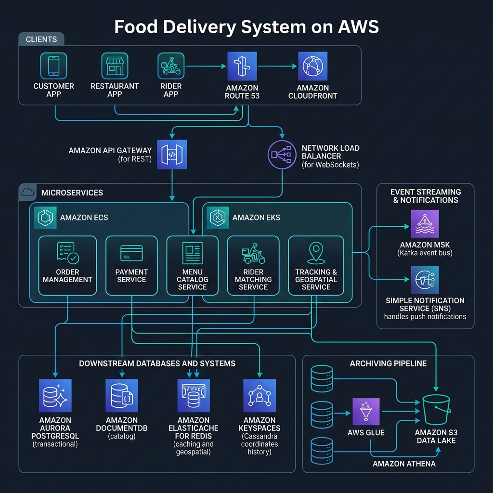

##### E. AWS-Native Live Ingestion & Tracking Pipeline
Live coordinate ingestion using AWS IoT Core or Network Load Balancer (NLB) to Amazon ElastiCache and Amazon Keyspaces (Cassandra).

##### F. AWS-Native Rider Matching & Dispatch Engine
Matching engine workflow orchestrated on AWS, pulling orders from Amazon MSK and geolocations from Amazon ElastiCache.

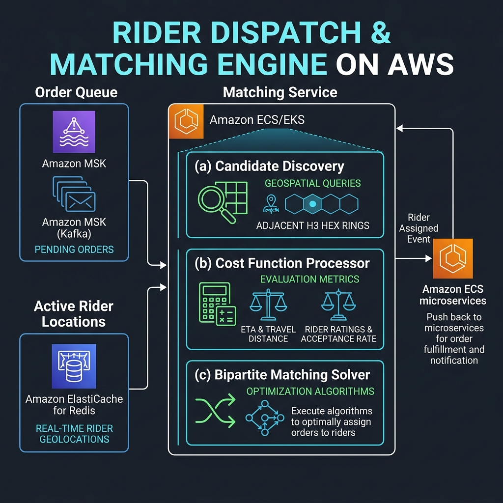

---

---

### Level 7 – AI Systems

#### 7.1 RAG Pipeline System Design
A production-grade system design for a **Retrieval-Augmented Generation** pipeline — the backbone of knowledge-grounded AI systems. Covers document ingestion, parent-child chunking, hybrid retrieval (dense + BM25), cross-encoder re-ranking, prompt assembly, and grounded LLM generation with citations.

* **Documentation:** [RAG Pipeline System Design (rag_pipeline_system_design.md)](./level_7_ai_systems/rag_pipeline/rag_pipeline_system_design.md)

#### RAG Pipeline Tech Stack Details (with AWS Service Mapping)
* **Vector Database (Amazon OpenSearch Serverless):** HNSW-indexed vector search over 10M+ chunks with metadata filtering and scalar quantization for 4x storage reduction.
* **Elasticsearch (Amazon OpenSearch Service):** BM25 sparse keyword search for exact-match retrieval. Combined with dense search via Reciprocal Rank Fusion (RRF) for hybrid retrieval.
* **Cross-Encoder Re-ranker (Amazon SageMaker):** `cross-encoder/ms-marco-MiniLM-L6` re-scores top-50 candidates for 10–20% higher accuracy than bi-encoder retrieval alone.
* **Embedding Service (Amazon Bedrock Titan):** Managed embedding API for batch document indexing and real-time query embedding. No GPU infrastructure to manage.
* **LLM Inference (Amazon Bedrock Claude/Titan):** Managed LLM inference with SSE streaming. Supports augmented prompt generation with retrieved context and inline citations.

#### RAG Pipeline Architecture Diagrams

##### A. High-Level RAG Architecture — Ingestion & Query Planes
Two-plane design: Offline Ingestion Plane (parse → chunk → embed → index) and Online Query Plane (embed → retrieve → re-rank → generate).

##### B. RAG Query Pipeline — Hybrid Retrieval + Re-ranking + Generation
End-to-end query flow showing parallel dense/sparse retrieval, RRF fusion, cross-encoder re-ranking, prompt assembly, and LLM streaming with latency annotations.

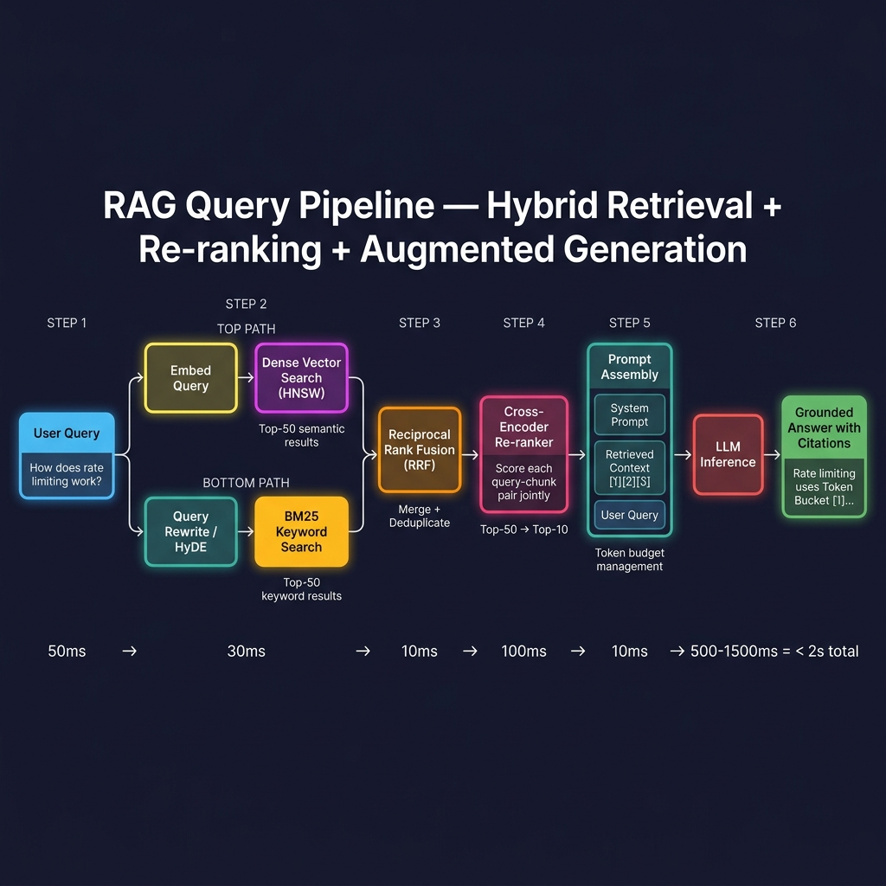

---

---

#### 7.2 Vector Database System Design
A production-grade system design for a real-time, low-latency **Vector Database** (comparable to Qdrant or Milvus). Highlights LSM-tree segment architectures, metadata pre-filtering during graph traversal, scalar quantization calculations (reducing vector size from float32 to int8 for a 72% RAM footprint saving), and distributed shard coordinating mechanisms.

* **Documentation:** [Vector Database System Design (vector_database_system_design.md)](./level_7_ai_systems/vector_database/vector_database_system_design.md)

#### Vector Database Tech Stack Details (with AWS Service Mapping)
* **Amazon EC2 (r6g memory-optimized nodes):** Holds the active in-memory HNSW index structures and executes vector/cosine-similarity calculations.
* **Amazon EBS (gp3):** Provides fast local storage for sequential Write-Ahead Log (WAL) commits.
* **Amazon ECS Fargate:** Hosts the stateless Proxy Coordination Cluster managing cluster schemas, shards routing, and gather queries.
* **Amazon S3:** Serves as the backup snapshot registry for archiving segment indexes.

#### Vector Database Architecture Diagrams

##### A. High-Level Distributed Vector Database Architecture
Visual layout showing proxy query routing, LSM-like mutable mem-segments, background compactor building the HNSW graphs, and immutable disk segments.

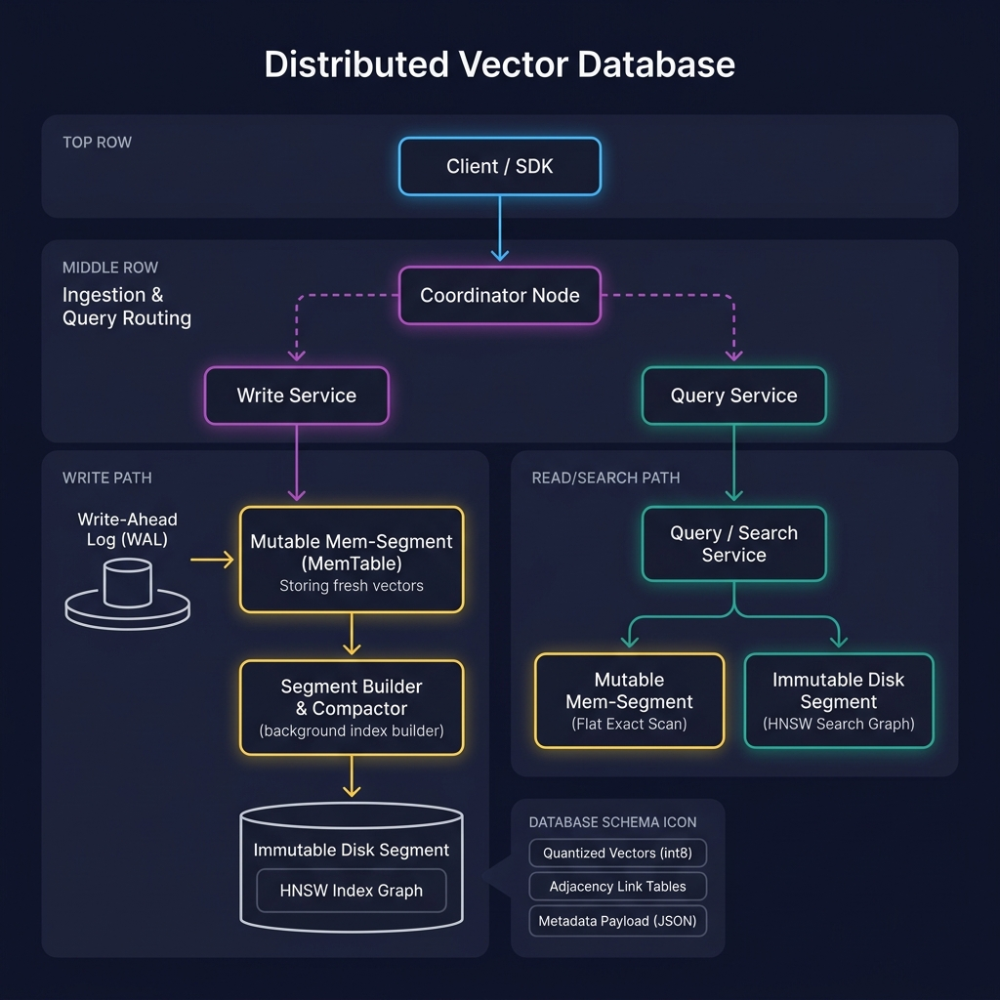

##### B. AWS Cloud-Native Vector Database Architecture
AWS cloud-native deployment using ECS proxy routing nodes, EC2 r6g memory-optimized HNSW cluster nodes, EBS gp3 write-ahead logs, and Amazon S3 segment backups.

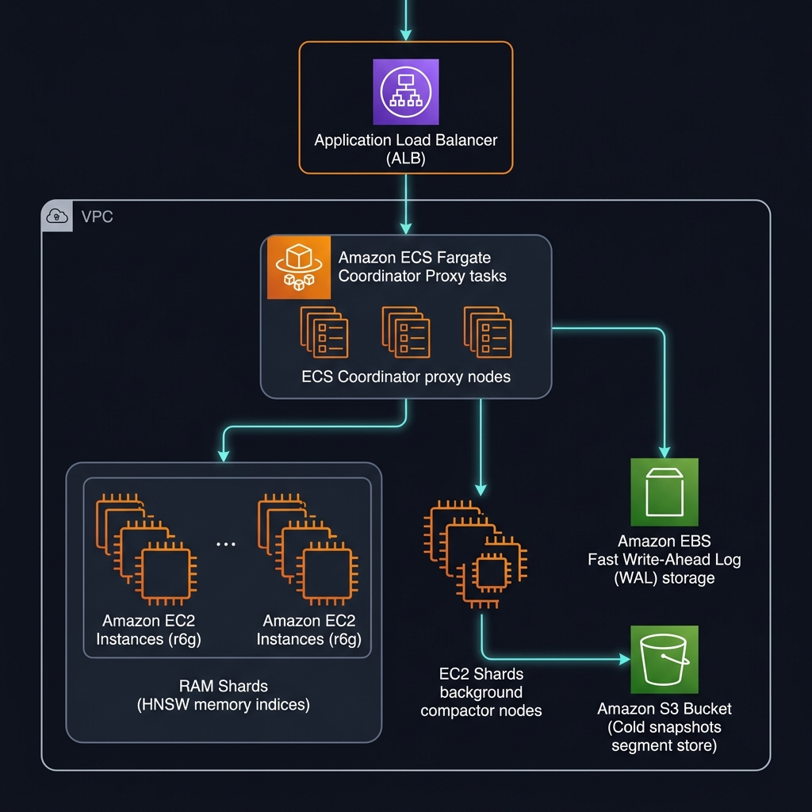

---

---

#### 7.3 ChatGPT System Design
A production-grade system design for a real-time, low-latency conversational AI platform (LLM conversational system). Handles streaming tokens, active session memory, context window compression, and GPU inference routing.

* **Documentation:** [ChatGPT System Design (chatgpt_system_design.md)](./level_7_ai_systems/chat_gpt/chatgpt_system_design.md)

#### ChatGPT Tech Stack Details (with AWS Service Mapping)
* **Server-Sent Events (ALB to ECS/EKS Streams):** Uses Application Load Balancers to support long-lived HTTP/2 chunked-transfer connections (SSE), pushing response tokens text-by-text to the client without API Gateway timeouts.
* **Apache Cassandra / DynamoDB (Amazon DynamoDB):** Stores conversational chat histories. DynamoDB handles billions of messages, partitioned by `session_id` and sorted by `created_at` for sub-10ms chronological reads.
* **Redis (Amazon ElastiCache for Redis):** Caches short-term active chat context windows and session state, letting the Query Orchestrator quickly compile conversation histories for LLM payloads.
* **Qdrant / pgvector (Amazon OpenSearch Service Vector Engine):** Indexes chunked vector embeddings using HNSW graphs for Retrieval-Augmented Generation (RAG), returning semantic search results within 10ms.
* **vLLM / Triton (Amazon EKS GPU Instances):** Model servers running on GPU-equipped EC2 instances (e.g., `p4d` or `p5` nodes with Nvidia A100/H100 GPUs) using tensor parallelism and PagedAttention to optimize throughput.

#### ChatGPT Architecture Diagrams

##### A. High-Level ChatGPT Architecture (Generic)
Overview of clients, gateway, Query Orchestrator, context engine, vector storage, and GPU cluster.

##### B. Low-Latency Token Streaming & GPU Inference Flow (Generic)
Visual flow of HTTP/2 SSE streaming connections, Triton/vLLM batch queuing, and PagedAttention block cache partitioning.

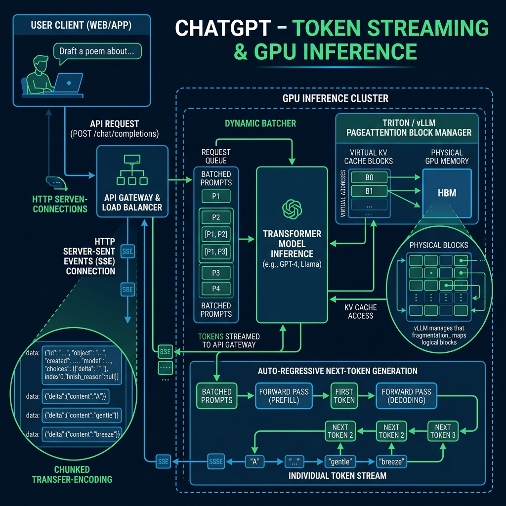

##### C. RAG & Context Window Memory Pipeline (Generic)
Visual flow of document indexing, semantic nearest-neighbor vector search, conversation context windows, and secondary LLM summarization.

##### D. AWS Cloud-Native ChatGPT Architecture
Cloud-native deployment on AWS routing SSE streams through Application Load Balancers, RAG via OpenSearch Vector Engine, and inference on Amazon EKS GPU clusters.

---

---

#### 7.4 AI Agent Framework System Design
A production-grade stateful agent runtime framework (comparable to LangGraph or CrewAI). Features graph-based execution loops, resilient state checkpointing, secure sandboxed execution environments, and Human-in-the-Loop approval gates.

* **Documentation:** [AI Agent Framework System Design (ai_agent_framework_system_design.md)](./level_7_ai_systems/ai_agent_framework/ai_agent_framework_system_design.md)

#### AI Agent Framework Tech Stack Details (with AWS Service Mapping)
* **AWS Lambda:** Provides ephemeral execution sandboxes for untrusted agent tool code.
* **Amazon Aurora PostgreSQL:** Logs thread checkpoints and state variables as transactional JSONB structures.
* **Amazon ElastiCache for Redis:** Stores temporary active context variables and manages locks for active threads.
* **Amazon Bedrock:** Serves as the backplane model provider.

#### AI Agent Framework Architecture Diagrams

##### A. High-Level AI Agent Framework Architecture
Overview of app clients, API gateway, state checkpoint store, short/long-term memory services, and secure code sandbox environments.

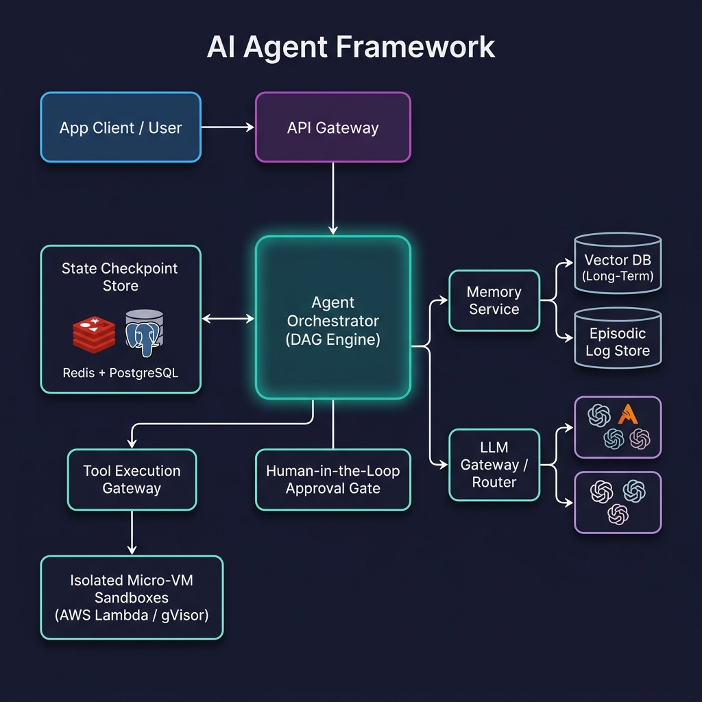

##### B. AWS-Native Stateful Agent Execution Loop
Visual workflow illustrating how Lambda sandboxes, DynamoDB states, and ECS orchestrator manage loop checkpoints and tool runs.

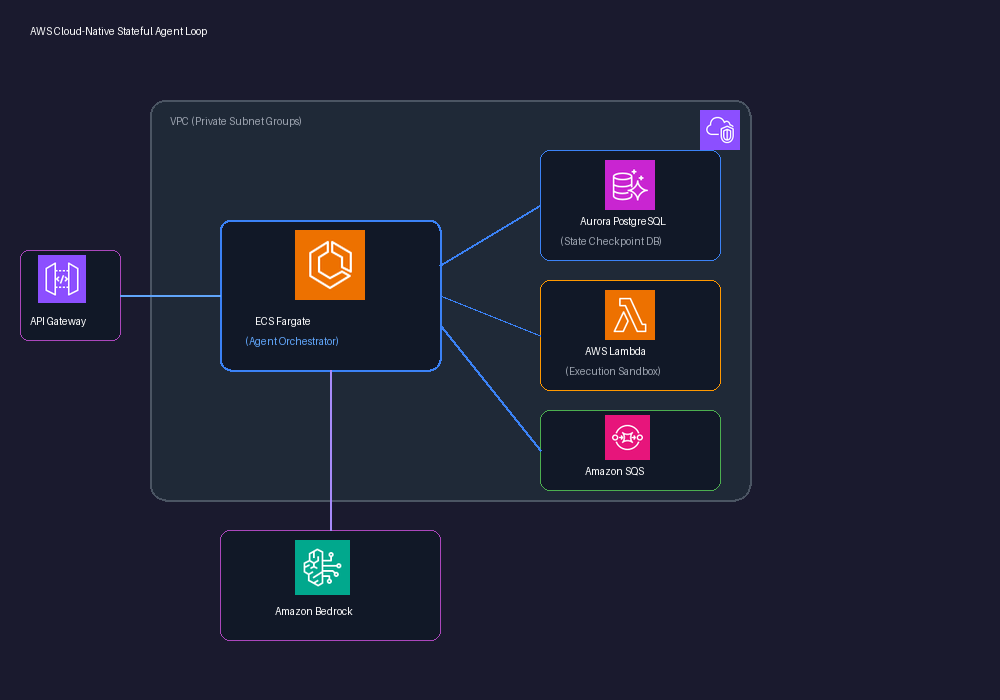

---

---

#### 7.5 LLM Gateway System Design
A high-throughput enterprise gateway proxy layers between application clients and upstream LLM providers. Optimizes model costs, handles intelligent routing and provider failover, and implements semantic query caching.

* **Documentation:** [LLM Gateway System Design (llm_gateway_system_design.md)](./level_7_ai_systems/llm_gateway/llm_gateway_system_design.md)

#### LLM Gateway Tech Stack Details (with AWS Service Mapping)
* **Amazon ECS Fargate:** Hosts the stateless proxy clusters managing routing, budget validation, and payload processing.
* **Amazon ElastiCache for Redis:** Implements TPM/RPM rate-limiting bucket logs and semantic cache indexes.
* **Amazon DynamoDB:** Persistent tenant API keys metadata configuration database.
* **Amazon S3 & Kinesis Firehose:** Asynchronous ledger logs streaming pipeline.

#### LLM Gateway Architecture Diagrams

##### A. High-Level LLM Gateway Architecture
Overview of client routing pipeline, authentication verify filters, semantic cache checkpoints, and model provider load balancer routing.

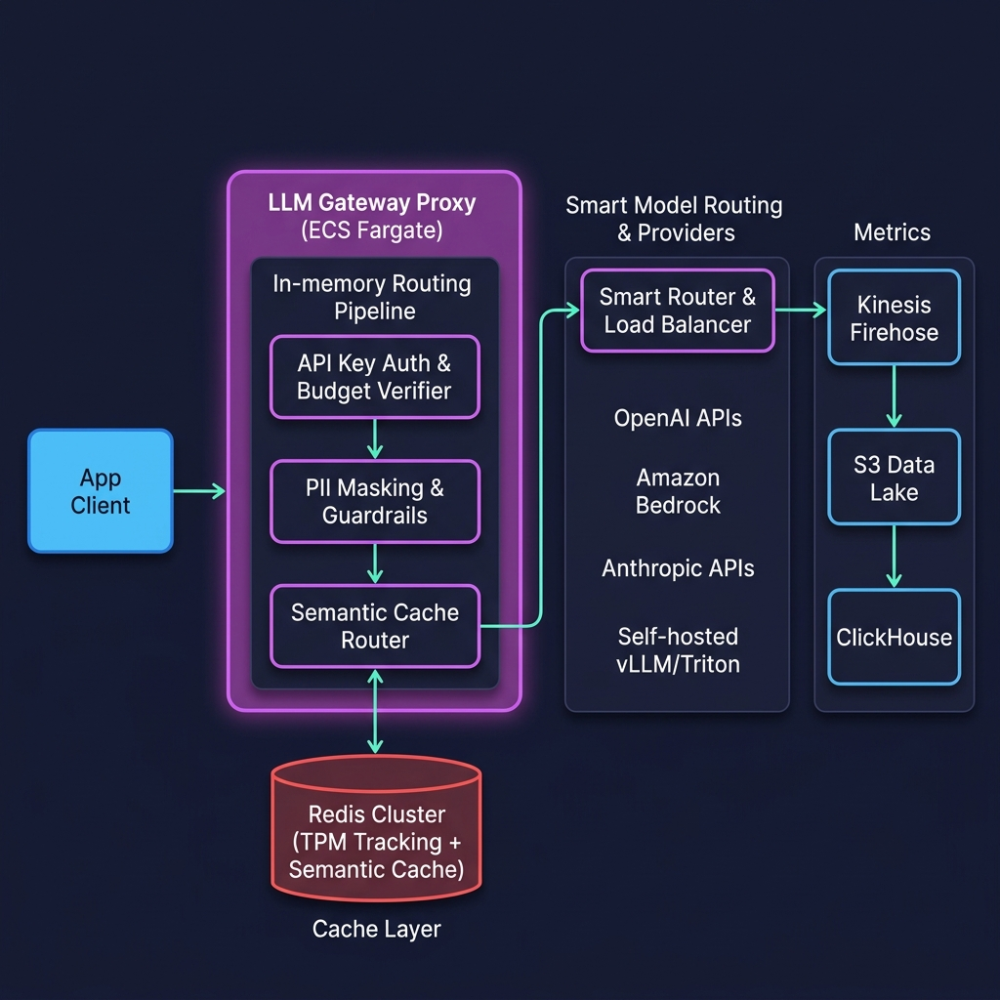

##### B. AWS Cloud-Native LLM Gateway Architecture
AWS cloud-native deployment using ECS Fargate, DynamoDB configuration registries, ElastiCache Redis counters, and Kinesis async metrics logging.

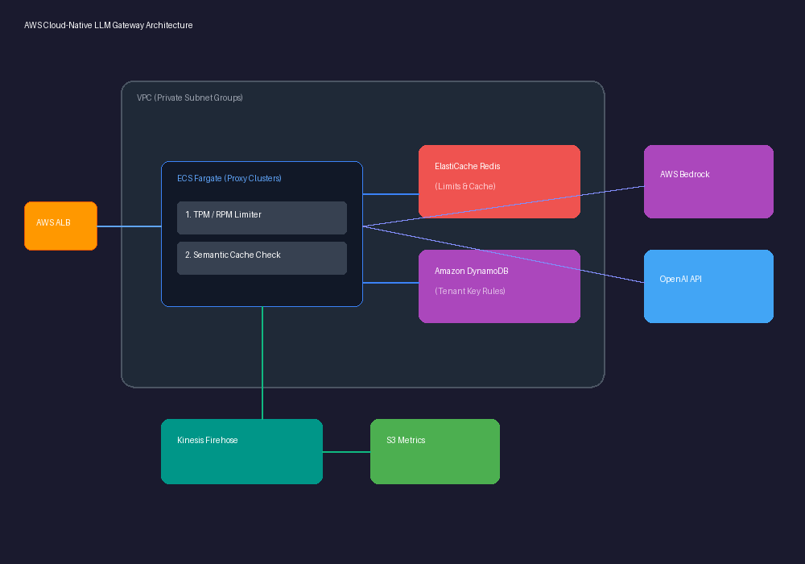

---

---

#### 7.6 Semantic Search System Design
A production-grade, highly precise multi-stage retrieval hybrid search engine. Combines conceptual vector search with sparse keyword search and cross-encoder re-ranking.

* **Documentation:** [Semantic Search System Design (semantic_search_system_design.md)](./level_7_ai_systems/semantic_search/semantic_search_system_design.md)

#### Semantic Search Tech Stack Details (with AWS Service Mapping)
* **Amazon OpenSearch Service:** Handles both dense vector space calculations (using KNN HNSW indices) and keyword search (BM25) in a single unified schema.
* **Amazon SageMaker Serverless:** Runs cross-encoder models for top-50 to top-10 candidate precision refinement.
* **Amazon MSK:** Pipelines catalog ingestion updates asynchronously to avoid search index lock congestion.

#### Semantic Search Architecture Diagrams

##### A. High-Level Hybrid Semantic Search Engine Architecture
Visual layout detailing twin bi-encoder dense and BM25 sparse search indices, reciprocal rank fusion, and SageMaker cross-encoder re-ranking.

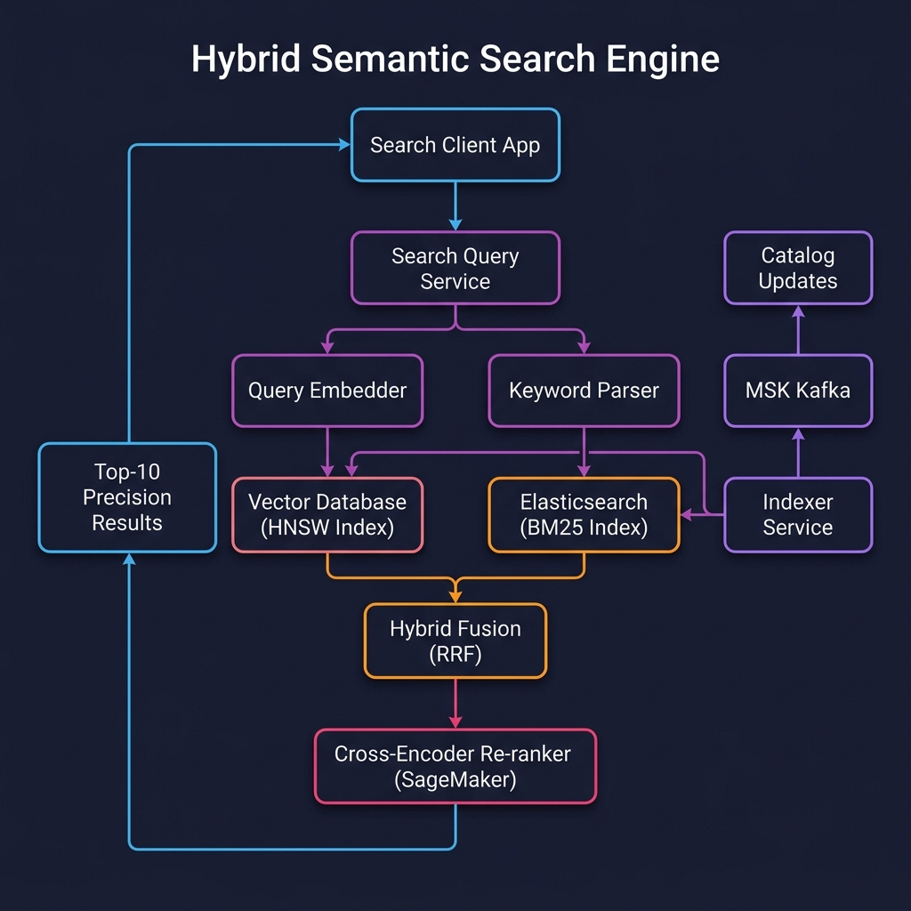

##### B. AWS Cloud-Native Semantic Search Engine Architecture
AWS cloud-native deployment using ECS Fargate search pods, Amazon OpenSearch Service indices, and SageMaker Serverless rerank endpoints.

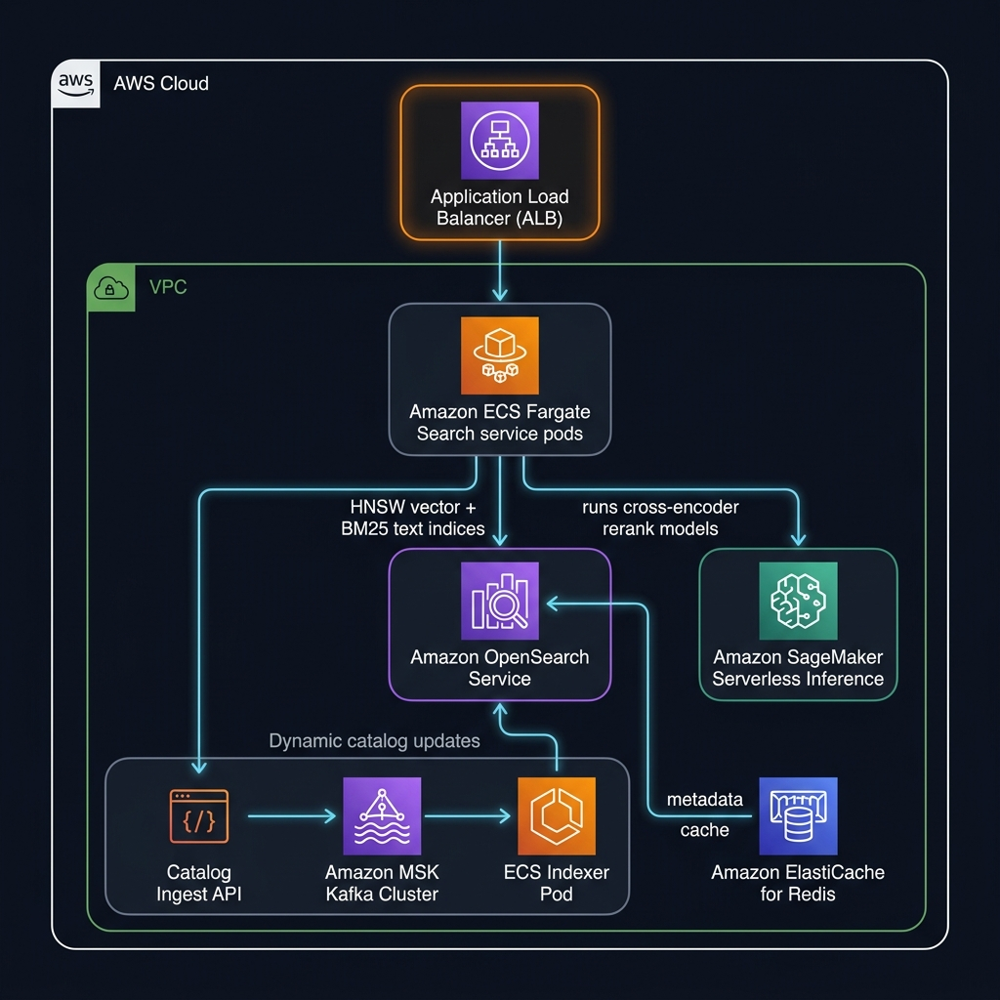

---

---

#### 7.7 Token Streaming System Design
A high-concurrency real-time stream broker optimized for pushing token generation updates back to client apps with sub-100ms first-token latency targets.

* **Documentation:** [Token Streaming System Design (token_streaming_system_design.md)](./level_7_ai_systems/token_streaming/token_streaming_system_design.md)

#### Token Streaming Tech Stack Details (with AWS Service Mapping)
* **Network Load Balancer (NLB):** Essential for routing millions of long-lived HTTP/2 TCP streams.
* **Amazon EKS (EC2 C6g Instances):** Runs Go/Rust connection gateway daemons using non-blocking Epoll loops for memory-efficient concurrency.
* **Amazon ElastiCache for Redis:** Decouples GPU inference events via Redis Pub/Sub topics.

#### Token Streaming Architecture Diagrams

##### A. High-Level Token Streaming Architecture
Visual overview showing high-throughput NLB, Epoll connection gateways, and decouple publish/subscribe topics.

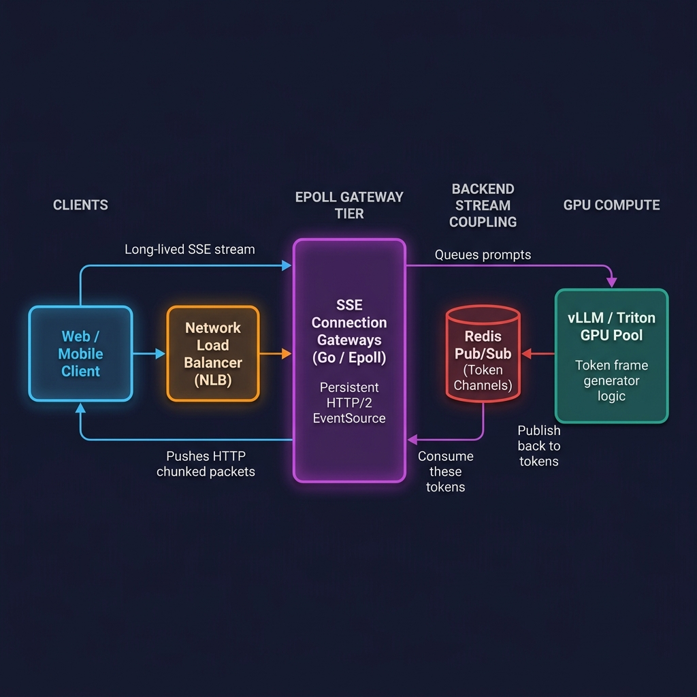

##### B. AWS Cloud-Native Token Streaming Engine Architecture
AWS cloud-native deployment using NLB, EKS connection gateway pods, ElastiCache Redis Pub/Sub, and EKS GPU inference servers.

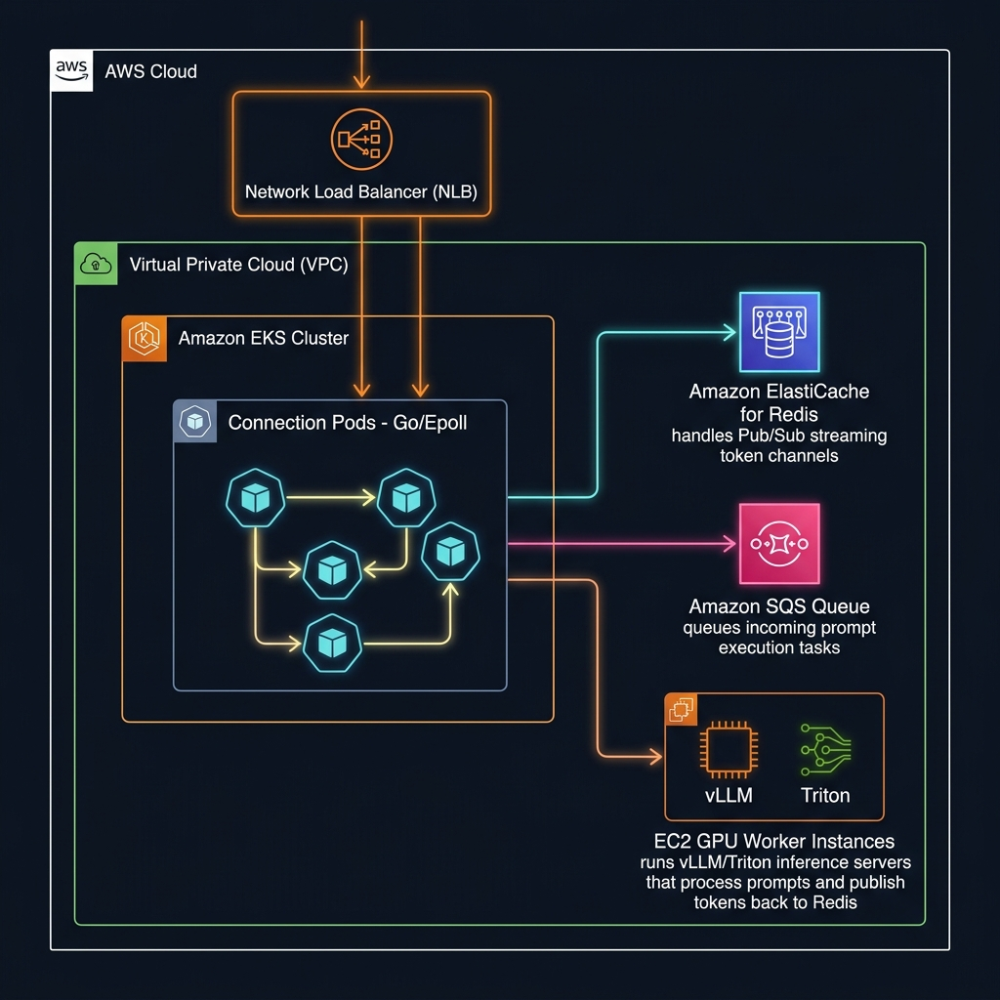

---

---

### Level 8 – Distributed Systems

#### 8.1 API Gateway System Design
A high-performance event-driven edge routing gateway engineered to handle 100,000+ RPS. Manages SSL termination, JWT auth validation, sliding-window rate limiting, path rewrites, dynamic service routing, and telemetry logging.

* **Documentation:** [API Gateway System Design (api_gateway_system_design.md)](./level_8_distributed_systems/api_gateway/api_gateway_system_design.md)

#### API Gateway Tech Stack Details (with AWS Service Mapping)
* **Amazon ECS Fargate (Envoy Proxy):** Deploys non-blocking event-loop task groups executing the filter chains.
* **Amazon Cognito:** Edge user authentication and token verification provider.
* **Amazon ElastiCache for Redis:** Records sliding-window sorted sets for precise rate-limit metrics.
* **Amazon DynamoDB:** Stores active configuration rules, dynamic routes, and tenant security maps.

#### API Gateway Architecture Diagrams

##### A. High-Level System Architecture & Filter Chain Pipeline
Visual layout illustrating the Linux epoll connection events listener, CPU core worker loops, and sequential filter pipeline checks.

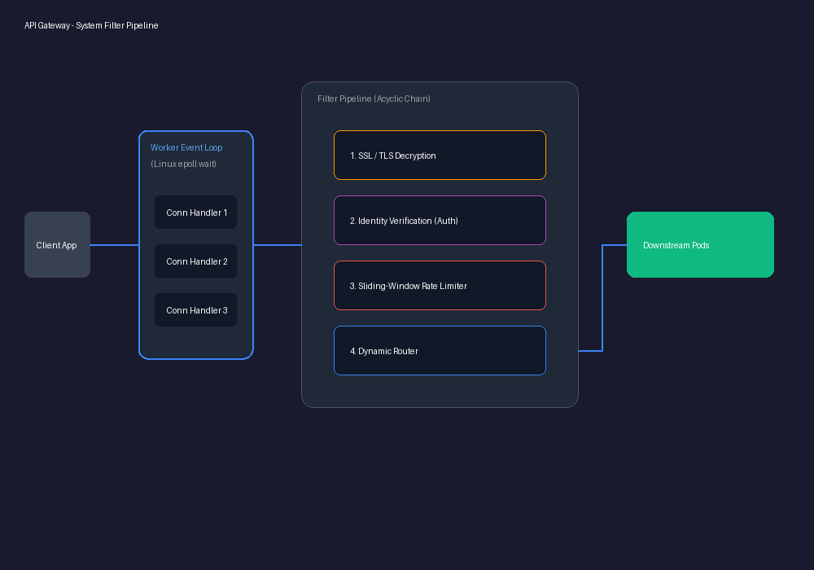

##### B. AWS Cloud-Native API Gateway Ingress Engine
Cloud-native layout showing traffic passing through WAF, NLB layers, ECS Envoy task arrays, authentication, caching tiers, and downstream service routing targets.

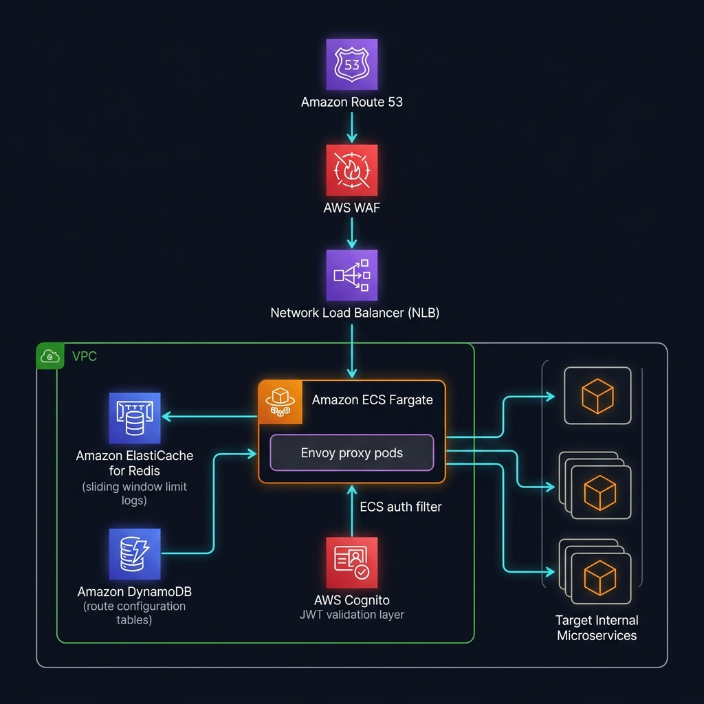

## ☕ Support

If you find these system design blueprints helpful, support my work by buying me a chai!

## 👤 Author & Contact

**Uday Singh**
* 📬 **Email:** [toudaysinghkushwah@gmail.com](mailto:toudaysinghkushwah@gmail.com)
* 🐙 **GitHub:** [github.com/udaysinghkushwah](https://github.com/udaysinghkushwah)

---

*Updated on 2026-07-21*
