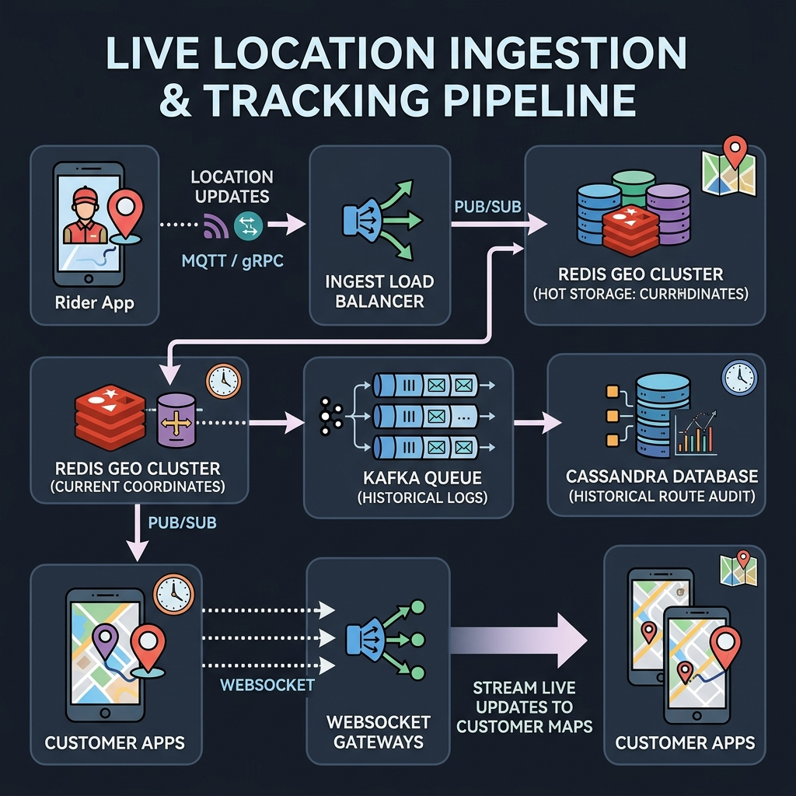
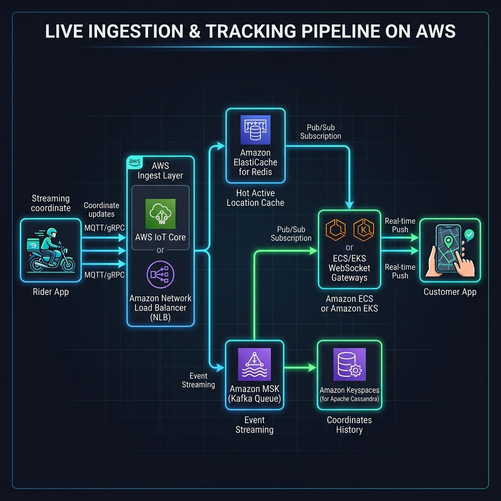
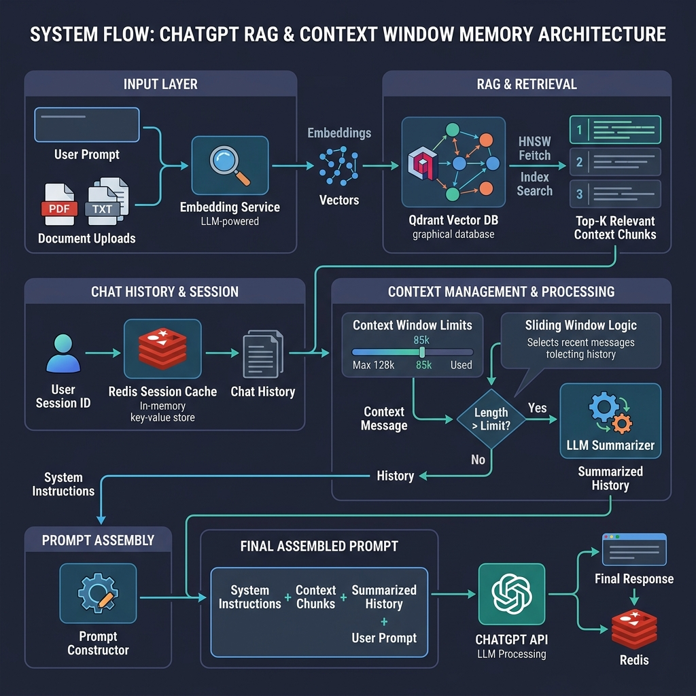
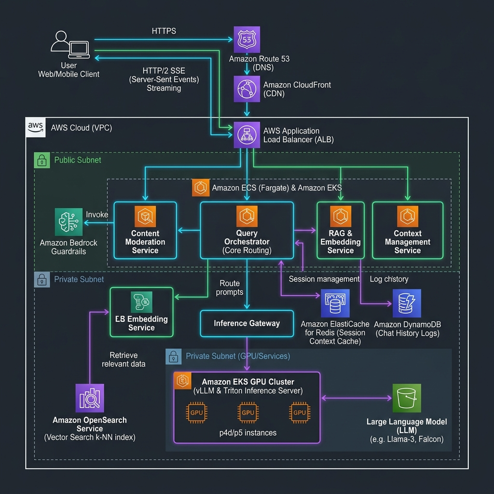

# 🏗️ System Design Blueprints

> A curated collection of **production-grade system design blueprints** with architecture diagrams, API specs, and AWS service mappings. Built for engineers preparing for system design interviews and building real-world distributed systems.

---

## 📋 Table of Contents

- [🗺️ System Design Roadmap](#️-system-design-roadmap)
- [📂 Completed Blueprints](#-completed-blueprints)
  - [🍔 Food Delivery System Design](#1-food-delivery-system-design)
  - [🤖 ChatGPT System Design](#2-chatgpt-system-design)
- [☕ Support](#-support)

---

## 🗺️ System Design Roadmap

A comprehensive roadmap of **100+ system design questions** organized by difficulty level. Topics with ✅ have detailed blueprints available — click the link to explore.

> **Legend:** ✅ Completed (with link) · ⬜ Planned

---

### Level 1 – Core System Design

| # | Topic | Status |
|---|-------|--------|
| 1 | Design a URL Shortener | ⬜ Planned |
| 2 | Design Pastebin | ⬜ Planned |
| 3 | Design File Storage System | ⬜ Planned |
| 4 | Design Dropbox | ⬜ Planned |
| 5 | Design Parking Lot | ⬜ Planned |
| 6 | Design Library Management System | ⬜ Planned |
| 7 | Design ATM System | ⬜ Planned |
| 8 | Design Elevator System | ⬜ Planned |
| 9 | Design Hotel Booking System | ⬜ Planned |

---

### Level 2 – Popular Real-world Systems

| # | Topic | Status |
|---|-------|--------|
| 1 | Design WhatsApp | ⬜ Planned |
| 2 | Design Facebook Messenger | ⬜ Planned |
| 3 | Design Slack | ⬜ Planned |
| 4 | Design Gmail | ⬜ Planned |
| 5 | Design Zoom | ⬜ Planned |
| 6 | Design Netflix | ⬜ Planned |
| 7 | Design YouTube | ⬜ Planned |
| 8 | Design Spotify | ⬜ Planned |
| 9 | Design Instagram | ⬜ Planned |

---

### Level 3 – E-commerce

| # | Topic | Status |
|---|-------|--------|
| 1 | Design Amazon | ⬜ Planned |
| 2 | Design Shopping Cart | ⬜ Planned |
| 3 | Design Checkout Service | ⬜ Planned |
| 4 | Design Inventory Management | ⬜ Planned |
| 5 | Design Product Search | ⬜ Planned |
| 6 | Design Recommendation Engine | ⬜ Planned |
| 7 | Design Order Management | ⬜ Planned |
| 8 | Design Payment Gateway | ⬜ Planned |
| 9 | Design Coupon Service | ⬜ Planned |

---

### Level 4 – Ride Sharing & Delivery

| # | Topic | Status |
|---|-------|--------|
| 1 | Design Uber | ⬜ Planned |
| 2 | Design Food Delivery Platform | ✅ [Blueprint](./food_delivery_sd/food_delivery_system_design.md) |
| 3 | Design Blinkit / Zepto | ⬜ Planned |
| 4 | Design Rider Dispatch | ⬜ Planned |
| 5 | Design ETA Calculation | ⬜ Planned |

---

### Level 5 – Social Media

| # | Topic | Status |
|---|-------|--------|
| 1 | Design Facebook | ⬜ Planned |
| 2 | Design Twitter / X | ⬜ Planned |
| 3 | Design LinkedIn | ⬜ Planned |
| 4 | Design Reddit | ⬜ Planned |
| 5 | Design News Feed | ⬜ Planned |
| 6 | Design Trending Topics | ⬜ Planned |

---

### Level 6 – Streaming

| # | Topic | Status |
|---|-------|--------|
| 1 | Design Video Streaming Platform | ⬜ Planned |
| 2 | Design Live Streaming | ⬜ Planned |
| 3 | Design CDN | ⬜ Planned |
| 4 | Design Video Encoding | ⬜ Planned |
| 5 | Design Adaptive Bitrate Streaming | ⬜ Planned |

---

### Level 7 – AI Systems

| # | Topic | Status |
|---|-------|--------|
| 1 | Design ChatGPT | ✅ [Blueprint](./chat_gpt_sd/chatgpt_system_design.md) |
| 2 | Design RAG Pipeline | ⬜ Planned |
| 3 | Design Vector Database | ⬜ Planned |
| 4 | Design AI Agent Framework | ⬜ Planned |
| 5 | Design LLM Gateway | ⬜ Planned |
| 6 | Design Semantic Search | ⬜ Planned |
| 7 | Design Token Streaming | ⬜ Planned |

---

### Level 8 – Distributed Systems

| # | Topic | Status |
|---|-------|--------|
| 1 | Distributed Cache | ⬜ Planned |
| 2 | Distributed Lock | ⬜ Planned |
| 3 | Distributed Queue | ⬜ Planned |
| 4 | API Gateway | ⬜ Planned |
| 5 | Service Discovery | ⬜ Planned |
| 6 | Rate Limiter | ⬜ Planned |
| 7 | Circuit Breaker | ⬜ Planned |
| 8 | Saga Pattern | ⬜ Planned |
| 9 | CQRS | ⬜ Planned |
| 10 | Event Sourcing | ⬜ Planned |

---

### Level 9 – Storage Systems

| # | Topic | Status |
|---|-------|--------|
| 1 | Design Redis | ⬜ Planned |
| 2 | Design Cassandra | ⬜ Planned |
| 3 | Design DynamoDB | ⬜ Planned |
| 4 | Design Elasticsearch | ⬜ Planned |
| 5 | Design MongoDB | ⬜ Planned |
| 6 | Design Object Storage (S3) | ⬜ Planned |

---

### Level 10 – Search Systems

| # | Topic | Status |
|---|-------|--------|
| 1 | Design Google Search | ⬜ Planned |
| 2 | Search Autocomplete | ⬜ Planned |
| 3 | Spell Checker | ⬜ Planned |
| 4 | Web Crawler | ⬜ Planned |
| 5 | Search Ranking | ⬜ Planned |

---

### Level 11 – Financial Systems

| # | Topic | Status |
|---|-------|--------|
| 1 | Design PayPal | ⬜ Planned |
| 2 | Design UPI | ⬜ Planned |
| 3 | Design Wallet | ⬜ Planned |
| 4 | Design Fraud Detection | ⬜ Planned |
| 5 | Design Ledger Service | ⬜ Planned |

---

### Level 12 – Cloud Systems

| # | Topic | Status |
|---|-------|--------|
| 1 | Design AWS S3 | ⬜ Planned |
| 2 | Design AWS Lambda | ⬜ Planned |
| 3 | Design Kubernetes | ⬜ Planned |
| 4 | Design CI/CD Pipeline | ⬜ Planned |
| 5 | Design Service Mesh | ⬜ Planned |

---

### Level 13 – Notification Systems

| # | Topic | Status |
|---|-------|--------|
| 1 | Push Notifications | ⬜ Planned |
| 2 | Email Service | ⬜ Planned |
| 3 | SMS Gateway | ⬜ Planned |
| 4 | WebSocket Notifications | ⬜ Planned |
| 5 | OTP Service | ⬜ Planned |

---

### Level 14 – Observability

| # | Topic | Status |
|---|-------|--------|
| 1 | Logging Platform | ⬜ Planned |
| 2 | Metrics Collection | ⬜ Planned |
| 3 | Distributed Tracing | ⬜ Planned |
| 4 | Alert Manager | ⬜ Planned |
| 5 | Monitoring Dashboard | ⬜ Planned |

---

### Level 15 – Interview Favorites

| # | Topic | Status |
|---|-------|--------|
| 1 | Design Google Docs | ⬜ Planned |
| 2 | Design Google Maps | ⬜ Planned |
| 3 | Design Airbnb | ⬜ Planned |
| 4 | Design GitHub | ⬜ Planned |
| 5 | Design GitHub Actions | ⬜ Planned |
| 6 | Design Notion | ⬜ Planned |
| 7 | Design Figma | ⬜ Planned |

---

### 🔥 Advanced Topics

| # | Topic | Status |
|---|-------|--------|
| 1 | Consistent Hashing | ⬜ Planned |
| 2 | Sharding | ⬜ Planned |
| 3 | CAP Theorem | ⬜ Planned |
| 4 | Multi-Region Systems | ⬜ Planned |
| 5 | Kafka Event Streaming | ⬜ Planned |
| 6 | Feature Flags | ⬜ Planned |
| 7 | IAM | ⬜ Planned |
| 8 | OAuth2 & SSO | ⬜ Planned |
| 9 | Zero Trust | ⬜ Planned |
| 10 | Disaster Recovery | ⬜ Planned |

---

## 📊 Progress Tracker

| Level | Category | Total | Completed | Progress |
|-------|----------|-------|-----------|----------|
| 1 | Core System Design | 9 | 0 | ⬜⬜⬜⬜⬜⬜⬜⬜⬜ |
| 2 | Popular Real-world Systems | 9 | 0 | ⬜⬜⬜⬜⬜⬜⬜⬜⬜ |
| 3 | E-commerce | 9 | 0 | ⬜⬜⬜⬜⬜⬜⬜⬜⬜ |
| 4 | Ride Sharing & Delivery | 5 | 1 | ✅⬜⬜⬜⬜ |
| 5 | Social Media | 6 | 0 | ⬜⬜⬜⬜⬜⬜ |
| 6 | Streaming | 5 | 0 | ⬜⬜⬜⬜⬜ |
| 7 | AI Systems | 7 | 1 | ✅⬜⬜⬜⬜⬜⬜ |
| 8 | Distributed Systems | 10 | 0 | ⬜⬜⬜⬜⬜⬜⬜⬜⬜⬜ |
| 9 | Storage Systems | 6 | 0 | ⬜⬜⬜⬜⬜⬜ |
| 10 | Search Systems | 5 | 0 | ⬜⬜⬜⬜⬜ |
| 11 | Financial Systems | 5 | 0 | ⬜⬜⬜⬜⬜ |
| 12 | Cloud Systems | 5 | 0 | ⬜⬜⬜⬜⬜ |
| 13 | Notification Systems | 5 | 0 | ⬜⬜⬜⬜⬜ |
| 14 | Observability | 5 | 0 | ⬜⬜⬜⬜⬜ |
| 15 | Interview Favorites | 7 | 0 | ⬜⬜⬜⬜⬜⬜⬜ |
| 🔥 | Advanced Topics | 10 | 0 | ⬜⬜⬜⬜⬜⬜⬜⬜⬜⬜ |
| | **Total** | **108** | **2** | **1.9%** |

---

## 📂 Completed Blueprints

### 1. Food Delivery System Design
A production-grade, end-to-end system design for a high-scale food delivery platform connecting Customers, Restaurants, and Delivery Partners.

* **Documentation:** [Food Delivery System Design (food_delivery_system_design.md)](./food_delivery_sd/food_delivery_system_design.md)
* **OpenAPI 3.0 API Spec:** [OpenAPI Contract (food_delivery_api_spec.yaml)](./food_delivery_sd/food_delivery_api_spec.yaml)
* **Local Mock API Server:** [Mock Python Server (mock_server.py)](./food_delivery_sd/mock_server.py) (run using `python3 food_delivery_sd/mock_server.py`)

#### Food Delivery Tech Stack Details (with AWS Service Mapping)
* **PostgreSQL (Amazon Aurora PostgreSQL):** Handles critical transactional order lifecycle, payment ledger logs, and user metadata. Configured with Aurora Global Database for multi-region active-passive failover under 1 minute.
* **MongoDB (Amazon DocumentDB):** Houses restaurant profiles and dynamic menus. The document-oriented layout stores complex nested categories and add-on lists in a single document, avoiding costly SQL joins on reads.
* **Redis (Amazon ElastiCache for Redis):** Manages real-time driver coordinates using in-memory geospatial indexes (`GEOADD` / `GEORADIUS`) and broadcasts live location updates to WebSocket servers via Redis Pub/Sub.
* **Elasticsearch (Amazon OpenSearch Service):** Drives food search, text keyword autocomplete, and geospatial listing queries (e.g., "nearby restaurants within 5km") with sub-20ms latencies.
* **Apache Cassandra (Amazon Keyspaces):** Serverless wide-column database that digests heavy location coordinate write-streams (25k writes/sec) from active riders, storing location logs partitioned by `(rider_id, date)`.
* **Apache Kafka (Amazon MSK):** Managed streaming cluster that decouples checkout and order placement services from background notification tasks and driver assignment loops.

#### Food Delivery Architecture Diagrams

##### A. High-Level System Architecture (Generic)
Overview of clients, gateway, microservices layer, message brokers, and databases.

##### B. Real-Time Ingestion & Live Tracking Pipeline (Generic)
Visual flow of coordinates streamed from riders to Redis Geo (hot cache), Kafka, Cassandra (historical logs), and WebSocket push connections to tracking users.

##### C. Rider Matching & Dispatch Engine (Generic)
Visual explanation of the bipartite graph match loop using candidate discovery, multi-criteria weight functions (ETA, Travel Distance, Rating), and Hungarian Algorithm solvers.

##### D. AWS Cloud-Native System Architecture
Cloud-native deployment mapping microservices to Amazon EKS/ECS, databases to Aurora/DocumentDB, and streaming to Amazon MSK.

##### E. AWS-Native Live Ingestion & Tracking Pipeline
Live coordinate ingestion using AWS IoT Core or Network Load Balancer (NLB) to Amazon ElastiCache and Amazon Keyspaces (Cassandra).

##### F. AWS-Native Rider Matching & Dispatch Engine
Matching engine workflow orchestrated on AWS, pulling orders from Amazon MSK and geolocations from Amazon ElastiCache.

---

### 2. ChatGPT System Design
A production-grade system design for a real-time, low-latency conversational AI platform (LLM conversational system). Handles streaming tokens, active session memory, context window compression, and GPU inference routing.

* **Documentation:** [ChatGPT System Design (chatgpt_system_design.md)](./chat_gpt_sd/chatgpt_system_design.md)

#### ChatGPT Tech Stack Details (with AWS Service Mapping)
* **Server-Sent Events (ALB to ECS/EKS Streams):** Uses Application Load Balancers to support long-lived HTTP/2 chunked-transfer connections (SSE), pushing response tokens text-by-text to the client without API Gateway timeouts.
* **Apache Cassandra / DynamoDB (Amazon DynamoDB):** Stores conversational chat histories. DynamoDB handles billions of messages, partitioned by `session_id` and sorted by `created_at` for sub-10ms chronological reads.
* **Redis (Amazon ElastiCache for Redis):** Caches short-term active chat context windows and session state, letting the Query Orchestrator quickly compile conversation histories for LLM payloads.
* **Qdrant / pgvector (Amazon OpenSearch Service Vector Engine):** Indexes chunked vector embeddings using HNSW graphs for Retrieval-Augmented Generation (RAG), returning semantic search results within 10ms.
* **vLLM / Triton (Amazon EKS GPU Instances):** Model servers running on GPU-equipped EC2 instances (e.g., `p4d` or `p5` nodes with Nvidia A100/H100 GPUs) using tensor parallelism and PagedAttention to optimize throughput.

#### ChatGPT Architecture Diagrams

##### A. High-Level ChatGPT Architecture (Generic)
Overview of clients, gateway, Query Orchestrator, context engine, vector storage, and GPU cluster.

##### B. Low-Latency Token Streaming & GPU Inference Flow (Generic)
Visual flow of HTTP/2 SSE streaming connections, Triton/vLLM batch queuing, and PagedAttention block cache partitioning.

##### C. RAG & Context Window Memory Pipeline (Generic)
Visual flow of document indexing, semantic nearest-neighbor vector search, conversation context windows, and secondary LLM summarization.

##### D. AWS Cloud-Native ChatGPT Architecture
Cloud-native deployment on AWS routing SSE streams through Application Load Balancers, RAG via OpenSearch Vector Engine, and inference on Amazon EKS GPU clusters.

---

## ☕ Support

If you find these system design blueprints helpful, support my work by buying me a chai!

---

*Updated on 2026-07-21*
