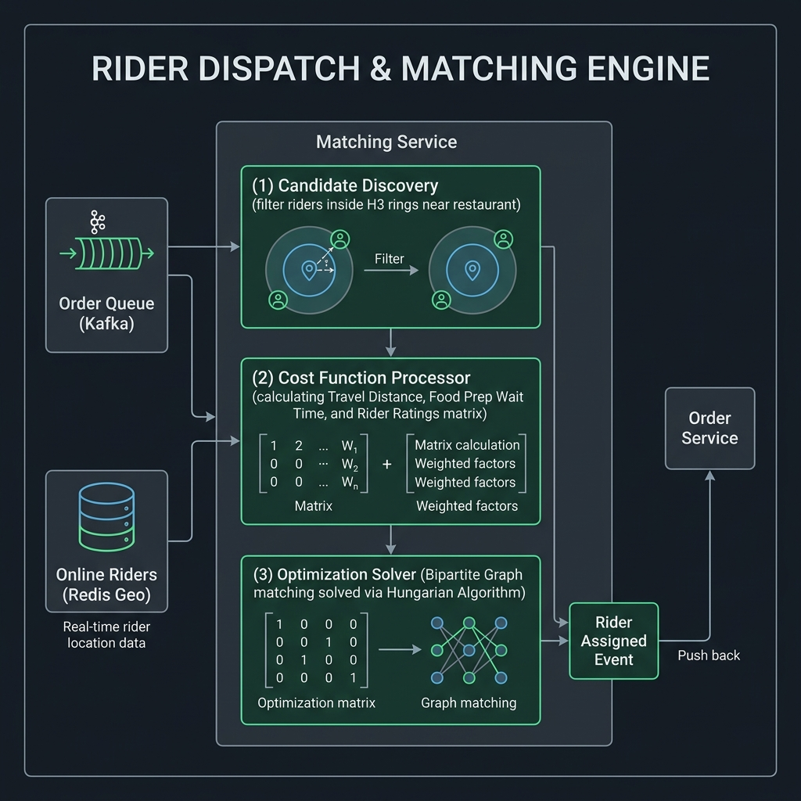

# System Design Repository

This repository contains professional system design blueprints and documentation.

## Projects

### 1. Food Delivery System Design
A production-grade, end-to-end system design for a high-scale food delivery platform connecting Customers, Restaurants, and Delivery Partners.

* **Documentation:** [Food Delivery System Design (food_delivery_system_design.md)](./Food_delivery_sd/food_delivery_system_design.md)
* **OpenAPI 3.0 API Spec:** [OpenAPI Contract (food_delivery_api_spec.yaml)](./Food_delivery_sd/food_delivery_api_spec.yaml)
* **Local Mock API Server:** [Mock Python Server (mock_server.py)](./Food_delivery_sd/mock_server.py) (run using `python3 Food_delivery_sd/mock_server.py`)

#### Food Delivery Tech Stack Details
* **PostgreSQL (Transactional Store):** Handles critical order lifecycle, payment ledger logs, and user metadata. Guarantees ACID transactions and row-level locks (`SELECT FOR UPDATE`) to prevent race conditions during driver job acceptances.
* **MongoDB (Catalog Store):** Houses restaurant profiles and dynamic menus. The document-oriented layout stores complex nested categories and add-on lists in a single document, avoiding costly SQL joins on reads.
* **Redis (Active Cache & Geo Index):** Manages real-time driver coordinates using in-memory geospatial indexes (`GEOADD` / `GEORADIUS`) and broadcasts live location changes using Redis Pub/Sub.
* **Elasticsearch (Search Engine):** Drives food search, text keyword autocomplete, and geospatial listing queries (e.g., "nearby restaurants within 5km") with sub-20ms latencies.
* **Apache Cassandra (Archival Tracking Logs):** Digests heavy location coordinate write-streams from thousands of delivery partners, storing location logs partitioned by `(rider_id, date)`.
* **Apache Kafka (Event Pipeline):** Decouples checkout and order placement services from background notification tasks and driver assignment loops.

#### Food Delivery Architecture Diagrams

##### A. High-Level System Architecture
Overview of clients, gateway, microservices layer, message brokers, and databases.

##### B. Real-Time Ingestion & Live Tracking Pipeline
Visual flow of coordinates streamed from riders to Redis Geo (hot cache), Kafka, Cassandra (historical logs), and WebSocket push connections to tracking users.

##### C. Rider Matching & Dispatch Engine
Visual explanation of the bipartite graph match loop using candidate discovery, multi-criteria weight functions (ETA, Travel Distance, Rating), and Hungarian Algorithm solvers.

---

### 2. ChatGPT System Design
A production-grade system design for a real-time, low-latency conversational AI platform (LLM conversational system). Handles streaming tokens, active session memory, context window compression, and GPU inference routing.

* **Documentation:** [ChatGPT System Design (chatgpt_system_design.md)](./chat_gpt_sd/chatgpt_system_design.md)

#### ChatGPT Tech Stack Details
* **Server-Sent Events (SSE):** Native HTTP-based unidirectional streaming protocol used to push response tokens text-by-text as they are generated. More lightweight and resilient than full-duplex WebSockets.
* **Apache Cassandra:** Stores billions of conversational chat history logs. Message writes are partition-aligned on `session_id` and sorted by creation timestamp for chronological reads.
* **Redis:** Caches short-term active chat context windows and session state, letting the Query Orchestrator quickly append historical prompts during conversation rounds.
* **Qdrant (Vector DB):** Indexes chunked vector embeddings using HNSW graphs for Retrieval-Augmented Generation (RAG), returning matching context documents within 10ms.
* **vLLM / Triton:** Handles dynamic batching, GPU tensor parallelism, and KV-cache management (PagedAttention) to optimize inference resource efficiency and throughput.

#### ChatGPT Architecture Diagrams

##### A. High-Level ChatGPT Architecture
Overview of clients, gateway, Query Orchestrator, context engine, vector storage, and GPU cluster.

##### B. Low-Latency Token Streaming & GPU Inference Flow
Visual flow of HTTP/2 SSE streaming connections, Triton/vLLM batch queuing, and PagedAttention block cache partitioning.

##### C. RAG & Context Window Memory Pipeline
Visual flow of document indexing, semantic nearest-neighbor vector search, conversation context windows, and secondary LLM summarization.

---

## Support

If you find these system design blueprints helpful, support my work by buying me a chai!

---
*Created on 2026-07-20*
