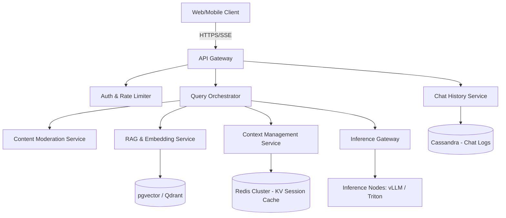
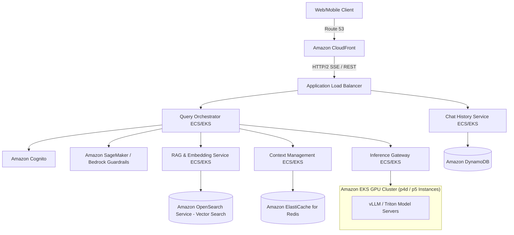

# ChatGPT System Design

This document outlines the system design for a real-time, low-latency conversational AI platform like **ChatGPT** (or Gemini). The system must ingest user queries, manage conversational context windows, perform safety checks, coordinate LLM inference endpoints, and stream responses back to users.

---

## 1. System Requirements

### Functional Requirements
* **Users:**
  * Create, delete, and rename chat threads.
  * Send text prompts (and attach documents/images for multimodal queries).
  * Receive real-time, streaming text responses (token by token).
  * View historical chat threads chronologically.
  * Rate answers (thumbs up/down) or copy responses.
* **Orchestration & Security:**
  * Moderate input prompts for safety, toxicity, and policy violations.
  * Retrieve contextually relevant documents (Retrieval-Augmented Generation / RAG).
  * Rate-limit users based on tier limits (e.g., Free vs. Plus plans).

### Non-Functional Requirements
* **Low Latency:** 
  * Time to First Token (TTFT) must be $< 200\text{ms}$.
  * Subsequent tokens must stream at a comfortable reading pace ($\approx 30\text{–}60 \text{ tokens/second}$).
* **High Concurrency:** Support millions of active users receiving streaming answers concurrently.
* **Durability:** Chat histories must be reliably stored and retrieved.
* **Fault Tolerance:** If an inference node or model host crashes, query requests must fail-over to healthy nodes without breaking the user session.

---

## 2. Capacity & Scale Estimation

Let's assume:
* **Daily Active Users (DAU):** $20 \text{ Million}$
* **Average Chats per User per Day:** $5 \text{ sessions}$
* **Average Messages per Session:** $10 \text{ messages}$
* **Total Daily Messages:** 
  $$20,000,000 \text{ users} \times 5 \text{ sessions} \times 10 \text{ messages} = 1 \text{ Billion messages/day}$$

### Throughput (QPS)
* **Average Request QPS:**
  $$\frac{1,000,000,000 \text{ messages}}{86,400 \text{ seconds}} \approx 11,574 \text{ QPS}$$
* **Peak Request QPS (3x average):** 
  $$11,574 \times 3 \approx 34,722 \text{ QPS}$$

### Storage Estimation (Chat History)
* Average message size (prompt + response): $1 \text{ KB}$ (approx. 500 words).
* Daily storage: 
  $$1,000,000,000 \text{ messages} \times 1 \text{ KB} = 1 \text{ TB / day}$$
* Annual Storage: 
  $$1 \text{ TB/day} \times 365 \text{ days} \approx 365 \text{ TB / year}$$

---

## 3. High-Level Architecture

The architecture utilizes an event-driven, stream-oriented model to guarantee rapid token delivery.


### System Architecture Flowchart


### Core Components

1. **API Gateway:** Entry point that routes HTTP requests and maintains persistent **Server-Sent Events (SSE)** connections for streaming tokens back to clients.
2. **Query Orchestrator:** The brain of the system. Co-ordinates the lifecycle of a prompt: verifies auth, calls Moderation, fetches history, coordinates RAG, sends formatted payloads to the inference engine, and pipes token packets back to the gateway.
3. **Content Moderation Service:** Run asynchronously or synchronously prior to model execution. Uses classification models to block queries violating safety policies (e.g., self-harm, hate speech).
4. **Context Management Service:** Keeps the active chat history context. Because LLMs have context limits and charge per token, it summarizes/compresses historical messages once a threshold is reached.
5. **Inference Gateway:** Manages load balancing across Triton Inference Server or vLLM clusters. Handles tensor parallel groups, token caching (KV Cache), and queues prompts when GPUs are saturated.

---

## 4. Key Workflows & Engineering Details

### A. Streaming Response Mechanism (SSE vs WebSockets)


To display text character-by-character, we must push downstream tokens in real-time.

* **Why Server-Sent Events (SSE)?**
  * **Unidirectional Stream:** The client only sends a single request (the prompt), and the server streams tokens back. WebSockets support full-duplex communication, which is overkill and uses more server overhead (WS connections need keep-alive pings and custom framings).
  * **HTTP Native:** SSE works over HTTP/2, automatically supports reconnection, and is lighter on network infrastructure.

#### **Flow of a Streaming Session:**
1. Client issues a `POST /v1/chat/completions` request.
2. The Gateway establishes a chunked-transfer HTTP stream (`Content-Type: text/event-stream`).
3. The inference engine outputs tokens.
4. Gateway writes each token as a message packet: `data: {"token": "hello"}`.
5. The stream is terminated with `data: [DONE]`.

---

### B. Context Window & Memory Management


An LLM does not remember past queries natively. To maintain a conversational thread, the system must append previous messages to the input payload.

1. **KV Caching:**
   Generating text is auto-regressive (the next token is predicted using all previous tokens). To prevent recalculating attention vectors for historical text repeatedly, GPUs cache keys and values (KV Cache) in GPU memory.
   * **PagedAttention (vLLM):** Partitions KV cache into non-contiguous blocks, mimicking virtual memory in operating systems, reducing memory waste by 96% and allowing larger batch sizes.
2. **Context Compression (Sliding Window & Summarization):**
   * If a conversation runs over 8,000 tokens, the Context Service compresses it by passing past messages to a smaller LLM for summarization.
   * Only the summary plus the last 3-4 messages are sent as context to the primary model, optimizing latency and resource utilization.

---

### C. Retrieval-Augmented Generation (RAG)
For factual, document-specific queries, the system pulls external context:

```
[User Prompt] ──> [Query Embedding (Ada/BERT)] ──> [Vector DB Search] 
                                                        │
                                                        ▼
[LLM Inference Payload] <── [Combine Prompt + Context] <── [Top K Documents]
```
* **Vector DB Indexing:** Document texts are chunked, embedded into high-dimensional vectors, and indexed in **Qdrant** or **pgvector** using **HNSW** (Hierarchical Navigable Small World) graphs for sub-10ms nearest neighbor search.

---

## 5. Database Schema Design

### 1. `chat_sessions` Table (PostgreSQL)
Manages session metadata (reads are low-frequency compared to messages).
```sql
CREATE TABLE chat_sessions (
    session_id UUID PRIMARY KEY DEFAULT gen_random_uuid(),
    user_id UUID NOT NULL,
    title VARCHAR(255) DEFAULT 'New Chat',
    created_at TIMESTAMP WITH TIME ZONE DEFAULT CURRENT_TIMESTAMP,
    updated_at TIMESTAMP WITH TIME ZONE DEFAULT CURRENT_TIMESTAMP
);
```

### 2. `chat_messages` Table (Cassandra / Wide-Column Store)
We write billions of messages daily. We partition by `session_id` and sort by message creation time for fast chronological loading.
```sql
CREATE KEYSPACE chat_history WITH replication = {
    'class': 'NetworkTopologyStrategy', 
    'replication_factor': 3
};

CREATE TABLE chat_history.messages (
    session_id uuid,
    message_id uuid,
    role text, -- 'user' or 'assistant'
    content text,
    created_at timestamp,
    PRIMARY KEY (session_id, created_at)
) WITH CLUSTERING ORDER BY (created_at DESC);
```

---

## 6. API Design & Payloads

### 1. Create a Chat Completion (Stream)
* **Endpoint:** `POST /v1/chat/completions`
* **Payload:**
```json
{
  "session_id": "9a38a3ce-21e3-4467-b8df-dc11202e88a1",
  "model": "gpt-4o",
  "messages": [
    {
      "role": "user",
      "content": "Explain quantum physics to a five year old."
    }
  ],
  "stream": true
}
```
* **Stream Response Format (Event-Stream packets):**
```
data: {"choices": [{"delta": {"content": "Quantum"}}]}
data: {"choices": [{"delta": {"content": " physics"}}]}
data: {"choices": [{"delta": {"content": " is"}}]}
...
data: [DONE]
```

---

## 7. Scalability & GPU Optimization

### 1. GPU Queueing and Dynamic Batching
* GPUs compute operations faster when running inputs in batches.
* The Inference Gateway buffers incoming individual prompts for a tiny window (e.g., 2–5ms) and batches them together before running inference, maximizing throughput.

### 2. Model Parallelism
* **Tensor Parallelism:** Splitting layers of a single model across multiple GPUs (intra-node) to allow models too large for one GPU's VRAM to run.
* **Pipeline Parallelism:** Splitting consecutive layers across separate nodes (inter-node).

---

## 8. AWS Cloud-Native Implementation

To host a low-latency LLM platform like ChatGPT on AWS, we map the components to AWS-managed infrastructure, prioritizing GPU utilization, low-latency streaming, and fast vector calculations.

### AWS Cloud-Native Architecture Diagram


### AWS Service Mapping & Design Choices

| Generic Component | AWS Service | Design Details & Rationale |
| :--- | :--- | :--- |
| **API Gateway / Ingress** | **Application Load Balancer (ALB) & CloudFront** | While Amazon API Gateway is useful, its strict **29-second execution timeout** is too short for long LLM generation runs. An ALB supports long-lived HTTP/2 chunked-transfer connections (Server-Sent Events) without timeouts, routing streams directly to orchestrator containers. |
| **Query Orchestrator** | **Amazon ECS on AWS Fargate / Amazon EKS** | Long-running Node.js or Go services coordinate token streaming, moderation, and RAG pipelines. Deployed on containers for horizontal scalability. |
| **Moderation Service** | **Amazon Bedrock Guardrails / SageMaker** | Amazon Bedrock Guardrails provides managed safety filters for LLM inputs/outputs. For custom toxicity models, a SageMaker serverless endpoint is used. |
| **Context KV Cache** | **Amazon ElastiCache for Redis** | Stores active conversation session history so the orchestrator can quickly fetch and compile the context window for the next prompt. |
| **Vector DB (RAG)** | **Amazon OpenSearch Service (Vector Engine)** | Amazon OpenSearch supports vector indices (k-NN search using HNSW graphs) to index documentation and query semantic matches in sub-10ms. |
| **Chat History** | **Amazon DynamoDB** | Stores billions of historical chat messages. Partitioned by `session_id` (hash key) and sorted by `created_at` (range key), providing single-digit millisecond latency for fetching chronological chat histories. |
| **Inference Nodes** | **Amazon EKS with GPU Instances** | Runs model servers (vLLM or Triton) on GPU-equipped EC2 instances (e.g., `p4d.24xlarge` with 8x Nvidia A100s or `p5.48xlarge` with Nvidia H100s). Amazon EKS manages tensor-parallel groups and scaling rules based on GPU memory/utilization metrics. |
