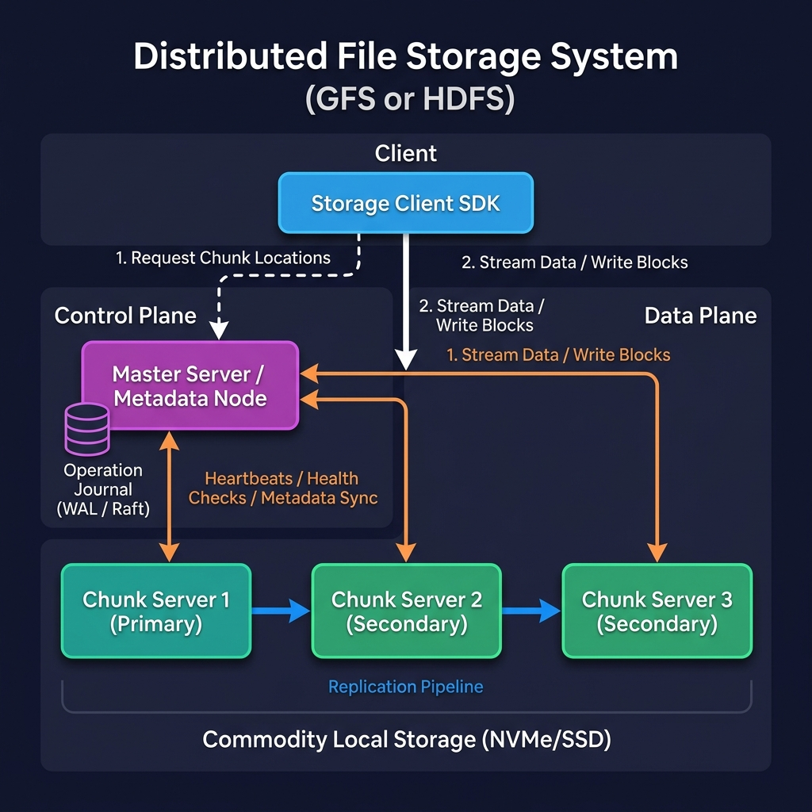
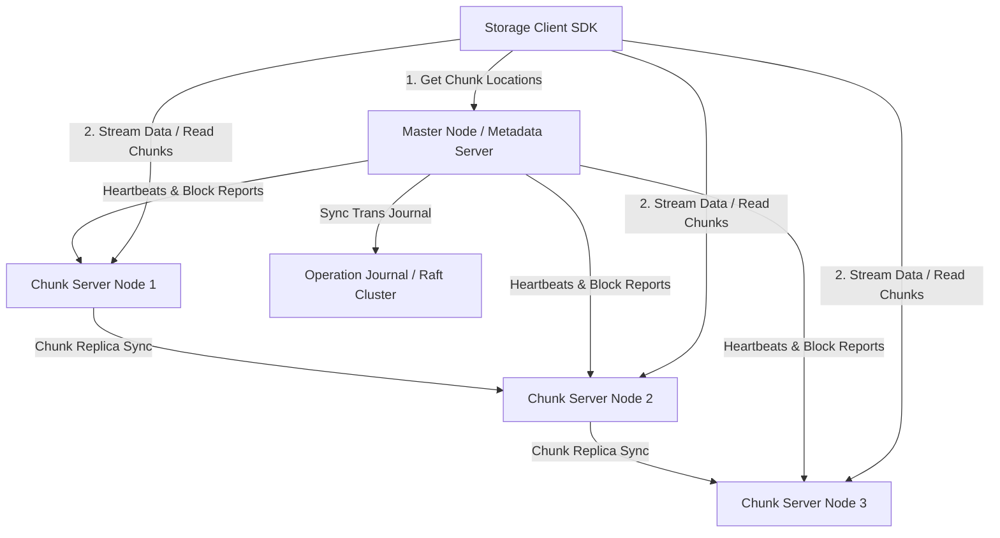
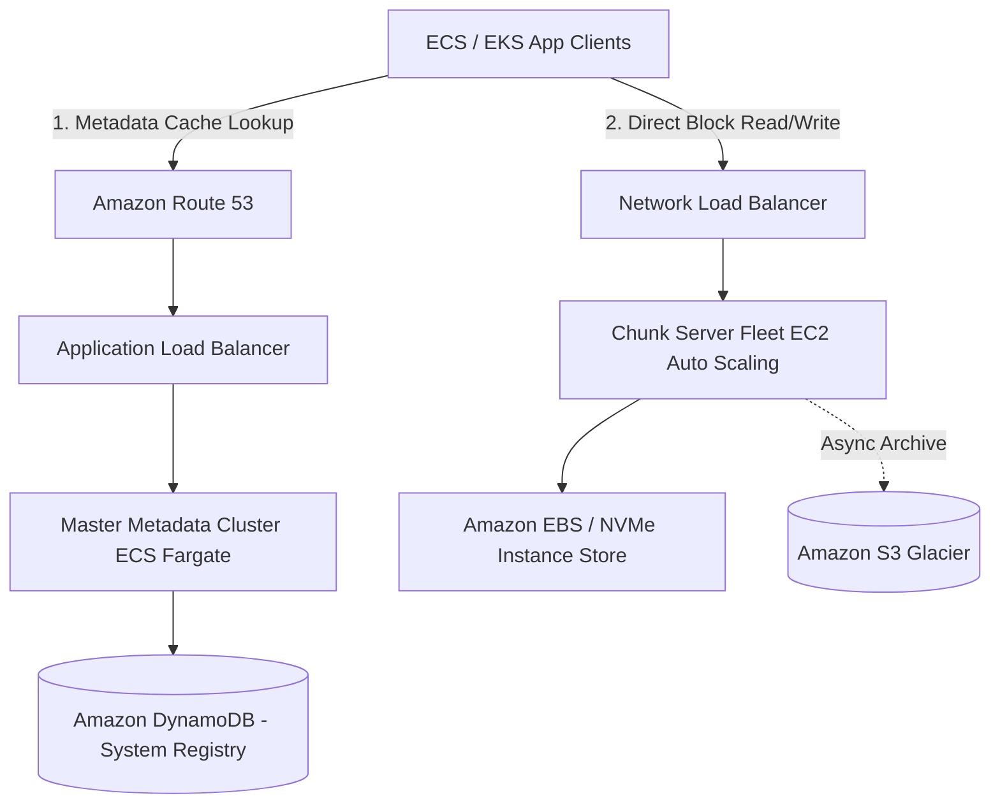

# Distributed File Storage System Design

This document details the production-grade system design for a high-scale, fault-tolerant **Distributed File Storage System** (analogous to Google File System (GFS) or Hadoop Distributed File System (HDFS)). The system is optimized for storing large files (multi-gigabyte to terabyte scale), managing a hierarchical directory namespace, distributing block/chunk storage across thousands of commodity servers, and providing high aggregate write/read throughput.

---

## 1. System Requirements

### Functional Requirements
* **Namespace Management:**
  * Support a hierarchical directory structure (create, rename, delete files and directories).
  * Fast lookup of file metadata (size, permissions, file-to-chunk mappings).
* **File Operations:**
  * Support large file writes (append-only operations optimized, arbitrary updates supported but discouraged).
  * High-throughput file reads (streaming access pattern).
  * Delete files (garbage collected asynchronously).
* **Data Chunking:**
  * Automatically split large files into fixed-size chunks (e.g., 64 MB blocks).
* **Replication & Fault Tolerance:**
  * Automatically replicate each chunk across multiple data servers (default: 3 replicas) to survive hardware failures.
  * Continuously monitor the health of data servers and re-replicate/rebalance blocks dynamically.

### Non-Functional Requirements
* **High Read/Write Aggregate Throughput:** Optimized for concurrent reads and writes by thousands of clients.
* **Fault Tolerance & Reliability:** Zero data loss in the event of hardware or rack-level power failures.
* **Scalability:** Scale to petabytes/exabytes of storage spanning tens of thousands of commodity machines.
* **Eventually Consistent Read Paths:** Master handles metadata synchronously, while chunk servers serve actual file data. Clients cache metadata to reduce master load.
* **Integrity:** Automatically detect and repair bit rot / data corruption using block checksums.

---

## 2. Capacity & Scale Estimation

### Assumptions
* **Total Storage Target:** $100 \text{ Petabytes (PB)}$
* **Average File Size:** $100 \text{ MB}$
* **Total Number of Files:** 
  $$\frac{100 \text{ PB}}{100 \text{ MB}} = 1 \text{ Billion files}$$
* **Default Chunk Size:** $64 \text{ MB}$
* **Replication Factor:** $3\times$ (Total raw physical storage required = $300 \text{ PB}$)
* **Average Chunks per File:**
  $$\frac{100 \text{ MB}}{64 \text{ MB}} \approx 1.56 \text{ chunks/file}$$
* **Total Chunk Replicas in the System:**
  $$1 \text{ Billion files} \times 1.56 \text{ chunks} \times 3 \text{ replicas} = 4.68 \text{ Billion chunk replicas}$$

### Master Metadata Memory Size (Single Node RAM Target)
The master server holds all metadata in memory for sub-millisecond namespace operations.
* Metadata per file: Name, size, ACLs, mappings $\approx 150 \text{ bytes}$.
* Metadata per chunk: Chunk ID, version, locations $\approx 100 \text{ bytes}$.
* Total Master Memory Required:
  $$(1 \text{ Billion files} \times 150 \text{ bytes}) + (1.56 \text{ Billion unique chunks} \times 100 \text{ bytes}) = 150 \text{ GB} + 156 \text{ GB} = \mathbf{306 \text{ GB RAM}}$$
  This easily fits on a modern high-memory bare-metal server (e.g., 512 GB or 1 TB RAM).

---

## 3. High-Level Architecture

The architecture separates the **Metadata Path** (control plane) from the **Data Path** (data plane) to prevent the master server from becoming a bottleneck during heavy read/write workloads.



### System Architecture Flowchart


### Core Components

1. **Storage Client SDK:** Integrated with client applications. It talks to the Master to get chunk locations and caches this metadata. It directly streams blocks from Chunk Servers.
2. **Master Server (Metadata Node):** The central coordinator. Manages the directory namespace, file-to-chunk mapping, replica placement, garbage collection, and chunk server health checks.
3. **Chunk Servers (Data Nodes):** Commodity Linux nodes running storage services. They store actual 64 MB chunk files on local disk (NVMe/SSD/HDD) and report chunk inventories to the Master.
4. **Operation Journal (WAL):** A highly durable, replicated transaction log (e.g., using Raft/ZooKeeper consensus) that records all namespace mutations synchronously before replying to the client.

---

## 4. Key Workflows & Engineering Details

### A. The Chunking and Allocation Strategy

Files are split into immutable, uniquely identified 64 MB chunks. The Master assigns a globally unique 64-bit Chunk Handle to each chunk during file creation.

```
File: /data/logs.txt (Size: 150 MB)
├── Chunk 0 (64 MB) -> Handle: 0xCAFE0001 (Replicas: CS1, CS2, CS3)
├── Chunk 1 (64 MB) -> Handle: 0xCAFE0002 (Replicas: CS2, CS3, CS4)
└── Chunk 2 (22 MB) -> Handle: 0xCAFE0003 (Replicas: CS1, CS4, CS5)
```

#### Why a large 64 MB chunk size?
1. **Reduces client-master interaction:** Clients can cache metadata maps and perform large sequential reads/writes on a single chunk without calling the Master repeatedly.
2. **Reduces Metadata Size:** Allows the Master to hold all file namespace information comfortably in physical RAM.
3. **Persistent TCP Connections:** Clients keep long-lived connections open to Chunk Servers, avoiding the overhead of connection handshakes.

---

### B. Write Path Flow (Single-Master, Multi-Replica)

To maximize write bandwidth, data is pipelined linearly along a chain of Chunk Servers rather than routed through the Master.

```
                     [Master Server]
                        │      ▲
           1. Get Write │      │ 6. Commit Confirm
              Lease &   │      │
              Replica   ▼      │
              List    ┌──────────┐
                      │  Client  │
                      └──────────┘
                         │    ▲
         2. Pipeline Data│    │ 5. Ack Success
           (Chained)     ▼    │
             ┌──────────────┐ │
             │ Chunk Server │─┘
             │ (Primary)    │◀──────────────┐
             └──────────────┘               │
               │      ▲                     │
 3. Push Data  │      │ 4. Replication Ack  │ 4. Replication Ack
               ▼      │                     │
             ┌──────────────┐               │
             │ Chunk Server │───────────────┘
             │ (Secondary)  │
             └──────────────┘
               │      ▲
 3. Push Data  │      │ 4. Replication Ack
               ▼      │
             ┌──────────────┐
             │ Chunk Server │
             │ (Tertiary)   │
             └──────────────┘
```

#### **Execution Sequence:**
1. **Client requests chunk locations:** Client asks the Master which Chunk Server holds the current write lease (Primary) and the locations of other replicas (Secondaries).
2. **Client pipelines data:** Client pushes data to the *closest* Chunk Server in the replica list. That Chunk Server buffers the data in memory and pipelines it to the next closest replica.
3. **Write Command Trigger:** Once all replicas acknowledge receipt of the buffered data, the client sends a write command to the Primary Chunk Server.
4. **Primary Serialization:** The Primary assigns consecutive sequence numbers to writes, executes the local write, and tells the Secondaries to write data at the exact same offsets.
5. **Acknowledge:** Secondaries reply to the Primary. The Primary then replies to the client.

---

### C. Replication, Placement & Rack Awareness

A major goal is surviving rack failures. Chunk replicas are distributed using a rack-aware placement policy:

```
RACK 1                             RACK 2
┌──────────────────┐               ┌──────────────────┐
│  [CS 1]   [CS 2] │               │  [CS 3]   [CS 4] │
│  (Replica 1)     │               │  (Replica 2)     │
│                  │               │  (Replica 3)     │
└──────────────────┘               └──────────────────┘
```

* **Replica 1:** Placed on a local Chunk Server (in the same rack as the client request).
* **Replica 2:** Placed on a different rack to protect against rack-level switch/power failure.
* **Replica 3:** Placed on a different node within that second rack to optimize local read load distribution.

---

## 5. Database & Namespace Schema

### 1. Master Server In-Memory Metadata Structure

The Master keeps the directory tree and file metadata in memory. Changes are serialized to a Transaction Journal.

```json
{
  "/data/logs.txt": {
    "file_id": "9f8e7d6c",
    "size_bytes": 157286400,
    "owner": "system",
    "permissions": "rw-r--r--",
    "created_at": 1784616000,
    "chunks": [
      {
        "chunk_index": 0,
        "chunk_handle": "0xCAFE0001",
        "version": 1
      },
      {
        "chunk_index": 1,
        "chunk_handle": "0xCAFE0002",
        "version": 1
      }
    ]
  }
}
```

### 2. Transaction Journal Format (Append-Only Log)

Every namespace change writes an entry to the transaction journal (replicated via Raft/Paxons):

```json
{"op": "CREATE_DIR", "path": "/data", "timestamp": 1784616000}
{"op": "CREATE_FILE", "path": "/data/logs.txt", "timestamp": 1784616010}
{"op": "ALLOCATE_CHUNK", "path": "/data/logs.txt", "chunk_handle": "0xCAFE0001", "replicas": ["10.0.1.10", "10.0.1.11", "10.0.2.10"]}
```

---

## 6. API Design & Payloads

### 1. Open / Create File
* **Endpoint:** `POST /api/v1/files/open`
* **Payload:**
```json
{
  "path": "/data/logs.txt",
  "mode": "write",
  "create_if_missing": true
}
```
* **Response (200 OK):**
```json
{
  "file_id": "9f8e7d6c",
  "chunk_size_bytes": 67108864,
  "file_size": 0
}
```

### 2. Get Chunk Locations (Metadata Query)
* **Endpoint:** `GET /api/v1/files/9f8e7d6c/chunks`
* **Query Params:** `chunk_index=0`
* **Response:**
```json
{
  "chunk_handle": "0xCAFE0001",
  "version": 1,
  "primary": "10.0.1.10:5001",
  "replicas": [
    "10.0.1.10:5001",
    "10.0.1.11:5001",
    "10.0.2.10:5001"
  ]
}
```

---

## 7. AWS Cloud-Native Implementation

For a cloud-based implementation, commodity local disks can be backed by AWS Elastic Block Store (EBS) or Instance Store, with S3 serving as a cold storage archive.

### AWS Cloud-Native Architecture Diagram


### AWS Service Mapping & Design Choices

| Component | AWS Service | Design Rationale |
| :--- | :--- | :--- |
| **Metadata Core** | **Amazon ECS Fargate + DynamoDB** | The Master Nodes run on Fargate. File namespace registry is persisted to DynamoDB for sub-10ms transactional row updates. |
| **Data Node Fleet** | **Amazon EC2 Auto Scaling (i3en / d3 instances)** | EC2 instances optimized for high storage throughput (equipped with local NVMe instance store) run the Chunk Server daemon. |
| **Replication Bus** | **Amazon VPC Private Subnets** | Replication traffic routes locally within high-speed AWS VPC infrastructure. |
| **Cold Storage** | **Amazon S3** | Inactive or archived chunks are compressed and swept into Amazon S3 cold storage classes to optimize running costs. |
