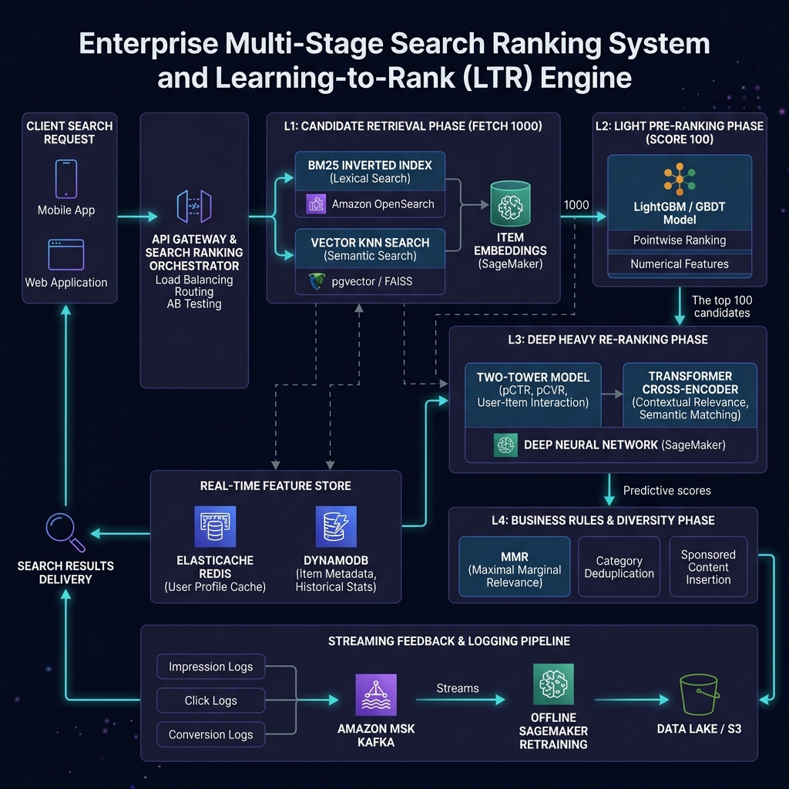
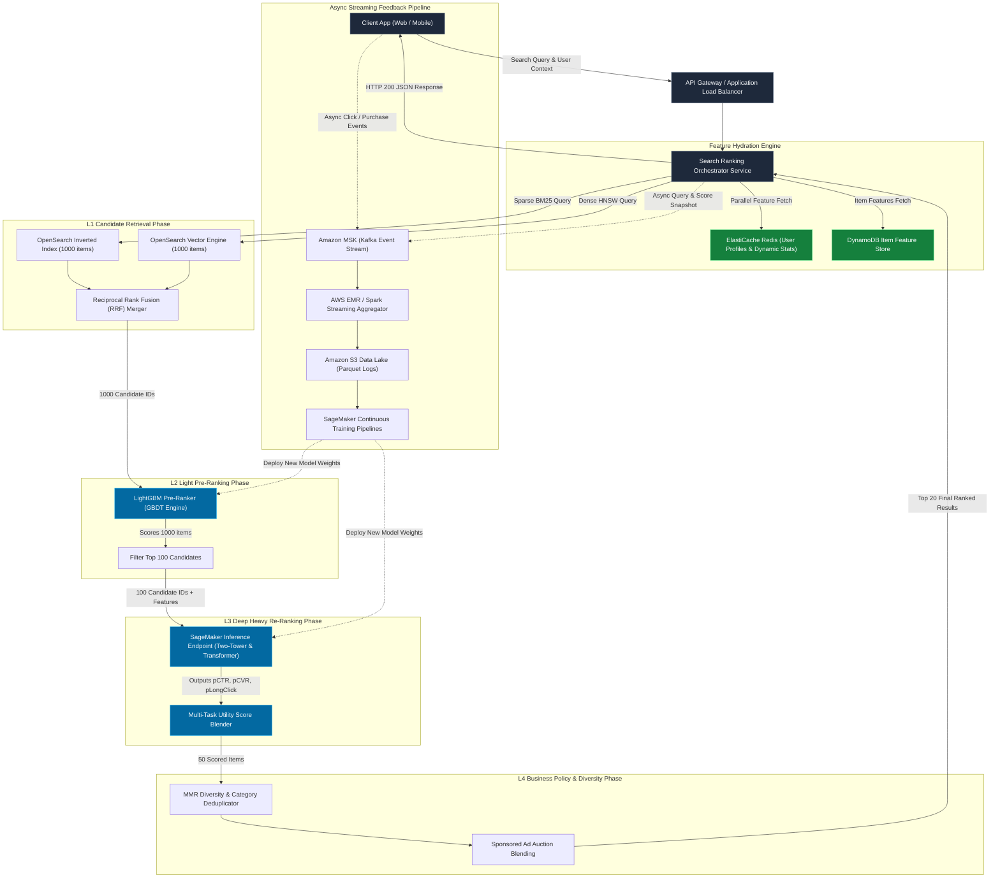
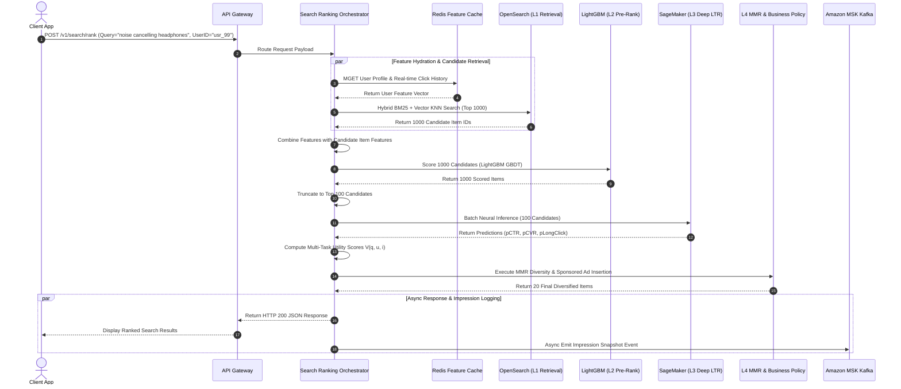
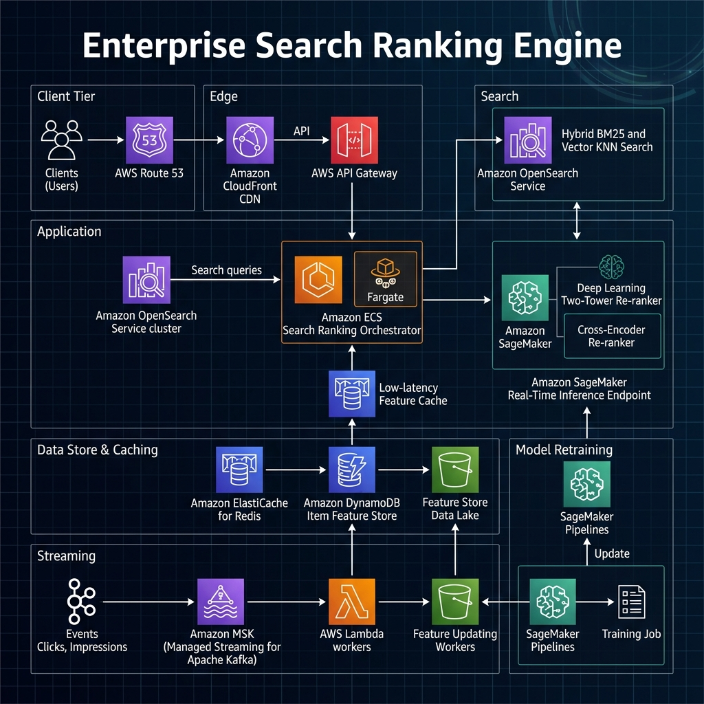

# Search Ranking System Design Blueprint

## Overview

A production-grade, ultra-low latency, multi-stage **Search Ranking Engine** and **Learning-to-Rank (LTR)** platform designed to process **100,000+ QPS** (queries per second) at **< 50ms P99 latency** across a catalog of **10 Billion items** and **500 Million Daily Active Users (DAU)**.

Modern search engines (e.g., Google, Amazon, E-commerce, Ride-sharing, Content Platforms) cannot evaluate complex deep learning models over millions of candidates in real-time within sub-50ms latency budgets. To solve this, this blueprint implements a **4-stage funnel architecture**:
1. **L1 Candidate Retrieval (Recall Phase)**: Sub-10ms hybrid lexical (BM25 sparse inverted index) and semantic (HNSW vector KNN) retrieval fetching 1,000 candidates from 10B items.
2. **L2 Light Pre-Ranking (Filtering & Broad Scoring)**: Sub-10ms Gradient Boosted Decision Tree (LightGBM/XGBoost) scoring 1,000 items down to 100 items using static and cached features.
3. **L3 Deep Heavy Re-Ranking (LTR & Personalization)**: Sub-20ms Deep Neural Multi-Task Learning (Two-Tower + Cross-Encoder Transformer) scoring 100 items for predicted Click-Through Rate ($pCTR$), predicted Conversion Rate ($pCVR$), and long-term engagement.
4. **L4 Business Policy & Diversity (Reranking & Blending)**: Sub-5ms Maximal Marginal Relevance (MMR) diversity, category deduplication, freshness boosting, and sponsored ad insertion.

```
       [ 10,000,000,000 Items Catalog ]
                      │
  ┌───────────────────┴───────────────────┐
  │  L1: Candidate Retrieval (Recall)    │  ──►  1,000 Candidates (<10ms)
  └───────────────────┬───────────────────┘
                      │
  ┌───────────────────┴───────────────────┐
  │  L2: Light Pre-Ranking (LightGBM)     │  ──►  100 Candidates   (<10ms)
  └───────────────────┬───────────────────┘
                      │
  ┌───────────────────┴───────────────────┐
  │  L3: Deep Neural Re-Ranking (MTL LTR) │  ──►  50 Ranked Items  (<20ms)
  └───────────────────┬───────────────────┘
                      │
  ┌───────────────────┴───────────────────┐
  │  L4: Business Rules & Diversity (MMR) │  ──►  20 Final Results (<5ms)
  └───────────────────────────────────────┘
```

---

## Section 1: System Requirements

### Functional Requirements
1. **Multi-Stage Candidate Funnel**: Execute a multi-layer cascade from sparse/dense candidate generation (L1) to fast GBDT pre-ranking (L2), deep multi-task neural re-ranking (L3), and business policy blending (L4).
2. **Real-Time Feature Hydration**: Fetch low-latency user features (recent clicks, search history, category affinity) and item features (stock, price, 1-hour CTR) within 5ms.
3. **Multi-Task Score Blending**: Predict multiple user engagement metrics ($pCTR$, $pCVR$, $pLongClick$) and combine them into a unified utility score adjusted by dynamic business weights.
4. **Diversity & Business Controls**: Apply Maximal Marginal Relevance (MMR) to prevent category dominance (max 2 items per vendor/category in top 10) and support sponsored auction blending.
5. **Streaming Feedback & Logging Pipeline**: Log every query impression, candidate score, feature snapshot, and user interaction (click, add-to-cart, purchase) into event streams without blocking the search response.
6. **Model Fallback Hierarchy**: Gracefully downgrade from L3 Deep Learning to L2 GBDT or L1 BM25 static relevance if downstream model inference endpoints timeout or fail.

### Non-Functional Requirements
1. **Latency SLA**: $P95 < 30\text{ms}$, $P99 < 50\text{ms}$ total end-to-end processing time including candidate retrieval, feature fetching, model inference, and diversity sorting.
2. **Throughput & Scale**: Support **100,000 QPS average** and **300,000 QPS peak** query throughput under seasonal sale events (e.g., Black Friday).
3. **Availability**: $99.99\%$ uptime with multi-region active-active deployment and zero single point of failure.
4. **Feature Consistency & Freshness**: Real-time user streaming features refreshed in $< 5\text{ seconds}$; point-in-time offline feature joins with zero data leakage for model training.
5. **Security & Privacy**: Strict encryption (TLS 1.3 in transit, AES-256 at rest), anonymized user IDs, and compliance with GDPR/CCPA for user search history.

---

## Section 2: Capacity & Scale Estimation

### Scale Assumptions
* **Daily Active Users (DAU)**: $500,000,000$ ($500\text{M}$)
* **Total Catalog Size**: $10,000,000,000$ ($10\text{B}$ items/documents)
* **Average Search Queries per User per Day**: $15$ queries
* **Total Daily Search Queries**: $500\text{M} \times 15 = 7.5\text{ Billion queries/day}$
* **Average QPS**: $\frac{7.5 \times 10^9}{86,400} \approx 86,800\text{ QPS}$ (Rounded to **100,000 QPS**)
* **Peak QPS**: $3 \times \text{Average QPS} = \mathbf{300,000\text{ QPS}}$

### Throughput Math
| Pipeline Stage | Input Candidates | Output Candidates | Target Latency SLA (P99) | Compute Load |
| :--- | :--- | :--- | :--- | :--- |
| **L1 Retrieval** | $10\text{B}$ catalog items | $1,000$ candidates | $< 10\text{ms}$ | $300\text{k QPS} \times 2\text{ indices} = 600\text{k lookup QPS}$ |
| **L2 Pre-Rank** | $1,000$ candidates | $100$ candidates | $< 10\text{ms}$ | $300\text{k QPS} \times 1,000 = 300\text{M item-evals/sec}$ |
| **L3 Heavy Rank** | $100$ candidates | $50$ candidates | $< 20\text{ms}$ | $300\text{k QPS} \times 100 = 30\text{M neural-evals/sec}$ |
| **L4 Diversity** | $50$ candidates | $20$ returned items | $< 5\text{ms}$ | $300\text{k QPS} \times 50 = 15\text{M MMR-matrix evals/sec}$ |

### Data Storage & Memory Sizing
1. **Real-Time Feature Store (Redis RAM Sizing)**:
   * Active User Profiles: $500\text{M users} \times 1\text{ KB/user} = 500\text{ GB}$
   * Real-Time Item Stats (1h CTR, stock, popularity): $100\text{M active items} \times 500\text{ Bytes/item} = 50\text{ GB}$
   * Redis Cluster Memory (with 2x replication & overhead): $(500\text{ GB} + 50\text{ GB}) \times 2.5 \approx \mathbf{1.375\text{ TB RAM}}$
2. **Item Feature Store (DynamoDB / SSD Sizing)**:
   * Item Metadata & Sparse/Dense Features: $10\text{B items} \times 2\text{ KB/item} = \mathbf{20\text{ TB SSD}}$
3. **OpenSearch Index Sizing**:
   * BM25 Inverted Index + HNSW Dense Vectors (768 dimensions quantized to int8): $10\text{B items} \times 1.2\text{ KB} = \mathbf{12\text{ TB Index Memory/Disk}}$
4. **Log Streaming & Data Lake Sizing**:
   * Query Impression Logs: $7.5\text{B queries/day} \times 5\text{ KB/impression snapshot} = \mathbf{37.5\text{ TB/day}}$
   * Compressed S3 Parquet Storage per Year (with 10:1 compression): $3.75\text{ TB/day} \times 365 = \mathbf{1.37\text{ PB/year}}$

---

## Section 3: High-Level Architecture

The system follows a decoupled, asynchronous microservices architecture. Client search requests enter via AWS API Gateway and CloudFront, routed to the **Search Ranking Orchestrator** on ECS Fargate. The orchestrator coordinates L1 candidate retrieval from OpenSearch, fetches features from ElastiCache Redis & DynamoDB, invokes SageMaker endpoints for L2/L3 ranking models, applies L4 business logic, and emits streaming event logs to MSK (Kafka).





---

## Section 4: Component-Level Design & Algorithms

### 1. Reciprocal Rank Fusion (RRF) for L1 Retrieval Merging
To combine sparse keyword retrieval (BM25) and dense semantic retrieval (Vector KNN HNSW) into a single candidate set without requiring score normalization:

$$RRF\_Score(d \in D) = \sum_{m \in M} \frac{1}{k + r_m(d)}$$

Where:
* $M$ = Set of retrievers (BM25, Dense KNN Vector).
* $r_m(d)$ = Rank of document $d$ in retriever $m$'s top list.
* $k$ = Smoothing constant (typically $k = 60$).

### 2. L2 Light Pre-Ranking (LightGBM GBDT)
* **Objective**: Evaluate $1,000$ candidates in $< 10\text{ms}$.
* **Model**: Gradient Boosted Decision Trees (LightGBM) trained with pairwise LambdaRank loss.
* **Feature Vector ($X_{L2}$)**:
  * Static BM25 / Vector RRF score.
  * Item 24-hour CTR, historical conversion rate.
  * Price ratio: $\frac{\text{Item Price}}{\text{User Average Historical Purchase Price}}$.
  * Category match indicator ($\text{IsCategoryMatch}(u, i) \in \{0, 1\}$).

### 3. L3 Deep Heavy Re-Ranking & Multi-Task Score Blending
* **Model Architecture**: Multi-Task Learning (MTL) network with shared bottom embeddings (Two-Tower) and task-specific heads:
  * Head 1: Click-Through Rate ($pCTR = \sigma(W_1 \cdot h_{shared})$)
  * Head 2: Conversion Rate ($pCVR = \sigma(W_2 \cdot h_{shared})$)
  * Head 3: Long-Click / Dwell Time ($pLongClick = \sigma(W_3 \cdot h_{shared})$)
* **Final Multi-Task Utility Score Formula**:

$$V(q, u, i) = w_{ctr} \cdot pCTR(q,u,i) + w_{cvr} \cdot pCVR(q,u,i) \times \text{Price}(i)^{\gamma} + w_{long} \cdot pLongClick(q,u,i) - w_{penalty} \cdot pReturn(i)$$

Where:
* $\gamma \in [0.1, 0.5]$ = Price elastic scaling factor.
* $w_{ctr}, w_{cvr}, w_{long}$ = Dynamic business tuning weights set based on campaign objectives (e.g., maximize revenue vs maximize GMV).

### 4. L4 Diversity Algorithm: Maximal Marginal Relevance (MMR)
To prevent the top ranked results from being flooded by near-identical items (e.g., 10 identical phone cases from different sellers):

$$\text{MMR} = \operatorname*{argmax}_{D_i \in R \setminus S} \left[ \lambda \cdot \text{Score}(D_i) - (1 - \lambda) \cdot \max_{D_j \in S} \text{Sim}(D_i, D_j) \right]$$

Where:
* $R$ = Candidate list from L3 ($50$ items).
* $S$ = Set of already selected items in the final ranked array.
* $R \setminus S$ = Remaining unselected candidates.
* $\text{Sim}(D_i, D_j)$ = Cosine similarity of category/title embeddings between candidate $D_i$ and selected item $D_j$.
* $\lambda \in [0, 1]$ = Diversity control factor ($\lambda = 0.7$ gives high relevance with moderate diversity).

```
                      MMR Diversity Selection Loop
 ┌──────────────────────────────────────────────────────────────────┐
 │ For k = 1 to 20:                                                 │
 │   1. Compute relevance term: λ * L3_Utility_Score(Item_i)        │
 │   2. Compute max similarity term: (1-λ) * max_{j in S} Sim(i, j) │
 │   3. Select Item_i with highest MMR score                        │
 │   4. Append Item_i to selected set S                             │
 └──────────────────────────────────────────────────────────────────┘
```

---

## Section 5: Database Schema & Data Models

### PostgreSQL DDL (Model Registry, Feature Metadata & Query Logs)

```sql
-- Model Registry Table
CREATE TABLE ranking_models (
    model_id VARCHAR(64) PRIMARY KEY,
    model_name VARCHAR(128) NOT NULL,
    model_stage VARCHAR(16) NOT NULL CHECK (model_stage IN ('L2_PRE_RANK', 'L3_DEEP_RANK')),
    model_version VARCHAR(32) NOT NULL,
    s3_artifact_path VARCHAR(512) NOT NULL,
    is_active BOOLEAN DEFAULT FALSE,
    traffic_allocation_pct NUMERIC(5, 2) DEFAULT 0.00,
    created_at TIMESTAMP WITH TIME ZONE DEFAULT CURRENT_TIMESTAMP,
    updated_at TIMESTAMP WITH TIME ZONE DEFAULT CURRENT_TIMESTAMP
);

CREATE INDEX idx_ranking_models_active ON ranking_models(model_stage, is_active);

-- Feature Metadata Registry
CREATE TABLE feature_definitions (
    feature_id VARCHAR(64) PRIMARY KEY,
    feature_name VARCHAR(128) UNIQUE NOT NULL,
    feature_group VARCHAR(32) NOT NULL CHECK (feature_group IN ('USER', 'ITEM', 'CONTEXT', 'CROSS')),
    data_type VARCHAR(16) NOT NULL,
    default_value_json JSONB NOT NULL,
    ttl_seconds INT DEFAULT 86400,
    created_at TIMESTAMP WITH TIME ZONE DEFAULT CURRENT_TIMESTAMP
);

-- Search Query Logs (Sampling / Audit Log)
CREATE TABLE search_query_logs (
    query_id UUID PRIMARY KEY,
    user_id VARCHAR(64) NOT NULL,
    raw_query TEXT NOT NULL,
    normalized_query TEXT NOT NULL,
    top_k INT NOT NULL,
    l1_candidate_count INT NOT NULL,
    l2_candidate_count INT NOT NULL,
    l3_candidate_count INT NOT NULL,
    execution_time_ms NUMERIC(6, 2) NOT NULL,
    served_model_version VARCHAR(32) NOT NULL,
    created_at TIMESTAMP WITH TIME ZONE DEFAULT CURRENT_TIMESTAMP
);

CREATE INDEX idx_search_query_logs_user ON search_query_logs(user_id, created_at DESC);
```

### Redis Key Namespace Strategy

| Key Pattern | Data Structure | TTL | Purpose |
| :--- | :--- | :--- | :--- |
| `usr:{user_id}:profile` | `HASH` | 7 Days | Cached demographic, historical avg purchase price, device type. |
| `usr:{user_id}:clicks_1h` | `ZSET` | 1 Hour | Timestamps and item IDs clicked by user in the past 60 minutes. |
| `itm:{item_id}:stats_realtime`| `HASH` | 24 Hours | Real-time 1h CTR, 1h sales volume, current stock availability. |
| `qyd:{query_hash}:retrieval` | `STRING` (JSON) | 5 Mins | Cached L1 retrieval candidate IDs for ultra-hot query strings. |
| `ab:traffic:allocations` | `HASH` | 1 Hour | Active A/B test bucket allocations across L2/L3 model variants. |

---

## Section 6: API Design & Contracts

### 1. Execute Search Ranking (`POST /v1/search/rank`)

#### Request Payload
```json
{
  "request_id": "req_88a912c4-001a",
  "user_id": "usr_9918234a",
  "query": "wireless noise cancelling headphones",
  "search_context": {
    "device_category": "mobile_ios",
    "country_code": "US",
    "user_latitude": 37.7749,
    "user_longitude": -122.4194,
    "session_depth": 3
  },
  "top_k": 20,
  "enable_diversity": true,
  "diversity_lambda": 0.75,
  "filter_category_id": "cat_audio_102"
}
```

#### Response Payload (HTTP 200 OK)
```json
{
  "request_id": "req_88a912c4-001a",
  "query": "wireless noise cancelling headphones",
  "total_retrieved": 1000,
  "total_returned": 20,
  "latency_breakdown_ms": {
    "l1_retrieval": 6.4,
    "feature_hydration": 3.8,
    "l2_pre_rank": 7.2,
    "l3_deep_rank": 16.5,
    "l4_diversity": 2.1,
    "total_end_to_end": 36.0
  },
  "served_model_version": "l3_transformer_v2.4",
  "ranked_items": [
    {
      "rank": 1,
      "item_id": "itm_headphone_901",
      "title": "Sony WH-1000XM5 Wireless Headphones",
      "category_id": "cat_audio_102",
      "price": 398.00,
      "relevance_score": 0.9421,
      "predictions": {
        "p_ctr": 0.185,
        "p_cvr": 0.042,
        "p_long_click": 0.720
      },
      "is_sponsored": false
    },
    {
      "rank": 2,
      "item_id": "itm_headphone_402",
      "title": "Bose QuietComfort 45 Bluetooth Headphones",
      "category_id": "cat_audio_102",
      "price": 329.00,
      "relevance_score": 0.9105,
      "predictions": {
        "p_ctr": 0.162,
        "p_cvr": 0.038,
        "p_long_click": 0.695
      },
      "is_sponsored": true
    }
  ]
}
```

---

## Section 7: End-to-End Workflow Sequence



---

## Section 8: Executable Python OOD Code

Below is a complete, zero-dependency, object-oriented Python implementation of the multi-stage search ranking pipeline, including L1 retrieval, L2 GBDT pre-ranking, L3 neural multi-task utility scoring, and L4 MMR diversity filtering.

```python
#!/usr/bin/env python3
"""
Search Ranking System Blueprint - Executable Python OOD Implementation
Demonstrates multi-stage LTR search ranking pipeline: L1 Recall -> L2 Pre-Rank -> L3 Deep Rank -> L4 MMR Diversity.
"""

import math
import time
import random
from typing import List, Dict, Any, Tuple


class CandidateItem:
    """Represents a search catalog item with metadata and features."""
    def __init__(self, item_id: str, title: str, category: str, price: float, bm25_score: float, vector_score: float):
        self.item_id = item_id
        self.title = title
        self.category = category
        self.price = price
        self.bm25_score = bm25_score
        self.vector_score = vector_score
        
        # Hydrated features
        self.ctr_1h: float = 0.0
        self.conversion_rate: float = 0.0
        self.historical_sales: int = 0
        
        # Stage Scores
        self.l1_rrf_score: float = 0.0
        self.l2_gbdt_score: float = 0.0
        self.p_ctr: float = 0.0
        self.p_cvr: float = 0.0
        self.p_long_click: float = 0.0
        self.final_utility_score: float = 0.0


class UserProfile:
    """Represents real-time user context and historical preferences."""
    def __init__(self, user_id: str, avg_spend_tier: float, preferred_category: str):
        self.user_id = user_id
        self.avg_spend_tier = avg_spend_tier
        self.preferred_category = preferred_category
        self.recent_click_categories: List[str] = [preferred_category]


class FeatureStore:
    """Simulates real-time low-latency feature store (Redis / DynamoDB)."""
    def __init__(self):
        self._item_stats = {
            f"itm_{i}": {
                "ctr_1h": round(random.uniform(0.01, 0.25), 4),
                "conversion_rate": round(random.uniform(0.005, 0.08), 4),
                "historical_sales": random.randint(50, 5000)
            } for i in range(1, 1001)
        }

    def hydrate_item_features(self, items: List[CandidateItem]) -> None:
        """Hydrates candidate items with real-time statistics."""
        for item in items:
            stats = self._item_stats.get(item.item_id, {})
            item.ctr_1h = stats.get("ctr_1h", 0.02)
            item.conversion_rate = stats.get("conversion_rate", 0.01)
            item.historical_sales = stats.get("historical_sales", 100)


class L1CandidateRetriever:
    """Simulates hybrid sparse BM25 and dense vector candidate retrieval."""
    def __init__(self, total_catalog_count: int = 1000):
        categories = ["Electronics", "Audio", "Accessories", "Mobile", "Computers"]
        self.catalog: List[CandidateItem] = []
        
        for i in range(1, total_catalog_count + 1):
            item_id = f"itm_{i}"
            title = f"Wireless Bluetooth Noise Cancelling Item {i}"
            cat = categories[i % len(categories)]
            price = round(random.uniform(25.0, 500.0), 2)
            bm25 = round(random.uniform(1.0, 25.0), 2)
            vec_sim = round(random.uniform(0.3, 0.98), 4)
            self.catalog.append(CandidateItem(item_id, title, cat, price, bm25, vec_sim))

    def retrieve_candidates(self, query: str, top_k: int = 100) -> List[CandidateItem]:
        """Executes Reciprocal Rank Fusion (RRF) to merge BM25 and Vector KNN rankings."""
        # Rank by BM25
        sorted_bm25 = sorted(self.catalog, key=lambda x: x.bm25_score, reverse=True)
        bm25_ranks = {item.item_id: rank + 1 for rank, item in enumerate(sorted_bm25)}
        
        # Rank by Vector Similarity
        sorted_vec = sorted(self.catalog, key=lambda x: x.vector_score, reverse=True)
        vec_ranks = {item.item_id: rank + 1 for rank, item in enumerate(sorted_vec)}
        
        # Calculate RRF Score (k = 60)
        k = 60.0
        for item in self.catalog:
            r_bm25 = bm25_ranks[item.item_id]
            r_vec = vec_ranks[item.item_id]
            item.l1_rrf_score = (1.0 / (k + r_bm25)) + (1.0 / (k + r_vec))
            
        # Return top K candidates sorted by RRF score
        sorted_candidates = sorted(self.catalog, key=lambda x: x.l1_rrf_score, reverse=True)
        return sorted_candidates[:top_k]


class L2GBDTPreRanker:
    """Fast GBDT (LightGBM) pre-ranker scoring candidates down to top 30."""
    def score_and_filter(self, items: List[CandidateItem], user: UserProfile, top_k: int = 30) -> List[CandidateItem]:
        for item in items:
            # Lightweight feature combination
            cat_match = 1.2 if item.category == user.preferred_category else 1.0
            price_ratio = 1.0 - min(abs(item.price - user.avg_spend_tier) / user.avg_spend_tier, 0.9)
            
            # GBDT Linear tree approximation
            item.l2_gbdt_score = (
                (item.l1_rrf_score * 500.0) * 0.4 +
                (item.ctr_1h * 10.0) * 0.3 +
                (price_ratio) * 0.2 +
                (cat_match) * 0.1
            )
            
        sorted_items = sorted(items, key=lambda x: x.l2_gbdt_score, reverse=True)
        return sorted_items[:top_k]


class L3NeuralReRanker:
    """Deep Neural Multi-Task LTR model predicting pCTR, pCVR, and pLongClick."""
    def re_rank(self, items: List[CandidateItem], user: UserProfile, w_ctr: float = 0.5, w_cvr: float = 0.4, w_long: float = 0.1) -> List[CandidateItem]:
        for item in items:
            # Simulated neural forward pass activation (Sigmoid outputs)
            raw_logit_ctr = (item.l2_gbdt_score * 0.5) + (item.vector_score * 2.0) - (item.price * 0.001)
            item.p_ctr = 1.0 / (1.0 + math.exp(-raw_logit_ctr))
            
            raw_logit_cvr = (item.p_ctr * 1.5) + (0.5 if item.category == user.preferred_category else -0.5)
            item.p_cvr = 1.0 / (1.0 + math.exp(-raw_logit_cvr))
            
            item.p_long_click = min(item.p_ctr * 1.2, 0.95)
            
            # Multi-Task Utility Score Blending
            item.final_utility_score = (
                w_ctr * item.p_ctr +
                w_cvr * item.p_cvr * math.pow(item.price, 0.2) +
                w_long * item.p_long_click
            )
            
        return sorted(items, key=lambda x: x.final_utility_score, reverse=True)


class MMRDiversityFilter:
    """Maximal Marginal Relevance (MMR) for candidate diversification."""
    def filter(self, items: List[CandidateItem], top_k: int = 10, lambda_param: float = 0.7) -> List[CandidateItem]:
        if not items:
            return []
            
        selected: List[CandidateItem] = []
        candidates = list(items)
        
        while len(selected) < top_k and candidates:
            best_item = None
            best_mmr_score = -float('inf')
            
            for item in candidates:
                rel_score = item.final_utility_score
                
                # Maximum similarity to already selected items
                max_sim = 0.0
                if selected:
                    for s in selected:
                        # Category overlap similarity
                        sim = 1.0 if item.category == s.category else 0.1
                        if sim > max_sim:
                            max_sim = sim
                            
                mmr_score = lambda_param * rel_score - (1.0 - lambda_param) * max_sim
                if mmr_score > best_mmr_score:
                    best_mmr_score = mmr_score
                    best_item = item
                    
            if best_item:
                selected.append(best_item)
                candidates.remove(best_item)
            else:
                break
                
        return selected


class SearchRankingEngine:
    """End-to-End Search Ranking Orchestrator Service."""
    def __init__(self):
        self.retriever = L1CandidateRetriever(total_catalog_count=1000)
        self.feature_store = FeatureStore()
        self.l2_preranker = L2GBDTPreRanker()
        self.l3_reranker = L3NeuralReRanker()
        self.l4_diversity = MMRDiversityFilter()

    def search(self, query: str, user: UserProfile, top_k: int = 10) -> Dict[str, Any]:
        start_time = time.perf_counter()
        
        # 1. L1 Retrieval
        l1_candidates = self.retriever.retrieve_candidates(query, top_k=100)
        l1_time = (time.perf_counter() - start_time) * 1000
        
        # 2. Feature Hydration
        h_start = time.perf_counter()
        self.feature_store.hydrate_item_features(l1_candidates)
        hydration_time = (time.perf_counter() - h_start) * 1000
        
        # 3. L2 Pre-Ranking
        l2_start = time.perf_counter()
        l2_candidates = self.l2_preranker.score_and_filter(l1_candidates, user, top_k=30)
        l2_time = (time.perf_counter() - l2_start) * 1000
        
        # 4. L3 Deep Re-Ranking
        l3_start = time.perf_counter()
        l3_scored = self.l3_reranker.re_rank(l2_candidates, user)
        l3_time = (time.perf_counter() - l3_start) * 1000
        
        # 5. L4 MMR Diversity
        l4_start = time.perf_counter()
        final_results = self.l4_diversity.filter(l3_scored, top_k=top_k, lambda_param=0.75)
        l4_time = (time.perf_counter() - l4_start) * 1000
        
        total_time = (time.perf_counter() - start_time) * 1000
        
        return {
            "query": query,
            "user_id": user.user_id,
            "total_candidates_retrieved": len(l1_candidates),
            "final_count": len(final_results),
            "latency_ms": {
                "l1_retrieval": round(l1_time, 2),
                "feature_hydration": round(hydration_time, 2),
                "l2_prerank": round(l2_time, 2),
                "l3_deep_rank": round(l3_time, 2),
                "l4_diversity": round(l4_time, 2),
                "total_end_to_end": round(total_time, 2)
            },
            "results": [
                {
                    "rank": idx + 1,
                    "item_id": item.item_id,
                    "title": item.title,
                    "category": item.category,
                    "price": item.price,
                    "p_ctr": round(item.p_ctr, 4),
                    "p_cvr": round(item.p_cvr, 4),
                    "utility_score": round(item.final_utility_score, 4)
                } for idx, item in enumerate(final_results)
            ]
        }


# Execution Verification Harness
if __name__ == "__main__":
    print("==========================================================================")
    print("      Executing Multi-Stage Search Ranking Engine Verification Pipeline   ")
    print("==========================================================================")
    
    engine = SearchRankingEngine()
    test_user = UserProfile(user_id="usr_991823", avg_spend_tier=250.0, preferred_category="Audio")
    
    response = engine.search(query="wireless noise cancelling headphones", user=test_user, top_k=5)
    
    print(f"\nQuery: '{response['query']}' | User: {response['user_id']}")
    print(f"Latency Breakdown (ms): {response['latency_ms']}")
    print("\nTop Ranked Search Results:")
    print("--------------------------------------------------------------------------")
    print(f"{'Rank':<5} | {'Item ID':<10} | {'Category':<12} | {'Price':<8} | {'pCTR':<6} | {'pCVR':<6} | {'Utility Score'}")
    print("--------------------------------------------------------------------------")
    for res in response["results"]:
        print(f"{res['rank']:<5} | {res['item_id']:<10} | {res['category']:<12} | ${res['price']:<7.2f} | {res['p_ctr']:<6} | {res['p_cvr']:<6} | {res['utility_score']}")
    print("==========================================================================")
```

---

## Section 9: Scalability, Resilience & Edge Failover

### Multi-Tier Model Fallback Hierarchy
When downstream inference nodes experience congestion or circuit breaker triggers ($P99 > 40\text{ms}$), the orchestrator dynamically falls back to maintain availability:

```
                  ┌───────────────────────────────┐
                  │    L3 Deep Neural Model       │ (Primary: Full Personalization)
                  └───────────────┬───────────────┘
                                  │ Timeout (>25ms) / Circuit Open
                                  ▼
                  ┌───────────────────────────────┐
                  │    L2 LightGBM Pre-Ranker     │ (Fallback 1: GBDT Fast Scoring)
                  └───────────────┬───────────────┘
                                  │ Feature Store Cache Miss
                                  ▼
                  ┌───────────────────────────────┐
                  │    L1 OpenSearch BM25 RRF     │ (Fallback 2: Pure Static Relevance)
                  └───────────────┬───────────────┘
```

### Edge Failover & Multi-Region Resilience
1. **Active-Active Multi-Region Deployment**: Deployed across `us-east-1` and `us-west-2` using AWS Route 53 latency-based routing.
2. **Feature Cache Resilience**: If Redis is unreachable, fallback to in-memory LRU local cache on ECS Fargate ranker pods (holding top 50,000 popular item feature snapshots).
3. **Shadow Model Deployment & A/B Testing**:
   * Traffic Splitter routes $5\%$ of live queries to new model candidate versions in **Shadow Mode** (executes inference asynchronously without affecting user response).
   * Metric Evaluator monitors offline vs online AUC, NDCG@10, and CTR lift before promoting candidate models.

---

## Section 10: AWS Cloud-Native Architecture

The cloud-native architecture is built on managed AWS services for high availability, automatic scaling, and operational efficiency.



### AWS Service Mapping Table

| Generic Component | AWS Service | Operational Purpose & Configuration |
| :--- | :--- | :--- |
| **Edge Routing & CDN** | Amazon CloudFront & Route 53 | Low-latency DNS routing, SSL termination, and DDoS protection via AWS WAF. |
| **API Gateway** | AWS API Gateway | Rate limiting (100k QPS quota), authentication, and request routing to load balancers. |
| **Ranking Orchestrator** | AWS ECS Fargate | Containerized Python/Go ranker microservice scaling automatically based on CPU/RAM. |
| **L1 Retrieval Index** | Amazon OpenSearch Service | Managed cluster running BM25 inverted index and Vector Engine (KNN HNSW). |
| **Real-Time Feature Cache** | Amazon ElastiCache for Redis | Multi-AZ Redis Cluster providing sub-2ms user profile and dynamic item feature lookups. |
| **Item Feature Store** | Amazon DynamoDB | High-throughput NoSQL store for item metadata with single-digit millisecond reads. |
| **L3 Heavy Model Inference** | Amazon SageMaker Real-time Endpoints | Multi-model endpoints backed by NVIDIA TensorRT / GPU instances for sub-20ms deep learning inference. |
| **Log Streaming Pipeline** | Amazon MSK (Kafka) | Managed Apache Kafka cluster ingesting impression, click, and conversion event streams. |
| **Feature Updating Workers** | AWS Lambda & Amazon EMR | Real-time feature calculation workers updating Redis 1h CTR stats every 60 seconds. |
| **Data Lake & Storage** | Amazon S3 | Parquet snapshot storage for historical query logs, clickstream events, and model weights. |
| **Continuous ML Pipeline** | SageMaker Pipelines | Automated ML workflow for daily model retraining, evaluation, and shadow deployment. |

---

## Section 11: Technology Justification

### 1. SageMaker + TensorRT vs. Custom C++ Triton Inference
* **Selection**: Amazon SageMaker Real-time Endpoints with TensorRT.
* **Justification**: Managed SageMaker endpoints provide out-of-the-box auto-scaling, canary rollouts, and multi-model hosting with GPU acceleration, avoiding the high operational overhead of managing custom Kubernetes Triton C++ clusters.

### 2. Reciprocal Rank Fusion (RRF) vs. Score Normalization
* **Selection**: Reciprocal Rank Fusion (RRF).
* **Justification**: BM25 scores (unbounded logarithmic values $[0, \infty)$) and Vector Cosine Similarities ($[-1, 1]$) have drastically different distributions. Linear score combination requires constant recalibration, whereas RRF relies strictly on rank order position, making it robust against index schema changes.

### 3. Redis + DynamoDB Dual Feature Store vs. Single Database
* **Selection**: Dual Store (Redis for hot user profiles/dynamic stats, DynamoDB for complete item catalog metadata).
* **Justification**: Storing 10 Billion items in Redis RAM would require $>20\text{ TB}$ of costly memory ($>\$30,000/\text{month}$). DynamoDB provides cost-effective SSD storage for static item attributes, while Redis delivers $< 2\text{ms}$ latencies for hot real-time user signals.

### 4. Maximal Marginal Relevance (MMR) vs. Fixed Category Bucketing
* **Selection**: MMR Diversity Algorithm.
* **Justification**: Hard category rules (e.g., "never show two items from same category") degrade relevance when a user explicitly searches for specific broad queries (e.g., "Apple products"). MMR dynamically trades off utility score vs category similarity based on a tuneable parameter ($\lambda$).

---

*Blueprint Version: 1.0.0 | Updated: 2026-08-05*
