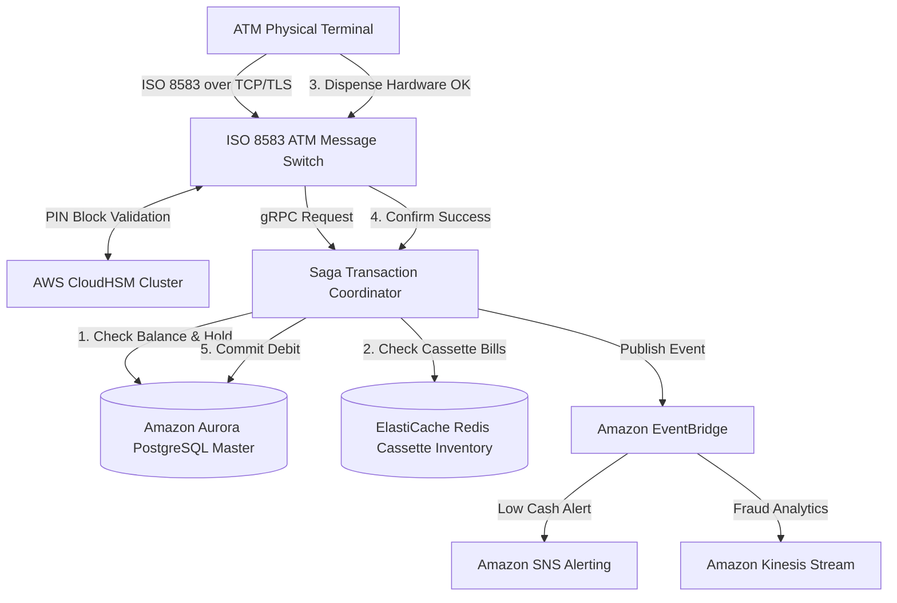
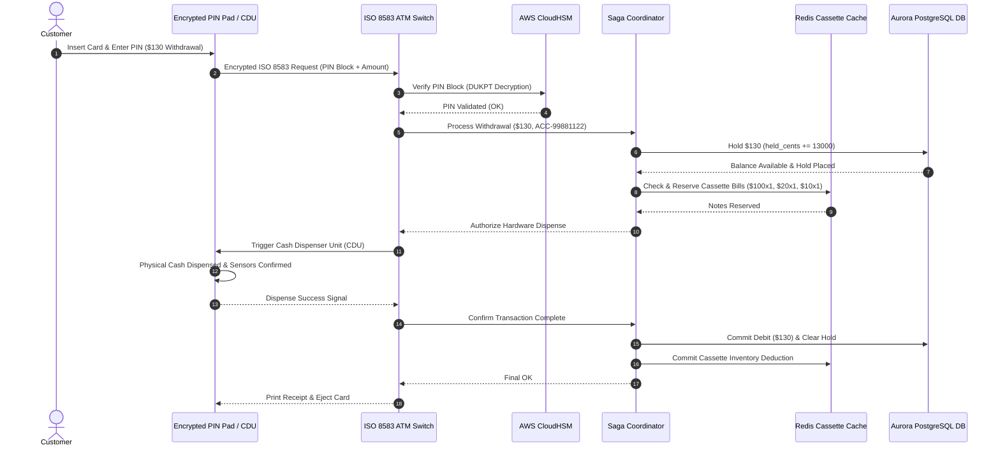
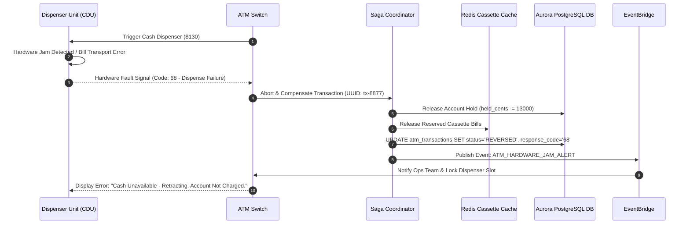
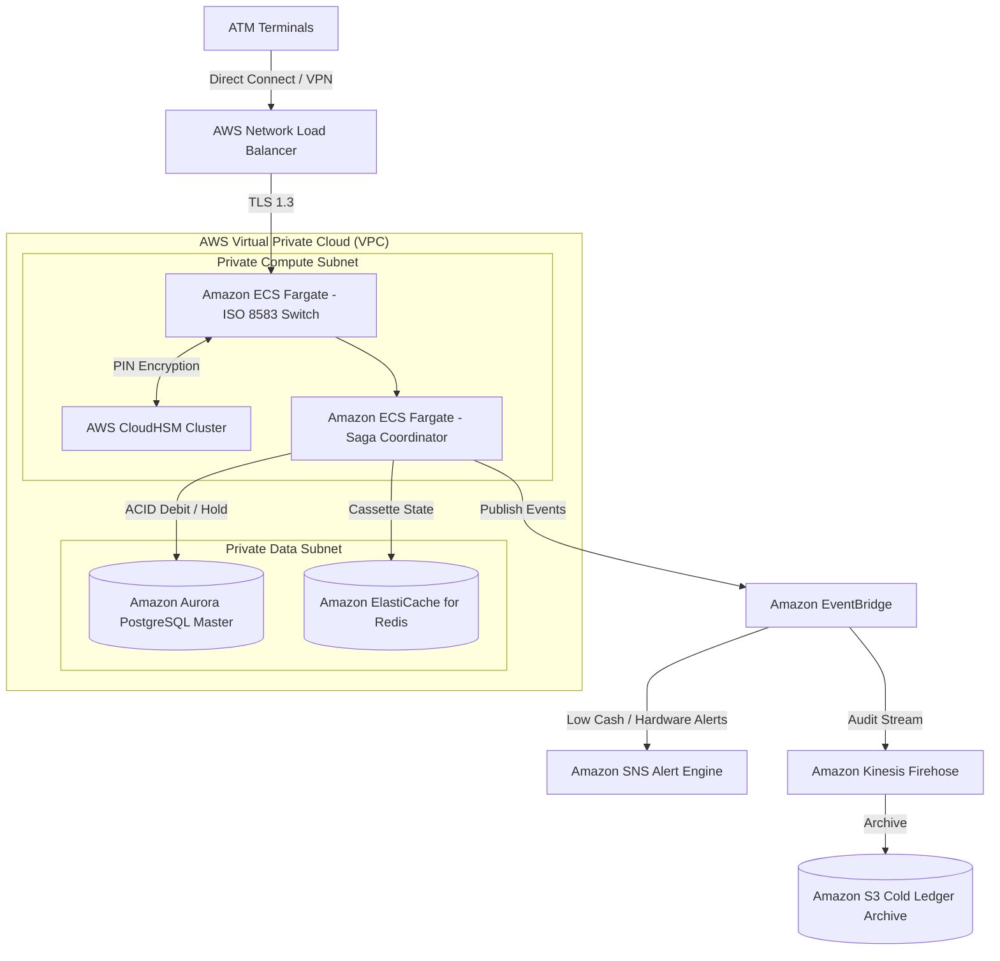

# Automated Teller Machine (ATM) System Design

This document details the production-grade system design for a high-availability, mission-critical **Automated Teller Machine (ATM) Network & Core Banking Switch**. Designed to support nationwide banking networks (e.g., 50,000+ ATM terminals), this blueprint outlines ISO 8583 financial messaging, Hardware Security Module (HSM) PIN block encryption, Saga-based Two-Phase Commit (2PC) cash withdrawal orchestration, dynamic cassette bill allocation algorithms, and offline emergency fallback operations.

---

## 1. System Requirements

### Functional Requirements
* **Card & Identity Verification:**
  * Support EMV chip cards, magnetic stripe fallbacks, and NFC contactless authentication.
  * Encrypt PIN input on the Encrypted PIN Pad (EPP) using Derived Unique Key Per Transaction (DUKPT) and validate via Hardware Security Modules (HSM).
* **Cash Withdrawal & Dispensing:**
  * Validate account balance, daily withdrawal limits (e.g., $1,000/day), and card status.
  * Execute a lock-free **Cash Bill Allocation Algorithm** to dispense exact requested amounts using available cassette note denominations ($10, $20, $50, $100).
  * Enforce strict transactional integrity: zero double-dispensing, zero double-debiting.
* **Cash & Check Deposit:**
  * Accept and validate paper currency and checks via optical/magnetic bill scanners.
  * Credit funds instantly or place conditional holds based on risk checks.
* **Balance Inquiry & Mini-Statement:**
  * Display real-time account balances and recent transaction activity (printed receipt or on-screen).
* **Account-to-Account Funds Transfer:**
  * Support intra-bank and inter-bank card-to-card/account transfers.
* **ATM Cassette Monitoring & Operations:**
  * Real-time tracking of note counts in individual hardware cassettes.
  * Automatically trigger low-cash alerts to bank operations when cassette inventory drops below threshold (< 10% capacity).

### Non-Functional Requirements
* **Ultra-Low Latency Authorization:** End-to-end PIN verification and withdrawal authorization must complete in $< 200\text{ms}$ (P99).
* **Financial ACID & Zero Inconsistency:** Strict transaction guarantees. Physical cash dispensing must match database debit operations under all hardware failure scenarios.
* **Banking-Grade Security:**
  * Hardware-level PIN block encryption (Triple-DES / AES-256 with DUKPT) executed inside FIPS 140-2 Level 3 Hardware Security Modules.
  * Transport layer security (TLS 1.3) over ISO 8583 messaging channels.
* **High Availability ($99.999\%$):** Core switch services must achieve 5 Nines availability ($< 5.26 \text{ minutes}$ downtime per year).
* **Resilient Offline Fallback Mode:** ATM terminals must support limited emergency offline withdrawals (up to $200 limit) using encrypted local hardware journals if connection to the core banking switch is severed.

---

## 2. Capacity & Scale Estimation

### Assumptions
* **Managed ATM Terminals:** $50,000 \text{ terminals}$
* **Active Bank Account Holders:** $10,000,000 \text{ customers}$
* **Daily ATM Transactions:** $2,000,000 \text{ transactions/day}$
* **Peak Traffic Multiplier:** $5\times$ during paydays, holidays, and major events.

### Throughput (QPS) Calculations
* **Average Transaction QPS:**
  $$\text{Average QPS} = \frac{2,000,000 \text{ transactions}}{86,400 \text{ seconds}} \approx \mathbf{23.1 \text{ QPS}}$$
* **Peak Transaction QPS:**
  $$\text{Peak QPS} = 23.1 \times 5 \approx \mathbf{116 \text{ QPS}}$$
  *(ISO 8583 message switches handle 116 QPS with ease using high-performance TCP socket listeners).*

### Storage & Sizing Estimates
* **Transaction Ledger Record (ISO 8583 + Audit Meta):** $\sim 1 \text{ KB}$ per record
  $$\text{Daily Storage} = 2,000,000 \times 1 \text{ KB} = \mathbf{2 \text{ GB/day}}$$
  $$\text{5-Year Transaction History Storage} \approx \mathbf{3.65 \text{ TB}}$$
* **ATM Cassette Status Snapshot:** $50,000 \text{ ATMs} \times 2 \text{ KB} = \mathbf{100 \text{ MB}}$ (Held in Redis RAM for sub-millisecond operational lookups).

---

## 3. High-Level Architecture

The architecture decouples the **ATM Terminal Hardware Layer** from the **ISO 8583 Message Switch Plane**, the **Saga Transaction Coordinator**, and the **Core Banking System (CBS)** system of record.


### System Architecture Flowchart



---

## 4. Component-Level Design

### A. Saga Pattern / 2PC Financial Transaction Coordinator
Hardware cash dispensers are physical devices that can experience mechanical jams, power cuts, or bill sensor miscounts. Therefore, debiting a customer's account **before** physical dispensing risks stealing money, while debiting **after** physical dispensing risks free cash if the network cuts before the debit call.

We implement a **Saga Orchestrator** pattern with strict compensating transactions:

```
               [ ATM Withdrawal Requested ($100) ]
                               │
                               ▼
            ┌──────────────────────────────────────┐
            │ STEP 1: Reserve Funds & Cassette     │
            │  Account: Hold $100                  │
            │  Cassette: Reserve 5x $20 bills      │
            └──────────────────────────────────────┘
                               │
                               ▼
            ┌──────────────────────────────────────┐
            │ STEP 2: Issue Hardware Dispense Cmd  │
            │  Send DISPENSE command to CDU        │
            └──────────────────────────────────────┘
                           /       \
                          /         \
              [Hardware OK]         [Hardware Jam / Timeout]
                    /                     \
                   ▼                       ▼
      ┌────────────────────────┐  ┌─────────────────────────────┐
      │ STEP 3a: Commit        │  │ STEP 3b: Compensate         │
      │  Debit Account $100    │  │  Release Account Hold       │
      │  Deduct Cassette Notes │  │  Return Bills to Cassette   │
      │  Print Receipt         │  │  Log Alarm & Retract Notes  │
      └────────────────────────┘  └─────────────────────────────┘
```

### B. Optimal Cash Bill Allocation Algorithm
When a user requests cash (e.g., $230), the ATM dispenser must calculate an optimal note allocation based on available cassette inventories ($10, $20, $50, $100 bills).

We use a **Constrained Greedy with Dynamic Programming Fallback** approach:

1. **Greedy Allocation Pass:** Try dispensing highest denomination first ($100 $\rightarrow$ $50 $\rightarrow$ $20 $\rightarrow$ $10).
2. **Cassette Inventory Constraint Verification:** Ensure selected note counts $\leq$ remaining physical bills in cassette.
3. **DP Fallback:** If greedy fails due to depleted bill denominations (e.g., 0x $10 bills available), execute DP change-making algorithm over remaining cassette note vectors.

```
Example: Request $130 (Cassettes: $100=0 bills, $50=5 bills, $20=10 bills, $10=0 bills)
Greedy Pass: $100 (0) -> $50 (2 = $100, Rem: $30) -> $20 (1 = $20, Rem: $10) -> $10 (0 -> FAIL)
DP Fallback: 1x $50 + 4x $20 = $130 -> SUCCESS!
```

---

## 5. Database Schema & Data Model

### 1. `atms` Device Registry (PostgreSQL)
```sql
CREATE TABLE atms (
    atm_id             UUID PRIMARY KEY DEFAULT gen_random_uuid(),
    terminal_code      VARCHAR(32) UNIQUE NOT NULL, -- e.g., 'ATM-NY-90210'
    branch_id          UUID NOT NULL,
    location_address   TEXT NOT NULL,
    ip_address         VARCHAR(45) NOT NULL,
    status             VARCHAR(20) NOT NULL DEFAULT 'ONLINE', -- 'ONLINE', 'OFFLINE', 'LOW_CASH', 'MAINTENANCE'
    last_ping_at       TIMESTAMP WITH TIME ZONE DEFAULT CURRENT_TIMESTAMP
);

CREATE INDEX idx_atms_terminal_code ON atms(terminal_code);
```

### 2. `atm_cassettes` Hardware Inventory (PostgreSQL)
```sql
CREATE TABLE atm_cassettes (
    cassette_id        UUID PRIMARY KEY DEFAULT gen_random_uuid(),
    atm_id             UUID NOT NULL REFERENCES atms(atm_id) ON DELETE CASCADE,
    cassette_slot      INT NOT NULL, -- Slot 1, 2, 3, 4
    denomination       INT NOT NULL, -- 10, 20, 50, 100
    current_bills      INT NOT NULL,
    max_capacity       INT NOT NULL DEFAULT 2000,
    status             VARCHAR(20) NOT NULL DEFAULT 'ACTIVE', -- 'ACTIVE', 'LOW', 'EMPTY', 'JAMMED'
    updated_at         TIMESTAMP WITH TIME ZONE DEFAULT CURRENT_TIMESTAMP,
    CONSTRAINT unique_atm_slot UNIQUE (atm_id, cassette_slot)
);
```

### 3. `accounts` Customer Accounts Registry (PostgreSQL)
```sql
CREATE TABLE accounts (
    account_number     VARCHAR(34) PRIMARY KEY,
    customer_id        UUID NOT NULL,
    balance_cents      BIGINT NOT NULL DEFAULT 0,
    held_cents         BIGINT NOT NULL DEFAULT 0, -- Saga pending hold amount
    daily_withdrawn    BIGINT NOT NULL DEFAULT 0,
    daily_limit_cents  BIGINT NOT NULL DEFAULT 100000, -- $1,000.00 daily limit
    status             VARCHAR(20) NOT NULL DEFAULT 'ACTIVE',
    version            INT NOT NULL DEFAULT 1 -- Optimistic Concurrency Control
);

CREATE INDEX idx_accounts_customer ON accounts(customer_id);
```

### 4. `atm_transactions` Audit Ledger (PostgreSQL)
```sql
CREATE TABLE atm_transactions (
    transaction_id     UUID PRIMARY KEY DEFAULT gen_random_uuid(),
    terminal_code      VARCHAR(32) NOT NULL,
    account_number     VARCHAR(34) NOT NULL REFERENCES accounts(account_number),
    transaction_type   VARCHAR(20) NOT NULL, -- 'WITHDRAWAL', 'DEPOSIT', 'INQUIRY', 'TRANSFER'
    amount_cents       BIGINT NOT NULL DEFAULT 0,
    status             VARCHAR(20) NOT NULL DEFAULT 'PENDING', -- 'PENDING', 'COMMITTED', 'REVERSED', 'FAILED'
    dispensed_notes    JSONB, -- e.g., {"100": 1, "20": 1, "10": 1}
    response_code      VARCHAR(4) NOT NULL, -- ISO 8583 Response Code (e.g., '00'=Success, '51'=Insufficient Funds)
    created_at         TIMESTAMP WITH TIME ZONE DEFAULT CURRENT_TIMESTAMP
);

CREATE INDEX idx_atm_tx_account ON atm_transactions(account_number, created_at);
CREATE INDEX idx_atm_tx_terminal ON atm_transactions(terminal_code, created_at);
```

---

## 6. API Design & Payloads

### 1. Encrypted PIN Authentication (ISO 8583 / REST Gateway)
* **Endpoint:** `POST /api/v1/atm/authenticate`
* **Request Payload:**
```json
{
  "terminal_code": "ATM-NY-90210",
  "card_number_masked": "411111******1111",
  "pin_block_encrypted": "9F1A2B3C4D5E6F708192A3B4C5D6E7F8",
  "ksn": "98765432101234500001",
  "track2_data": "4111111111111111=261210100000"
}
```
* **Response Payload (200 OK):**
```json
{
  "response_code": "00",
  "status": "authenticated",
  "auth_token": "jwt_session_token_xyz",
  "accounts": [
    { "account_number": "ACC-99881122", "type": "CHECKING" },
    { "account_number": "ACC-99881133", "type": "SAVINGS" }
  ]
}
```

### 2. Request Cash Withdrawal
* **Endpoint:** `POST /api/v1/atm/withdraw`
* **Request Payload:**
```json
{
  "terminal_code": "ATM-NY-90210",
  "account_number": "ACC-99881122",
  "amount_cents": 13000,
  "transaction_uuid": "tx-8877-4433-2211"
}
```
* **Response Payload (200 OK):**
```json
{
  "response_code": "00",
  "status": "APPROVED",
  "transaction_id": "c98b2110-12ab-4cd3-89ef-9900aabbccdd",
  "allocated_notes": {
    "100": 1,
    "20": 1,
    "10": 1
  },
  "remaining_balance_cents": 87000
}
```

---

## 7. End-to-End Workflow Sequences

### Sequence 1: ATM Cash Withdrawal Saga Execution



### Sequence 2: Hardware Jam Fault & Compensation Refund Flow



---

## 8. Scalability & Resilience Strategies

* **High-Throughput Netty / Go TCP Switch:** The ISO 8583 gateway uses non-blocking I/O event loops (Netty / Go goroutines) to manage 50,000+ persistent TCP connections from ATM terminals with minimal memory overhead.
* **Encrypted Offline Hardware Journal (Fallback Mode):**
  - If network connectivity between an ATM terminal and the central banking switch is severed, the terminal enters **Offline Emergency Fallback Mode**.
  - The terminal limits emergency withdrawals to a maximum of $200 per card.
  - Transactions are encrypted using local Hardware Security Module keys and stored in an on-device SQLite journal.
  - Upon network restoration, the terminal executes batch synchronization to log all offline transactions.

---

## 9. Disaster Recovery & Multi-Region Failover Strategy

* **Active-Active Aurora Global Database:** Replicates account ledgers and transaction history across AWS regions with sub-second replication latency.
* **Network Load Balancer (NLB) Anycast Routing:** ATM IP connections use AWS Global Accelerator / Anycast IPs to route terminal traffic to the nearest operational region automatically.
* **CloudHSM Multi-Region Key Synchronization:** Cryptographic keys are mirrored continuously across hardware security modules in multi-region clusters.

---

## 10. AWS Cloud-Native Implementation


### AWS Architecture Flowchart



### AWS Service Mapping & Rationale

| Component | AWS Service | Design Rationale & Details |
| :--- | :--- | :--- |
| **TCP Load Balancing** | **Network Load Balancer (NLB)** | Handles millions of concurrent TCP socket connections from ATM terminals with ultra-low latency. |
| **Message Switch** | **Amazon ECS Fargate** | Deploys containerized ISO 8583 parser and routing microservices. |
| **Hardware Security** | **AWS CloudHSM** | FIPS 140-2 Level 3 cryptographic hardware for secure DUKPT PIN block decryption. |
| **Core Ledger** | **Amazon Aurora PostgreSQL** | Multi-AZ relational database guaranteeing ACID financial transaction consistency. |
| **Cassette Cache** | **Amazon ElastiCache for Redis** | Sub-millisecond in-memory tracking of bill inventory counts across 50,000+ terminals. |
| **Event Router** | **Amazon EventBridge** | Asynchronously dispatches low-cash alerts, hardware jam alarms, and fraud signals. |

---

## 11. Technology Justification: Why We Use

### A. Saga Orchestrator Pattern vs. Single Database Locking
* **Why We Use It:** A physical cash dispenser is an external hardware device that cannot participate in a database `BEGIN/COMMIT` transaction. Using a Saga Orchestrator with explicit compensating steps ensures that if physical dispensing fails due to a paper jam or power cut, customer funds are safely restored via compensating transactions.

### B. AWS CloudHSM vs. Software-Based Cryptography
* **Why We Use It:** Payment Card Industry (PCI-DSS) security standards strictly forbid storing or decrypting PIN blocks in software RAM. AWS CloudHSM provides dedicated hardware security modules that execute cryptographic operations inside tamper-resistant hardware.

### C. ISO 8583 Messaging Protocol vs. Standard JSON REST
* **Why We Use It:** ISO 8583 is the international standard for financial transaction messaging. Its compact binary/bitmap encoding reduces message payloads from ~2 KB (JSON) down to ~150 bytes, enabling reliable communication even over low-bandwidth cellular connections at remote ATM sites.
