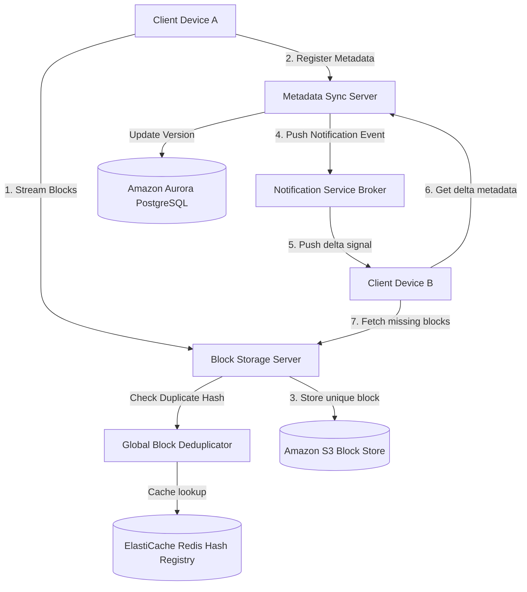
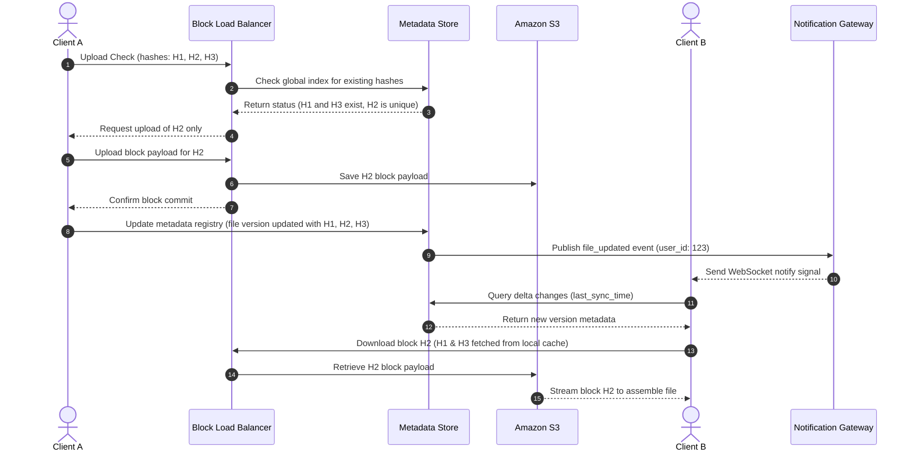
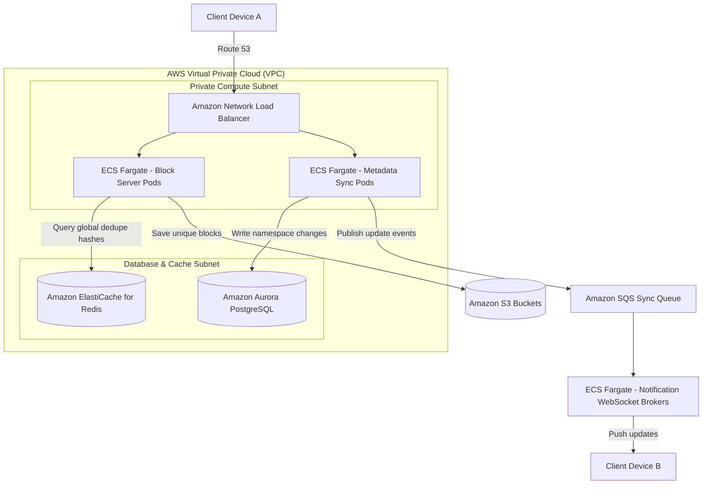

# Dropbox System Design (Cloud File Sync Service)

This document details the production-grade system design for a high-scale, real-time **Cloud File Synchronization and Storage Service** (analogous to Dropbox, Google Drive, or OneDrive). The system is engineered to handle seamless file synchronization across millions of client devices, optimizing bandwidth consumption using block-level deduplication and client-side delta chunking.

---

## 1. System Requirements

### Functional Requirements
* **File Synchronization:** Sync files, folders, and directories across multiple devices (desktop, mobile, web) belonging to a user in real-time.
* **Delta Sync & Chunking:** Split large files into smaller chunks (e.g., target 4 MB blocks). Only sync modified chunks (deltas) instead of uploading the entire file.
* **Metadata & Versioning:** Track file namespaces, directory trees, ownership, size, permissions, and complete revision histories (default: 30-day version recovery).
* **Offline Access:** Clients can modify files offline. Once online, the client sync engine resolves conflicts and pushes changes.
* **File Sharing:** Enable secure file and folder sharing with read/write permissions via shareable links.

### Non-Functional Requirements
* **Low Latency & High Speed:** Delta synchronization should compile and reflect changes within seconds (< 5s for average modifications).
* **Bandwidth Optimization:** Minimize data transfer by deduplicating chunks globally and compressing blocks before transit.
* **Data Durability & Reliability:** Zero data loss ($99.999999999\%$ chunk durability target).
* **Strong Consistency:** Strict serializability for metadata updates. Read paths must immediately reflect a committed upload to avoid split-brain syncing.
* **Security:** End-to-end encryption in transit (TLS 1.3) and encryption at rest (AES-256).

---

## 2. Capacity & Scale Estimation

### Assumptions
* **Total Registered Users:** $50,000,000 \text{ (50 Million)}$
* **Daily Active Users (DAU):** $10,000,000 \text{ (10 Million)}$
* **Average Storage Allocated per User:** $10 \text{ GB}$ (Total capacity managed = $500 \text{ Petabytes (PB)}$)
* **Average Files per User:** $1,000$ files (Total unique metadata nodes = $50 \text{ Billion}$ files/directories)
* **Daily Upload Frequency:** Each active user modifies or uploads $5$ files per day.

### Read/Write Calculations
* **Daily Ingress File Volume:**
  $$10,000,000 \text{ DAU} \times 5 \text{ files/day} = 50,000,000 \text{ file writes/day}$$
* **Average File Write QPS:**
  $$\frac{50,000,000 \text{ writes}}{86,400 \text{ seconds}} \approx \mathbf{580 \text{ write operations/sec (peak: 2,000 QPS)}}$$
* **Bandwidth Requirements:**
  Assuming an average modified delta size of $500 \text{ KB}$ per save:
  $$580 \text{ writes/sec} \times 500 \text{ KB} = 290,000 \text{ KB/s} \approx \mathbf{290 \text{ MB/s (2.3 Gbps)}}$$

---

## 3. High-Level Architecture

The system decouples the **Block Plane** (data transfer, deduplication, storage) from the **Metadata Plane** (namespace management, version indexes, sync coordination) to scale writes and metadata indexing independently.


### System Architecture Flowchart


---

## 4. Component-Level Design

### A. Client-Side Chunking & Rabin Fingerprints
To minimize network upload volumes, files are processed using **Variable-Size Block Chunking** rather than fixed-size blocks. Fixed-size chunking suffers from the "boundary shift" problem—inserting a single byte at the beginning of a file changes all downstream block boundaries and invalidates caches.

```
Original File:  [Block A: 4MB] [Block B: 4MB] [Block C: 4MB]
Insert 1 byte:  [*] [Shifted Block A] [Shifted Block B] [Shifted Block C]  (All hashes change!)

Variable (Rabin): [Block A: ~4MB] [Block B: ~4MB] [Block C: ~4MB]
Insert 1 byte:  [*] [Block A: ~4MB] [Block B: ~4MB] [Block C: ~4MB]       (Only Block A changes!)
```

* **Rabin Fingerprinting:** A sliding window scans the file content and computes a polynomial rolling hash. When the hash modulo a value equals a divider config (e.g., $Hash(bytes) \pmod{4\text{MB}} == 0$), a chunk boundary is declared.
* **Local Database:** The client app maintains an embedded SQLite database tracking the state of local files, paths, chunk hashes, and modification times.

### B. Upload Ingestion Pipeline
1. **Chunk & Hash:** The client chunks a modified file, computing SHA-256 hashes for each chunk.
2. **Metadata Handshake:** Client sends list of hashes to the Block Server.
3. **Deduplication Check:** The server cross-references hashes against a global index. If a block already exists (e.g., a shared public file or system library), the client skips uploading that block.
4. **Data Stream:** Client uploads only the missing, unique chunks.

---

## 5. Database Schema & Namespace Strategy

### 1. `files` Metadata Registry (PostgreSQL)
```sql
CREATE TABLE files (
    file_id        UUID PRIMARY KEY,
    parent_folder  UUID REFERENCES files(file_id),
    owner_id       VARCHAR(64) NOT NULL,
    file_name      VARCHAR(255) NOT NULL,
    is_directory   BOOLEAN DEFAULT FALSE,
    current_version INT NOT NULL DEFAULT 1,
    is_deleted     BOOLEAN DEFAULT FALSE,
    updated_at     TIMESTAMP WITH TIME ZONE DEFAULT CURRENT_TIMESTAMP
);
```

### 2. `file_chunks` Mapping Index (PostgreSQL)
Tracks the mapping of specific file versions to their underlying physical data blocks.
```sql
CREATE TABLE file_chunks (
    id             BIGSERIAL PRIMARY KEY,
    file_id        UUID REFERENCES files(file_id),
    version_number INT NOT NULL,
    chunk_index    INT NOT NULL, -- Sorting order
    block_hash     VARCHAR(64) NOT NULL, -- SHA-256 link to block store
    UNIQUE(file_id, version_number, chunk_index)
);
```

---

## 6. API Design & Payloads

### 1. Request Block Upload Check
* **Endpoint:** `POST /api/v1/blocks/deduplicate`
* **Payload:**
```json
{
  "file_id": "9b1deb4d-3b7d-4bad-9bdd-2b0d7b3dcb6d",
  "total_chunks": 3,
  "chunk_hashes": [
    "SHA256_HASH_BLOCK_A",
    "SHA256_HASH_BLOCK_B",
    "SHA256_HASH_BLOCK_C"
  ]
}
```
* **Response:**
```json
{
  "missing_chunks": [
    { "index": 0, "hash": "SHA256_HASH_BLOCK_A" },
    { "index": 2, "hash": "SHA256_HASH_BLOCK_C" }
  ]
}
```

---

## 7. End-to-End Workflow Sequence



---

## 8. Scalability & Resilience Strategies
* **Client Bandwidth Throttling:** The sync engine uses token bucket limiters to dynamically cap background upload rates based on system CPU load and network status.
* **Block Storage Deduplication:** A global Redis cache tracks unique block hashes. If duplicate blocks are submitted, only a reference pointer is updated in the database metadata table.

---

## 9. Disaster Recovery & Multi-Region Failover Strategy
* **Metadata Global Databases:** Map metadata registries to Amazon Aurora PostgreSQL Global Database configurations, allowing read failover with replication lags under 1 second.
* **S3 Cross-Region Replication (CRR):** S3 bucket policies automatically sync block storage data asynchronously to a secondary region.

---

## 10. AWS Cloud-Native Implementation


### AWS Cloud-Native Architecture Flowchart



### AWS Service Mapping & Rationale

| Generic Component | AWS Service | Design Details & Rationale |
| :--- | :--- | :--- |
| **Ingress Router** | **Network Load Balancer (NLB)** | Preserves long-lived WebSocket synchronization streams without ALB layer 7 timeout limits. |
| **Data Pods** | **Amazon ECS Fargate** | Deploys stateless metadata and block chunk proxy containers. |
| **Block Store** | **Amazon S3** | Standard object storage. Custom lifecycle configurations archive old file versions to S3 Glacier after 30 days. |
| **Metadata Index** | **Amazon Aurora PostgreSQL** | Relational state index ensuring strict ACID consistency for file modifications. |
| **Dedupe Registry** | **Amazon ElastiCache for Redis** | Stores global block hashes in RAM for low-latency deduplication evaluations. |

---

## 11. Technology Justification: Why We Use

### A. Variable-Size Rabin Fingerprints over Fixed Chunking
* **Why We Use It:** Dropbox must scale synchronization over millions of multi-gigabyte files. If fixed 4MB chunking was used, any file modification (such as adding a header page to a doc) would force uploading the entire file. Variable-size chunking isolates offsets, saving up to 90% of user bandwidth and storage nodes.

### B. WebSockets over Long-Polling for Notification Push
* **Why We Use It:** Real-time updates require bi-directional links. Long-polling consumes HTTP ports and forces clients to constantly rebuild TCP handshakes. WebSockets keep a lightweight persistent connection open, letting the notification layer broadcast events instantly.
