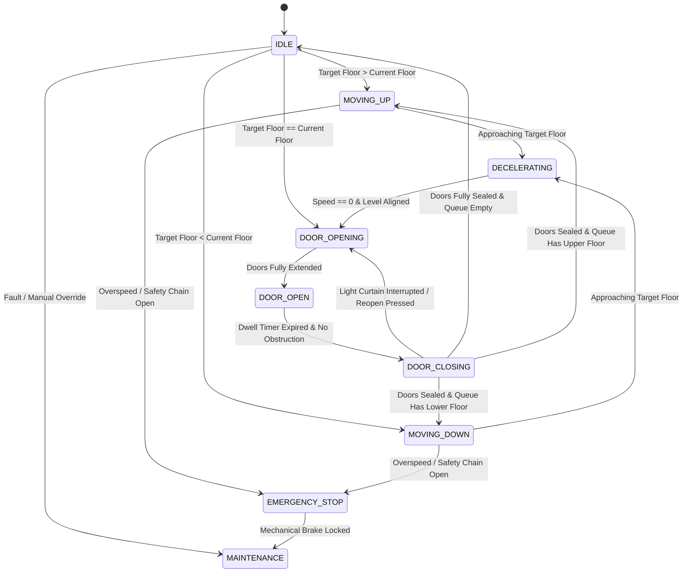
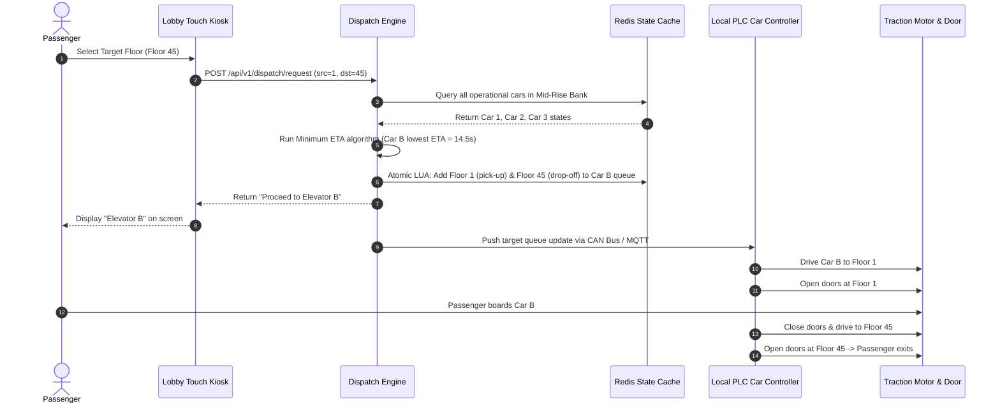

# Smart Multi-Elevator Control System Design

This document details the production-grade system design for an **IoT-Enabled Smart Multi-Elevator Control & Dispatch System** built for high-rise commercial skyscrapers and residential towers (e.g., 100 floors, 24 elevator cars across 4 zone banks). This blueprint outlines the **Destination Dispatch System (DDS)**, **Minimum Estimated Time of Arrival (ETA)** scheduling algorithms (combining SCAN/LOOK heuristics), real-time IoT sensor telemetry ingestion, fault-tolerant state machine orchestration, lock-free Redis priority queues, and AWS cloud-native edge-failover architecture.

---

## 1. System Requirements

### Functional Requirements
* **Destination Dispatch System (DDS):**
  * Passengers select their target floor at lobby touchscreen kiosks or mobile apps *before* boarding.
  * The system computes the optimal elevator car assignment and directs the passenger to a specific elevator (e.g., "Elevator B").
  * Eliminates in-car floor destination buttons (except for emergency, door open/close, and accessibility controls).
* **Traditional Hall Calls & Car Calls Support:**
  * Support legacy up/down hall buttons on intermediate floors for non-DDS zones.
  * Accept inside-car floor presses for service/freight elevators.
* **Dynamic Zone & Bank Allocation:**
  * Group elevators into specialized banks: Low-Rise (Floors 1–25), Mid-Rise (Floors 26–50), High-Rise (Floors 51–75), and Sky-Express (Lobby direct to 76–100).
  * Dynamically re-assign elevator cars between banks based on peak traffic patterns (e.g., morning up-peak vs. evening down-peak).
* **Door Control & Passenger Safety:**
  * Photodiode infrared light curtains and optical 3D depth sensors to prevent doors from closing on passengers.
  * Load cell weight sensors measuring car weight; trigger "Full Capacity" status when car exceeds $80\%$ max weight limit to bypass intermediate hall calls.
* **Emergency & Priority Overrides:**
  * **Fire Emergency Mode:** Recall all cars immediately to the main egress floor (Ground Floor), open doors, and disable further passenger operation.
  * **VIP & Medical Priority Mode:** Direct assignment of a dedicated car bypassing all scheduled queue calls.
  * **Power Failure / Automatic Rescue Device (ARD):** Battery-operated backup moves cars to the nearest floor and releases doors safely.

### Non-Functional Requirements
* **Ultra-Low Latency Dispatch:** Elevator assignment and kiosk response must complete in $< 50\text{ms}$ (P99) to ensure instant feedback to boarding passengers.
* **Sub-100ms Telemetry Ingestion:** Real-time car metrics (floor position, speed, door status, motor load, passenger count) published via IoT protocols every $100\text{ms}$ ($10\text{ Hz}$).
* **Strict Safety & Fault Isolation:** Hardware-level programmable logic controllers (PLCs) operate safety interlocks independently of software network controllers. Mechanical safety brakes engage instantly if speed exceeds $115\%$ of rated velocity.
* **High Availability ($99.999\%$):** Central dispatch services must guarantee less than $5.26 \text{ minutes}$ of unscheduled system-wide downtime per year.
* **Resilient Edge Local Failover:** If cloud or central dispatcher connectivity drops, local elevator car microcontrollers fall back to standalone **LOOK (Elevator Algorithm)** scheduling via local CAN bus peer-to-peer networking.

---

## 2. Capacity & Scale Estimation

### Building Specifications & Traffic Assumptions
* **Building Height:** 100 Floors ($400 \text{ meters}$).
* **Total Elevator Cars:** 24 Cars distributed across 4 Banks (6 cars per bank).
* **Building Occupancy:** 15,000 occupants (150 occupants per floor average).
* **Elevator Car Capacity:** $1,600 \text{ kg}$ (~20 passengers rated load per car).
* **Elevator Speed:** Express cars run at $8 \text{ m/s}$; Local cars run at $4 \text{ m/s}$.
* **Door Operation Time:** $2.0 \text{s}$ opening + $2.0 \text{s}$ closing + $3.0 \text{s}$ dwell time = $7.0 \text{s}$ total door cycle time per stop.

### Peak Traffic Throughput (QPS)
* **Morning Up-Peak Traffic:** 15% of total occupants enter the lobby within a 30-minute peak window ($2,250 \text{ passengers}$).
  $$\text{Peak Passenger Arrival Rate} = \frac{2,250 \text{ passengers}}{1,800 \text{ seconds}} \approx \mathbf{1.25 \text{ passengers/sec}}$$
* **Kiosk Destination Requests (QPS):** Assuming 20 lobby kiosks handling arrivals:
  $$\text{Average Kiosk Dispatch QPS} = \mathbf{1.25 \text{ QPS (Average)}}, \quad \text{Peak Spike QPS} = \mathbf{25 \text{ QPS}}$$
* **IoT Sensor Telemetry Throughput:**
  Each of the 24 elevator cars publishes telemetry payloads (position, speed, load, status) every $100\text{ms}$ ($10\text{ Hz}$):
  $$\text{Telemetry Ingress Rate} = 24 \text{ cars} \times 10 \text{ msgs/sec} = \mathbf{240 \text{ messages/sec}}$$
  Adding hall button status, door sensors, and kiosk heartbeats brings total network ingestion to $\approx \mathbf{1,000 \text{ messages/sec}}$.

### Bandwidth & Storage Sizing
* **Telemetry Payload Size:** $\sim 256 \text{ bytes}$ per MQTT message.
  $$\text{Ingress Bandwidth} = 1,000 \text{ msgs/sec} \times 256 \text{ bytes} = 256,000 \text{ bytes/sec} \approx \mathbf{256 \text{ KB/sec}}$$
* **Daily Telemetry Storage (TimescaleDB / DynamoDB):**
  $$\text{Daily Storage} = 240 \text{ msgs/sec} \times 86,400 \text{ sec} \times 256 \text{ bytes} \approx \mathbf{5.3 \text{ GB/day}}$$
* **Daily Passenger Trip Audit Logs:** 50,000 trips/day $\times 512 \text{ bytes/trip} \approx \mathbf{25.6 \text{ MB/day}}$.

---

## 3. High-Level Architecture

The architecture decouples the **Passenger Input & Gate Layer** from the **Edge Hardware Control Plane**, the **Destination Dispatch Scheduling Engine**, and the **IoT Telemetry & Cloud Analytics Pipeline**.


### System Architecture Flowchart

```mermaid
graph TD
    %% Passenger Layer
    Kiosk[Lobby Destination Kiosk] -->|REST / gRPC| Dispatcher[Destination Dispatch Engine]
    HallBtn[Floor Hall Button] -->|CAN Bus Signal| PLC[Local PLC Car Controller]
    App[Mobile App / NFC Reader] -->|API Gateway| Dispatcher

    %% Control & Dispatch Layer
    Dispatcher <-->|1. Read/Write Car State| StateGrid[(ElastiCache Redis State Grid)]
    Dispatcher -->|2. Compute Lowest ETA| ETACalc[Minimum ETA Scheduler]
    Dispatcher -->|3. Assign Car ID| Kiosk

    %% Hardware & Edge Execution
    Dispatcher -->|4. Push Motion Command| PLC
    PLC -->|Drive Motor & Doors| Motor[Elevator Traction Motor & Doors]
    Sensors[Weight Sensor / Laser Position / Door Light Curtain] -->|State Telemetry| PLC

    %% Ingestion & Analytics
    PLC -->|5. MQTT Telemetry (10 Hz)| MQTT[AWS IoT Core / MQTT Broker]
    MQTT -->|Real-time Ingress| TelemetryIngest[Telemetry Ingestion Service]
    TelemetryIngest -->|Update Live Position| StateGrid
    TelemetryIngest -->|Stream Logs| Kinesis[Amazon Kinesis Stream]
    Kinesis -->|Cold Storage| TSDB[(Amazon Aurora PostgreSQL / Timestream)]
```

---

## 4. Component-Level Design & Algorithms

### A. Elevator Car Finite State Machine (FSM)
Each elevator car operates as an independent state machine driven by safety sensors, motor commands, and door triggers:



---

### B. Elevator Dispatch Algorithms (SCAN, LOOK, & Destination Dispatch)

#### 1. Traditional SCAN (Elevator Algorithm)
* The elevator car travels in one direction (e.g., UP) servicing all requested stops until it reaches the highest floor, then reverses direction (DOWN).
* **Limitation:** Inefficient for high-rises; causes unnecessary travel to top floors even if no requests exist beyond floor 30.

#### 2. LOOK Algorithm (Optimized SCAN)
* The car travels in one direction servicing requests, but reverses as soon as there are **no further requests** in the current direction.
* **Used in:** Intermediate floor local controllers during network failover mode.

#### 3. Destination Dispatch System (DDS) & Minimum ETA Algorithm
Instead of passengers pressing buttons inside the car, passengers declare their destination at the lobby. The scheduler assigns the car that minimizes total **Passenger Wait Time + Journey Time**.

```
Passenger at Floor 1 requests Floor 45
                        │
                        ▼
┌──────────────────────────────────────────────────────────────┐
│ For each available Elevator Car (in Zone Bank):              │
│   Calculate Estimated Time of Arrival (ETA) to Floor 1       │
│   + Estimated Travel Time to Floor 45                        │
└──────────────────────────────────────────────────────────────┘
                        │
                        ▼
┌──────────────────────────────────────────────────────────────┐
│ Select Car with MINIMUM Cost Function J(c):                  │
│   J(c) = ETA_wait(c) + ETA_travel(c) + Capacity_Penalty(c)   │
└──────────────────────────────────────────────────────────────┘
                        │
                        ▼
         Display "Elevator C" on Kiosk Screen
```

---

### C. Minimum ETA Calculation Mathematical Formula

For a given elevator car $c$, candidate passenger source floor $f_s$, and destination floor $f_d$:

$$\text{ETA}(c, f_s) = T_{\text{travel}}(f_{\text{curr}}, f_s) + \sum_{k \in S_{\text{intervening}}} T_{\text{stop}}(k) + W_{\text{load}}(c) + P_{\text{dir}}(c)$$

Where:
* **$T_{\text{travel}}(f_{\text{curr}}, f_s)$**: Direct acceleration, cruise, and deceleration transit time:
  $$T_{\text{travel}} = \frac{|f_s - f_{\text{curr}}| \times h_{\text{floor}}}{v_{\text{rated}}} + t_{\text{accel\_decel\_overhead}}$$
* **$S_{\text{intervening}}$**: Set of pre-scheduled stops between current floor $f_{\text{curr}}$ and target floor $f_s$.
* **$T_{\text{stop}}$**: Fixed door dwell cycle time per stop ($7.0 \text{ seconds}$).
* **$W_{\text{load}}(c)$**: Weight capacity penalty. If current load exceeds $80\%$, $W_{\text{load}} = +\infty$ (bypasses hall pick-up).
* **$P_{\text{dir}}(c)$**: Directional alignment penalty:
  * Car moving towards $f_s$ in requested direction: $P_{\text{dir}} = 0\text{s}$.
  * Car moving away from $f_s$: $P_{\text{dir}} = +20\text{s}$ (must complete current direction before reversing).
  * Car `IDLE` at $f_{\text{curr}}$: $P_{\text{dir}} = 0\text{s}$.

---

### D. Concurrency & Conflict Resolution Strategy
When hundreds of passengers interact with lobby kiosks concurrently during morning rush hour, race conditions can occur where multiple dispatch threads assign requests to the same elevator car, overloading its capacity limit.

We resolve this using **Redis Atomic Transactions (LUA Scripts)** and **Min-Heap Priority Queues**:

1. Each elevator car maintains two sorted min-heaps in Redis: `elevator:{id}:up_queue` and `elevator:{id}:down_queue`.
2. When allocating a passenger, the scheduler executes a Redis LUA script that atomically:
   - Reads current passenger count + pending assigned reservations.
   - Verifies load $< \text{Capacity Limit}$.
   - Pushes $f_s$ and $f_d$ into the respective direction queue.
   - Updates total projected load.

---

## 5. Database Schema & Data Model

### 1. `elevators` Car State Registry (PostgreSQL)
```sql
CREATE TABLE elevators (
    elevator_id       UUID PRIMARY KEY,
    bank_id           VARCHAR(20) NOT NULL,       -- 'LOW_RISE', 'MID_RISE', 'HIGH_RISE', 'SKY_EXPRESS'
    car_number        INT NOT NULL,               -- Car 1, Car 2...
    current_floor     INT NOT NULL DEFAULT 1,
    target_floor      INT DEFAULT 1,
    direction         VARCHAR(10) NOT NULL DEFAULT 'IDLE', -- 'UP', 'DOWN', 'IDLE'
    state             VARCHAR(20) NOT NULL DEFAULT 'IDLE', -- 'IDLE', 'MOVING', 'DOOR_OPEN', 'MAINTENANCE'
    current_weight_kg NUMERIC(6, 2) DEFAULT 0.0,
    max_capacity_kg   NUMERIC(6, 2) DEFAULT 1600.0,
    is_operational    BOOLEAN DEFAULT TRUE,
    last_telemetry_at TIMESTAMP WITH TIME ZONE DEFAULT CURRENT_TIMESTAMP
);
```

### 2. `dispatch_requests` Trip Log (PostgreSQL)
```sql
CREATE TABLE dispatch_requests (
    request_id        UUID PRIMARY KEY DEFAULT gen_random_uuid(),
    kiosk_id          VARCHAR(30) NOT NULL,
    source_floor      INT NOT NULL,
    destination_floor INT NOT NULL,
    passenger_count   INT DEFAULT 1,
    assigned_car_id   UUID REFERENCES elevators(elevator_id),
    status            VARCHAR(20) NOT NULL DEFAULT 'ASSIGNED', -- 'ASSIGNED', 'PICKED_UP', 'COMPLETED', 'CANCELLED'
    estimated_wait_s  NUMERIC(5, 2),
    created_at        TIMESTAMP WITH TIME ZONE DEFAULT CURRENT_TIMESTAMP,
    completed_at      TIMESTAMP WITH TIME ZONE
);
```

### 3. Redis In-Memory Key Namespace Strategy

| Redis Key Pattern | Data Structure | Purpose |
| :--- | :--- | :--- |
| `elevator:{car_id}:state` | **Hash** | Stores real-time position, speed, door state, and weight. Updated every 100ms. |
| `elevator:{car_id}:up_stops` | **ZSET (Score = Floor)** | Sorted set of upcoming UP stops. |
| `elevator:{car_id}:down_stops` | **ZSET (Score = -Floor)** | Sorted set of upcoming DOWN stops. |
| `lock:elevator:{car_id}` | **String (EX 1s)** | Distributed lock during batch queue re-optimization. |

---

## 6. API Design & Telemetry Payloads

### 1. Register Destination Call (Lobby Kiosk)
* **Endpoint:** `POST /api/v1/dispatch/request`
* **Request Payload:**
```json
{
  "kiosk_id": "kiosk_lobby_north_02",
  "source_floor": 1,
  "destination_floor": 45,
  "passenger_count": 1,
  "accessibility_required": false
}
```
* **Response Payload ($< 50\text{ms}$):**
```json
{
  "status": "SUCCESS",
  "request_id": "8f3b2a11-5d9c-4e81-b201-9a1122334455",
  "assigned_elevator": {
    "elevator_id": "e3012345-0000-0000-0000-000000000002",
    "bank_name": "Mid-Rise Bank",
    "car_label": "Elevator B",
    "current_floor": 12,
    "estimated_wait_seconds": 14.5
  }
}
```

---

### 2. Live Elevator Telemetry Payload (MQTT Topic: `building/bank1/elevator/2/telemetry`)
* **Message Interval:** $100\text{ms}$ ($10\text{ Hz}$)
* **Payload:**
```json
{
  "timestamp": 1784722200100,
  "elevator_id": "e3012345-0000-0000-0000-000000000002",
  "car_number": 2,
  "current_floor": 14,
  "position_meters": 56.0,
  "velocity_m_s": 4.0,
  "acceleration_m_s2": 0.0,
  "direction": "UP",
  "state": "MOVING",
  "door_state": "CLOSED",
  "weight_kg": 640.0,
  "load_percentage": 40.0,
  "fault_flags": {
    "light_curtain_blocked": false,
    "overspeed_tripped": false,
    "safety_chain_broken": false,
    "fire_mode_active": false
  }
}
```

---

## 7. End-to-End Workflow Sequence



---

## 8. Complete Executable Code Implementation (Python Object-Oriented Design)

Below is the production-grade, executable Python implementation of the **Multi-Elevator System** featuring the `DestinationDispatchController`, finite state machines, min-heap stop management, and minimum ETA calculation.

```python
import enum
import heapq
import time
from typing import List, Dict, Optional, Tuple


class Direction(enum.Enum):
    UP = "UP"
    DOWN = "DOWN"
    IDLE = "IDLE"


class ElevatorState(enum.Enum):
    IDLE = "IDLE"
    MOVING = "MOVING"
    DOOR_OPEN = "DOOR_OPEN"
    MAINTENANCE = "MAINTENANCE"
    EMERGENCY = "EMERGENCY"


class DestinationRequest:
    """Represents a passenger's destination dispatch request."""

    def __init__(self, request_id: str, source_floor: int, destination_floor: int, weight_kg: float = 70.0):
        self.request_id = request_id
        self.source_floor = source_floor
        self.destination_floor = destination_floor
        self.weight_kg = weight_kg
        self.requested_at = time.time()
        self.direction = Direction.UP if destination_floor > source_floor else Direction.DOWN


class ElevatorCar:
    """Represents a single elevator car state machine and physical metrics."""

    def __init__(self, car_id: str, car_name: str, min_floor: int, max_floor: int, max_capacity_kg: float = 1600.0):
        self.car_id = car_id
        self.car_name = car_name
        self.min_floor = min_floor
        self.max_floor = max_floor
        self.max_capacity_kg = max_capacity_kg

        # Live State Metrics
        self.current_floor: int = 1
        self.direction: Direction = Direction.IDLE
        self.state: ElevatorState = ElevatorState.IDLE
        self.current_weight_kg: float = 0.0
        self.speed_m_s: float = 4.0  # 4 m/s cruise speed
        self.door_cycle_time_s: float = 7.0  # Door open + dwell + close

        # Priority Queues for Stops (Min-Heap for UP, Max-Heap simulation for DOWN)
        self.up_stops: List[int] = []  # Min-heap
        self.down_stops: List[int] = []  # Max-heap (stored as negative values)
        self.assigned_requests: List[DestinationRequest] = []

    def is_overloaded(self, additional_weight: float = 0.0) -> bool:
        return (self.current_weight_kg + additional_weight) > (0.85 * self.max_capacity_kg)

    def add_stop(self, source_floor: int, destination_floor: int):
        """Adds source and destination stops into the appropriate direction priority queue."""
        req_dir = Direction.UP if destination_floor > source_floor else Direction.DOWN

        if req_dir == Direction.UP:
            if source_floor not in self.up_stops:
                heapq.heappush(self.up_stops, source_floor)
            if destination_floor not in self.up_stops:
                heapq.heappush(self.up_stops, destination_floor)
        else:
            if source_floor not in [abs(x) for x in self.down_stops]:
                heapq.heappush(self.down_stops, -source_floor)
            if destination_floor not in [abs(x) for x in self.down_stops]:
                heapq.heappush(self.down_stops, -destination_floor)

        if self.direction == Direction.IDLE:
            self.direction = req_dir
            self.state = ElevatorState.MOVING

    def get_all_pending_stops_count(self) -> int:
        return len(self.up_stops) + len(self.down_stops)

    def step_simulation(self):
        """Simulates one step of elevator motion and state transitions."""
        if self.state == ElevatorState.MAINTENANCE or self.state == ElevatorState.EMERGENCY:
            return

        if self.direction == Direction.UP:
            if self.up_stops:
                next_stop = self.up_stops[0]
                if self.current_floor < next_stop:
                    self.current_floor += 1
                    self.state = ElevatorState.MOVING
                elif self.current_floor == next_stop:
                    heapq.heappop(self.up_stops)
                    self.state = ElevatorState.DOOR_OPEN
                    if not self.up_stops:
                        if self.down_stops:
                            self.direction = Direction.DOWN
                        else:
                            self.direction = Direction.IDLE
                            self.state = ElevatorState.IDLE

        elif self.direction == Direction.DOWN:
            if self.down_stops:
                next_stop = -self.down_stops[0]
                if self.current_floor > next_stop:
                    self.current_floor -= 1
                    self.state = ElevatorState.MOVING
                elif self.current_floor == next_stop:
                    heapq.heappop(self.down_stops)
                    self.state = ElevatorState.DOOR_OPEN
                    if not self.down_stops:
                        if self.up_stops:
                            self.direction = Direction.UP
                        else:
                            self.direction = Direction.IDLE
                            self.state = ElevatorState.IDLE
        else:
            self.state = ElevatorState.IDLE


class ETACalculator:
    """Computes Estimated Time of Arrival (ETA) for dispatch decisions."""

    @staticmethod
    def calculate_eta(car: ElevatorCar, request: DestinationRequest) -> float:
        # If car is overloaded, return infinity penalty
        if car.is_overloaded(request.weight_kg):
            return float('inf')

        # Floor bounds check
        if not (car.min_floor <= request.source_floor <= car.max_floor and car.min_floor <= request.destination_floor <= car.max_floor):
            return float('inf')

        distance_floors = abs(car.current_floor - request.source_floor)
        travel_time = (distance_floors * 4.0) / car.speed_m_s  # 4m floor height

        intervening_stops = car.get_all_pending_stops_count()
        stop_delay = intervening_stops * car.door_cycle_time_s

        # Directional Penalty
        direction_penalty = 0.0
        if car.direction != Direction.IDLE and car.direction != request.direction:
            direction_penalty = 15.0  # 15s penalty for direction reversal

        # Moving away penalty
        if car.direction == Direction.UP and request.source_floor < car.current_floor:
            direction_penalty += 20.0
        elif car.direction == Direction.DOWN and request.source_floor > car.current_floor:
            direction_penalty += 20.0

        return travel_time + stop_delay + direction_penalty


class DestinationDispatchController:
    """Central Controller managing elevator banks and passenger assignments."""

    def __init__(self):
        self.cars: Dict[str, ElevatorCar] = {}

    def register_car(self, car: ElevatorCar):
        self.cars[car.car_id] = car

    def request_dispatch(self, request: DestinationRequest) -> Optional[Tuple[str, str, float]]:
        """Processes a passenger request and returns (car_id, car_name, estimated_wait_s)."""
        best_car: Optional[ElevatorCar] = None
        min_eta = float('inf')

        for car in self.cars.values():
            eta = ETACalculator.calculate_eta(car, request)
            if eta < min_eta:
                min_eta = eta
                best_car = car

        if best_car:
            best_car.add_stop(request.source_floor, request.destination_floor)
            best_car.assigned_requests.append(request)
            return (best_car.car_id, best_car.car_name, round(min_eta, 2))

        return None


# Verification Run
if __name__ == "__main__":
    controller = DestinationDispatchController()

    # Initialize 3 Cars in Mid-Rise Bank (Floors 1-50)
    car_a = ElevatorCar("car_1", "Elevator A", min_floor=1, max_floor=50)
    car_b = ElevatorCar("car_2", "Elevator B", min_floor=1, max_floor=50)
    car_c = ElevatorCar("car_3", "Elevator C", min_floor=1, max_floor=50)

    # Position cars at initial floors
    car_a.current_floor = 1
    car_b.current_floor = 20
    car_c.current_floor = 40

    controller.register_car(car_a)
    controller.register_car(car_b)
    controller.register_car(car_c)

    # Passenger 1 requests Floor 1 -> Floor 25
    req1 = DestinationRequest("req_101", source_floor=1, destination_floor=25)
    assignment1 = controller.request_dispatch(req1)
    print(f"Passenger 1 (1->25): Assigned {assignment1[1]} (Wait: {assignment1[2]}s)")

    # Passenger 2 requests Floor 18 -> Floor 45
    req2 = DestinationRequest("req_102", source_floor=18, destination_floor=45)
    assignment2 = controller.request_dispatch(req2)
    print(f"Passenger 2 (18->45): Assigned {assignment2[1]} (Wait: {assignment2[2]}s)")

    # Simulate steps
    for step in range(5):
        car_a.step_simulation()
        car_b.step_simulation()

    print(f"Status after 5 steps: Car A at Floor {car_a.current_floor}, Car B at Floor {car_b.current_floor}")
```

---

## 9. Scalability, Resilience & Edge Failover

### A. Local Edge Microcontroller Failover
* **Hardware PLC Interlocks:** The elevator drive motor, door safety chains, and physical limit switches are wired to an industrial **Programmable Logic Controller (PLC)** (e.g., Siemens S7 / Beckhoff).
* **Standalone Mode:** If the Ethernet/Wi-Fi connection to the Destination Dispatch Engine is lost, the local PLC automatically switches to independent **LOOK (Elevator Algorithm)** scheduling. Intermediate floor up/down buttons illuminate, and the car functions safely without cloud supervision.

### B. Automatic Rescue Device (ARD) & Power Failure Mode
* When utility power drops, dual redundant Uninterruptible Power Supply (UPS) battery banks power the ARD.
* The ARD reads car weight sensors: if gravity favors moving down, it releases motor brakes to glide down to the nearest floor; if lighter moving up, it drives up. Doors lock open at the floor to allow passenger exit.

### C. Overload & Passenger Bypass Handling
* When load cell sensors register $\geq 80\%$ maximum capacity ($1,280 \text{ kg}$ for a $1,600 \text{ kg}$ car), the car flags `FULL_CAPACITY` to the dispatch engine.
* The dispatch engine bypasses intermediate pick-up stops for that car, re-routing those passengers to another available car in the bank.

---

## 10. AWS Cloud-Native Implementation


### AWS Service Mapping & Component Rationale

| Generic Component | AWS Service | Design Details & Rationale |
| :--- | :--- | :--- |
| **IoT Telemetry Broker** | **AWS IoT Core** | Managed MQTT broker with TLS 1.3 encryption. Maintains persistent TCP sessions for 24+ elevator cars publishing 10 Hz telemetry. |
| **Kiosk REST API** | **Amazon API Gateway** | Provides low-latency HTTPS/gRPC ingress for lobby kiosks and mobile apps with WAF DDoS protection. |
| **Dispatch Compute Engine** | **AWS ECS Fargate** | Deploys containerized microservices running the Minimum ETA Destination Dispatch Engine across multiple Availability Zones. |
| **Live State Grid** | **Amazon ElastiCache (Redis)** | Sub-millisecond in-memory cache storing car states, min-heap queues, and active locks. |
| **Durable Ledger** | **Amazon Aurora PostgreSQL** | Multi-AZ relational database storing elevator car registries, trip audit logs, and maintenance schedules. |
| **Stream Analytics** | **Amazon Kinesis Data Streams** | Streams 10 Hz telemetry data to AWS Lambda and Timestream for anomaly detection and motor wear analytics. |
| **Alert Notification** | **Amazon EventBridge + SNS** | Asynchronously triggers SMS/email alerts to building security and emergency services if safety chains open. |

---

## 11. Technology Justification: Why We Use

### A. MQTT over HTTP / WebSockets for Elevator Telemetry
* **Why We Use It:** Elevator microcontrollers operate over cellular or industrial bus links where bandwidth must be minimized. MQTT has a tiny 2-byte header overhead compared to HTTP (which has kilobytes of header overhead per request). Its publish/subscribe model allows central dispatchers to broadcast fire/emergency commands instantly to all 24 cars over a single open TCP connection.

### B. Destination Dispatch System (DDS) over Traditional In-Car Buttons
* **Why We Use It:** In high-rise skyscrapers with high morning rush hour traffic, traditional elevators spend $60\%$ of their time making single-passenger stops. DDS groups passengers traveling to nearby floors (e.g., floors 40–45) into the same car, increasing building handling capacity by **up to 40%** and reducing average time-to-destination by **30%**.

### C. Redis Min-Heap Priority Queues for Stop Management
* **Why We Use It:** Standard database SQL queries (`SELECT * FROM stops WHERE floor > current ORDER BY floor`) incur database locking overhead and latency spikes under concurrent passenger calls. Storing upcoming stops in Redis ZSET (Min-Heap) allows $O(\log N)$ insertion and $O(1)$ sub-millisecond retrieval of the next floor stop.
