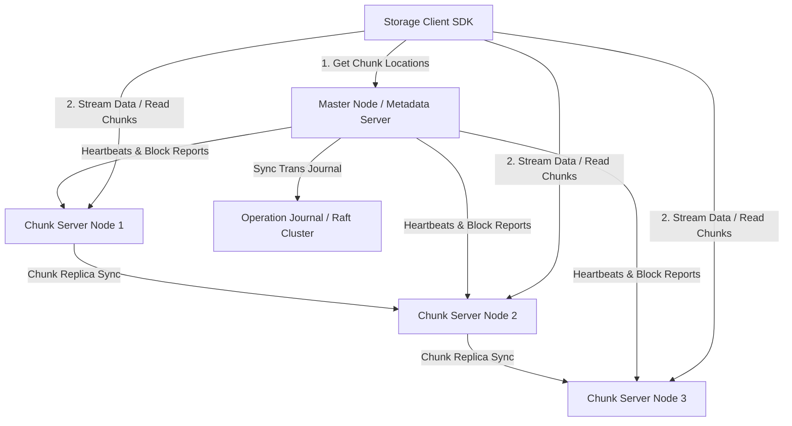
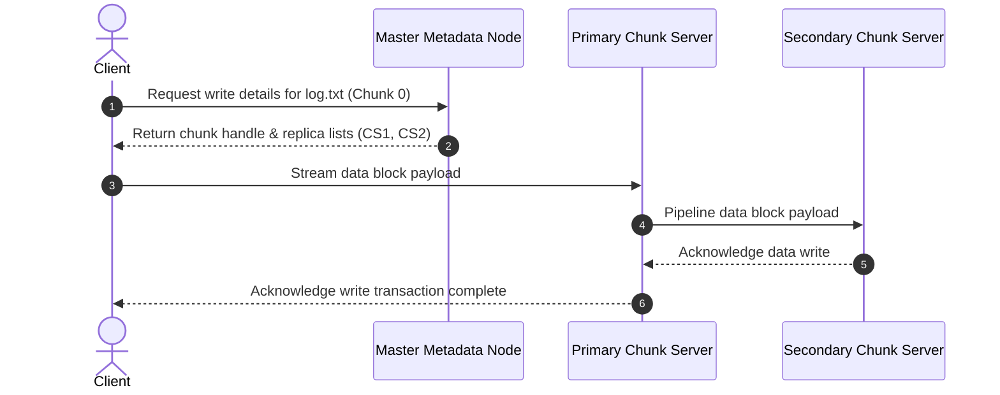

# Distributed File Storage System Design

This document details the production-grade system design for a high-scale, fault-tolerant **Distributed File Storage System** (analogous to Google File System (GFS) or Hadoop Distributed File System (HDFS)). The system is optimized for storing large files (multi-gigabyte to terabyte scale), managing a hierarchical directory namespace, distributing block/chunk storage across thousands of commodity servers, and providing high aggregate write/read throughput.

---

## 1. System Requirements

### Functional Requirements
* **Namespace Management:**
  * Support a hierarchical directory structure (create, rename, delete files and directories).
  * Fast lookup of file metadata (size, permissions, file-to-chunk mappings).
* **File Operations:**
  * Support large file writes (append-only operations optimized, arbitrary updates supported but discouraged).
  * High-throughput file reads (streaming access pattern).
  * Delete files (garbage collected asynchronously).
* **Data Chunking:**
  * Automatically split large files into fixed-size chunks (e.g., 64 MB blocks).
* **Replication & Fault Tolerance:**
  * Automatically replicate each chunk across multiple data servers (default: 3 replicas) to survive hardware failures.
  * Continuously monitor the health of data servers and re-replicate/rebalance blocks dynamically.

### Non-Functional Requirements
* **High Read/Write Aggregate Throughput:** Optimized for concurrent reads and writes by thousands of clients.
* **Fault Tolerance & Reliability:** Zero data loss in the event of hardware or rack-level power failures.
* **Scalability:** Scale to petabytes/exabytes of storage spanning tens of thousands of commodity machines.
* **Eventually Consistent Read Paths:** Master handles metadata synchronously, while chunk servers serve actual file data. Clients cache metadata to reduce master load.
* **Integrity:** Automatically detect and repair bit rot / data corruption using block checksums.

---

## 2. Capacity & Scale Estimation

### Assumptions
* **Total Storage Target:** $100 \text{ Petabytes (PB)}$
* **Average File Size:** $100 \text{ MB}$
* **Total Number of Files:** 
  $$\frac{100 \text{ PB}}{100 \text{ MB}} = 1 \text{ Billion files}$$
* **Default Chunk Size:** $64 \text{ MB}$
* **Replication Factor:** $3\times$ (Total raw physical storage required = $300 \text{ PB}$)
* **Average Chunks per File:**
  $$\frac{100 \text{ MB}}{64 \text{ MB}} \approx 1.56 \text{ chunks/file}$$
* **Total Chunk Replicas in the System:**
  $$1 \text{ Billion files} \times 1.56 \text{ chunks} \times 3 \text{ replicas} = 4.68 \text{ Billion chunk replicas}$$

### Master Metadata Memory Size (Single Node RAM Target)
The master server holds all metadata in memory for sub-millisecond namespace operations.
* Metadata per file: Name, size, ACLs, mappings $\approx 150 \text{ bytes}$.
* Metadata per chunk: Chunk ID, version, locations $\approx 100 \text{ bytes}$.
* Total Master Memory Required:
  $$(1 \text{ Billion files} \times 150 \text{ bytes}) + (1.56 \text{ Billion unique chunks} \times 100 \text{ bytes}) = 150 \text{ GB} + 156 \text{ GB} = \mathbf{306 \text{ GB RAM}}$$
  This easily fits on a modern high-memory bare-metal server (e.g., 512 GB or 1 TB RAM).

---

## 3. High-Level Architecture

The architecture separates the **Metadata Path** (control plane) from the **Data Path** (data plane) to prevent the master server from becoming a bottleneck during heavy read/write workloads.


### System Architecture Flowchart


### Core Components
1. **Storage Client SDK:** Handles chunk lookup requests, local caching, and file data streaming pipelines.
2. **Master Server (Control Plane):** Central orchestrator managing the directory tree, block namespace, chunk leases, and cluster load balancing.
3. **Chunk Servers (Data Plane):** High-performance storage servers storing binary files directly to local disks.
4. **Operation Journal (Consensus Core):** Replicated append-only state log tracking namespace changes.

---

## 4. Component-Level Design

### A. Chunk Size Design Trade-offs

Choosing the chunk size determines file access latency and memory footprints:

| Chunk Size | Control Plane Overhead | TCP Handshake Overhead | Internal Fragmentation | Best Use Case |
| :--- | :--- | :--- | :--- | :--- |
| **1 MB (Small)** | Extremely High (64x more keys) | High (frequent connections) | Very Low | Small text documents, tiny logs. |
| **64 MB (Large) ✅** | **Very Low (RAM friendly)** | **Minimal (Persistent links)**| High (for files < 64 MB) | **Default choice for massive datasets.** |

---

### B. Write Path Flow (Single-Master, Multi-Replica)

To maximize write bandwidth, data is pipelined linearly along a chain of Chunk Servers rather than routed through the Master.

```
                     [Master Server]
                        │      ▲
           1. Get Write │      │ 6. Commit Confirm
              Lease &   │      │
              Replica   ▼      │
              List    ┌──────────┐
                      │  Client  │
                      └──────────┘
                         │    ▲
         2. Pipeline Data│    │ 5. Ack Success
           (Chained)     ▼    │
             ┌──────────────┐ │
             │ Chunk Server │─┘
             │ (Primary)    │◀──────────────┐
             └──────────────┘               │
               │      ▲                     │
 3. Push Data  │      │ 4. Replication Ack  │ 4. Replication Ack
               ▼      │                     │
             ┌──────────────┐               │
             │ Chunk Server │───────────────┘
             │ (Secondary)  │
             └──────────────┘
               │      ▲
 3. Push Data  │      │ 4. Replication Ack
               ▼      │
             ┌──────────────┐
             │ Chunk Server │
             │ (Tertiary)   │
             └──────────────┘
```

---

## 5. Database Schema & Namespace Strategy

### 1. File Metadata Document Schema (JSON representation)
```json
{
  "file_path": "/data/logs.txt",
  "owner": "admin",
  "size_bytes": 157286400,
  "chunks": [
    { "index": 0, "handle": "0xCAFE0001", "version": 1 },
    { "index": 1, "handle": "0xCAFE0002", "version": 1 }
  ]
}
```

### 2. Sharding & Backup
* **Namespace Partitioning:** Partition metadata in DynamoDB by directory prefix keys (e.g. hash partitioning on `/data/`) to scale namespace updates.

---

## 6. API Design & Payloads

### 1. Allocate Chunk
* **Endpoint:** `POST /api/v1/chunks/allocate`
* **Payload:**
```json
{
  "file_path": "/data/logs.txt",
  "chunk_index": 0
}
```
* **Response:**
```json
{
  "chunk_handle": "0xCAFE0001",
  "primary": "10.0.1.10:5001",
  "replicas": ["10.0.1.10:5001", "10.0.1.11:5001", "10.0.2.10:5001"]
}
```

---

## 7. End-to-End Workflow Sequence



---

## 8. Scalability & Resilience Strategies
* **Dynamic Rebalancing:** Master scans chunk server capacity metrics and moves replicas to lower-use nodes asynchronously.
* **Block Reports:** Chunk servers periodically send block reports (inventories of local chunks) to reconcile states against the master registry.

---

## 9. Disaster Recovery & Multi-Region Failover Strategy
* **Journal Replication:** Replicate transaction operation logs using Raft consensus groups across three active zones to guarantee zero-loss control plane state recovery.

---

## 10. AWS Cloud-Native Implementation

### AWS Service Mapping & Rationale

| Generic Component | AWS Service | Design Details & Rationale |
| :--- | :--- | :--- |
| **Master Node** | **Amazon ECS Fargate** | Coordinates lookup leases and manages cluster mappings. |
| **Data Node Fleet** | **Amazon EC2 (i3en instances)** | High IOPS EC2 instances with local NVMe storage nodes. |
| **Metadata Registry** | **Amazon DynamoDB** | High-throughput document index for namespace files. |
| **Cold Storage** | **Amazon S3 Glacier** | Long-term backup snapshot vault. |

---

## 11. Technology Justification: Why We Use

### A. EC2 i3en Instances (NVMe Storage)
* **Why We Use It:** Local NVMe instance stores are needed to bypass network EBS bottleneck limits when streaming gigabyte-scale datasets. Direct disk access matches HDFS/GFS performance targets.

### B. Amazon DynamoDB (System Registry)
* **Why We Use It:** Storing hierarchical file systems requires high-throughput updates on directories. DynamoDB handles scaling namespace allocations automatically with sub-10ms response targets.
