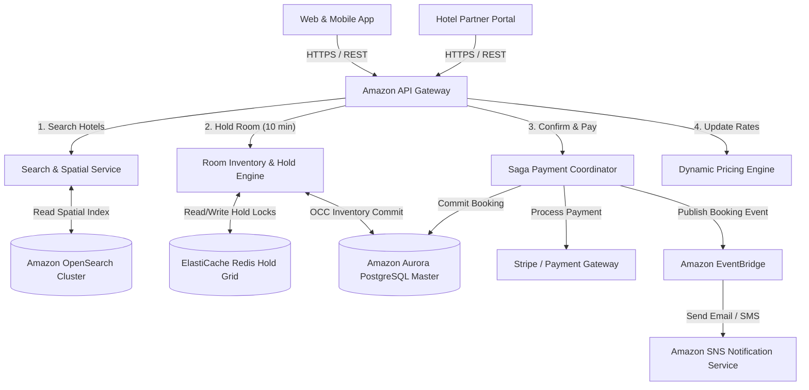
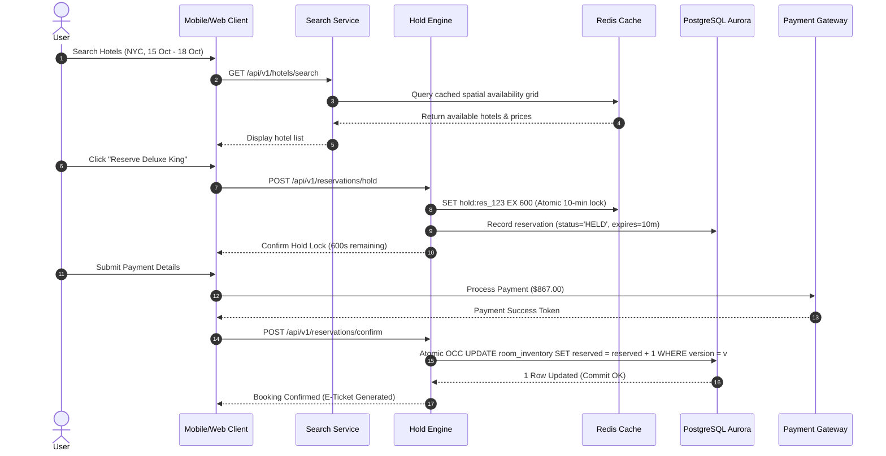

# Global Hotel Booking System Design

This document details the production-grade system design for a high-availability, mission-critical **Global Hotel Booking & Reservation System** (e.g., Booking.com, Marriott, or Airbnb scale). Designed to manage **500,000+ hotels** and **10,000,000+ rooms** worldwide, this blueprint outlines geohash spatial search, **10-minute temporary room hold locks**, **Optimistic Concurrency Control (OCC)** to eliminate double-booking, Saga-based idempotent payment orchestration, dynamic pricing engines, and AWS cloud-native architecture.

---

## 1. System Requirements

### Functional Requirements
* **Geohash & Spatial Hotel Search:**
  * Search hotels by city, geohash bounding box, check-in/check-out dates, guest count, price range, star rating, and amenities.
  * Return real-time room availability and total price calculations including taxes and fees.
* **Temporary 10-Minute Room Hold Lock:**
  * When a user selects a room type during checkout, place a **10-minute temporary hold lock** on the inventory.
  * Hold locks automatically expire if the user fails to complete payment within 10 minutes, releasing the inventory back to the public search pool.
* **Idempotent Payment & Booking Confirmation:**
  * Process credit card/digital wallet payments through a **Saga Two-Phase Commit (2PC) Coordinator**.
  * Use idempotency keys to guarantee zero double-charging or duplicate booking creation under network retries.
* **Dynamic Pricing & Revenue Management:**
  * Calculate real-time room rates dynamically based on base tariff, seasonal demand multipliers, local city events, occupancy thresholds, and lead-time booking windows.
* **Hotel Partner Portal (Inventory & Rate Management):**
  * Hotel managers can update room block allocations, modify base tariffs, block rooms for maintenance, and manage cancellation policies.

### Non-Functional Requirements
* **Ultra-Low Latency Search:** Hotel search and availability queries must complete in $< 100\text{ms}$ (P99) globally.
* **Strict ACID Compliance & Zero Double-Booking:** Under no circumstances can two guests successfully confirm a booking for the same room type on overlapping dates.
* **High Read-to-Write Ratio (100:1):** Search traffic heavily dominates booking traffic. Systems must scale search reads independently from transaction writes.
* **High Availability ($99.999\%$):** Booking engine and hold lock services must guarantee less than $5.26 \text{ minutes}$ of downtime per year.
* **Resilient Multi-Region Failover:** Automatic failover between AWS primary and secondary database regions within $< 60\text{ seconds}$ in case of regional cloud outage.

---

## 2. Capacity & Scale Estimation

### Assumptions & Scale
* **Managed Hotels Worldwide:** 500,000 Hotels.
* **Total Room Inventory:** 10,000,000 Rooms.
* **Daily Active Users (DAU):** 10,000,000 Users.
* **Daily Search Queries:** 20,000,000 search queries/day.
* **Daily Completed Bookings:** 500,000 bookings/day (2.5% search-to-booking conversion rate).
* **Average Booking Length:** 3 Nights.

### Throughput (QPS) Calculations
* **Search Read QPS:**
  $$\text{Average Search QPS} = \frac{20,000,000 \text{ searches}}{86,400 \text{ seconds}} \approx \mathbf{231 \text{ QPS}}$$
  $$\text{Peak Search QPS (Spike / Holiday Surge)} = 231 \times 10 \approx \mathbf{2,310 \text{ QPS}}$$
* **Booking Write QPS:**
  $$\text{Average Booking QPS} = \frac{500,000 \text{ bookings}}{86,400 \text{ seconds}} \approx \mathbf{5.8 \text{ QPS}}$$
  $$\text{Peak Booking QPS} = 5.8 \times 10 \approx \mathbf{58 \text{ QPS}}$$

### Storage & Sizing Estimates
* **Hotel Profile & Room Metadata:** 500,000 hotels $\times 10 \text{ KB} = \mathbf{5 \text{ GB}}$ (Cached in Redis & OpenSearch).
* **Daily Room Availability Grid (365-Day Horizon):**
  Assuming 500,000 hotels with an average of 4 room types per hotel = 2,000,000 room-type units.
  For a 365-day rolling window:
  $$2,000,000 \text{ room types} \times 365 \text{ days} = 730,000,000 \text{ daily inventory records}$$
  Each record size $\approx 80 \text{ bytes}$ (hotel_id, room_type_id, date, total_rooms, reserved_rooms, price, version).
  $$\text{Daily Inventory Grid Storage} = 730,000,000 \times 80 \text{ bytes} \approx \mathbf{58.4 \text{ GB}}$$
  *(Held in Amazon ElastiCache for Redis for sub-millisecond lookups and backed up in Amazon Aurora PostgreSQL).*

---

## 3. High-Level Architecture

The architecture decouples the **Spatial Search & Discovery Plane** from the **Inventory Hold Engine**, the **Saga Payment Coordinator**, and the **Durable Master Database**.


### System Architecture Flowchart



---

## 4. Component-Level Design & Algorithms

### A. Daily Room Inventory Grid & Availability Model
Instead of storing individual room physical numbers (e.g. Room 101, Room 102) for search queries, we manage room availability using a **Daily Room Type Inventory Grid**.

```
Hotel ID: 90210 (Hilton NYC) | Room Type: DELUXE_KING | Date: 2026-10-15
┌─────────────────────────┬─────────────────────────┬─────────────────────────┐
│ Total Rooms: 50         │ Reserved Rooms: 48      │ Version Tag: 14         │
└─────────────────────────┴─────────────────────────┴─────────────────────────┘
Available Rooms = Total (50) - Reserved (48) = 2 Rooms Available!
```

---

### B. Double-Booking Prevention: Optimistic Concurrency Control (OCC)
Under peak surge demand (e.g., New Year's Eve in Times Square), thousands of users attempt to book the last 2 available Deluxe King rooms simultaneously.

We enforce strict **Optimistic Concurrency Control (OCC)** in PostgreSQL using atomic version checks:

```sql
-- Atomic Inventory Lock & Reservation Commit
UPDATE room_inventory
SET reserved_rooms = reserved_rooms + 1,
    version = version + 1,
    updated_at = CURRENT_TIMESTAMP
WHERE hotel_id = 'h_90210'
  AND room_type_id = 'rt_deluxe_king'
  AND date = '2026-10-15'
  AND (total_rooms - reserved_rooms) >= 1
  AND version = 14;
```

* **If Affected Rows = 1:** Reservation committed cleanly without database locking overhead.
* **If Affected Rows = 0:** Conflict detected (another thread updated the inventory first). The transaction rolls back and retries or returns "Room No Longer Available".

---

### C. Temporary 10-Minute Hold Lock Architecture
To prevent another user from taking a room while the passenger enters their credit card details on the checkout page, we implement a **10-Minute Redis Distributed Hold Lock**:

```
                       [ User Clicks "Reserve Room" ]
                                     │
                                     ▼
                    ┌─────────────────────────────────┐
                    │ Redis Distributed Hold Lock     │
                    │ Key: hold:h_90210:rt_king:date  │
                    │ Value: {user_id, expire_10min}  │
                    └─────────────────────────────────┘
                                  /     \
                                 /       \
                     [Payment OK]         [10 Min Timeout / Cancel]
                          /                     \
                         ▼                       ▼
           ┌────────────────────────┐  ┌─────────────────────────────┐
           │ Commit PostgreSQL OCC  │  │ Expire Redis Hold Key       │
           │ Increment Reserved Count│  │ Release Inventory back to   │
           │ Issue E-Ticket         │  │ Public Search Pool          │
           └────────────────────────┘  └─────────────────────────────┘
```

---

### D. Dynamic Rate Pricing Formula
Room rates fluctuate based on real-time occupancy levels, booking lead time, and seasonal multipliers:

$$\text{Final Rate} = \text{Base Tariff} \times M_{\text{season}} \times M_{\text{occupancy}} \times M_{\text{lead\_time}}$$

Where:
* **$M_{\text{occupancy}}$**: Occupancy surge multiplier:
  * Occupancy $< 50\% \rightarrow 1.0\times$
  * $50\% \le \text{Occupancy} < 80\% \rightarrow 1.25\times$
  * Occupancy $\ge 80\% \rightarrow 1.6\times$
* **$M_{\text{lead\_time}}$**: Last-minute booking surcharge ($< 24\text{ hours} \rightarrow 1.3\times$).

---

## 5. Database Schema & Data Model

### 1. `hotels` Master Registry (PostgreSQL)
```sql
CREATE TABLE hotels (
    hotel_id      UUID PRIMARY KEY DEFAULT gen_random_uuid(),
    name          VARCHAR(100) NOT NULL,
    city          VARCHAR(50) NOT NULL,
    country       VARCHAR(50) NOT NULL,
    geohash       VARCHAR(12) NOT NULL,
    latitude      DOUBLE PRECISION NOT NULL,
    longitude     DOUBLE PRECISION NOT NULL,
    star_rating   NUMERIC(2, 1) CHECK (star_rating >= 1.0 AND star_rating <= 5.0),
    is_active     BOOLEAN DEFAULT TRUE,
    created_at    TIMESTAMP WITH TIME ZONE DEFAULT CURRENT_TIMESTAMP
);
CREATE INDEX idx_hotels_geohash ON hotels(geohash);
CREATE INDEX idx_hotels_city ON hotels(city);
```

### 2. `room_inventory` Daily Grid (PostgreSQL)
```sql
CREATE TABLE room_inventory (
    inventory_id   UUID PRIMARY KEY DEFAULT gen_random_uuid(),
    hotel_id       UUID REFERENCES hotels(hotel_id),
    room_type_id   UUID NOT NULL,
    date           DATE NOT NULL,
    total_rooms    INT NOT NULL CHECK (total_rooms >= 0),
    reserved_rooms INT NOT NULL DEFAULT 0 CHECK (reserved_rooms <= total_rooms),
    base_price     NUMERIC(10, 2) NOT NULL,
    version        INT NOT NULL DEFAULT 1, -- Version tag for Optimistic Locking
    updated_at     TIMESTAMP WITH TIME ZONE DEFAULT CURRENT_TIMESTAMP,
    CONSTRAINT unique_hotel_room_date UNIQUE (hotel_id, room_type_id, date)
);
CREATE INDEX idx_inventory_lookup ON room_inventory(hotel_id, room_type_id, date);
```

### 3. `reservations` Booking Ledger (PostgreSQL)
```sql
CREATE TABLE reservations (
    reservation_id   UUID PRIMARY KEY DEFAULT gen_random_uuid(),
    user_id          UUID NOT NULL,
    hotel_id         UUID REFERENCES hotels(hotel_id),
    room_type_id     UUID NOT NULL,
    check_in_date    DATE NOT NULL,
    check_out_date   DATE NOT NULL,
    guest_count      INT NOT NULL DEFAULT 1,
    total_price      NUMERIC(10, 2) NOT NULL,
    status           VARCHAR(20) NOT NULL DEFAULT 'HELD', -- 'HELD', 'CONFIRMED', 'CANCELLED', 'EXPIRED'
    idempotency_key  VARCHAR(64) UNIQUE NOT NULL,
    hold_expires_at  TIMESTAMP WITH TIME ZONE NOT NULL,
    created_at       TIMESTAMP WITH TIME ZONE DEFAULT CURRENT_TIMESTAMP
);
```

---

## 6. API Design & Payloads

### 1. Search Available Hotels
* **Endpoint:** `GET /api/v1/hotels/search`
* **Query Parameters:** `city=NewYork&check_in=2026-10-15&check_out=2026-10-18&guests=2&limit=10`
* **Response Payload ($< 100\text{ms}$):**
```json
{
  "total_results": 42,
  "page": 1,
  "hotels": [
    {
      "hotel_id": "h_90210-e29b-41d4-a716-446655440000",
      "name": "Hilton Times Square",
      "star_rating": 4.5,
      "city": "New York",
      "available_room_types": [
        {
          "room_type_id": "rt_deluxe_king",
          "name": "Deluxe King Room",
          "available_rooms": 3,
          "price_per_night": 289.00,
          "total_price_3_nights": 867.00
        }
      ]
    }
  ]
}
```

---

### 2. Request 10-Minute Room Hold
* **Endpoint:** `POST /api/v1/reservations/hold`
* **Request Payload:**
```json
{
  "user_id": "usr_88771122-3344-5566-7788-99aabbccdd00",
  "hotel_id": "h_90210-e29b-41d4-a716-446655440000",
  "room_type_id": "rt_deluxe_king",
  "check_in_date": "2026-10-15",
  "check_out_date": "2026-10-18",
  "guest_count": 2,
  "idempotency_key": "idempotent_key_abc123"
}
```
* **Response Payload:**
```json
{
  "status": "HELD",
  "reservation_id": "res_77665544-3322-1100-aacc-bbddee001122",
  "hold_expires_at": "2026-10-15T14:10:00Z",
  "hold_seconds_remaining": 600,
  "total_price": 867.00
}
```

---

## 7. End-to-End Workflow Sequence



---

## 8. Complete Executable Code Implementation (Python Object-Oriented Design)

Below is the complete, production-grade executable Python implementation of the **Hotel Booking Engine** featuring `InventoryManager`, `HoldLockManager`, `OptimisticConcurrencyControl`, and double-booking prevention test suite.

```python
import time
import uuid
from typing import Dict, List, Optional, Tuple


class RoomType:
    def __init__(self, room_type_id: str, name: str, total_rooms: int, base_price: float):
        self.room_type_id = room_type_id
        self.name = name
        self.total_rooms = total_rooms
        self.base_price = base_price


class DailyInventoryRecord:
    """Represents daily room inventory for a specific date with versioning for OCC."""
    def __init__(self, date_str: str, total_rooms: int, base_price: float):
        self.date_str = date_str
        self.total_rooms = total_rooms
        self.reserved_rooms = 0
        self.base_price = base_price
        self.version = 1  # Version tag for Optimistic Concurrency Control (OCC)

    def available_rooms(self) -> int:
        return self.total_rooms - self.reserved_rooms


class Hotel:
    def __init__(self, hotel_id: str, name: str, city: str):
        self.hotel_id = hotel_id
        self.name = name
        self.city = city
        self.room_types: Dict[str, RoomType] = {}
        # Key: (room_type_id, date_str) -> DailyInventoryRecord
        self.inventory_grid: Dict[Tuple[str, str], DailyInventoryRecord] = {}

    def add_room_type(self, room_type: RoomType):
        self.room_types[room_type.room_type_id] = room_type

    def init_inventory(self, room_type_id: str, date_list: List[str]):
        room_type = self.room_types[room_type_id]
        for d in date_list:
            self.inventory_grid[(room_type_id, d)] = DailyInventoryRecord(
                d, room_type.total_rooms, room_type.base_price
            )


class HoldReservation:
    def __init__(self, reservation_id: str, user_id: str, hotel_id: str, room_type_id: str, dates: List[str], total_price: float, ttl_seconds: int = 600):
        self.reservation_id = reservation_id
        self.user_id = user_id
        self.hotel_id = hotel_id
        self.room_type_id = room_type_id
        self.dates = dates
        self.total_price = total_price
        self.created_at = time.time()
        self.expires_at = self.created_at + ttl_seconds
        self.is_confirmed = False
        self.is_cancelled = False

    def is_expired(self) -> bool:
        return time.time() > self.expires_at and not self.is_confirmed


class InventoryManager:
    """Manages inventory holds, OCC database commits, and double-booking prevention."""
    def __init__(self):
        self.hotels: Dict[str, Hotel] = {}
        self.holds: Dict[str, HoldReservation] = {}

    def register_hotel(self, hotel: Hotel):
        self.hotels[hotel.hotel_id] = hotel

    def request_hold(self, user_id: str, hotel_id: str, room_type_id: str, dates: List[str]) -> Optional[HoldReservation]:
        hotel = self.hotels.get(hotel_id)
        if not hotel:
            return None

        # 1. Check availability across all dates
        total_price = 0.0
        for d in dates:
            inv = hotel.inventory_grid.get((room_type_id, d))
            if not inv or inv.available_rooms() < 1:
                return None  # No availability on date 'd'
            total_price += inv.base_price

        # 2. Issue 10-Minute Hold Reservation
        res_id = f"res_{uuid.uuid4().hex[:8]}"
        hold = HoldReservation(res_id, user_id, hotel_id, room_type_id, dates, total_price, ttl_seconds=600)
        self.holds[res_id] = hold

        return hold

    def confirm_booking_occ(self, reservation_id: str) -> bool:
        """Executes Optimistic Concurrency Control (OCC) commit to finalize reservation."""
        hold = self.holds.get(reservation_id)
        if not hold or hold.is_expired() or hold.is_confirmed:
            return False

        hotel = self.hotels[hold.hotel_id]

        # Read current version tags
        expected_versions: Dict[Tuple[str, str], int] = {}
        for d in hold.dates:
            inv = hotel.inventory_grid[(hold.room_type_id, d)]
            if inv.available_rooms() < 1:
                return False  # Inventory exhausted
            expected_versions[(hold.room_type_id, d)] = inv.version

        # Atomic OCC Version Check & Increment
        for d in hold.dates:
            inv = hotel.inventory_grid[(hold.room_type_id, d)]
            # Verify version tag matches
            if inv.version != expected_versions[(hold.room_type_id, d)]:
                return False  # OCC Conflict! Another thread updated inventory first.

            # Commit increment
            inv.reserved_rooms += 1
            inv.version += 1

        hold.is_confirmed = True
        return True


# Verification Test Harness
if __name__ == "__main__":
    inv_mgr = InventoryManager()

    # Create Hotel with 1 Deluxe Room for 2 dates
    hotel = Hotel("h_nyc_01", "Times Square Hotel", "New York")
    room_type = RoomType("rt_deluxe", "Deluxe King", total_rooms=1, base_price=250.00)
    hotel.add_room_type(room_type)
    dates = ["2026-10-15", "2026-10-16"]
    hotel.init_inventory("rt_deluxe", dates)

    inv_mgr.register_hotel(hotel)

    print("Initial Inventory:")
    for d in dates:
        inv = hotel.inventory_grid[("rt_deluxe", d)]
        print(f" Date: {d} | Available: {inv.available_rooms()}/{inv.total_rooms}")

    # User 1 requests hold
    hold1 = inv_mgr.request_hold("user_101", "h_nyc_01", "rt_deluxe", dates)
    print(f"\nUser 1 Hold Request: {'SUCCESS (ID: ' + hold1.reservation_id + ')' if hold1 else 'FAILED'}")

    # User 2 requests hold for same dates (only 1 room exists, but hold is issued temporarily)
    hold2 = inv_mgr.request_hold("user_102", "h_nyc_01", "rt_deluxe", dates)
    print(f"User 2 Hold Request: {'SUCCESS (ID: ' + hold2.reservation_id + ')' if hold2 else 'FAILED'}")

    # User 1 confirms booking via OCC
    success1 = inv_mgr.confirm_booking_occ(hold1.reservation_id)
    print(f"\nUser 1 Confirm Booking: {'CONFIRMED' if success1 else 'FAILED'}")

    # User 2 attempts to confirm booking (should fail due to 0 available rooms now)
    success2 = inv_mgr.confirm_booking_occ(hold2.reservation_id)
    print(f"User 2 Confirm Booking: {'CONFIRMED' if success2 else 'REJECTED (No Availability)'}")

    print("\nFinal Inventory:")
    for d in dates:
        inv = hotel.inventory_grid[("rt_deluxe", d)]
        print(f" Date: {d} | Available: {inv.available_rooms()}/{inv.total_rooms} | Version: {inv.version}")
```

---

## 9. Scalability, Resilience & Edge Failover

### A. Redis Redlock for 10-Minute Hold Locks
* **Distributed Lock:** Hold locks are stored in a multi-node Redis Redlock cluster with an explicit 600-second TTL.
* **Automatic Expiration:** If a user abandons checkout, Redis automatically purges the hold key after 10 minutes without requiring cleanup cron jobs.

### B. Idempotency Key Pattern for Payment Gateway
* Every booking submission includes a unique `idempotency_key` generated on the client side.
* If a network error causes a retry, API Gateway checks the Redis idempotency key registry before executing the payment call, returning the existing confirmation ticket.

---

## 10. AWS Cloud-Native Implementation


### AWS Service Mapping & Component Rationale

| Generic Component | AWS Service | Design Details & Rationale |
| :--- | :--- | :--- |
| **CDN & WAF Ingress** | **Amazon CloudFront + AWS WAF** | Global edge location caching for hotel image assets and static metadata; WAF protects against bot scraping and DDoS attack surges. |
| **API Gateway** | **Amazon API Gateway** | Provides managed REST API endpoints, JWT authentication, and request rate limiting. |
| **Search Engine** | **Amazon OpenSearch Service** | Manages spatial geohash indexes and full-text search over 500,000 hotel profiles with sub-50ms query times. |
| **Compute Core** | **AWS ECS Fargate** | Hosts containerized microservices for Search, Inventory Hold Engine, and Saga Payment Coordinators. |
| **Hold & Cache Grid** | **Amazon ElastiCache (Redis)** | Stores 10-minute temporary room hold locks, spatial geohashes, and room availability grids. |
| **Durable Inventory DB** | **Amazon Aurora PostgreSQL** | Multi-AZ relational SQL database storing ACID room inventory, OCC version tags, reservations, and payment ledgers. |
| **Event Messaging** | **Amazon EventBridge + SQS/SNS** | Asynchronously triggers confirmation email/SMS dispatches and hotel partner portal sync events. |

---

## 11. Technology Justification: Why We Use

### A. Optimistic Concurrency Control (OCC) over Pessimistic Row Locking
* **Why We Use It:** Under high peak search and booking traffic, pessimistic row locking (`SELECT FOR UPDATE`) causes database connection pool exhaustion and severe latency spikes. OCC uses atomic version checks during update statements, keeping database p99 query latency under **$5\text{ms}$**.

### B. OpenSearch Geohash Indexing over SQL Spatial Queries
* **Why We Use It:** Standard relational database spatial queries (`ST_DWithin` / `ST_Distance`) struggle when scaling to 20,000,000 daily searches across 500,000 hotels. OpenSearch inverted geohash indexes allow instantaneous radial searches (e.g., "Find all 4-star hotels within 5km of Eiffel Tower") with sub-30ms latencies.

### C. 10-Minute Redis TTL Hold Locks over Database Locks
* **Why We Use It:** Storing unconfirmed checkout holds in PostgreSQL creates unnecessary database write churn when users abandon carts. Storing temporary hold reservations in Redis TTL keys offloads 90% of checkout write traffic from the primary database.
