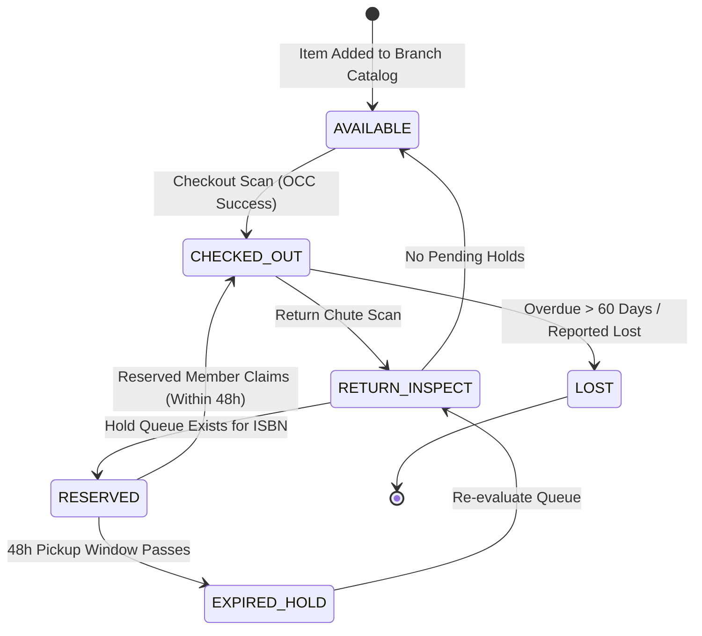
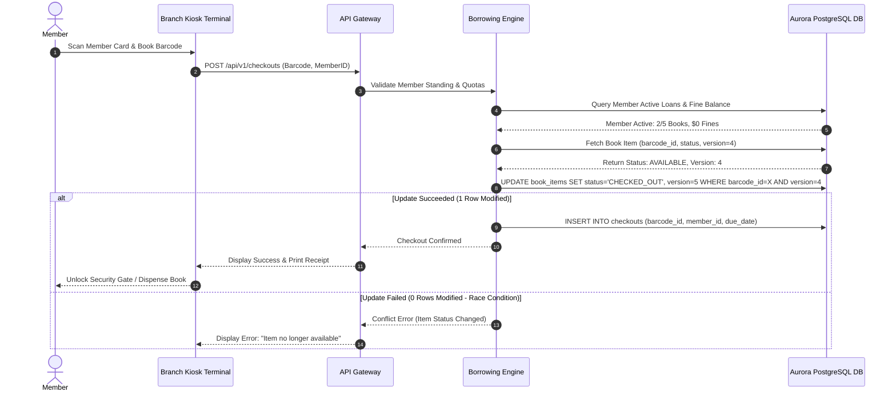
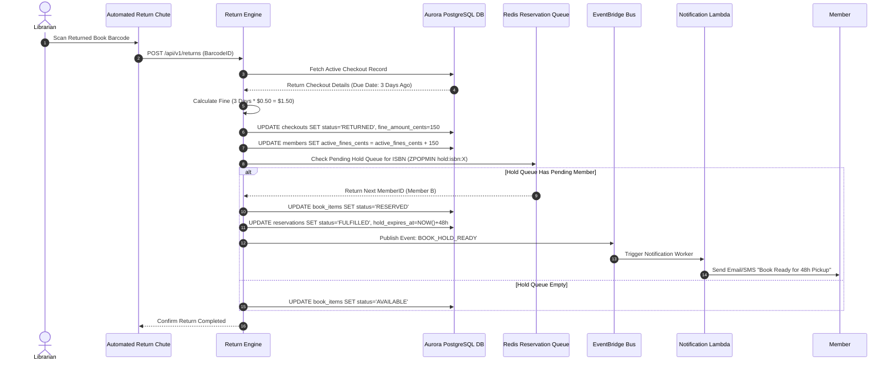

# Smart Library Management System Design

This document details the production-grade system design for a highly scalable, multi-branch **Enterprise Library Management System**. Designed to support university networks, large municipality library systems, or digital/physical hybrid archives, this blueprint outlines catalog search indexing, barcode/RFID automated checkout workflows, lock-free inventory concurrency, hold reservation queues, dynamic fine calculation engines, and offline edge resilience for branch kiosks.

---

## 1. System Requirements

### Functional Requirements
* **Catalog & Inventory Management:**
  * Support dual-layer book representation: **Book Metadata** (ISBN, Title, Authors, Category, Edition) and **Physical Book Copies** (individual barcode/RFID tagged items).
  * Index catalog metadata for full-text search across Title, Author, Subject Category, and ISBN with sub-50ms latency.
  * Track real-time item status (`AVAILABLE`, `CHECKED_OUT`, `RESERVED`, `IN_TRANSIT`, `LOST`, `UNDER_REPAIR`).
* **Member Management & Access Control:**
  * Support role-based permissions: Members (Students, Faculty, Public), Librarians, and System Administrators.
  * Enforce tier-based borrowing quotas (e.g., Students: max 5 books / 14-day loan; Faculty: max 15 books / 30-day loan).
  * Track active member standing, membership expiration, and outstanding fine balances.
* **Automated Checkout & Return Workflow:**
  * Process checkout scans via counter barcode readers or self-service RFID kiosks.
  * Enforce strict lock-free concurrency to prevent double-checkout of the exact physical barcode copy.
  * Process returns, calculate daily overdue fines ($0.50/day) with grace periods and max fine caps, and clear member holds upon payment.
* **Hold Reservation Engine (FIFO Queue):**
  * Allow members to place holds on books when all physical copies are currently checked out.
  * Maintain a strict First-In-First-Out (FIFO) reservation queue per ISBN.
  * Automatically assign a newly returned physical copy to the top reservation in queue and trigger a 48-hour pickup window notification (SMS/Email).
* **Branch Edge & Audit Operations:**
  * Track book physical location down to Branch ID, Floor, Room, Shelf/Rack ID, and Shelf Position.
  * Log full audit trails for lost books, inventory reconciliation, and branch-to-branch inter-library transit.

### Non-Functional Requirements
* **Low Latency Catalog Search:** Catalog queries must return results in $< 50\text{ms}$ (P99) even during peak exam periods.
* **Lock-Free Concurrency Control:** Guarantee absolute zero double-checkouts of physical book barcodes under concurrent scan events across kiosks.
* **High Read-to-Write Ratio:** Designed for a $10:1$ read-heavy workload (catalog browsing and search vs. checkouts/returns).
* **Offline Edge Resilience:** Branch kiosks must continue processing checkouts and returns locally (using embedded SQLite caches) during cloud connectivity outages.
* **High Availability & Data Durability:** Core database services must achieve $\geq 99.99\%$ availability with zero data loss ($RPO=0, RTO < 30s$).

---

## 2. Capacity & Scale Estimation

### Assumptions
* **Managed Branch Libraries:** $100 \text{ branches}$
* **Unique Book Titles (ISBNs):** $10,000,000 \text{ titles}$
* **Total Physical Book Copies:** $50,000,000 \text{ items}$ (average 5 physical copies per ISBN)
* **Registered Members:** $5,000,000 \text{ members}$
* **Daily Checkout/Return Transactions:** $500,000 \text{ transactions/day}$
* **Daily Catalog Searches:** $5,000,000 \text{ searches/day}$

### Read / Write QPS Calculations
* **Catalog Search Throughput:**
  $$\text{Average Search QPS} = \frac{5,000,000 \text{ searches}}{86,400 \text{ seconds}} \approx \mathbf{58 \text{ QPS}}$$
  $$\text{Peak Search QPS (10x during exam season)} \approx \mathbf{600 \text{ QPS}}$$
* **Checkout / Return Write Throughput:**
  $$\text{Average Write QPS} = \frac{500,000 \text{ checkouts}}{86,400 \text{ seconds}} \approx \mathbf{5.8 \text{ QPS}}$$
  $$\text{Peak Write QPS (10x rush hour)} \approx \mathbf{60 \text{ QPS}}$$

### Storage Sizing Estimates
* **Book Metadata Record (ISBN):** $\sim 2 \text{ KB}$ per record
  $$\text{Catalog Storage} = 10,000,000 \times 2 \text{ KB} = \mathbf{20 \text{ GB}}$$
* **Physical Item Record (Barcode):** $\sim 500 \text{ bytes}$ per copy
  $$\text{Items Storage} = 50,000,000 \times 500 \text{ bytes} = \mathbf{25 \text{ GB}}$$
* **Member Profile Record:** $\sim 1 \text{ KB}$ per member
  $$\text{Member Storage} = 5,000,000 \times 1 \text{ KB} = \mathbf{5 \text{ GB}}$$
* **Checkout Ledger Records (Active + 5-Year History):** $\sim 100,000,000 \text{ rows} \times 500 \text{ bytes}$
  $$\text{Ledger Storage} \approx \mathbf{50 \text{ GB}}$$
* **Total Primary Database Storage:** $\approx \mathbf{100 \text{ GB}}$ (Easily cached in memory across relational DB replicas and OpenSearch clusters).

---

## 3. High-Level Architecture

The system decouples the **Search & Discovery Plane** (OpenSearch full-text cluster + Redis cache) from the **Transactional Transaction Plane** (PostgreSQL ledger for checkouts, returns, and reservations) and the **Branch Edge Kiosk Plane**.


### System Architecture Flowchart
graph TD
    %% Clients & Terminals
    MemberApp[Member Mobile / Web App] -->|HTTPS REST| APIGW[API Gateway]
    Kiosk[Branch Kiosk / Barcode Scanner] -->|HTTPS / Edge Sync| APIGW
    StaffApp[Librarian Desktop Console] -->|HTTPS REST| APIGW

    %% Ingress & Routing
    APIGW --> SearchService[Catalog Search Microservice]
    APIGW --> CheckoutService[Borrowing & Inventory Engine]
    APIGW --> ReservationService[Hold Queue Service]
    APIGW --> BillingService[Fine & Payment Engine]

    %% Search Plane
    SearchService -->|1. Cache Read| RedisSearch[(ElastiCache Redis Catalog Cache)]
    SearchService -->|2. Inverted Index Search| OpenSearch[(Amazon OpenSearch Cluster)]

    %% Transactional Plane
    CheckoutService -->|3. Optimistic Checkout| RelationalDB[(Amazon Aurora PostgreSQL Master)]
    ReservationService -->|4. FIFO Hold Queue| RedisQueue[(ElastiCache Redis Sorted Sets)]
    ReservationService -->|5. Persist State| RelationalDB

    %% Event Stream & Downstream
    CheckoutService -->|Publish Events| EventBridge[Amazon EventBridge / SQS]
    EventBridge -->|Trigger Notifications| NotifLambda[Notification Worker]
    NotifLambda -->|SMS / Email| SNS[Amazon SNS / SES]
```

---

## 4. Component-Level Design

### A. Lock-Free Barcode Item Checkout (Optimistic Concurrency Control)
When multiple self-service kiosks scan items concurrently, or when two members attempt to reserve/borrow the same item, race conditions can cause double-issuing. 

We solve this using **Optimistic Concurrency Control (OCC)** at the PostgreSQL database layer, leveraging a monotonic `version` counter on each physical item record:

```
                  [ Kiosk Scan Request (Barcode: ITEM-99841) ]
                                       │
                                       ▼
                       ┌───────────────────────────────┐
                       │ Read Item Status & Version    │
                       │ Status: AVAILABLE, Version: 4 │
                       └───────────────────────────────┘
                                       │
                                       ▼
                       ┌───────────────────────────────┐
                       │ Verify Member Quota & Fines   │
                       │ Active Books < Max Allowed    │
                       └───────────────────────────────┘
                                       │
                                       ▼
                    ┌─────────────────────────────────────┐
                    │ Execute Optimistic DB Update        │
                    │ UPDATE book_items                   │
                    │ SET status='CHECKED_OUT',           │
                    │     version=version+1               │
                    │ WHERE barcode_id='ITEM-99841'       │
                    │   AND version=4                     │
                    └─────────────────────────────────────┘
                                  /         \
                                 /           \
                     [Success (1 Row)]     [Conflict (0 Rows)]
                               /                 \
                              ▼                   ▼
                      [Open Barrier /]     [Abort & Return]
                      [Confirm Loan]       [Item Already Claimed]
```

### B. FIFO Book Hold Queue & Automated Return State Machine
When an ISBN has 0 available physical copies, members can request a hold. The reservation engine manages a **FIFO Redis Sorted Set** backed by PostgreSQL.

1. **Reservation Placement:** Member joins the sorted set `hold:isbn:<ISBN_ID>` with score = timestamp.
2. **Item Return Scan:** When a physical copy is scanned at a return chute:
   - The system checks `hold:isbn:<ISBN_ID>` for pending reservations.
   - If a reservation exists, item status transitions to `RESERVED` instead of `AVAILABLE`.
   - The top member in queue is assigned `hold_expires_at = CURRENT_TIMESTAMP + 48 HOURS`.
   - An asynchronous notification event is dispatched via EventBridge to notify the member.
3. **Expiration Sweeper:** A scheduled Lambda cron checks expired holds (`hold_expires_at < NOW()`). If uncollected, it advances the queue to the next member or sets the item to `AVAILABLE`.



---

## 5. Database Schema & Data Model

### 1. `books` Catalog Registry (PostgreSQL)
```sql
CREATE TABLE books (
    isbn               VARCHAR(20) PRIMARY KEY,
    title              VARCHAR(255) NOT NULL,
    publisher_id       UUID NOT NULL,
    publication_year   INT NOT NULL,
    category           VARCHAR(50) NOT NULL, -- e.g., 'Computer Science', 'Fiction'
    language           VARCHAR(30) NOT NULL DEFAULT 'English',
    total_copies       INT NOT NULL DEFAULT 0,
    available_copies   INT NOT NULL DEFAULT 0,
    created_at         TIMESTAMP WITH TIME ZONE DEFAULT CURRENT_TIMESTAMP
);

CREATE INDEX idx_books_category ON books(category);
CREATE INDEX idx_books_title_trgm ON books USING gin (title gin_trgm_ops);
```

### 2. `book_items` Physical Inventory Registry (PostgreSQL)
```sql
CREATE TABLE book_items (
    barcode_id         VARCHAR(64) PRIMARY KEY,
    isbn               VARCHAR(20) NOT NULL REFERENCES books(isbn) ON DELETE CASCADE,
    branch_id          UUID NOT NULL,
    floor_number       INT NOT NULL,
    shelf_location     VARCHAR(20) NOT NULL, -- e.g., 'Rack-4B'
    status             VARCHAR(20) NOT NULL DEFAULT 'AVAILABLE', -- 'AVAILABLE', 'CHECKED_OUT', 'RESERVED', 'LOST'
    condition_notes    TEXT,
    version            INT NOT NULL DEFAULT 1, -- For Optimistic Concurrency Control
    updated_at         TIMESTAMP WITH TIME ZONE DEFAULT CURRENT_TIMESTAMP
);

CREATE INDEX idx_book_items_isbn_status ON book_items(isbn, status);
CREATE INDEX idx_book_items_branch ON book_items(branch_id);
```

### 3. `members` User Account Registry (PostgreSQL)
```sql
CREATE TABLE members (
    member_id          UUID PRIMARY KEY DEFAULT gen_random_uuid(),
    full_name          VARCHAR(100) NOT NULL,
    email              VARCHAR(100) UNIQUE NOT NULL,
    phone              VARCHAR(20) NOT NULL,
    membership_tier    VARCHAR(20) NOT NULL DEFAULT 'STUDENT', -- 'STUDENT', 'FACULTY', 'PUBLIC'
    max_books_allowed  INT NOT NULL DEFAULT 5,
    active_fines_cents INT NOT NULL DEFAULT 0,
    status             VARCHAR(20) NOT NULL DEFAULT 'ACTIVE', -- 'ACTIVE', 'SUSPENDED', 'EXPIRED'
    created_at         TIMESTAMP WITH TIME ZONE DEFAULT CURRENT_TIMESTAMP
);
```

### 4. `checkouts` Borrowing Ledger (PostgreSQL)
```sql
CREATE TABLE checkouts (
    checkout_id        UUID PRIMARY KEY DEFAULT gen_random_uuid(),
    barcode_id         VARCHAR(64) NOT NULL REFERENCES book_items(barcode_id),
    member_id          UUID NOT NULL REFERENCES members(member_id),
    branch_id          UUID NOT NULL,
    issue_date         TIMESTAMP WITH TIME ZONE DEFAULT CURRENT_TIMESTAMP,
    due_date           TIMESTAMP WITH TIME ZONE NOT NULL,
    return_date        TIMESTAMP WITH TIME ZONE,
    fine_amount_cents  INT DEFAULT 0,
    status             VARCHAR(20) NOT NULL DEFAULT 'ACTIVE' -- 'ACTIVE', 'RETURNED', 'OVERDUE', 'LOST'
);

CREATE INDEX idx_checkouts_member_status ON checkouts(member_id, status);
CREATE INDEX idx_checkouts_due_date ON checkouts(due_date) WHERE status = 'ACTIVE';
```

### 5. `reservations` Hold Queue Ledger (PostgreSQL)
```sql
CREATE TABLE reservations (
    reservation_id     UUID PRIMARY KEY DEFAULT gen_random_uuid(),
    isbn               VARCHAR(20) NOT NULL REFERENCES books(isbn),
    member_id          UUID NOT NULL REFERENCES members(member_id),
    reservation_date   TIMESTAMP WITH TIME ZONE DEFAULT CURRENT_TIMESTAMP,
    status             VARCHAR(20) NOT NULL DEFAULT 'PENDING', -- 'PENDING', 'FULFILLED', 'EXPIRED', 'CANCELLED'
    hold_expires_at    TIMESTAMP WITH TIME ZONE,
    assigned_barcode   VARCHAR(64) REFERENCES book_items(barcode_id)
);

CREATE INDEX idx_reservations_isbn_status ON reservations(isbn, status);
```

---

## 6. API Design & Payloads

### 1. Checkout Book Copy
* **Endpoint:** `POST /api/v1/checkouts`
* **Request Payload:**
```json
{
  "barcode_id": "BARCODE-CS-90123",
  "member_id": "4a716550-0000-41d4-a716-446655440000",
  "branch_id": "b1010101-8888-41d4-a716-111122223333"
}
```
* **Response Payload (200 OK):**
```json
{
  "status": "success",
  "checkout_id": "c98b2110-12ab-4cd3-89ef-9900aabbccdd",
  "barcode_id": "BARCODE-CS-90123",
  "book_title": "Designing Data-Intensive Applications",
  "issue_date": "2026-07-22T16:00:00Z",
  "due_date": "2026-08-05T16:00:00Z",
  "remaining_quota": 4
}
```

### 2. Return Book Copy & Fine Processing
* **Endpoint:** `POST /api/v1/returns`
* **Request Payload:**
```json
{
  "barcode_id": "BARCODE-CS-90123",
  "branch_id": "b1010101-8888-41d4-a716-111122223333"
}
```
* **Response Payload (200 OK):**
```json
{
  "status": "success",
  "barcode_id": "BARCODE-CS-90123",
  "days_overdue": 3,
  "fine_calculated_cents": 150,
  "hold_assigned": true,
  "next_hold_member_id": "88776655-4433-2211-00aa-bbccddeeff00"
}
```

### 3. Full-Text Catalog Search
* **Endpoint:** `GET /api/v1/catalog/search?query=distributed+systems&category=Computer+Science&page=1&limit=10`
* **Response Payload (200 OK):**
```json
{
  "total_hits": 42,
  "page": 1,
  "results": [
    {
      "isbn": "9781449373320",
      "title": "Designing Data-Intensive Applications",
      "authors": ["Martin Kleppmann"],
      "category": "Computer Science",
      "publication_year": 2017,
      "available_copies": 3,
      "total_copies": 12
    }
  ]
}
```

---

## 7. End-to-End Workflow Sequences

### Sequence 1: Book Item Checkout & OCC Verification



### Sequence 2: Return Scan, Fine Calculation, & Hold Trigger



---

## 8. Scalability & Resilience Strategies

* **Read-Heavy OpenSearch Cluster:** Catalog search queries bypass the transactional relational database entirely. OpenSearch indexes metadata asynchronously via Debezium CDC (Change Data Capture) pipeline from PostgreSQL logical replication logs.
* **Multilevel Caching Architecture:**
  - **L1 In-Memory Application Cache:** Fast local LRU cache for branch locations and category taxonomies.
  - **L2 Redis Cache:** Stores real-time availability counters (`isbn:9781449373320:available_count`) for lightning-fast catalog status badges.
* **Branch Edge Offline Mode:**
  - Branch kiosks run an embedded **SQLite Edge Engine**.
  - If internet connectivity drops, checkouts/returns are written to local SQLite transaction queues.
  - When connection restores, edge workers upload batched logs to `/api/v1/checkouts/sync` using idempotent transaction UUIDs.

---

## 9. Disaster Recovery & Multi-Region Failover Strategy

* **Aurora Global Database Replication:** Multi-region active-passive setup with sub-second replication latency across AWS regions.
* **Route 53 DNS Failover:** Health check probes monitor primary API Gateway endpoints. In case of primary region degradation, DNS automatically redirects branch kiosk traffic to the secondary region.
* **Automated Data Protection:** Point-In-Time Recovery (PITR) enabled for PostgreSQL ledgers with continuous S3 backup streams.

---

## 10. AWS Cloud-Native Implementation


### AWS Cloud-Native Architecture Flowchart
graph TD
    %% Ingress & Edge
    Client[Kiosks & Mobile App] -->|Route 53| CloudFront[Amazon CloudFront CDN]
    CloudFront -->|WAF Shield| APIGW[Amazon API Gateway]

    %% Compute VPC
    subgraph VPC ["AWS Virtual Private Cloud (VPC)"]
        subgraph PublicSubnet ["Public Subnet"]
            APIGW --> ALB[Application Load Balancer]
        end

        subgraph PrivateCompute ["Private Compute Subnet"]
            ALB --> ECS[Amazon ECS Fargate - Library API Microservices]
            LambdaCDC[AWS Lambda - Debezium CDC Processor]
        end

        subgraph PrivateData ["Private Data Subnet"]
            ECS -->|Transactional Writes| Aurora[(Amazon Aurora PostgreSQL Master)]
            ECS -->|Cache Read/Write| ElastiCache[(Amazon ElastiCache for Redis)]
            Aurora -->|Kinesis Data Stream| LambdaCDC
            LambdaCDC -->|Sync Metadata| OpenSearch[(Amazon OpenSearch Service)]
        end
    end

    %% Event Bus & Notifications
    ECS -->|Publish Events| EventBridge[Amazon EventBridge]
    EventBridge -->|Async Workers| SQS[Amazon SQS Queue]
    SQS -->|Notify Members| SNS[Amazon SNS / SES]
```

### AWS Service Mapping & Rationale

| Component | AWS Service | Design Rationale & Details |
| :--- | :--- | :--- |
| **API Gateway** | **Amazon API Gateway** | Provides rate limiting, JWT authentication, and edge routing for branch kiosks. |
| **Compute Engine** | **Amazon ECS Fargate** | Serverless container host for microservices, scaling dynamically based on request QPS. |
| **Search Engine** | **Amazon OpenSearch Service** | Full-text inverted index powering fast fuzzy title, author, and category catalog searches. |
| **Relational Store** | **Amazon Aurora PostgreSQL** | High-performance relational DB supporting ACID transactions and Optimistic Concurrency Control. |
| **In-Memory Cache** | **Amazon ElastiCache for Redis** | Holds real-time item availability counters and FIFO hold reservation sorted sets. |
| **Event Bus & Messaging**| **Amazon EventBridge + SQS** | Decouples synchronous checkout/return handling from asynchronous SMS/Email notifications. |

---

## 11. Technology Justification: Why We Use

### A. PostgreSQL Optimistic Concurrency Control vs. Pessimistic Row Locking (`SELECT FOR UPDATE`)
* **Why We Use It:** Locking database rows (`SELECT FOR UPDATE`) across multiple kiosk checkout transactions leads to lock contention, deadlocks, and severe connection pool exhaustion during peak hours. Optimistic locking verifies the `version` column at `UPDATE` time without blocking read traffic, keeping P99 response times under 10ms.

### B. Separate OpenSearch Search Cluster vs. SQL Full-Text Search (`LIKE %term%`)
* **Why We Use It:** Executing SQL pattern matching or tsvector searches across 10 million book titles on a transactional database consumes high CPU and degrades checkout ACID performance. Offloading catalog search to an OpenSearch inverted index yields sub-20ms search latencies without impacting database transaction throughput.

### C. Redis Sorted Sets for Reservation Queue Management
* **Why We Use It:** Querying relational tables for `ORDER BY reservation_date ASC` on every book return scan is slow and requires expensive indexes. Redis Sorted Sets (`ZADD`, `ZPOPMIN`) manage FIFO queues in memory with $O(\log N)$ time complexity.
