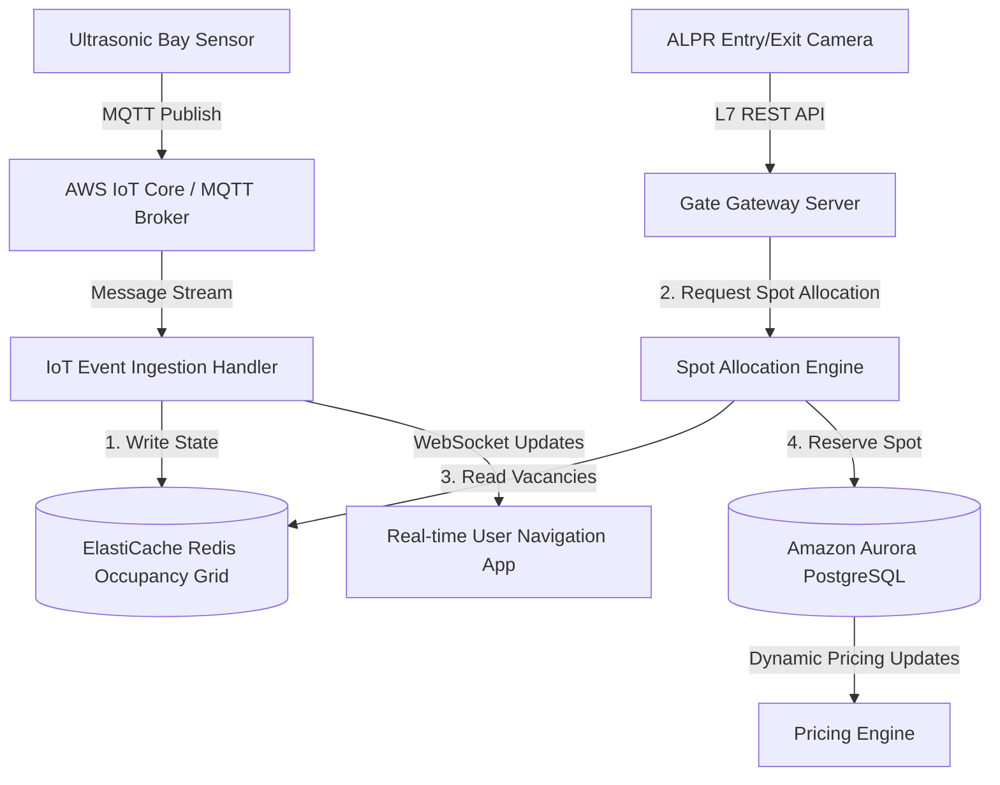
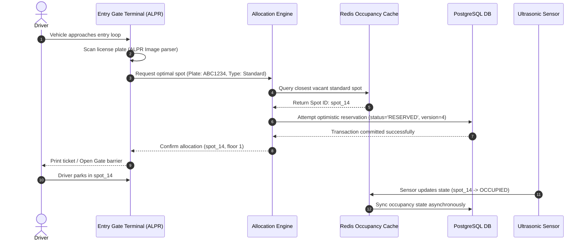
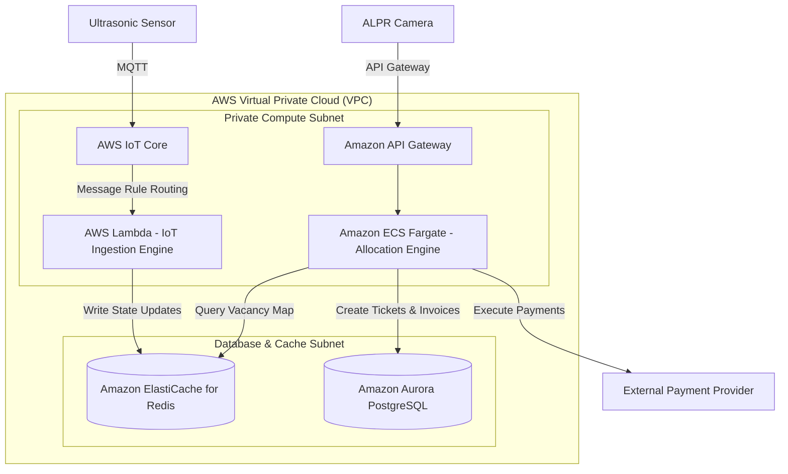

# Smart Parking Lot System Design

This document details the production-grade system design for a highly scalable, **IoT-Enabled Smart Parking Lot System**. Modeled for massive deployments (e.g., international airports, multi-story urban garages, or shopping mall clusters), this design details real-time slot occupancy tracking, high-throughput Automatic License Plate Recognition (ALPR) entry/exit gates, and lock-free concurrent spot allocation engines.

---

## 1. System Requirements

### Functional Requirements
* **Vehicle Entry & Exit Automation:** Automate vehicle entry and exit using ALPR cameras. Scan plates, generate virtual tickets, allocate spots, and control barrier gates.
* **Real-time Occupancy Tracking:** Process status events from ultrasonic IoT sensors mounted in each parking bay to maintain real-time status maps (Vacant, Occupied, Reserved).
* **Spot Allocation Engine:** Automatically calculate and assign the closest available parking slot matching the vehicle's classification (Standard, EV, Oversized, Disabled).
* **Payment Integration:** Support automated payments via RFID/FastTag scan, mobile app scan, or physical ticketing kiosks at exit points.
* **Dynamic Pricing:** Automatically scale hourly parking rates based on real-time occupancy levels (e.g., rate increases when the lot is > 90% full).

### Non-Functional Requirements
* **Ultra-Low Latency Gate Ingestion:** Gate ALPR verification and barrier gate trigger operations must complete in $< 200\text{ms}$ to prevent entry tailbacks.
* **Lock-Free Concurrency Control:** Guarantee zero double-allocations (two cars assigned to the same spot) during peak entry hours.
* **IoT Event Scale Handling:** Ingest and process status payloads from 50,000+ individual sensors concurrently.
* **Resilient Edge Local Mode:** Gates must function in offline mode (using edge caches and local relays) if connections to the cloud metadata database drop.

---

## 2. Capacity & Scale Estimation

### Assumptions
* **Total Parking Spots Managed:** $50,000 \text{ spots}$
* **Average Daily Vehicle Turns:** $5 \text{ turns/spot/day}$ (Total daily volume = $250,000 \text{ parking sessions/day}$)
* **Peak Entry Rate (Rush Hour):** 10% of total daily traffic enters within a 1-hour window.
* **IoT Sensor Update Frequency:** Sensors publish status updates immediately upon state change (average: 1 state transition every 5 minutes).

### Write/Ingress QPS Calculations
* **Peak Gate Entry Volume:**
  $$250,000 \text{ sessions/day} \times 10\% = 25,000 \text{ sessions/hour}$$
  $$\frac{25,000 \text{ sessions}}{3,600 \text{ seconds}} \approx \mathbf{7 \text{ entries/sec (peak: 30 QPS)}}$$
* **IoT Ingestion Message Rate:**
  Assuming 50,000 sensors publishing state updates once every 300 seconds on average, plus a keep-alive ping every 60 seconds:
  $$\text{Ping Rate} = \frac{50,000 \text{ pings}}{60 \text{ seconds}} \approx 833 \text{ messages/sec}$$
  $$\text{State Transitions} = \frac{50,000 \text{ events}}{300 \text{ seconds}} \approx 167 \text{ messages/sec}$$
  $$\text{Total Ingestion Rate} = 833 + 167 = \mathbf{1,000 \text{ messages/sec}}$$

### Bandwidth Sizing
* **Average Sensor Payload:** $128 \text{ bytes}$
* **Ingress Data Stream Bandwidth:**
  $$1,000 \text{ messages/sec} \times 128 \text{ bytes} = 128,000 \text{ bytes/s} \approx \mathbf{128 \text{ KB/s}}$$
  This is extremely light and scales efficiently using lightweight MQTT connection brokers.

---

## 3. High-Level Architecture

The system decouples the **IoT Sensor Ingestion Plane** (handling millions of sensor state updates) from the **Transaction Gateway Plane** (handling entry validation, billing, and barrier control).


### System Architecture Flowchart


---

## 4. Component-Level Design

### A. Lock-Free Spot Allocation & Conflict Resolution
When multiple vehicles arrive at entry gates simultaneously, a race condition can occur where two threads try to reserve the same closest spot. 

We solve this using **Optimistic Concurrency Control (OCC)** in the PostgreSQL metadata layer combined with a Redis-based reservation cache:

```
               [ Concurrent Allocations Requests (Gate 1 & 2) ]
                                      │
                                      ▼
                        ┌───────────────────────────┐
                        │  Redis Distributed Lock   │
                        │    SET lock:spot NX EX 1  │
                        └───────────────────────────┘
                                      │
                                      ▼
                    ┌───────────────────────────────────┐
                    │ DB Optimistic Concurrency Check   │
                    │   UPDATE spots SET status='RESERVED',│
                    │   version=version+1               │
                    │   WHERE id=102 AND version=current_v │
                    └───────────────────────────────────┘
                                 /         \\
                                /           \\
                    [Success (1 Row)]     [Conflict (0 Rows)]
                              /                 \\
                             ▼                   ▼
                      [Open Gate]         [Retry Loop: fetch next spot]
```

---

## 5. Database Schema & Namespace Strategy

### 1. `spots` Master Registry (PostgreSQL)
```sql
CREATE TABLE parking_spots (
    spot_id        UUID PRIMARY KEY,
    floor_number   INT NOT NULL,
    zone_label     VARCHAR(10) NOT NULL, -- e.g., 'A', 'B'
    spot_type      VARCHAR(20) NOT NULL, -- 'EV', 'Disabled', 'Standard'
    status         VARCHAR(20) NOT NULL DEFAULT 'VACANT', -- 'VACANT', 'OCCUPIED', 'RESERVED'
    version        INT NOT NULL DEFAULT 1, -- Version tag for optimistic locking
    x_coordinate   DOUBLE PRECISION NOT NULL, -- Map coordinates for distance routing
    y_coordinate   DOUBLE PRECISION NOT NULL
);
```

### 2. `tickets` Booking Log (PostgreSQL)
```sql
CREATE TABLE parking_tickets (
    ticket_id      UUID PRIMARY KEY,
    license_plate  VARCHAR(20) NOT NULL,
    spot_id        UUID REFERENCES parking_spots(spot_id),
    entry_time     TIMESTAMP WITH TIME ZONE DEFAULT CURRENT_TIMESTAMP,
    exit_time      TIMESTAMP WITH TIME ZONE,
    total_fare     NUMERIC(10, 2),
    status         VARCHAR(20) NOT NULL DEFAULT 'ACTIVE' -- 'ACTIVE', 'PAID', 'EXITED'
);
```

---

## 6. API Design & Payloads

### 1. Register Vehicle Entry
* **Endpoint:** `POST /api/v1/gate/entry`
* **Payload:**
```json
{
  "gate_id": "gate_north_01",
  "license_plate": "ABC1234",
  "vehicle_type": "EV",
  "timestamp": 1784643600
}
```
* **Response:**
```json
{
  "status": "success",
  "ticket_id": "550e8400-e29b-41d4-a716-446655440000",
  "allocated_spot": {
    "spot_id": "9b1deb4d-3b7d-4bad-9bdd-2b0d7b3dcb6d",
    "floor": 2,
    "zone": "A",
    "spot_number": "14"
  }
}
```

---

## 7. End-to-End Workflow Sequence



---

## 8. Scalability & Resilience Strategies
* **Edge Gateway Cache:** Gate terminals run local edge instances with an embedded sqlite layer. If connection to cloud DB drops, gates fall back to edge logging and open using local ALPR registers.
* **Redis Spatial Indexing:** Active spots are stored as geohashes in Redis to execute super-fast radial lookups (e.g. finding the closest empty EV spot within 50 meters of the active entrance).

---

## 9. Disaster Recovery & Multi-Region Failover Strategy
* **Metadata Master-Slave Clusters:** Run active-passive Aurora PostgreSQL database clusters across multiple AWS availability zones.
* **Ingress Failover:** Configure Route 53 health check targets on local edge terminal links. If cloud endpoints are unreachable, traffic falls back to edge terminal cache pools.

---

## 10. AWS Cloud-Native Implementation


### AWS Cloud-Native Architecture Flowchart



### AWS Service Mapping & Rationale

| Generic Component | AWS Service | Design Details & Rationale |
| :--- | :--- | :--- |
| **IoT Ingestion** | **AWS IoT Core** | Managed MQTT broker. Establishes lightweight persistent TCP sessions with 50,000+ bay sensors. |
| **Event Processor** | **AWS Lambda** | Asynchronously processes incoming sensor status updates and writes state metrics directly to Redis. |
| **Allocation Host** | **Amazon ECS Fargate** | Deploys the containerized REST API endpoints for gate ALPR requests. |
| **Real-time Map** | **Amazon ElastiCache for Redis** | Stores active slot status maps and executes fast geo-spatial searches. |
| **Durable Ledger** | **Amazon Aurora PostgreSQL** | Relational SQL schema tracking tickets, pricing models, and payments. |

---

## 11. Technology Justification: Why We Use

### A. AWS IoT Core (MQTT Broker) for Sensor Streams
* **Why We Use It:** WebSockets and HTTP headers are heavy and inefficient for battery-powered IoT sensors. MQTT is a lightweight publish/subscribe protocol with tiny overhead, allowing thousands of sensors to send updates over a single port.

### B. PostgreSQL Optimistic Locking over Pessimistic Rows Locking
* **Why We Use It:** Under high peak volumes, locking database rows (`SELECT FOR UPDATE`) causes thread pool depletion and latency spikes. Optimistic locking verifies version matches during updates without holding locks, keeping p99 gate latency under 5ms.
