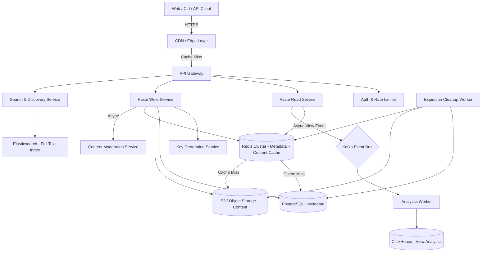
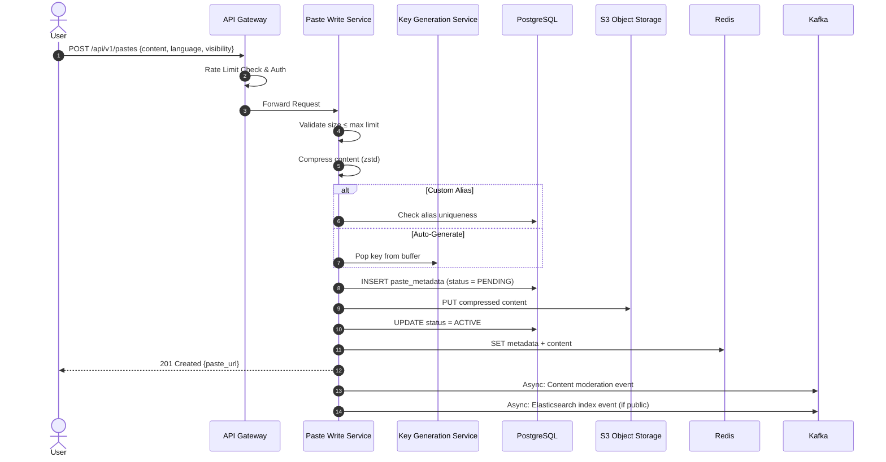
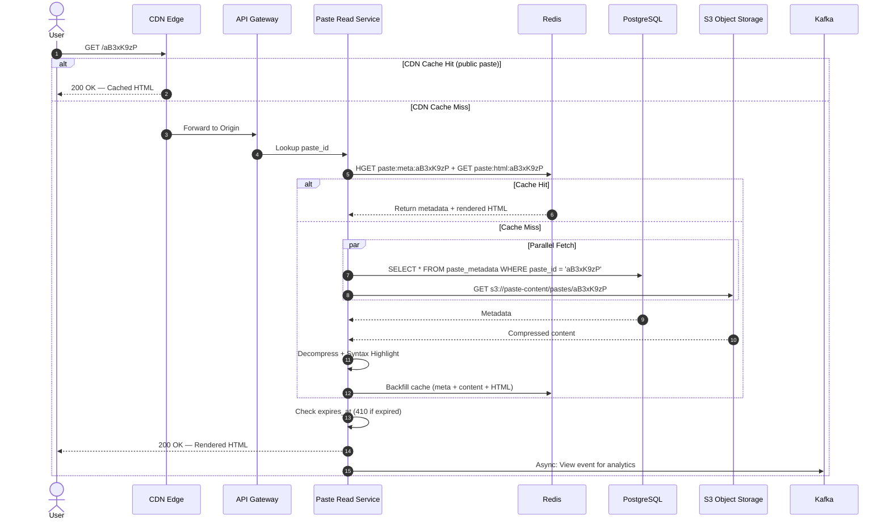
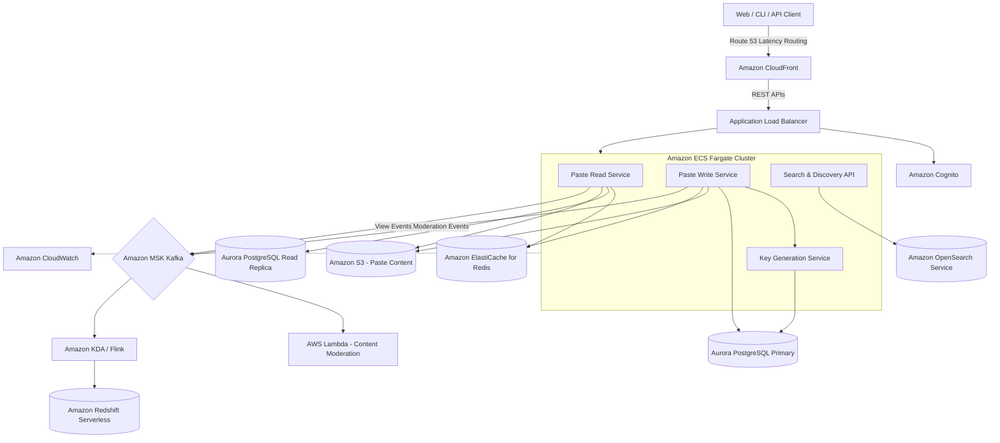

# Pastebin System Design

This document outlines the production-grade system design for a high-scale text sharing and collaboration platform like **Pastebin** (or GitHub Gist, Hastebin). The system must allow users to create, store, retrieve, and share text snippets with syntax highlighting, expiration policies, and access controls — handling millions of pastes and billions of read requests.

---

## 1. System Requirements

### Functional Requirements
* **Paste Creation:**
  * Create a text paste with an auto-generated unique URL (e.g., `https://paste.io/aB3xK9`).
  * Support custom aliases (e.g., `https://paste.io/my-config`).
  * Set syntax highlighting language (Python, JSON, SQL, etc.).
  * Set visibility: Public, Unlisted (accessible via link only), or Private (authenticated access).
  * Set expiration: Never, 10 minutes, 1 hour, 1 day, 1 week, 1 month, 6 months.
  * Set maximum paste size limit (e.g., 512 KB for free users, 10 MB for pro users).
* **Paste Retrieval:**
  * Retrieve raw text content via URL with sub-100ms latency.
  * Render pastes with server-side syntax highlighting.
  * Support "Raw" mode (plain text response for `curl` / API consumers).
* **Paste Management:**
  * Authenticated users can list, edit, delete, and fork (clone) their pastes.
  * View paste metadata: creation time, expiry, view count, language, size.
* **Social & Discovery:**
  * Browse trending / recently created public pastes.
  * Search public pastes by content keywords or title.
* **API Access:**
  * Full REST API for programmatic paste creation and retrieval.
  * CLI tool support (`cat file.py | curl -X POST paste.io`).

### Non-Functional Requirements
* **Low Latency:** Paste retrieval must complete in $< 50\text{ms}$ (P99) for cached pastes.
* **High Availability:** The read path must have $\geq 99.99\%$ uptime.
* **High Read Throughput:** The system is heavily read-biased — a single viral paste can receive millions of views.
* **Durability:** Paste content must never be lost during the retention period. Data at rest must be encrypted.
* **Storage Efficiency:** Text content must be compressed to minimize storage costs — pastes are highly compressible text.
* **Content Safety:** Automated scanning for malware, credentials, and policy-violating content.

---

## 2. Capacity & Scale Estimation

### Assumptions
* **New Pastes per Day:** $500,000$
* **Read-to-Write Ratio:** $50:1$ (50 reads per paste creation)
* **Daily Reads:** $25 \text{ Million}$
* **Average Paste Size:** $10 \text{ KB}$ (raw text, before compression)
* **Average Compressed Size:** $3 \text{ KB}$ (gzip achieves ~70% compression on text)
* **Paste Retention:** 80% of pastes have an expiry ($\leq 6$ months), 20% are permanent.
* **Paste Key Length:** $8$ characters, Base62

### Throughput (QPS)

* **Write QPS (Paste Creation):**
  $$\frac{500,000 \text{ pastes}}{86,400 \text{ seconds}} \approx 6 \text{ writes/sec}$$
  * **Peak Write QPS (5x):** $\approx 30 \text{ writes/sec}$

* **Read QPS (Paste Retrieval):**
  $$\frac{25,000,000 \text{ reads}}{86,400 \text{ seconds}} \approx 290 \text{ reads/sec}$$
  * **Peak Read QPS (10x — viral paste):** $\approx 2,900 \text{ reads/sec}$

### Storage Estimation

* **Daily New Storage (compressed):**
  $$500,000 \text{ pastes} \times 3 \text{ KB} = 1.5 \text{ GB/day}$$

* **Annual Storage:**
  $$1.5 \text{ GB/day} \times 365 = 548 \text{ GB/year}$$

* **5-Year Total (with 80% expiring within 6 months):**
  * Active permanent pastes: $500,000 \times 0.2 \times 365 \times 5 = 182.5\text{M pastes} \times 3\text{ KB} \approx 548 \text{ GB}$
  * At any given time, ~6 months of expiring pastes exist: $500,000 \times 0.8 \times 180 \times 3\text{ KB} \approx 216 \text{ GB}$
  * **Total Active Storage: $\approx 764 \text{ GB}$** — comfortably fits on a single database shard.

### Key Space Analysis (Base62, 8 characters)

$$62^8 = 218,340,105,584,896 \approx 218 \text{ Trillion unique codes}$$

At 500K pastes/day, the key space lasts:
$$\frac{218 \times 10^{12}}{365 \times 500,000} \approx 1.2 \text{ Million years}$$

### Bandwidth Estimation

* **Incoming (Writes):**
  $$6 \text{ writes/sec} \times 10 \text{ KB} = 60 \text{ KB/s}$$ (negligible)

* **Outgoing (Reads):**
  $$290 \text{ reads/sec} \times 10 \text{ KB} = 2.9 \text{ MB/s}$$
  * **Peak (viral):** $\approx 29 \text{ MB/s}$ — easily handled with CDN offloading.

### Cache Estimation

Following the 80/20 rule — 20% of pastes drive 80% of traffic:
$$0.2 \times 25,000,000 \text{ daily reads} \times 10 \text{ KB} \approx 50 \text{ GB}$$

A Redis cluster with 2–3 nodes can serve this hot set entirely from memory.

---

## 3. High-Level Architecture

The architecture follows a **read-optimized, object-storage-backed** design. Paste content (the text body) is stored in object storage (S3), while metadata (paste ID, user, expiry, language) lives in a relational database. This separation is critical — it prevents large text blobs from bloating the database and allows object storage to handle content delivery with CDN integration.


### System Architecture Flowchart


### Core Components

1. **CDN / Edge Layer:** Caches rendered paste HTML and raw content at the edge. For viral pastes (shared on Reddit, Hacker News), the CDN absorbs 90%+ of traffic without touching the origin. Uses `Cache-Control: public, max-age=300` for public pastes.
2. **API Gateway:** Routes requests, enforces rate limits (Token Bucket per IP/API key), validates JWT tokens, and handles SSL termination. Limits paste size at the gateway layer (rejects payloads > max allowed size).
3. **Paste Read Service (Hot Path):** The latency-critical path. Checks Redis for cached content first, then falls back to PostgreSQL (metadata) + S3 (content) on cache miss. Applies syntax highlighting server-side using a library like Pygments or highlight.js.
4. **Paste Write Service:** Accepts new paste content, compresses it (gzip/zstd), generates or validates the paste key, stores compressed content in S3, writes metadata to PostgreSQL, and warms the Redis cache.
5. **Key Generation Service (KGS):** Pre-generates unique 8-character Base62 paste keys offline and distributes them in batches to write servers — identical to the URL Shortener KGS pattern (zero-collision guarantee).
6. **Content Moderation Service:** Asynchronous scanner that checks new pastes for malware signatures, leaked credentials (API keys, passwords), and policy violations. Runs post-creation to avoid blocking the write path.
7. **Search & Discovery Service:** Indexes public paste titles and content snippets in Elasticsearch for full-text search and trending paste discovery.
8. **Expiration Cleanup Worker:** A scheduled cron job that scans for expired pastes and deletes content from S3, metadata from PostgreSQL, and keys from Redis.

---

## 4. Key Workflows & Engineering Details

### A. Content Storage Strategy — Metadata vs. Content Separation

The most important architectural decision in Pastebin is **separating metadata from content**:

| Layer | What It Stores | Storage System | Why |
| :--- | :--- | :--- | :--- |
| **Metadata** | `paste_id`, `user_id`, `title`, `language`, `visibility`, `created_at`, `expires_at`, `size_bytes`, `view_count` | **PostgreSQL** | Relational queries (list user's pastes, filter by expiry, sort by date). Small rows (~200 bytes). |
| **Content** | The actual paste text body (compressed) | **S3 / Object Storage** | Large blobs (up to 10 MB). S3 provides 11 nines durability, unlimited storage, and native CDN integration via CloudFront. |
| **Hot Cache** | Recent/popular metadata + content | **Redis** | Sub-millisecond reads for frequently accessed pastes. |

#### Why Not Store Content in PostgreSQL?
* **TOAST Overhead:** PostgreSQL stores large text in out-of-line TOAST tables. Reading a 10 KB paste requires an extra I/O hop. At 290 reads/sec, this adds unnecessary disk pressure.
* **Backup Bloat:** Database backups grow proportionally to content size. Separating content to S3 keeps the PostgreSQL database lean (~200 bytes/row × 182.5M rows ≈ 36 GB for metadata).
* **CDN Integration:** S3 objects can be served directly via CloudFront with signed URLs, bypassing the application layer entirely for raw content requests.

#### Content Compression

Text pastes are highly compressible. We compress before storing to S3:

| Compression | Ratio (10 KB paste) | Speed | Use Case |
| :--- | :--- | :--- | :--- |
| **gzip (level 6)** | ~70% reduction → 3 KB | Fast | Default — good balance of size and speed |
| **Zstandard (zstd level 3)** | ~75% reduction → 2.5 KB | Faster than gzip | Better for large pastes; dictionary mode shines on similar content |
| **None** | 0% | Instant | Binary pastes or already-compressed content |

```python
import zstandard as zstd

compressor = zstd.ZstdCompressor(level=3)
compressed = compressor.compress(paste_content.encode('utf-8'))

# Store compressed bytes to S3
s3.put_object(
    Bucket='paste-content',
    Key=f'pastes/{paste_id}',
    Body=compressed,
    ContentEncoding='zstd',
    ContentType='text/plain'
)
```

---

### B. Paste Creation Flow

```
Client → API Gateway → Paste Write Service
                            │
                ┌───────────┼───────────────┐
                ▼           ▼               ▼
           Validate    Get Key from    Compress Content
           Input       KGS Buffer     (gzip/zstd)
                            │               │
                            ▼               ▼
                    ┌───────────────────────────────┐
                    │   Transaction:                │
                    │   1. INSERT metadata → PG     │
                    │   2. PUT content → S3         │
                    │   3. SET cache → Redis        │
                    └───────────────────────────────┘
                            │
                            ▼
                    Async: Content Moderation
                    Async: Index in Elasticsearch (if public)
```

**Steps:**
1. **Validate Input:** Check paste size ($\leq$ max limit), validate language parameter, sanitize title.
2. **Allocate Key:** Pop a pre-generated key from the in-memory KGS buffer.
3. **Compress Content:** Apply zstd compression on the raw text.
4. **Store Metadata:** INSERT into PostgreSQL with `paste_id`, `user_id`, `language`, `visibility`, `expires_at`, and `size_bytes`.
5. **Store Content:** PUT compressed bytes to S3 at key `pastes/{paste_id}`.
6. **Warm Cache:** SET both metadata and compressed content in Redis with TTL matching the paste expiry.
7. **Async Tasks:** Queue content moderation check and Elasticsearch indexing (for public pastes) via Kafka.

**Atomicity Concern:** If the S3 PUT succeeds but the PostgreSQL INSERT fails (or vice versa), we have an orphaned object. To handle this:
* Write metadata first with `status = 'PENDING'`.
* Upload to S3.
* Update metadata to `status = 'ACTIVE'` on S3 success.
* A cleanup job periodically deletes `PENDING` records older than 5 minutes and their corresponding S3 objects.

---

### C. Paste Retrieval (Hot Path Optimization)

The read path must serve pastes in $< 50\text{ms}$ at P99, even during traffic spikes from viral pastes.


#### Multi-Layer Cache Strategy:

```
GET /aB3xK9 HTTP/1.1

  ┌─────────────┐     ┌──────────────────┐     ┌────────────────────┐
  │  CDN Edge   │────>│  Redis Cluster   │────>│  PostgreSQL + S3   │
  │  (HTML/Raw) │     │  (Meta + Content)│     │  (Source of Truth) │
  │             │     │                  │     │                    │
  │  < 5ms      │     │  < 3ms           │     │  < 50ms            │
  └──────┬──────┘     └───────┬──────────┘     └─────────┬──────────┘
         │                    │                          │
         └────────────────────┴──────────────────────────┘
                              │
                    200 OK — Rendered HTML / Raw Text
```

1. **Layer 1 — CDN:** Caches rendered HTML (with syntax highlighting) and raw text responses at edge PoPs. Public pastes use `Cache-Control: public, max-age=300`. Unlisted pastes use `Cache-Control: private` (not CDN-cached).
2. **Layer 2 — Redis:** Stores both metadata (as a hash) and compressed content (as a blob) with a TTL aligned to the paste's expiry:
   ```
   HSET paste:aB3xK9 lang "python" title "Config" visibility "public" size 4523
   SET paste:content:aB3xK9 <compressed_bytes> EX 86400
   ```
3. **Layer 3 — PostgreSQL + S3:** On cache miss, fetch metadata from PostgreSQL and content from S3 in parallel (`Promise.all` / goroutine fan-out). Backfill Redis cache after retrieval.

#### Syntax Highlighting Strategy:

Two approaches — we choose **server-side pre-rendering**:

| Approach | Pros | Cons |
| :--- | :--- | :--- |
| **Client-Side (highlight.js in browser)** | No server CPU cost; flexible language support. | Large JS bundle; slow on mobile; no highlighting for `curl` users. |
| **Server-Side (Pygments / Tree-sitter)** | Cacheable HTML output; works for all clients; consistent rendering. | CPU cost per cache miss; must invalidate on theme changes. |

* On first access (cache miss), the Read Service renders highlighted HTML and caches the result in Redis alongside the raw content.
* Subsequent requests serve pre-rendered HTML directly from cache.
* Raw mode (`GET /aB3xK9/raw`) bypasses highlighting entirely.

---

### D. Paste Expiration & Cleanup

Pastes with expiration dates must be reliably purged after their TTL elapses.

#### Two-Pronged Expiration Strategy:

1. **Lazy Expiration (On-Read):**
   * When a paste is requested, the Read Service checks `expires_at` before serving:
     ```python
     if paste.expires_at and paste.expires_at < datetime.utcnow():
         return Response(status=410, body="This paste has expired.")
     ```
   * This ensures expired pastes are never served, even if the cleanup job hasn't run yet.

2. **Active Cleanup (Scheduled Job):**
   * A cron job runs every 15 minutes, scanning PostgreSQL for expired pastes:
     ```sql
     SELECT paste_id FROM paste_metadata
     WHERE expires_at < NOW() AND is_active = TRUE
     LIMIT 10000;
     ```
   * For each batch:
     1. Delete content from S3: `DELETE s3://paste-content/pastes/{paste_id}`
     2. Delete from Redis: `DEL paste:aB3xK9` and `DEL paste:content:aB3xK9`
     3. Soft-delete in PostgreSQL: `UPDATE paste_metadata SET is_active = FALSE`
     4. Optionally recycle the paste key back to the KGS `unused_keys` pool.

#### Why Not Use S3 Lifecycle Rules Alone?
S3 lifecycle rules can auto-delete objects after a fixed number of days, but pastes have variable expiry (10 min to never). We need per-object TTL logic, which requires application-level management.

---

### E. Access Control & Visibility

| Visibility | Behavior | CDN Caching | Authentication |
| :--- | :--- | :--- | :--- |
| **Public** | Listed in search, browsable by anyone. | ✅ Cached at edge | None |
| **Unlisted** | Accessible only via direct URL. Not indexed. | ❌ Not CDN-cached (`Cache-Control: private`) | None (security through obscurity via random URL) |
| **Private** | Only the owner can view. | ❌ Not cached | ✅ JWT required; ownership validated |

* **Private Paste Access:** The Read Service validates the JWT token and confirms `paste.user_id == token.user_id` before serving content.
* **S3 Signed URLs (for large private pastes):** For pastes > 1 MB, the Read Service generates a pre-signed S3 URL (valid for 5 minutes) and returns it as a redirect, offloading content delivery to S3 directly.

---

### F. Rate Limiting & Abuse Prevention

| User Type | Create Limit | Read Limit | Max Paste Size |
| :--- | :--- | :--- | :--- |
| **Anonymous** | 10 pastes/hour/IP | 60 reads/min/IP | 64 KB |
| **Free Registered** | 50 pastes/hour | 300 reads/min | 512 KB |
| **Pro** | 500 pastes/hour | Unlimited | 10 MB |

Rate limiting is enforced at the API Gateway using Redis-backed Token Bucket counters:
```
INCR rate:create:<ip_or_user_id>
EXPIRE rate:create:<ip_or_user_id> 3600
```

---

## 5. Database Schema Design

### 1. `paste_metadata` Table (PostgreSQL — Metadata Store)

```sql
CREATE TABLE paste_metadata (
    paste_id     VARCHAR(10) PRIMARY KEY,
    user_id      UUID,                                    -- NULL for anonymous pastes
    title        VARCHAR(255),
    language     VARCHAR(50) DEFAULT 'plaintext',
    visibility   VARCHAR(10) NOT NULL DEFAULT 'unlisted', -- public, unlisted, private
    size_bytes   INTEGER NOT NULL,
    is_active    BOOLEAN DEFAULT TRUE,
    view_count   BIGINT DEFAULT 0,
    created_at   TIMESTAMP WITH TIME ZONE DEFAULT CURRENT_TIMESTAMP,
    expires_at   TIMESTAMP WITH TIME ZONE,                -- NULL = never expires
    s3_key       VARCHAR(255) NOT NULL                    -- S3 object key for content
);

-- Index for user's paste listing (sorted by recency)
CREATE INDEX idx_paste_user ON paste_metadata (user_id, created_at DESC)
    WHERE is_active = TRUE;

-- Index for expiration cleanup job
CREATE INDEX idx_paste_expiry ON paste_metadata (expires_at)
    WHERE expires_at IS NOT NULL AND is_active = TRUE;

-- Index for trending / recent public pastes
CREATE INDEX idx_paste_public ON paste_metadata (created_at DESC)
    WHERE visibility = 'public' AND is_active = TRUE;
```

### 2. `users` Table (PostgreSQL)

```sql
CREATE TABLE users (
    user_id     UUID PRIMARY KEY DEFAULT gen_random_uuid(),
    username    VARCHAR(50) UNIQUE NOT NULL,
    email       VARCHAR(100) UNIQUE NOT NULL,
    api_key     VARCHAR(64) UNIQUE NOT NULL,
    tier        VARCHAR(20) DEFAULT 'free',               -- free, pro
    created_at  TIMESTAMP WITH TIME ZONE DEFAULT CURRENT_TIMESTAMP
);
```

### 3. `unused_keys` & `used_keys` Tables (Key Generation Service)

```sql
CREATE TABLE unused_keys (
    paste_key VARCHAR(10) PRIMARY KEY
);

CREATE TABLE used_keys (
    paste_key    VARCHAR(10) PRIMARY KEY,
    allocated_at TIMESTAMP WITH TIME ZONE DEFAULT CURRENT_TIMESTAMP
);
```

### 4. `paste_views` Table (ClickHouse — View Analytics)

```sql
CREATE TABLE paste_views (
    paste_id    String,
    viewed_at   DateTime,
    country     LowCardinality(String),
    device_type LowCardinality(String),
    browser     LowCardinality(String),
    referrer    String,
    ip_hash     String
) ENGINE = MergeTree()
PARTITION BY toYYYYMM(viewed_at)
ORDER BY (paste_id, viewed_at);
```

### 5. Redis Cache Schema

```
# Metadata hash
HSET paste:meta:<paste_id>  lang "python"  title "Config"  visibility "public"
                             size "4523"  expires_at "2026-08-21T00:00:00Z"
                             s3_key "pastes/aB3xK9"

# Compressed content blob
SET paste:content:<paste_id> <compressed_bytes>  EX <ttl_seconds>

# Pre-rendered syntax-highlighted HTML
SET paste:html:<paste_id> <highlighted_html>  EX <ttl_seconds>

# Rate limit counter
SET rate:create:<ip>  <count>  EX 3600
```

### 6. S3 Object Storage Layout

```
s3://paste-content/
├── pastes/
│   ├── aB3xK9          # Compressed paste content (zstd)
│   ├── Zm7pQ2
│   └── kL9wR4
```

* **Storage Class:** S3 Standard for active pastes; S3 Intelligent-Tiering for pastes older than 30 days.
* **Encryption:** AES-256 server-side encryption (SSE-S3) enabled by default.

---

## 6. API Design & Payloads

### 1. Create Paste
* **Endpoint:** `POST /api/v1/pastes`
* **Headers:** `Authorization: Bearer <api_key>` (optional for anonymous)
* **Payload:**
```json
{
  "content": "def hello():\n    print('Hello, World!')\n\nhello()",
  "title": "Python Hello World",
  "language": "python",
  "visibility": "public",
  "expires_in": "1d"
}
```
* **Response (201 Created):**
```json
{
  "paste_id": "aB3xK9zP",
  "url": "https://paste.io/aB3xK9zP",
  "raw_url": "https://paste.io/aB3xK9zP/raw",
  "title": "Python Hello World",
  "language": "python",
  "visibility": "public",
  "size_bytes": 58,
  "created_at": "2026-07-21T06:30:00Z",
  "expires_at": "2026-07-22T06:30:00Z"
}
```

### 2. Get Paste (Rendered HTML)
* **Endpoint:** `GET /{paste_id}`
* **Response (200 OK):**
```
Content-Type: text/html; charset=utf-8
Cache-Control: public, max-age=300

<html>
  <body>
    <pre><code class="language-python">
      <span class="keyword">def</span> <span class="function">hello</span>():
        <span class="builtin">print</span>(<span class="string">'Hello, World!'</span>)
    </code></pre>
  </body>
</html>
```

### 3. Get Raw Paste
* **Endpoint:** `GET /{paste_id}/raw`
* **Response (200 OK):**
```
Content-Type: text/plain; charset=utf-8

def hello():
    print('Hello, World!')

hello()
```

### 4. Get Paste Metadata
* **Endpoint:** `GET /api/v1/pastes/{paste_id}/meta`
* **Response:**
```json
{
  "paste_id": "aB3xK9zP",
  "title": "Python Hello World",
  "language": "python",
  "visibility": "public",
  "size_bytes": 58,
  "view_count": 12847,
  "created_at": "2026-07-21T06:30:00Z",
  "expires_at": "2026-07-22T06:30:00Z"
}
```

### 5. List User's Pastes
* **Endpoint:** `GET /api/v1/pastes`
* **Query Params:** `page=1&limit=20&sort=created_at:desc`
* **Response:**
```json
{
  "pastes": [
    {
      "paste_id": "aB3xK9zP",
      "title": "Python Hello World",
      "language": "python",
      "visibility": "public",
      "size_bytes": 58,
      "view_count": 12847,
      "created_at": "2026-07-21T06:30:00Z",
      "expires_at": "2026-07-22T06:30:00Z"
    }
  ],
  "pagination": { "page": 1, "limit": 20, "total": 42 }
}
```

### 6. Delete Paste
* **Endpoint:** `DELETE /api/v1/pastes/{paste_id}`
* **Response (204 No Content)**

### 7. Fork Paste
* **Endpoint:** `POST /api/v1/pastes/{paste_id}/fork`
* **Response (201 Created):** Returns a new paste with the same content but a new `paste_id` owned by the authenticated user.

---

## 7. End-to-End Workflow Sequence

### Paste Creation Flow


### Paste Retrieval Flow


---

## 8. Scalability & Resilience Strategies

### Read Path Optimization
* **CDN Offloading:** Public pastes with `Cache-Control: public, max-age=300` are served from CloudFront edge locations. During viral events (a paste linked on Hacker News), the CDN absorbs 90%+ of traffic.
* **Redis Cluster:** Three-layer cache (metadata hash, compressed content blob, pre-rendered HTML) eliminates S3 GET latency for hot pastes. Cluster mode provides horizontal scaling via hash-slot sharding.
* **S3 as Content Origin:** S3 handles virtually unlimited concurrent reads without provisioning — no need to scale read infrastructure for content delivery.

### Write Path Optimization
* **KGS Batch Allocation:** Identical to the URL Shortener pattern — app servers hold 1,000 pre-generated keys in memory, minimizing KGS round-trips.
* **Async Moderation:** Content scanning runs post-creation via Kafka consumers, keeping the write path under 100ms.

### Fault Tolerance
* **S3 Durability (99.999999999%):** Paste content in S3 has 11 nines of durability — effectively indestructible.
* **Cache Stampede Prevention:** The **singleflight** pattern ensures only one goroutine/thread fetches a cold paste from S3 + PostgreSQL. All concurrent requests for the same paste wait and share the result.
* **Circuit Breakers:** If S3 is temporarily unreachable (rare), the Read Service returns cached content or a graceful error — never a 500.
* **Graceful KGS Fallback:** If the KGS service is unreachable, the Write Service falls back to UUID-based key generation (`uuid4()` → Base62 truncation) until KGS recovers.

### Content Moderation
* **Malware Scanning:** Uploaded pastes are scanned by ClamAV or a custom ML model for known malware patterns, encoded payloads, and exploit code.
* **Credential Detection:** Regex + entropy-based scanning detects accidentally pasted API keys, passwords, and SSH private keys. Flagged pastes are quarantined pending review.

---

## 9. Disaster Recovery & Multi-Region Strategy

### A. Global Traffic Routing
* **Latency-Based DNS Routing:** AWS Route 53 routes users to the nearest healthy region based on measured latency. Health checks monitor `/health` endpoints every 10 seconds.
* **CDN Edge Caching:** CloudFront PoPs in 40+ locations serve cached pastes globally, providing sub-10ms responses regardless of origin region.

### B. Multi-Region Data Topology
1. **PostgreSQL (Metadata):**
   * **Active-Passive with Aurora Global Database:** Primary in `us-east-1`, async replica in `eu-west-1` with $< 1\text{s}$ replication lag. On primary failure, the replica is promoted in $< 1$ minute.
2. **S3 (Content):**
   * **Cross-Region Replication (CRR):** S3 objects are automatically replicated to a backup bucket in a secondary region. Ensures content availability even if an entire AWS region goes offline.
3. **Redis (Cache):**
   * **Independent Regional Clusters:** Each region has its own Redis cluster. Cache warms naturally from read traffic — no cross-region Redis replication needed.
4. **Kafka (Events):**
   * **MirrorMaker 2.0:** Replicates event topics across regions for unified analytics processing.

### C. Data Integrity
* **Idempotent Paste Creation:** The `paste_id` primary key prevents duplicate insertions during retry storms.
* **S3 Versioning:** Enabled for the content bucket to prevent accidental overwrites or deletions.
* **Cache Invalidation on Delete:** Deleting a paste purges Redis keys (`DEL paste:meta:*`, `DEL paste:content:*`, `DEL paste:html:*`) and triggers a CDN cache purge.

---

## 10. AWS Cloud-Native Implementation

### AWS Cloud-Native Architecture Diagram


### AWS Service Mapping & Design Choices

| Generic Component | AWS Service | Design Details & Rationale |
| :--- | :--- | :--- |
| **CDN / Edge Cache** | **Amazon CloudFront** | Caches rendered paste HTML and raw text at global edge PoPs. Origin Shield enabled to reduce origin fetches. Lambda@Edge can inject `Content-Security-Policy` headers for XSS protection. |
| **Load Balancer** | **Application Load Balancer (ALB)** | Routes `/api/*` to write/management services and `/{paste_id}` to the read service. ALB supports path-based routing and integrates with Cognito for authentication. |
| **Compute** | **Amazon ECS on AWS Fargate** | Stateless Go or Node.js containers for read, write, and KGS services. Fargate auto-scales based on request count. No EC2 fleet management required. |
| **Content Store** | **Amazon S3** | Stores compressed paste content with 99.999999999% durability. S3 Intelligent-Tiering auto-moves old pastes to infrequent-access storage. Cross-Region Replication ensures DR readiness. |
| **Metadata Database** | **Amazon Aurora PostgreSQL** | Stores paste metadata in a lean, indexed relational table. Aurora auto-scales storage up to 128 TB. Global Database provides cross-region failover in $< 1$ minute. |
| **Cache** | **Amazon ElastiCache for Redis (Cluster Mode)** | Three-tier cache: metadata hashes, compressed content blobs, and pre-rendered HTML. Multi-AZ replication provides high availability. |
| **Search Engine** | **Amazon OpenSearch Service** | Full-text search over public paste titles and content snippets. Supports autocomplete and fuzzy matching for paste discovery. |
| **Event Streaming** | **Amazon MSK (Managed Kafka)** | Buffers view events and moderation tasks. Partitioned by `paste_id` for ordered processing. 7-day retention enables event replay. |
| **Content Moderation** | **AWS Lambda** | Serverless functions triggered by MSK events. Run ClamAV scanning and credential detection on new pastes without provisioning dedicated servers. |
| **Analytics** | **Amazon Redshift Serverless** | Columnar OLAP warehouse for paste view analytics. Serverless auto-scaling eliminates capacity planning. Redshift Spectrum queries archived data in S3. |
| **Auth** | **Amazon Cognito** | User registration, login, and API key management. Integrates natively with ALB for request authentication. |
| **Monitoring** | **Amazon CloudWatch** | Tracks read latency (P50/P99), cache hit rates, S3 GET latency, and paste creation rates. Alarms trigger auto-scaling or PagerDuty alerts. |

---

## 11. Pastebin vs URL Shortener — Architectural Differences

Since Pastebin and URL Shortener are frequently compared in system design interviews, here's a concise comparison of their architectural trade-offs:

| Aspect | **URL Shortener** | **Pastebin** |
| :--- | :--- | :--- |
| **Primary Operation** | HTTP Redirect (301/302) | Content Retrieval (200 OK with body) |
| **Response Size** | ~0 bytes (redirect header only) | 1 KB – 10 MB (paste content) |
| **Content Storage** | URL string in DB (~200 bytes) | Large text blobs in Object Storage (S3) |
| **Write Complexity** | Simple — store a URL string | Complex — compress, upload to S3, index for search |
| **Read Latency Target** | $< 10\text{ms}$ (redirect is a header flip) | $< 50\text{ms}$ (must fetch and optionally render content) |
| **CDN Behavior** | Caches redirect response | Caches rendered HTML or raw text body |
| **Content Processing** | None | Syntax highlighting, compression, moderation |
| **Metadata vs Content** | Tightly coupled (URL is the content) | Separated (metadata in DB, content in S3) |
| **Search** | Not applicable | Full-text search over public pastes |

---

## 12. Technology Justification: Why We Use

### A. S3 / Object Storage (Content Store)
* **Why We Use It:** Paste content ranges from a few bytes to 10 MB. Storing large text blobs in PostgreSQL would bloat the database (TOAST overhead), slow backups, and limit CDN integration. S3 provides unlimited storage, 11 nines durability, and native CloudFront integration.
* **Key Features Utilized:**
  * **Intelligent-Tiering:** Automatically moves infrequently accessed pastes to cheaper storage classes.
  * **Cross-Region Replication:** Ensures content availability during regional outages.
  * **Pre-Signed URLs:** Offloads large private paste delivery directly to S3, bypassing the application layer.

### B. PostgreSQL (Metadata Store)
* **Why We Use It:** Metadata queries are relational in nature — "list my pastes sorted by date," "find all expired pastes," "count public pastes by language." PostgreSQL's indexing, partial indexes, and ACID guarantees are ideal for this workload.
* **Key Features Utilized:**
  * Partial indexes (`WHERE is_active = TRUE`) to keep index sizes minimal.
  * `SELECT ... FOR UPDATE SKIP LOCKED` for concurrent KGS batch allocation.
  * Aurora Global Database for cross-region disaster recovery.

### C. Redis (Multi-Purpose Cache)
* **Why We Use It:** The read path serves three distinct cache layers — metadata, compressed content, and pre-rendered HTML. Redis hash types and binary-safe strings support all three efficiently in sub-millisecond latency.
* **Key Features Utilized:**
  * **Hash Commands (`HSET`/`HGET`):** Store structured metadata with individual field access.
  * **Binary-Safe Strings:** Store compressed byte arrays (zstd output) directly.
  * **TTL (`EXPIRE`):** Automatically expire cache entries aligned with paste expiry.
  * **Cluster Mode:** Horizontal scaling via hash-slot sharding.

### D. Elasticsearch / OpenSearch (Search & Discovery)
* **Why We Use It:** Users need to search public pastes by title, content keywords, or programming language. PostgreSQL's `LIKE '%query%'` requires full table scans. Elasticsearch provides inverted index-based full-text search with fuzzy matching and autocomplete in sub-20ms.
* **Key Features Utilized:**
  * Inverted indexing for keyword searches across paste content snippets.
  * Language analyzers for syntax-aware tokenization.
  * `bool` filter queries combining text search with visibility/language filters.

### E. Kafka (Event Bus)
* **Why We Use It:** Content moderation and analytics processing must not block the critical read/write paths. Kafka decouples synchronous user-facing operations from asynchronous background tasks.
* **Key Features Utilized:**
  * **Durable Buffering:** If the moderation service is temporarily down, events wait in Kafka until it recovers.
  * **Multiple Consumer Groups:** View analytics consumers and content moderation consumers independently process the same event stream.
