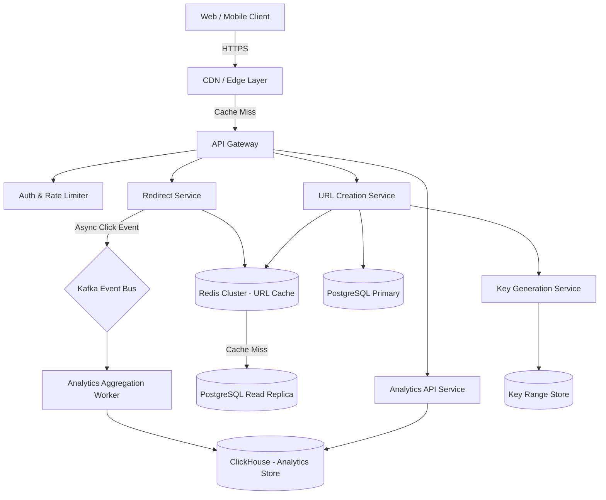
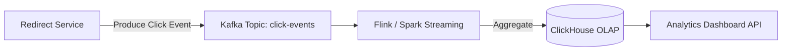
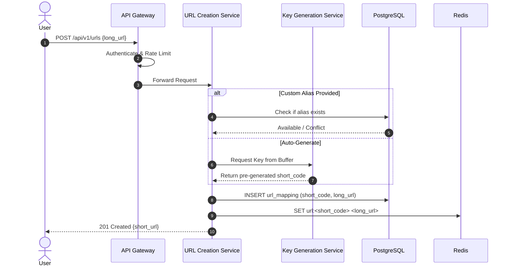
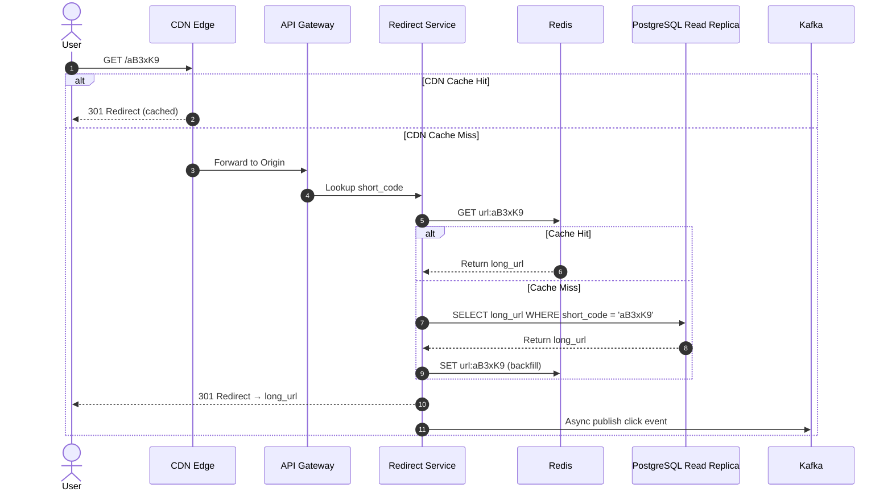
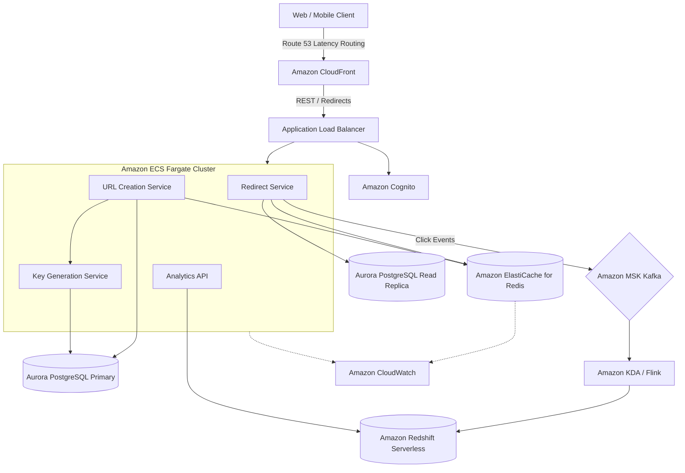

# URL Shortener System Design

This document outlines the production-grade system design for a high-scale URL shortening service like **Bitly** (or TinyURL). The system must generate unique, compact short URLs, redirect users with sub-50ms latency, handle billions of redirects daily, and provide real-time click analytics.

---

## 1. System Requirements

### Functional Requirements
* **URL Shortening:**
  * Generate a unique, short alias (e.g., `https://short.ly/aB3xK9`) for any given long URL.
  * Support custom aliases (vanity URLs) like `https://short.ly/my-brand`.
  * Set optional expiration dates (TTL) for short URLs.
* **URL Redirection:**
  * Redirect users from the short URL to the original long URL with minimal latency.
  * Support HTTP 301 (permanent) and 302 (temporary) redirect strategies.
* **Analytics:**
  * Track total clicks, unique visitors, referrer sources, geographic distribution, device types, and timestamps per short URL.
  * Provide real-time and historical analytics dashboards.
* **User Management:**
  * Authenticated users can manage (list, update, delete, expire) their short URLs.
  * Rate-limit anonymous URL creation requests.

### Non-Functional Requirements
* **Ultra-Low Latency:** Redirect lookups must complete in $< 10\text{ms}$ (P99).
* **High Availability:** The redirect path must have $\geq 99.99\%$ uptime — a redirect failure is a broken link for every downstream consumer.
* **High Read Throughput:** The system is read-heavy (100:1 read-to-write ratio). Redirect reads vastly outnumber URL creation writes.
* **Durability:** Once a short URL is created, the mapping must never be lost.
* **Uniqueness:** Every generated short code must be globally unique — collisions are unacceptable.

---

## 2. Capacity & Scale Estimation

### Assumptions
* **New URLs Created per Day:** $1 \text{ Million}$
* **Read-to-Write Ratio:** $100:1$ (100 redirects per URL creation)
* **Daily Redirects:** $100 \text{ Million}$
* **Short Code Length:** $7$ characters using Base62 ($[a\text{-}z, A\text{-}Z, 0\text{-}9]$)
* **URL Retention Period:** $5 \text{ years}$

### Throughput (QPS)

* **Write QPS (URL Creation):**
  $$\frac{1,000,000 \text{ URLs}}{86,400 \text{ seconds}} \approx 12 \text{ writes/sec}$$
  * **Peak Write QPS (5x):** $\approx 60 \text{ writes/sec}$

* **Read QPS (Redirects):**
  $$\frac{100,000,000 \text{ redirects}}{86,400 \text{ seconds}} \approx 1,157 \text{ reads/sec}$$
  * **Peak Read QPS (5x):** $\approx 5,787 \text{ reads/sec}$

### Storage Estimation

* **URL Mapping Record Size:**
  * `short_code` (7 bytes) + `long_url` (avg 200 bytes) + `user_id` (16 bytes) + `created_at` (8 bytes) + `expires_at` (8 bytes) + metadata (~61 bytes) $\approx 300 \text{ bytes per record}$

* **5-Year Storage:**
  $$1,000,000 \text{ URLs/day} \times 365 \times 5 \text{ years} \times 300 \text{ bytes} \approx 548 \text{ GB}$$

### Key Space Analysis (Base62, 7 characters)

$$62^7 = 3,521,614,606,208 \approx 3.5 \text{ Trillion unique codes}$$

At 1M URLs/day, the key space will last:
$$\frac{3.5 \times 10^{12}}{365 \times 10^6} \approx 9,589 \text{ years}$$

This gives us a virtually inexhaustible key space, eliminating collision concerns.

### Bandwidth Estimation

* **Incoming (Writes):**
  $$12 \text{ writes/sec} \times 300 \text{ bytes} \approx 3.6 \text{ KB/s}$$ (negligible)

* **Outgoing (Redirects — HTTP 301/302 header responses):**
  $$1,157 \text{ reads/sec} \times 500 \text{ bytes (headers)} \approx 565 \text{ KB/s}$$ (negligible)

### Cache Estimation (Hot URLs)

Following the 80/20 rule (Pareto principle), 20% of URLs generate 80% of traffic:
$$0.2 \times 100,000,000 \text{ redirects/day} \times 300 \text{ bytes} \approx 6 \text{ GB cache}$$

A single Redis node can comfortably hold this in-memory.

---

## 3. High-Level Architecture

The architecture follows a **read-optimized, cache-first** design since redirects outnumber creations by 100:1.


### System Architecture Flowchart


### Core Components

1. **CDN / Edge Layer:** Caches redirect responses at the edge for ultra-popular short URLs, reducing origin traffic by up to 60%. Uses `Cache-Control` headers with short TTLs (e.g., 5–15 minutes) to balance freshness with performance.
2. **API Gateway:** Entry point for all requests. Routes redirect GETs to the Redirect Service and creation POSTs to the URL Creation Service. Enforces rate limiting (Token Bucket) and JWT authentication.
3. **Redirect Service (Hot Path):** The performance-critical path. Looks up the short code in Redis first (cache hit), then falls back to the PostgreSQL read replica on a cache miss. Returns an HTTP 301/302 redirect response.
4. **URL Creation Service:** Accepts long URLs, generates or validates short codes, persists the mapping to PostgreSQL, and writes-through to Redis.
5. **Key Generation Service (KGS):** Pre-generates unique short codes offline and distributes them to creation servers in batches, eliminating real-time collision checks. This is the core innovation for uniqueness at scale.
6. **Analytics Pipeline:** Every redirect fires an asynchronous click event to Kafka. Analytics workers aggregate events and write to ClickHouse for real-time OLAP queries (clicks by country, device, referrer, time).

---

## 4. Key Workflows & Engineering Details

### A. Short Code Generation Strategies

Generating globally unique short codes without collisions is the central engineering challenge. Below is a comparison of the four primary approaches:

| Strategy | How It Works | Pros | Cons |
| :--- | :--- | :--- | :--- |
| **Random + Check** | Generate a random Base62 string, check DB for collision, retry if exists. | Simple to implement. | Collision probability grows as key space fills; DB round-trip on every create. |
| **MD5/SHA256 Hash + Truncation** | Hash the long URL, take the first 7 characters of the Base62-encoded hash. | Deterministic — same URL always produces same code. | Hash collisions require retry logic; cannot support custom aliases naturally. |
| **Counter-Based (Snowflake)** | Use a distributed counter (like Twitter Snowflake) to generate monotonically increasing IDs, then Base62-encode. | Zero collisions; predictable. | Sequential codes are guessable (security concern); requires coordination. |
| **Key Generation Service (KGS) ✅** | Pre-generate millions of unique keys offline, store in a dedicated DB table, and hand out unused keys to app servers in batches. | Zero collisions; no real-time computation; horizontally scalable. | Slightly more infrastructure; unused keys are wasted if a server crashes (acceptable). |

#### **Recommended: Key Generation Service (KGS)**

```
┌──────────────────────────────────────────────────────────┐
│                 Key Generation Service                   │
│                                                          │
│  ┌──────────────┐    Batch of 1000     ┌──────────────┐  │
│  │   Key Pool    │ ──── keys ────────> │  App Server   │  │
│  │   (DB Table)  │                     │  (In-Memory   │  │
│  │               │                     │   Key Buffer) │  │
│  │  unused_keys  │                     └──────────────┘  │
│  │  used_keys    │                                       │
│  └──────────────┘                                        │
└──────────────────────────────────────────────────────────┘
```

**How KGS Works:**
1. **Offline Generation:** A background job pre-generates millions of unique 7-character Base62 strings and inserts them into an `unused_keys` table.
2. **Batch Allocation:** When an app server's local key buffer runs low, it requests a batch (e.g., 1,000 keys) from the KGS. The KGS atomically moves these keys from `unused_keys` to `used_keys` using a database transaction:
   ```sql
   BEGIN;
   SELECT short_code FROM unused_keys LIMIT 1000 FOR UPDATE SKIP LOCKED;
   DELETE FROM unused_keys WHERE short_code IN (...);
   INSERT INTO used_keys (short_code) VALUES (...);
   COMMIT;
   ```
3. **Local Buffer:** The app server holds keys in an in-memory queue. Each URL creation request pops a key from this buffer — zero DB round-trips for uniqueness.
4. **Crash Safety:** If an app server crashes, the pre-allocated keys in its buffer are lost. At our scale (1M URLs/day), losing 1,000 keys is negligible ($< 0.1\%$ waste).

---

### B. Redirect Service (Hot Path Optimization)

The redirect path is the most latency-sensitive operation in the system. Every millisecond counts because it directly impacts user experience.


#### **Redirect Flow:**
```
GET /aB3xK9 HTTP/1.1
Host: short.ly

  ┌─────────────┐     ┌──────────────────┐     ┌────────────────────┐
  │  CDN Edge   │────>│  Redis Cluster   │────>│  PostgreSQL        │
  │  (Cache Hit)│     │  (Cache Hit)     │     │  Read Replica      │
  │             │     │                  │     │  (Cache Miss)      │
  │  < 5ms      │     │  < 2ms           │     │  < 10ms            │
  └──────┬──────┘     └───────┬──────────┘     └─────────┬──────────┘
         │                    │                          │
         └────────────────────┴──────────────────────────┘
                              │
                    HTTP 301 Location: <long_url>
```

1. **Layer 1 — CDN Edge:** For ultra-popular links (viral tweets, marketing campaigns), the CDN serves a cached 301 response without touching the origin. TTL is kept short (5–15 min) to respect URL deletions.
2. **Layer 2 — Redis Cluster:** On CDN cache miss, the Redirect Service queries Redis using `GET url:<short_code>`. Redis cluster mode distributes keys across shards for horizontal scaling.
3. **Layer 3 — PostgreSQL Read Replica:** On Redis cache miss (cold or expired key), the service queries the DB, returns the redirect, and backfills the Redis cache:
   ```
   SET url:aB3xK9 "https://example.com/very-long-url" EX 86400
   ```
4. **Async Analytics Event:** After resolving the redirect (regardless of cache layer), the service publishes a click event to Kafka:
   ```json
   {
     "short_code": "aB3xK9",
     "timestamp": 1784634288,
     "ip": "203.0.113.42",
     "user_agent": "Mozilla/5.0...",
     "referrer": "https://twitter.com"
   }
   ```

---

### C. Analytics Pipeline

Click analytics must not block the redirect response. The pipeline is fully asynchronous.



* **Kafka Topic:** `click-events` — Partitioned by `short_code` hash to ensure all events for a single URL land on the same partition (enabling ordered, efficient aggregation).
* **Stream Processing:** Apache Flink (or Spark Structured Streaming) consumes events, enriches them with GeoIP lookups (MaxMind) and device parsing (User-Agent), and writes 1-minute tumbling window aggregates.
* **ClickHouse:** Column-oriented OLAP database optimized for time-series aggregations. Queries like "clicks per country in the last 24 hours" run in sub-second latency over billions of rows.

---

### D. Handling Custom Aliases (Vanity URLs)

Custom aliases (e.g., `short.ly/summer-sale`) bypass the KGS entirely:

1. The URL Creation Service checks if the custom alias already exists in PostgreSQL (unique constraint on `short_code`).
2. If available, it inserts the mapping directly.
3. If taken, the API returns `409 Conflict`.
4. Custom aliases are validated against a blocklist of reserved words (`/api`, `/admin`, `/health`, etc.) and profanity filters.

---

### E. URL Expiration & Cleanup

* **TTL-Based Expiration:** Each URL mapping has an optional `expires_at` timestamp. The Redirect Service checks this field before serving a redirect:
  ```python
  if url_mapping.expires_at and url_mapping.expires_at < now():
      return HTTP 410 Gone
  ```
* **Background Cleanup Job:** A daily cron job scans for expired URLs and:
  1. Deletes entries from Redis cache.
  2. Soft-deletes rows in PostgreSQL (marks `is_active = false`).
  3. Recycles the short codes back into the `unused_keys` pool for reuse.

---

## 5. Database Schema Design

### 1. `url_mappings` Table (PostgreSQL — Primary Data Store)

```sql
CREATE TABLE url_mappings (
    short_code  VARCHAR(10) PRIMARY KEY,
    long_url    TEXT NOT NULL,
    user_id     UUID,                                   -- NULL for anonymous users
    is_custom   BOOLEAN DEFAULT FALSE,
    is_active   BOOLEAN DEFAULT TRUE,
    created_at  TIMESTAMP WITH TIME ZONE DEFAULT CURRENT_TIMESTAMP,
    expires_at  TIMESTAMP WITH TIME ZONE,               -- NULL = never expires
    click_count BIGINT DEFAULT 0                        -- Denormalized counter (updated async)
);

-- Index for user-specific URL listings
CREATE INDEX idx_url_user ON url_mappings (user_id, created_at DESC);

-- Index for cleanup jobs targeting expired URLs
CREATE INDEX idx_url_expiry ON url_mappings (expires_at) WHERE expires_at IS NOT NULL AND is_active = TRUE;
```

### 2. `unused_keys` Table (Key Generation Service)

```sql
CREATE TABLE unused_keys (
    short_code VARCHAR(10) PRIMARY KEY
);

-- Pre-populated with millions of unique Base62 codes offline
```

### 3. `used_keys` Table (Key Generation Service)

```sql
CREATE TABLE used_keys (
    short_code   VARCHAR(10) PRIMARY KEY,
    allocated_at TIMESTAMP WITH TIME ZONE DEFAULT CURRENT_TIMESTAMP
);
```

### 4. `users` Table (PostgreSQL)

```sql
CREATE TABLE users (
    user_id     UUID PRIMARY KEY DEFAULT gen_random_uuid(),
    email       VARCHAR(100) UNIQUE NOT NULL,
    api_key     VARCHAR(64) UNIQUE NOT NULL,
    tier        VARCHAR(20) DEFAULT 'free',             -- free, pro, enterprise
    created_at  TIMESTAMP WITH TIME ZONE DEFAULT CURRENT_TIMESTAMP
);
```

### 5. `click_events` Table (ClickHouse — Analytics)

```sql
CREATE TABLE click_events (
    short_code  String,
    clicked_at  DateTime,
    country     LowCardinality(String),
    city        String,
    device_type LowCardinality(String),                 -- mobile, desktop, tablet
    browser     LowCardinality(String),
    os          LowCardinality(String),
    referrer    String,
    ip_hash     String                                  -- Hashed for privacy
) ENGINE = MergeTree()
PARTITION BY toYYYYMM(clicked_at)
ORDER BY (short_code, clicked_at);
```

### 6. Redis Cache Schema

* **URL Lookup Key:** `url:<short_code>` → `<long_url>` (String, TTL: 24h)
* **Rate Limit Key:** `rate:<ip_address>` → counter (String, TTL: 60s)

---

## 6. API Design & Payloads

### 1. Create Short URL
* **Endpoint:** `POST /api/v1/urls`
* **Headers:** `Authorization: Bearer <api_key>` (optional for anonymous)
* **Payload:**
```json
{
  "long_url": "https://www.example.com/very/long/path/to/resource?param=value",
  "custom_alias": "summer-sale",
  "expires_at": "2026-12-31T23:59:59Z"
}
```
* **Response (201 Created):**
```json
{
  "short_code": "summer-sale",
  "short_url": "https://short.ly/summer-sale",
  "long_url": "https://www.example.com/very/long/path/to/resource?param=value",
  "expires_at": "2026-12-31T23:59:59Z",
  "created_at": "2026-07-21T06:30:00Z"
}
```

### 2. Redirect (Short → Long)
* **Endpoint:** `GET /{short_code}`
* **Response (301 Moved Permanently):**
```
HTTP/1.1 301 Moved Permanently
Location: https://www.example.com/very/long/path/to/resource?param=value
Cache-Control: max-age=300
```

### 3. Get URL Analytics
* **Endpoint:** `GET /api/v1/urls/{short_code}/analytics`
* **Query Params:** `from=2026-07-01&to=2026-07-21&granularity=day`
* **Response:**
```json
{
  "short_code": "summer-sale",
  "total_clicks": 142857,
  "unique_visitors": 98234,
  "time_series": [
    { "date": "2026-07-20", "clicks": 8432, "unique": 5621 },
    { "date": "2026-07-21", "clicks": 7891, "unique": 5102 }
  ],
  "top_countries": [
    { "country": "US", "clicks": 52341 },
    { "country": "IN", "clicks": 38920 }
  ],
  "top_referrers": [
    { "referrer": "twitter.com", "clicks": 34521 },
    { "referrer": "linkedin.com", "clicks": 21003 }
  ],
  "devices": {
    "mobile": 85432,
    "desktop": 48921,
    "tablet": 8504
  }
}
```

### 4. Delete Short URL
* **Endpoint:** `DELETE /api/v1/urls/{short_code}`
* **Response (204 No Content)**

### 5. List User's URLs
* **Endpoint:** `GET /api/v1/urls`
* **Query Params:** `page=1&limit=20&sort=created_at:desc`
* **Response:**
```json
{
  "urls": [
    {
      "short_code": "summer-sale",
      "short_url": "https://short.ly/summer-sale",
      "long_url": "https://www.example.com/...",
      "click_count": 142857,
      "is_active": true,
      "created_at": "2026-07-21T06:30:00Z",
      "expires_at": "2026-12-31T23:59:59Z"
    }
  ],
  "pagination": {
    "page": 1,
    "limit": 20,
    "total": 156
  }
}
```

---

## 7. End-to-End Workflow Sequence

### URL Creation Flow


### URL Redirect Flow


---

## 8. Scalability & Resilience Strategies

### Read Path Optimization
* **Multi-Layer Caching:** CDN → Redis → DB creates a cascading cache that absorbs traffic spikes. During viral link events, 95%+ of requests are served from Redis without touching PostgreSQL.
* **Redis Cluster Mode:** Hash-slot based sharding distributes URL keys across multiple Redis nodes. Each node handles ~100K ops/sec, giving us linear horizontal scaling.
* **Read Replicas:** PostgreSQL read replicas handle cache-miss queries, isolating the primary from read traffic.

### Write Path Optimization
* **KGS Batch Allocation:** App servers pre-fetch keys in bulk (1,000 at a time), reducing KGS calls to once per ~1,000 URL creations.
* **Write-Through Cache:** On URL creation, we write to both PostgreSQL and Redis atomically, ensuring the redirect path is immediately hot.

### Fault Tolerance
* **Cache Stampede Prevention:** If Redis goes down or a popular key expires, thousands of simultaneous cache misses could overload PostgreSQL. We use **request coalescing** (singleflight pattern): only the first request queries the DB, and all concurrent requests for the same key wait and share the result.
* **Circuit Breakers:** If the analytics Kafka producer is down, the redirect still succeeds — analytics events are buffered in a local queue and retried.
* **Graceful Degradation:** If KGS is unreachable, the URL Creation Service falls back to a local counter-based generation (Snowflake ID → Base62) until KGS recovers.

### Rate Limiting
* **Anonymous Users:** 10 URL creations per hour per IP (Token Bucket in Redis).
* **Authenticated Free Tier:** 100 URLs/day.
* **Pro / Enterprise:** Configurable limits via API key tier.

---

## 9. Disaster Recovery & Multi-Region Strategy

### A. Global Traffic Routing
* **Anycast DNS / Latency-Based Routing:** AWS Route 53 (or Cloudflare) routes users to the nearest healthy region. Health checks monitor `/health` endpoints every 10 seconds.
* **CDN Edge Caching:** CloudFront PoPs in 40+ global locations serve cached redirects, providing sub-10ms responses regardless of origin region.

### B. Multi-Region Database Topology
1. **PostgreSQL (URL Mappings):**
   * **Active-Passive with Aurora Global Database:** Primary region (e.g., `us-east-1`) handles all writes. Asynchronous replication to a secondary region (`eu-west-1`) with $< 1\text{s}$ replication lag.
   * **Failover:** If the primary region goes down, the secondary is promoted in $< 1\text{ minute}$. DNS is updated to route write traffic to the new primary.
2. **Redis (Cache):**
   * **Independent Regional Clusters:** Each region has its own Redis cluster. Cache warming happens naturally as redirects flow in. No cross-region Redis replication needed — cache misses simply hit the local read replica.
3. **Kafka (Analytics Events):**
   * **MirrorMaker 2.0:** Replicates click-event topics across regional Kafka clusters for unified analytics in a central ClickHouse deployment.

### C. Key Data Integrity Guarantees
* **Idempotent URL Creation:** The `short_code` primary key constraint prevents duplicate insertions. If a retry occurs during failover, the INSERT is safely rejected.
* **Cache Invalidation on Delete:** When a URL is deleted, we invalidate both the Redis key (`DEL url:<short_code>`) and send a CDN purge request to remove cached redirects.

---

## 10. AWS Cloud-Native Implementation

### AWS Cloud-Native Architecture Diagram


### AWS Service Mapping & Design Choices

| Generic Component | AWS Service | Design Details & Rationale |
| :--- | :--- | :--- |
| **CDN / Edge Cache** | **Amazon CloudFront** | Caches 301/302 redirect responses at 400+ global edge locations. For viral short URLs, CloudFront absorbs 60%+ of redirect traffic, preventing origin overload. Short TTLs (5 min) ensure deleted URLs are purged quickly. |
| **API Gateway / LB** | **Application Load Balancer (ALB)** | Routes redirect GETs and API POSTs to ECS containers. ALB is preferred over API Gateway because redirects are simple HTTP responses — API Gateway's per-request pricing and 29s timeout are unnecessary overhead for this use case. |
| **Compute** | **Amazon ECS on AWS Fargate** | Stateless Go or Node.js microservices for redirect and creation logic. Fargate provides serverless container scaling — no EC2 fleet management. Auto-scales based on request count and CPU utilization metrics. |
| **URL Cache** | **Amazon ElastiCache for Redis (Cluster Mode)** | In-memory URL lookup cache. Cluster mode distributes keys across shards via hash slots, supporting 100K+ ops/sec per shard. Multi-AZ replication ensures cache availability during node failures. |
| **Primary Database** | **Amazon Aurora PostgreSQL** | Stores URL mappings and key pools. Aurora's storage auto-scales up to 128 TB, and Global Database provides cross-region replication with $< 1\text{s}$ lag. Read replicas handle cache-miss redirect queries. |
| **Analytics Stream** | **Amazon MSK (Managed Streaming for Kafka)** | Durably buffers click events with high throughput. Partitioned by `short_code` hash for ordered processing. Retention of 7 days allows replaying events for reprocessing. |
| **Stream Processing** | **Amazon Kinesis Data Analytics (Apache Flink)** | Managed Flink runtime aggregates click events in real-time tumbling windows (1 min), enriches with GeoIP data, and writes to the analytics store. |
| **Analytics Store** | **Amazon Redshift Serverless** | Columnar warehouse for OLAP analytics queries. Serverless mode auto-scales compute, and Redshift Spectrum allows querying archived data in S3 directly. |
| **Auth** | **Amazon Cognito** | Manages user registration, login, and API key generation. Integrates with ALB for request-level authentication. |
| **Monitoring** | **Amazon CloudWatch** | Tracks redirect latency (P50/P99), cache hit rates, KGS key pool depth, and ECS container health. Alarms trigger auto-scaling or page on-call engineers. |

---

## 11. 301 vs 302 Redirect — Design Trade-off

Choosing the redirect status code has significant implications for caching and analytics:

| Aspect | **301 Moved Permanently** | **302 Found (Temporary)** |
| :--- | :--- | :--- |
| **Browser Behavior** | Browser caches the redirect; future requests skip the short URL server entirely. | Browser does NOT cache; every click hits the short URL server. |
| **Analytics Impact** | ❌ Undercounts clicks — cached redirects bypass analytics. | ✅ Every click is tracked accurately. |
| **Server Load** | ✅ Lower — browser and CDN caching absorb repeat traffic. | ❌ Higher — every request reaches origin. |
| **SEO** | Transfers link equity to the long URL permanently. | Preserves link equity on the short URL. |

**Recommended Strategy:**
* Use **302** for analytics-heavy use cases (marketing campaigns, link tracking).
* Use **301** for permanent link shortening where analytics are not critical.
* Make this configurable per URL via an API parameter: `"redirect_type": "temporary"`.

---

## 12. Technology Justification: Why We Use

### A. PostgreSQL (Primary URL Store)
* **Why We Use It:** URL mappings are relational data requiring ACID guarantees — a short code must never map to two different long URLs. PostgreSQL's `PRIMARY KEY` constraint on `short_code` provides database-level uniqueness enforcement.
* **Key Features Utilized:**
  * `SELECT ... FOR UPDATE SKIP LOCKED` for concurrent KGS batch allocation without blocking.
  * Partial indexes (`WHERE expires_at IS NOT NULL AND is_active = TRUE`) for efficient expiration scans.
  * Aurora Global Database for cross-region disaster recovery.

### B. Redis (URL Cache & Rate Limiter)
* **Why We Use It:** The redirect path must respond in $< 10\text{ms}$. PostgreSQL (even with indexes) has a floor latency of 2–5ms per query. Redis serves lookups in $< 1\text{ms}$ from memory.
* **Key Features Utilized:**
  * **String Commands (`GET`/`SET` with TTL):** Simple key-value lookups for URL resolution.
  * **Atomic Increment (`INCR`):** Rate limiting counters per IP/API key.
  * **Cluster Mode:** Hash-slot sharding for horizontal scaling beyond single-node memory limits.

### C. Kafka (Analytics Event Bus)
* **Why We Use It:** Writing click events synchronously to an analytics database would add 10–50ms to the redirect latency. Kafka decouples the hot redirect path from the cold analytics path. Events are buffered durably and processed asynchronously.
* **Key Features Utilized:**
  * **Partitioning by `short_code`:** All events for a single URL land on the same partition, enabling ordered aggregation without shuffling.
  * **Consumer Group Offsets:** Multiple independent consumers (analytics, fraud detection, billing) process the same event stream at their own pace.

### D. ClickHouse / Redshift (Analytics OLAP)
* **Why We Use It:** Click analytics involve aggregation queries over billions of rows ("clicks per country per day for the last 30 days"). Row-oriented databases (PostgreSQL) are too slow for these scans. Column-oriented stores compress and scan columnar data 10–100x faster.
* **Key Features Utilized:**
  * **Columnar Storage & Compression:** `LowCardinality` columns (country, device_type) achieve 10:1 compression ratios.
  * **Partition Pruning:** Data partitioned by `toYYYYMM(clicked_at)` allows queries to scan only relevant months.
