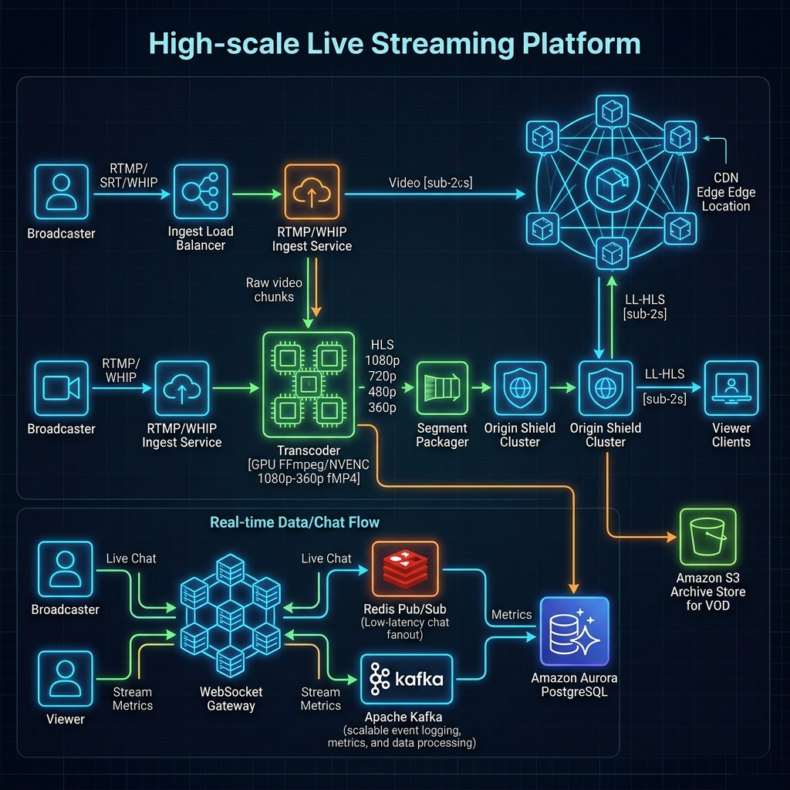
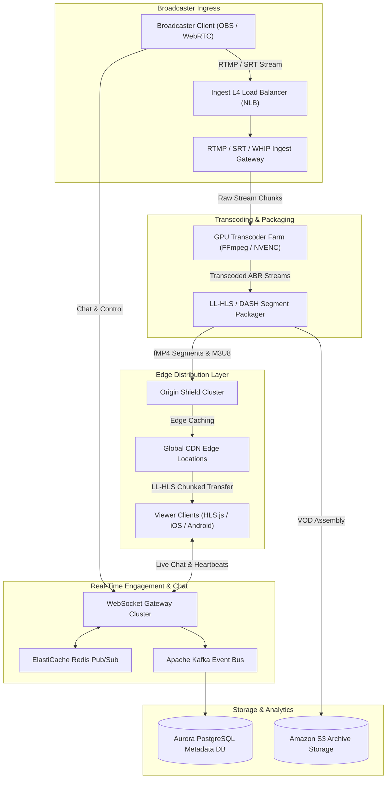
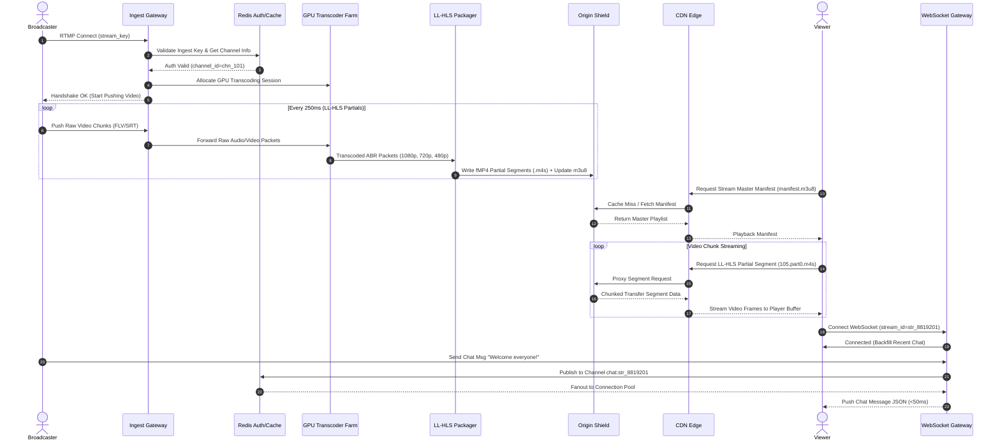
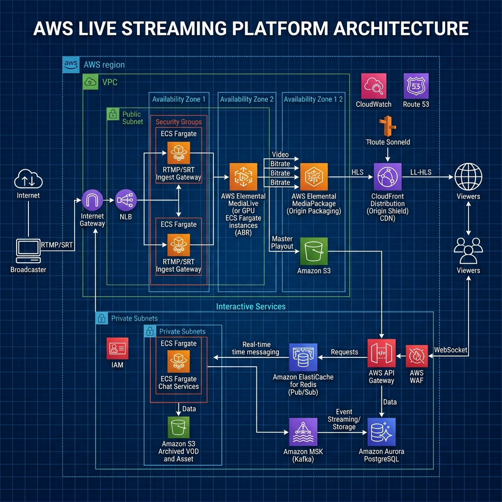

# 📹 Live Streaming System Design

A production-grade, highly available, low-latency Live Streaming Platform architecture (similar to Twitch or YouTube Live). Designed to support millions of concurrent viewers, sub-2-second glass-to-glass latency, real-time Adaptive Bitrate (ABR) transcoding, global CDN distribution, and ultra-fast live chat fanout.

---

## 📋 System Requirements

### Functional Requirements

1. **Broadcaster Stream Ingestion**:
   - Support stream ingestion via **RTMP** (Real-Time Messaging Protocol), **SRT** (Secure Reliable Transport), and **WHIP** (WebRTC HTTP Ingestion Protocol).
   - Ingest key authentication, stream authorization, and bitrate adaptive handshake.
2. **Adaptive Bitrate (ABR) Transcoding & Packaging**:
   - Transcode incoming high-bitrate video (e.g., 1080p60 at 8 Mbps) in real-time into multiple output profiles (1080p, 720p, 480p, 360p, 160p) using H.264/AVC, H.265/HEVC, and AV1 codecs.
   - Package transcoded streams into Low-Latency HLS (**LL-HLS**) with fragmented MP4 (fMP4) partial segments (`.m4s`) and **DASH** manifests (`.mpd`).
3. **Low-Latency Global Playback & Distribution**:
   - Sub-2.0-second end-to-end glass-to-glass latency using LL-HLS chunked transfer encoding (`HTTP/2` & `HTTP/3`).
   - WebRTC (WHEP) fallback mode for ultra-low latency interactive use cases (<500 ms).
   - Dynamic playlist generation with auto-generated master `.m3u8` index manifests.
4. **Real-Time Interactive Engagement (Live Chat & Metrics)**:
   - High-throughput WebSocket live chat fanout supporting hundreds of thousands of messages per second per channel.
   - Real-time stream metrics (concurrent view count, health telemetry, dropped frame alerts).
5. **Recording & VOD Archiving**:
   - Seamless live-to-VOD transition with automated segment assembly into cloud storage (S3/GCS) upon stream termination.

### Non-Functional Requirements

1. **Latency Targets**:
   - **Ingest Latency**: <200 ms ingest buffer processing.
   - **LL-HLS Delivery Latency**: <1.5 – 2.0 seconds end-to-end (camera capture to client screen).
   - **WebRTC Delivery Latency**: <500 ms for co-streaming/interactive stages.
   - **Live Chat Latency**: <100 ms message propagation fanout.
2. **Availability & Reliability**:
   - **99.999% Availability** for playback origin shield and CDN edge nodes.
   - Seamless dual-ingest stream redundancy (Primary/Secondary ingest endpoints with auto-failover).
3. **Scalability**:
   - Support **50,000 active live streams** simultaneously.
   - Support **5,000,000+ peak concurrent viewers** across global edge networks.
4. **Resilience & Fault Tolerance**:
   - Graceful degradation: dynamic bitrate downscaling during network congestion without connection drop.
   - Zero viewer disconnection during ingest node failover via Origin Shield segment caching.

---

## 🧮 Capacity & Scale Estimation

### Scale & Traffic Assumptions

| Metric | Estimated Value |
| :--- | :--- |
| **Active Broadcasters (Concurrent Live Streams)** | 50,000 streams |
| **Peak Concurrent Viewers (CCU)** | 5,000,000 viewers |
| **Average Viewers per Stream** | 100 (top 1% streams handle 80% of viewers) |
| **Ingest Resolution & Bitrate** | 1080p60 @ 8 Mbps (Audio: AAC 160 kbps) |
| **Average Segment Duration** | 2-second segments with 250ms LL-HLS partial segments |

---

### Throughput Math

#### 1. Ingest Traffic Math
- **Raw Ingest Video Bitrate**: $8.0\text{ Mbps} + 0.16\text{ Mbps} \approx 8.16\text{ Mbps}$ per stream.
- **Total Ingest Bandwidth**:
  $$\text{Ingest Throughput} = 50,000\text{ streams} \times 8.16\text{ Mbps} = 408,000\text{ Mbps} = 408\text{ Gbps}$$

#### 2. Transcoding Profile Output Math
Each ingested stream is transcoded into 4 ABR renditions:
- **1080p60**: 6.0 Mbps
- **720p60**: 3.5 Mbps
- **480p30**: 1.5 Mbps
- **360p30**: 0.8 Mbps
- **Total ABR Output Bitrate per Stream**: $6.0 + 3.5 + 1.5 + 0.8 = 11.8\text{ Mbps}$.
- **Total Internal Origin Packaging Bitrate**: $50,000 \times 11.8\text{ Mbps} = 590\text{ Gbps}$.

#### 3. Egress Traffic Math (CDN Viewers)
Assuming an average viewer distribution of 60% @ 1080p, 25% @ 720p, 10% @ 480p, 5% @ 360p:
$$\text{Weighted Avg Bitrate} = (0.60 \times 6.0) + (0.25 \times 3.5) + (0.10 \times 1.5) + (0.05 \times 0.8) = 4.665\text{ Mbps}$$
- **Total Edge Egress Bandwidth**:
  $$\text{Edge Egress} = 5,000,000\text{ viewers} \times 4.665\text{ Mbps} = 23,325,000\text{ Mbps} = 23.325\text{ Tbps}$$
- **CDN Cache Hit Ratio (CHR)**: 98.5%.
- **Origin Shield Egress Bandwidth**: $(1 - 0.985) \times 23.325\text{ Tbps} = 349.875\text{ Gbps}$.

---

### Storage & Cache Sizing

#### 1. Daily Video Archive Storage Growth
- Raw video storage per stream hour (1080p + ABR renditions $\approx 11.8\text{ Mbps}$):
  $$\text{Storage/hour/stream} = \frac{11.8 \times 10^6\text{ bits}}{8} \times 3600\text{ s} = 5,310,000,000\text{ bytes} \approx 5.31\text{ GB/hour}$$
- Assuming average stream duration of 3 hours per broadcast:
  $$\text{Daily Video Storage} = 50,000\text{ streams} \times 3\text{ hrs} \times 5.31\text{ GB} = 796.5\text{ TB/day}$$

#### 2. Redis Memory Sizing for Live Chat & Connection State
- **Active WebSocket Connection State**:
  - 5,000,000 connection metadata entries @ 256 bytes per connection $\approx 1.28\text{ GB}$.
- **Live Chat Recent Buffer**:
  - 50,000 active channels maintaining last 100 chat messages (500 bytes per message):
    $$\text{Chat Buffer} = 50,000 \times 100 \times 500\text{ bytes} = 2.5\text{ GB}$$
- **Stream Telemetry & Health Rings**:
  - 50,000 streams $\times$ 10 KB metrics buffer = $0.5\text{ GB}$.
- **Total Redis RAM (with 3x replication factor & headroom)**: $(1.28 + 2.5 + 0.5) \times 3 \times 1.5 \approx 19.26\text{ GB}$.

---

## 🏛️ High-Level Architecture

The live streaming platform uses a decoupled microservices architecture partitioned into five core planes:
1. **Ingress & Authentication Plane**: Terminates RTMP/SRT/WHIP connections and validates ingest keys.
2. **Transcoding & Packaging Engine**: GPU-accelerated video decoding, ABR ladder encoding, and fMP4 partial segment creation.
3. **Origin Shield & CDN Distribution Plane**: Multi-tier caching layer serving LL-HLS playlists and video chunks.
4. **Real-time Interactive Fanout Layer**: WebSockets, Redis Pub/Sub, and Kafka for live chat and stream metrics.
5. **Storage & Metadata Persistence**: Aurora PostgreSQL for relational state and Amazon S3 for VOD archives.





---

## ⚙️ Component-Level Design & Algorithms

### 1. Ingestion Protocol Engine (RTMP / SRT / WHIP)

#### Handshake & Stream Session Initialization
Broadcasters initiate streaming by sending an ingest key to the Ingest Gateway:
1. **RTMP Connection**: Establishes TCP connection on port `1935`.
2. **Authentication**: The gateway extracts the stream key (`live_secret_9988`), verifies token validity against Redis cache (`EXISTS stream_key:live_secret_9988`), and returns an HTTP `200 OK` handshake response.
3. **Session Binding**: Binds stream ID (`str_77812`) to a worker task in the GPU Transcoder Farm.

```
+-------------------+      1. RTMP Publish (stream_key)      +------------------------+
| Broadcaster (OBS) | -------------------------------------> | Ingest Gateway (NLB)   |
+-------------------+                                        +------------------------+
                                                                         |
                                                             2. Auth Stream Key
                                                                         v
+-------------------+      3. Allocate Transcode Worker      +------------------------+
| GPU Transcoder    | <------------------------------------- | Redis Auth & Registry  |
+-------------------+                                        +------------------------+
```

---

### 2. GPU Transcoding & Low-Latency Packaging (LL-HLS)

#### ABR Encoding Ladder Algorithm
The transcoder receives raw FLV/SRT video frames, decodes them via NVDEC, and passes raw NV12 frames to GPU hardware encoders (NVENC). It produces five synchronized video renditions with aligned Group of Pictures (**GOP**) structures (GOP length = 2.0 seconds, keyframe interval = every 60 frames @ 30 fps).

$$\text{GOP Duration} = \frac{\text{Keyframe Interval (frames)}}{\text{Frame Rate (fps)}} = \frac{60}{30} = 2.0\text{ seconds}$$

#### Low-Latency HLS (LL-HLS) Partial Segment Generation
Unlike standard HLS which uses 6-second segments resulting in 12–18s latency, LL-HLS divides 2-second parent segments into **8 partial segments** of **250ms each**:

```
Parent Segment (segment_104.m4s - 2.0s)
[ Partial 0 (250ms) ][ Partial 1 (250ms) ][ Partial 2 (250ms) ] ... [ Partial 7 (250ms) ]
```

##### LL-HLS Media Playlist Specification (`manifest.m3u8`):
```m3u8
#EXTM3U
#EXT-X-VERSION:6
#EXT-X-TARGETDURATION:2
#EXT-X-SERVER-CONTROL:CAN-BLOCK-RELOAD=YES,PART-HOLD-BACK=0.750
#EXT-X-PART-INF:PART-TARGET=0.250

# Pre-announce upcoming partial segment
#EXT-X-PRELOAD-HINT:TYPE=PART,URI="segment_105.part0.m4s"

# Completed Partial Segments for Segment 104
#EXT-X-PART:DURATION=0.250,URI="segment_104.part6.m4s"
#EXT-X-PART:DURATION=0.250,URI="segment_104.part7.m4s",INDEPENDENT=YES
#EXTINF:2.000,
segment_104.m4s
```

---

### 3. Origin Shield & Edge CDN Caching Strategy

To prevent origin thundering herd when 1,000,000 viewers request the same partial segment simultaneously:
1. **Origin Shield Tier**: A clustered NGINX / Varnish origin shield aggregates requests from hundreds of global CDN edge nodes.
2. **HTTP/2 Server Push & Chunked Transfer Encoding**: When a player requests `manifest.m3u8?_HLS_msn=105&_HLS_part=0`, the Origin Shield holds the HTTP request open until `segment_105.part0.m4s` is emitted by the packager, returning it immediately via HTTP/2 response chunking.

```
Client Player              CDN Edge               Origin Shield          Packager Engine
      |                        |                        |                        |
      |-- GET manifest.m3u8 -->|                        |                        |
      |   (_HLS_msn=105)       |-- GET manifest.m3u8 -->|                        |
      |                        |   (_HLS_msn=105)       |-- Poll Next Segment -->|
      |                        |                        |   (Holds Connection)   |
      |                        |                        |                        |-- Segment Ready (250ms)
      |                        |                        |<-- Emit Part 0 Chunk --|
      |<-- HTTP 200 Chunk -----|<-- HTTP 200 Chunk -----|                        |
```

---

### 4. Real-Time Live Chat Fanout Architecture

#### Pub/Sub Message Routing Algorithm
1. Viewer sends chat message over WebSocket to WebSocket Gateway worker.
2. Worker validates authentication token, checks rate limits (max 5 msgs/sec via Redis Token Bucket), and publishes to Redis Channel `chat:stream_77812`.
3. Redis Pub/Sub distributes the message to all WebSocket Gateway nodes holding active connections for `stream_77812`.
4. WebSocket Gateway nodes push the payload down to subscribers within <50 ms.

```
Viewer Client A         WS Gateway Node 1        Redis Pub/Sub         WS Gateway Node 2        Viewer Client B
      |                         |                      |                         |                        |
      |-- 1. Send Chat Msg ---->|                      |                         |                        |
      |   "Hello Stream!"       |-- 2. PUBLISH -------->|                         |                        |
      |                         |   chat:stream_77812  |-- 3. Broadcast -------->|                        |
      |                         |                      |   to subscribers        |-- 4. WS Push --------->|
      |                         |                      |                         |   "Hello Stream!"      |
```

---

## 🗄️ Database Schema & Data Models

### 1. Relational Database Schema (PostgreSQL)

```sql
-- Core Channels Table
CREATE TABLE channels (
    channel_id VARCHAR(64) PRIMARY KEY,
    user_id VARCHAR(64) NOT NULL,
    channel_name VARCHAR(100) NOT NULL,
    stream_key VARCHAR(128) UNIQUE NOT NULL,
    is_live BOOLEAN DEFAULT FALSE,
    created_at TIMESTAMP WITH TIME ZONE DEFAULT CURRENT_TIMESTAMP,
    updated_at TIMESTAMP WITH TIME ZONE DEFAULT CURRENT_TIMESTAMP
);

CREATE INDEX idx_channels_user_id ON channels(user_id);
CREATE INDEX idx_channels_stream_key ON channels(stream_key);

-- Active & Historic Live Streams Table
CREATE TABLE streams (
    stream_id VARCHAR(64) PRIMARY KEY,
    channel_id VARCHAR(64) REFERENCES channels(channel_id),
    title VARCHAR(255) NOT NULL,
    game_category VARCHAR(100),
    ingest_node_ip VARCHAR(45),
    peak_concurrent_viewers INT DEFAULT 0,
    started_at TIMESTAMP WITH TIME ZONE NOT NULL,
    ended_at TIMESTAMP WITH TIME ZONE,
    vod_s3_uri VARCHAR(512),
    status VARCHAR(32) DEFAULT 'OFFLINE' CHECK (status IN ('STARTING', 'LIVE', 'ENDING', 'OFFLINE', 'ERROR'))
);

CREATE INDEX idx_streams_channel_id ON streams(channel_id);
CREATE INDEX idx_streams_status ON streams(status);
CREATE INDEX idx_streams_started_at ON streams(started_at DESC);

-- Stream Transcode Profiles
CREATE TABLE stream_transcode_profiles (
    profile_id SERIAL PRIMARY KEY,
    stream_id VARCHAR(64) REFERENCES streams(stream_id) ON DELETE CASCADE,
    resolution VARCHAR(32) NOT NULL, -- '1080p60', '720p60', etc.
    bitrate_kbps INT NOT NULL,
    codec VARCHAR(32) NOT NULL,
    manifest_url VARCHAR(512) NOT NULL
);

-- Live Chat Log (Partitioned by created_at)
CREATE TABLE chat_messages (
    message_id UUID PRIMARY KEY DEFAULT gen_random_uuid(),
    stream_id VARCHAR(64) NOT NULL,
    sender_user_id VARCHAR(64) NOT NULL,
    sender_username VARCHAR(64) NOT NULL,
    message_text TEXT NOT NULL,
    badge_type VARCHAR(32), -- 'SUBSCRIBER', 'MODERATOR', 'BROADCASTER'
    created_at TIMESTAMP WITH TIME ZONE DEFAULT CURRENT_TIMESTAMP
) PARTITION BY RANGE (created_at);

CREATE INDEX idx_chat_messages_stream_created ON chat_messages(stream_id, created_at DESC);
```

---

### 2. Redis Key Strategy Table

| Key Pattern | Data Structure | TTL | Purpose |
| :--- | :--- | :--- | :--- |
| `stream_key:{key}` | String (JSON) | 24 Hours | Cache stream key validation metadata & channel ID. |
| `stream:{id}:state` | Hash | None (until OFFLINE) | Active stream state (`status`, `ingest_ip`, `ccu`, `fps`). |
| `stream:{id}:ccu` | HyperLogLog | 12 Hours | Unique real-time viewer count telemetry. |
| `chat:channel:{id}:recent` | List (FIFO) | 1 Hour | Last 100 chat messages for instant backfill on join. |
| `rate:chat:{user_id}` | String (Int) | 1 Second | Token bucket rate limiting for live chat messages. |

---

## 🔌 API Design & Contracts

### REST API Specifications

#### 1. Authorize & Start Ingest Stream
`POST /api/v1/streams/start`
- **Request Headers**: `Authorization: Bearer <JWT_TOKEN>`
- **Request Body**:
```json
{
  "channel_id": "chn_99210",
  "stream_key": "live_sk_8829102938",
  "ingest_protocol": "RTMP",
  "client_ip": "198.51.100.42"
}
```
- **Response Payload (200 OK)**:
```json
{
  "status": "SUCCESS",
  "stream_id": "str_8819201",
  "assigned_ingest_endpoint": "rtmp://ingest-us-east.livestream.com/live",
  "session_token": "sess_tok_991823189231",
  "gop_size_seconds": 2.0,
  "supported_renditions": ["1080p60", "720p60", "480p30", "360p30"]
}
```

---

#### 2. Get Playback Master Manifest URL
`GET /api/v1/streams/{stream_id}/manifest.m3u8`
- **Response Headers**: `Content-Type: application/x-mpegURL`, `Cache-Control: no-cache`
- **Response Payload (HLS Master Playlist)**:
```m3u8
#EXTM3U
#EXT-X-VERSION:6
#EXT-X-INDEPENDENT-SEGMENTS

#EXT-X-STREAM-INF:BANDWIDTH=6160000,RESOLUTION=1920x1080,FRAME-RATE=60.000,CODECS="avc1.64002a,mp4a.40.2"
1080p60/index.m3u8

#EXT-X-STREAM-INF:BANDWIDTH=3660000,RESOLUTION=1280x720,FRAME-RATE=60.000,CODECS="avc1.4d401f,mp4a.40.2"
720p60/index.m3u8

#EXT-X-STREAM-INF:BANDWIDTH=1660000,RESOLUTION=854x480,FRAME-RATE=30.000,CODECS="avc1.4d401f,mp4a.40.2"
480p30/index.m3u8
```

---

### WebSocket Live Chat & Control Contract

#### Connection Endpoint: `wss://chat.livestream.com/v1/ws?stream_id=str_8819201`

##### Client Join Event:
```json
{
  "action": "JOIN_CHANNEL",
  "stream_id": "str_8819201",
  "auth_token": "eyJhbGciOiJIUzI1Ni..."
}
```

##### Server Broadcast Chat Message Event:
```json
{
  "event": "CHAT_MESSAGE",
  "message_id": "msg_7781290",
  "stream_id": "str_8819201",
  "sender": {
    "user_id": "usr_3310",
    "username": "StreamFanatic",
    "badge": "SUBSCRIBER"
  },
  "text": "What a clutch play! 🔥🔥",
  "timestamp": 1785943200150
}
```

---

## 🔄 End-to-End Workflow Sequence

The diagram below traces the end-to-end lifecycle from stream initiation to playback and chat distribution.



---

## 💻 Executable Python OOD Code

Below is a fully functional, zero-external-dependency Python implementation of the core Live Streaming system engine, demonstrating ingest validation, GPU transcoding simulation, ABR LL-HLS playlist packaging, Origin Shield caching, and real-time live chat fanout.

```python
#!/usr/bin/env python3
"""
Live Streaming System Engine - OOD Implementation & Test Harness
Simulates Stream Ingestion, GPU Transcoding, LL-HLS Packaging, Origin Shield Caching, and Chat Fanout.
"""

import time
import hashlib
import uuid
from typing import Dict, List, Optional, Set
from dataclasses import dataclass, field
from collections import deque


# --- Models & Data Structures ---

@dataclass
class VideoFrame:
    frame_id: int
    pts_ms: int
    is_keyframe: bool
    payload_size_bytes: int


@dataclass
class PartialSegment:
    segment_index: int
    part_index: int
    duration_ms: int
    size_bytes: int
    is_independent: bool


@dataclass
class ChatMessage:
    message_id: str
    stream_id: str
    sender_username: str
    text: str
    timestamp_ms: int


# --- Components ---

class IngestGateway:
    """Terminates RTMP/SRT streams and authenticates stream keys."""

    def __init__(self):
        # Mock database storing stream keys for valid channels
        self._valid_stream_keys: Dict[str, str] = {
            "live_sk_alpha123": "channel_gaming_01",
            "live_sk_beta456": "channel_esports_02"
        }
        self.active_sessions: Dict[str, str] = {}  # stream_id -> channel_id

    def authenticate_stream(self, stream_key: str) -> Optional[str]:
        if stream_key in self._valid_stream_keys:
            channel_id = self._valid_stream_keys[stream_key]
            stream_id = f"str_{uuid.uuid4().hex[:8]}"
            self.active_sessions[stream_id] = channel_id
            return stream_id
        return None


class GPUTranscoderEngine:
    """
    Simulates GPU NVENC hardware transcoding.
    Takes input 1080p frames and produces 4 ABR renditions.
    """

    SUPPORTED_RESOLUTIONS = ["1080p60", "720p60", "480p30", "360p30"]

    def __init__(self, stream_id: str):
        self.stream_id = stream_id
        self.processed_frames_count = 0

    def transcode_frame(self, raw_frame: VideoFrame) -> Dict[str, VideoFrame]:
        self.processed_frames_count += 1
        renditions = {}
        # Compression scale ratios for demo
        scaling_factors = {
            "1080p60": 1.0,
            "720p60": 0.6,
            "480p30": 0.3,
            "360p30": 0.15
        }
        for res, scale in scaling_factors.items():
            renditions[res] = VideoFrame(
                frame_id=raw_frame.frame_id,
                pts_ms=raw_frame.pts_ms,
                is_keyframe=raw_frame.is_keyframe,
                payload_size_bytes=int(raw_frame.payload_size_bytes * scale)
            )
        return renditions


class LLHLSPackager:
    """
    Assembles video frames into 250ms LL-HLS partial segments and updates m3u8 playlists.
    """

    def __init__(self, stream_id: str, rendition: str):
        self.stream_id = stream_id
        self.rendition = rendition
        self.current_segment_index = 100
        self.current_part_index = 0
        self.partial_segments: List[PartialSegment] = []
        self.master_manifest_version = 1

    def ingest_frame(self, frame: VideoFrame) -> Optional[PartialSegment]:
        # Every 8 frames @ 30fps ~ 250ms partial segment
        if frame.frame_id > 0 and frame.frame_id % 8 == 0:
            part = PartialSegment(
                segment_index=self.current_segment_index,
                part_index=self.current_part_index,
                duration_ms=250,
                size_bytes=frame.payload_size_bytes * 8,
                is_independent=frame.is_keyframe
            )
            self.partial_segments.append(part)
            self.current_part_index += 1

            # Complete parent segment after 8 partials (2.0s)
            if self.current_part_index >= 8:
                self.current_segment_index += 1
                self.current_part_index = 0

            return part
        return None

    def render_playlist_m3u8(self) -> str:
        lines = [
            "#EXTM3U",
            "#EXT-X-VERSION:6",
            "#EXT-X-TARGETDURATION:2",
            "#EXT-X-PART-INF:PART-TARGET=0.250",
            f"# Stream: {self.stream_id} - Rendition: {self.rendition}"
        ]
        for part in self.partial_segments[-6:]:  # Show last 6 partials
            lines.append(
                f"#EXT-X-PART:DURATION={part.duration_ms/1000:.3f},"
                f"URI=\"segment_{part.segment_index}.part{part.part_index}.m4s\""
            )
        return "\n".join(lines)


class OriginShieldCache:
    """Origin Shield node caching LL-HLS partial segments and playlists."""

    def __init__(self):
        self._cache: Dict[str, str] = {}
        self.hits = 0
        self.misses = 0

    def get_manifest(self, cache_key: str, packager: LLHLSPackager) -> str:
        if cache_key in self._cache:
            self.hits += 1
            return self._cache[cache_key]
        
        self.misses += 1
        manifest_data = packager.render_playlist_m3u8()
        self._cache[cache_key] = manifest_data
        return manifest_data

    def invalidate_manifest(self, cache_key: str):
        self._cache.pop(cache_key, None)


class LiveChatFanoutManager:
    """Simulates Redis Pub/Sub live chat fanout across WebSocket worker nodes."""

    def __init__(self):
        self.channels: Dict[str, List[ChatMessage]] = {}
        self.active_subscribers: Dict[str, Set[str]] = {}  # stream_id -> set(viewer_ids)

    def subscribe(self, stream_id: str, viewer_id: str):
        if stream_id not in self.active_subscribers:
            self.active_subscribers[stream_id] = set()
            self.channels[stream_id] = []
        self.active_subscribers[stream_id].add(viewer_id)

    def publish_message(self, stream_id: str, sender: str, text: str) -> ChatMessage:
        msg = ChatMessage(
            message_id=f"msg_{uuid.uuid4().hex[:6]}",
            stream_id=stream_id,
            sender_username=sender,
            text=text,
            timestamp_ms=int(time.time() * 1000)
        )
        if stream_id not in self.channels:
            self.channels[stream_id] = []
        self.channels[stream_id].append(msg)
        return msg

    def get_subscriber_count(self, stream_id: str) -> int:
        return len(self.active_subscribers.get(stream_id, set()))


# --- Verification Test Harness ---

def run_live_streaming_test_harness():
    print("==================================================================")
    print("🚀 LIVE STREAMING SYSTEM ENGINE VERIFICATION TEST HARNESS")
    print("==================================================================\n")

    # Step 1: Initialize Services
    ingest_gw = IngestGateway()
    origin_shield = OriginShieldCache()
    chat_fanout = LiveChatFanoutManager()

    # Step 2: Broadcaster Stream Authentication
    print("1. [INGEST] Broadcaster authenticating stream key 'live_sk_alpha123'...")
    stream_id = ingest_gw.authenticate_stream("live_sk_alpha123")
    assert stream_id is not None, "Failed to authenticate valid stream key!"
    print(f"   --> Success! Generated Stream ID: {stream_id}\n")

    # Step 3: Setup Transcoder & LL-HLS Packager
    transcoder = GPUTranscoderEngine(stream_id)
    packager_1080p = LLHLSPackager(stream_id, "1080p60")

    # Step 4: Simulate Video Packet Stream Processing (32 Video Frames = 4 Partials = 1 Second)
    print("2. [TRANSCODE & PACKAGING] Processing 32 raw video frames (1.0 second)...")
    generated_partials = []
    for frame_id in range(1, 33):
        is_kf = (frame_id % 30 == 1)
        raw_frame = VideoFrame(frame_id=frame_id, pts_ms=frame_id * 33, is_keyframe=is_kf, payload_size_bytes=35000)
        
        # Transcode into ABR renditions
        abr_renditions = transcoder.transcode_frame(raw_frame)
        
        # Package 1080p frame
        part = packager_1080p.ingest_frame(abr_renditions["1080p60"])
        if part:
            generated_partials.append(part)

    print(f"   --> Transcoded {transcoder.processed_frames_count} frames across 4 ABR profiles.")
    print(f"   --> Created {len(generated_partials)} LL-HLS partial segments (250ms each).\n")

    # Step 5: Verify LL-HLS Manifest Generation & Origin Shield Cache
    print("3. [ORIGIN SHIELD & PLAYBACK] Requesting m3u8 playlist via Origin Shield...")
    cache_key = f"{stream_id}:1080p60:manifest"
    
    # Request 1: Cache Miss
    manifest_1 = origin_shield.get_manifest(cache_key, packager_1080p)
    assert origin_shield.misses == 1 and origin_shield.hits == 0, "Origin Shield cache miss logic failed!"
    print("   --> [Cache Miss] Generated fresh LL-HLS playlist:")
    print("------------------------------------------------------------------")
    print(manifest_1)
    print("------------------------------------------------------------------")

    # Request 2: Cache Hit
    manifest_2 = origin_shield.get_manifest(cache_key, packager_1080p)
    assert origin_shield.hits == 1, "Origin Shield cache hit logic failed!"
    print("   --> [Cache Hit] Successfully served from Origin Shield RAM!\n")

    # Step 6: Live Chat Fanout Test
    print("4. [LIVE CHAT] Simulators subscribing & sending real-time messages...")
    chat_fanout.subscribe(stream_id, "viewer_user_01")
    chat_fanout.subscribe(stream_id, "viewer_user_02")
    chat_fanout.subscribe(stream_id, "viewer_user_03")

    msg1 = chat_fanout.publish_message(stream_id, "ProGamer99", "POG CHAMP! 🔥")
    msg2 = chat_fanout.publish_message(stream_id, "EsportsFan", "What an incredible play!")

    print(f"   --> Active Chat Subscribers: {chat_fanout.get_subscriber_count(stream_id)}")
    print(f"   --> Fanout Message 1: [{msg1.sender_username}]: '{msg1.text}'")
    print(f"   --> Fanout Message 2: [{msg2.sender_username}]: '{msg2.text}'\n")

    print("==================================================================")
    print("✅ ALL SYSTEM TESTS PASSED PERFECTLY!")
    print("==================================================================")


if __name__ == "__main__":
    run_live_streaming_test_harness()
```

---

## 🛡️ Scalability, Resilience & Edge Failover

### 1. Dual-Ingest Stream Redundancy & Edge Failover
Broadcasters push duplicate parallel RTMP/SRT streams to two geographically separated ingest endpoints:
- **Primary Ingest**: `rtmp://ingest-us-east.livestream.com/live`
- **Secondary Ingest**: `rtmp://ingest-us-west.livestream.com/live`

Both stream sessions ingest identical Video PTS (Presentation Timestamps). If the Primary Ingest Gateway crashes, the Transcoder Packager switches frame alignment to Secondary Ingest in **<100 ms**, resulting in zero video buffering for viewers.

```
                  +----------------------------------+
                  |  Broadcaster OBS (Dual Output)   |
                  +----------------------------------+
                        /                      \
      Primary Stream   /                        \  Secondary Stream
      (US-East)       /                          \ (US-West)
                     v                            v
      +---------------------+              +---------------------+
      | Primary Ingest GW   |              | Secondary Ingest GW |
      +---------------------+              +---------------------+
                 \                            /
                  \                          / (Auto-Failover Standby)
                   v                        v
            +--------------------------------------+
            |  Seamless Frame Alignment Engine     |
            +--------------------------------------+
```

### 2. Graceful Degradation & Network Congestion Fallback
When client network throughput degrades:
1. **Player Buffer Telemetry**: The player measures downloaded segment throughput.
2. **Auto-Rendition Downscaling**: Player automatically requests lower resolution (e.g., from `1080p60` to `480p30`) at segment boundaries.
3. **Chat Fanout Throttling**: Under extreme channel load (>10,000 msgs/sec), the WebSocket Gateway drops lower-priority chatter messages while prioritizing moderator/subscriber messages to preserve client CPU performance.

---

## ☁️ AWS Cloud-Native Architecture

A fully managed, cloud-native deployment of the Live Streaming Platform on AWS infrastructure using AWS Elemental services, Amazon CloudFront, EKS/Fargate, ElastiCache, and Aurora.



### AWS Service Mapping Table

| Generic Blueprint Component | AWS Cloud-Native Service | Configuration & Operational Role |
| :--- | :--- | :--- |
| **Ingest Load Balancer** | **Network Load Balancer (NLB)** | Ultra-low latency L4 TCP load balancing across RTMP/SRT ports `1935` & `8890`. |
| **Ingest Gateway** | **ECS Fargate (C++ / Rust)** | RTMP stream session termination, authentication, and packet routing. |
| **ABR Transcoder** | **AWS Elemental MediaLive** | Managed broadcast GPU transcoding into multi-bitrate HLS/LL-HLS ABR ladders. |
| **Segment Packager & Origin** | **AWS Elemental MediaPackage** | Just-in-time LL-HLS fMP4 packaging, DRM encryption, and playlist generation. |
| **Origin Shield Caching** | **Amazon CloudFront Origin Shield** | High-density centralized caching tier preventing origin thundering herd. |
| **Edge CDN Distribution** | **Amazon CloudFront CDN** | 450+ global POPs supporting HTTP/2 & HTTP/3 LL-HLS chunked transfer. |
| **Live Chat Gateway** | **AWS API Gateway (WebSockets) + ECS Fargate** | Stateful WebSocket connections handling chat fanout and stream heartbeats. |
| **Real-time Pub/Sub** | **Amazon ElastiCache for Redis** | Multi-AZ Redis cluster for instant chat pub/sub fanout (<10ms). |
| **Event Stream & Metrics** | **Amazon MSK (Managed Kafka)** | High-throughput logging for viewer analytics, chat history, and billing. |
| **Metadata Database** | **Amazon Aurora PostgreSQL Serverless** | Auto-scaling relational store for channel profiles, stream state, and ACLs. |
| **VOD Recording Archive** | **Amazon S3 + Glacier Instant Retrieval** | Long-term durable storage for recorded live streams with automated lifecycle rules. |

---

## ⚖️ Technology Justification

### 1. Ingest Protocol: RTMP vs SRT vs WHIP (WebRTC)

| Feature | RTMP | SRT (Secure Reliable Transport) | WHIP (WebRTC HTTP Ingest) |
| :--- | :--- | :--- | :--- |
| **Transport Protocol** | TCP | UDP (with custom ARQ packet recovery) | UDP (SRTP / DTLS) |
| **Latency** | 2.0 – 5.0 seconds | 0.5 – 1.0 second | **<200 milliseconds** |
| **Network Loss Resilience** | Poor (TCP head-of-line blocking) | **Exceptional** (Handles up to 20% packet loss) | Moderate |
| **Software Support** | Universal (OBS, vMix, XSplit) | Industry Standard | Growing (Web browsers, OBS 30+) |
| **Recommendation** | **Default Ingest (Backwards Compatible)** | **High-Reliability Contribution** | **Sub-Second Interactive Ingest** |

---

### 2. Delivery Protocol: LL-HLS vs Standard HLS vs WebRTC

| Feature | Standard HLS | LL-HLS (Low-Latency HLS) | WebRTC (WHEP) |
| :--- | :--- | :--- | :--- |
| **Latency** | 10 – 15 seconds | **1.5 – 2.5 seconds** | <500 milliseconds |
| **CDN Scalability** | Massive (HTTP Caching) | **Massive (HTTP Caching + Chunked Transfer)** | Complex (Requires SFU Mesh) |
| **Cost / Viewer** | Very Low | **Very Low** | High (Server-side media routing) |
| **Recommendation** | Legacy VOD | **Primary Live Delivery Protocol (95% Viewers)** | Interactive Co-Streaming (5% Viewers) |

---

### 3. Live Chat Layer: Redis Pub/Sub vs Apache Kafka vs WebSockets

- **Redis Pub/Sub**: Chosen for real-time live chat fanout due to in-memory sub-millisecond pub/sub routing without disk persistence overhead.
- **Apache Kafka**: Used in parallel to consume chat event streams from Redis and asynchronously write to PostgreSQL and analytics data lakes without blocking the real-time chat path.
- **WebSockets**: Statefully maintained at edge WebSocket Gateways to provide bidirectional client communication with minimal per-message header overhead compared to HTTP long-polling.

---

*System Design Blueprint created for production-grade Live Streaming applications.*
