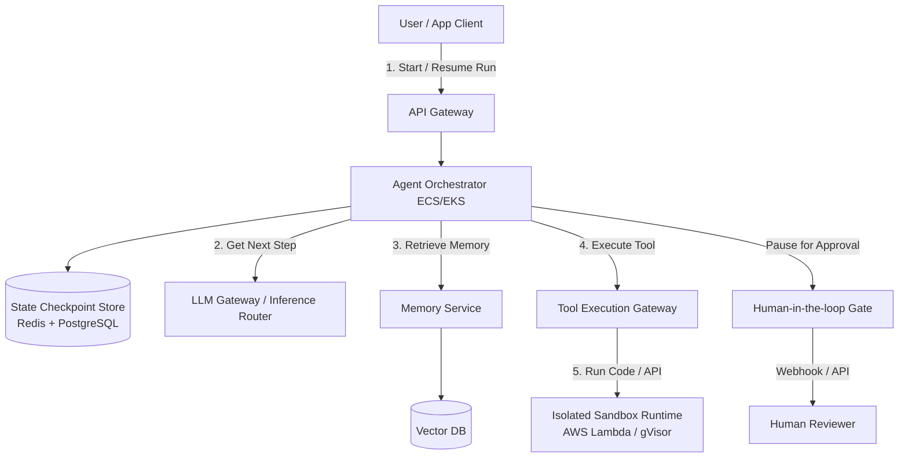
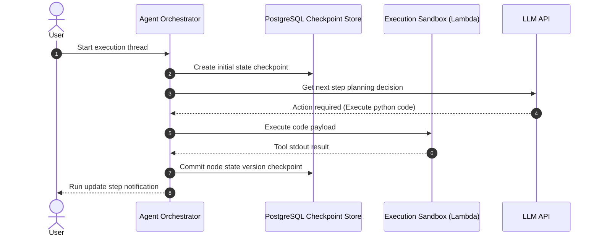
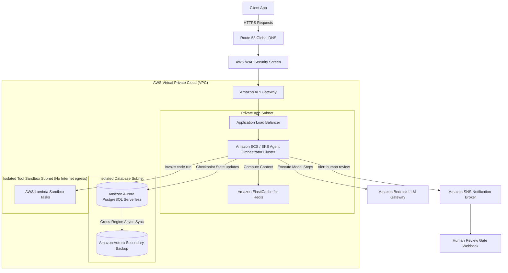

# AI Agent Framework System Design

This document details the production-grade system design for an enterprise **AI Agent Framework** (comparable to LangGraph, AutoGen, or CrewAI). The framework is optimized to build, execute, and monitor stateful, multi-agent systems with short/long-term memory integration, secure tool execution sandboxes, dynamic task planning loops, and robust human-in-the-loop (HITL) interception gates.

---

## 1. System Requirements

### Functional Requirements
* **Stateful Orchestration (Agent Loop):**
  * Support multiple orchestration patterns: ReAct (Reason + Action), Plan-and-Solve, Reflection, and Hierarchical Supervisor-Worker setups.
  * Define agents as state machines (DAGs / cyclic graphs) where transitions are decided dynamically by the LLM.
* **Memory Management:**
  * **Short-Term Memory:** Conversation context tracking (sliding window, summarizing older threads).
  * **Long-Term Memory:** Semantic recall of past experiences and metadata search via Vector Databases.
  * **Episodic Memory:** Structured audit trail logs of step-by-step reasoning runs.
* **Secure Tool Execution (Action Plane):**
  * Dynamic tool schema registration (JSON schema schemas exposed to LLM).
  * Secure, sandboxed runtime environment for executing tool code (e.g., Python execution, API requests, database updates).
* **Human-in-the-Loop (HITL) Interception:**
  * Support breakpoint gates for critical actions (e.g., executing a transaction, sending an email) that pause agent state waiting for human approval.
* **Multi-Agent Collaboration:**
  * Peer-to-peer or hierarchical communication channel enabling agents to delegate tasks, pass state messages, and aggregate results.

### Non-Functional Requirements
* **State Resiliency & Durability:** Agent execution states must survive network drops or container restarts (checkpoints saved at every state transition).
* **Low Latency Overhead:** Framework execution overhead must be $< 10\text{ms}$ per state transition (excluding LLM call time).
* **Security & Isolation:** Sandbox execution environment must prevent container break-out, network attacks, and unauthorized system access (malicious tool code execution).
* **Observability & Tracing:** Detailed execution traces (tokens used, tools called, latency per node, cost calculation) for developer debugging.

---

## 2. Capacity & Scale Estimation

### Assumptions
* **Daily Active Agent Sessions:** $100,000$ active runs/day
* **Average State Transitions per Run:** $20$ transitions (nodes visited in the execution graph)
* **Total Daily State Transitions:** $2 \text{ Million}$ transitions/day
* **Average State Payload Size:** $8 \text{ KB}$ (context, memory variables, tool history)

### Database Write/Read Throughput
* **Average Database Writes (State Checkpoints):**
  $$\text{Writes/sec} = \frac{2,000,000 \text{ checkpoints}}{86,400 \text{ seconds}} \approx 23 \text{ writes/sec}$$
  * During peak execution bursts, traffic spikes up to 5x:
  $$\text{Peak Writes/sec} \approx 23 \times 5 = 115 \text{ writes/sec}$$
* **Average Database Reads (Loading State):** Same as writes (approx. $23\text{–}115 \text{ reads/sec}$).

### State Storage Volume (Active Checkpoints)
* **Daily Storage Added:**
  $$2,000,000 \text{ checkpoints} \times 8 \text{ KB} = 16 \text{ GB / day}$$
* **Annual Storage (without compression):**
  $$16 \text{ GB/day} \times 365 \text{ days} \approx 5.84 \text{ TB / year}$$
* **Retention Policy:** Hot active state checkpoints archived to cold storage after 30 days. Active state store size $\approx 480 \text{ GB}$.

---

## 3. High-Level Architecture

The architecture decouples the stateful coordinator (State Engine) from the sandboxed environment executing client/agent tools.


### System Architecture Flowchart


### Core Components
1. **API Gateway:** Entry point that handles client requests, rate-limiting, and authentication.
2. **Agent Orchestrator:** Resolves state transitions, handles checkpointing, and triggers actions.
3. **State Checkpoint Store:** Manages current thread execution state variables and previous execution steps.
4. **Memory Service:** Accesses short-term (caching) and long-term (vector DB lookup) experience stores.
5. **Tool Execution Gateway:** Sandboxes tool triggers to prevent host vulnerabilities.

---

## 4. Component-Level Design

### A. Orchestration Patterns comparison

Choosing the right execution flow determines the agent's autonomy:

| Pattern | Control Flow | Autonomy | Recovery Strategy | Best Use Case |
| :--- | :--- | :--- | :--- | :--- |
| **ReAct (Reason/Action)** | Linear loop: Plan → Tool → Observe. | Low-Medium | Restart loop step. | Single tool execution, simple lookup. |
| **Hierarchical Supervisor** | Router agent coordinates worker sub-agents. | High | Delegate to alternative agent node. | Complex multi-domain tasks. |
| **Cyclic State DAG (LangGraph) ✅** | State machine where nodes are tasks and edges are conditionals. | High | Resume from specific failed node. | Multi-step corporate workflows. |

---

### B. Secure Tool Execution Sandbox

Executing LLM-generated code or APIs is highly dangerous. We isolate the execution using a **micro-virtualization** or container-sandboxing architecture:

```
[Tool execution Request]
         │
         ▼
[Micro-VM Sandbox (gVisor / Firecracker)]
    ├── Host OS kernel isolated (Syscall intercept)
    ├── Local read-only filesystem (base image)
    ├── Ephemeral tmpfs (512 MB RAM limit)
    ├── Outbound egress network limited (WAF IP filtering)
    └── Max execution timeout (e.g., 30s)
```

1. **gVisor / Firecracker:** Intercepts kernel syscalls from user code, preventing privilege escalation.
2. **Strict Timeouts:** Kills execution threads after 15–30 seconds to prevent infinite loops.
3. **Egress Firewall Rules:** Restricts network calls to a strict whitelist of API domains.

---

## 5. Database Schema & Partitioning Strategy

### 1. `agent_threads` Table (PostgreSQL)

```sql
CREATE TABLE agent_threads (
    thread_id   UUID PRIMARY KEY DEFAULT gen_random_uuid(),
    user_id     UUID NOT NULL,
    status      VARCHAR(20) NOT NULL DEFAULT 'active', -- active, paused_hitl, completed, failed
    created_at  TIMESTAMP WITH TIME ZONE DEFAULT CURRENT_TIMESTAMP,
    updated_at  TIMESTAMP WITH TIME ZONE DEFAULT CURRENT_TIMESTAMP
);
```

### 2. `agent_checkpoints` Table (PostgreSQL - Versioned Graph State)

```sql
CREATE TABLE agent_checkpoints (
    checkpoint_id UUID PRIMARY KEY DEFAULT gen_random_uuid(),
    thread_id     UUID NOT NULL REFERENCES agent_threads(thread_id),
    version       INTEGER NOT NULL,
    current_node  VARCHAR(100) NOT NULL,              -- Name of the active graph node
    state_payload JSONB NOT NULL,                     -- Variables, messages history, tools outputs
    created_at    TIMESTAMP WITH TIME ZONE DEFAULT CURRENT_TIMESTAMP,
    CONSTRAINT unique_thread_version UNIQUE (thread_id, version)
);

CREATE INDEX idx_checkpoint_lookup ON agent_checkpoints (thread_id, version DESC);
```

### 3. Sharding & Archiving Policy
* **Sharding:** Partitioned by `thread_id` using consistent hashing to keep all checkpoints for an active run on a single DB shard.
* **Archiving:** Checkpoints older than 30 days are swept from PostgreSQL to cold storage (S3 Glacier) in Parquet format.

---

## 6. API Design & Payloads

### 1. Initialize Thread
* **Endpoint:** `POST /api/v1/threads`
* **Response:**
```json
{
  "thread_id": "thread_uuid_12345",
  "status": "active"
}
```

### 2. Run Step
* **Endpoint:** `POST /api/v1/threads/{thread_id}/run`
* **Payload:**
```json
{
  "input": "Run analysis on logs"
}
```
* **Response:**
```json
{
  "node_visited": "tool_call",
  "status": "paused_hitl"
}
```

---

## 7. End-to-End Workflow Sequence



---

## 8. Scalability & Resilience Strategies
* **State Checkpoint Compaction:** Instead of storing complete message chains repeatedly in every version payload, we store delta changes and rebuild the full state using event-sourcing aggregation on read.
* **Singleflight Execution Guard:** Prevents race conditions where a client submits twin run commands to the same thread concurrently. Uses Redis distributed locks (`SET thread:lock <uuid> NX EX 10`).

---

## 9. Disaster Recovery & Multi-Region Failover Strategy
* **Active-Passive DB Replication:** Replicates the PostgreSQL `agent_checkpoints` database to a secondary DR region asynchronously with $< 1\text{s}$ replication lag.
* **Idempotency Keys:** Every tool execution and graph state transition is bound to an idempotency token to prevent double-execution of real-world API requests during a gateway failover.

---

## 10. AWS Cloud-Native Implementation


### AWS Cloud-Native Architecture Flowchart



### AWS Service Mapping & Rationale

| Generic Component | AWS Service | Design Details & Rationale |
| :--- | :--- | :--- |
| **API Gateway** | **Amazon API Gateway** | Manages client verification and request throttle limits. |
| **State Registry** | **Amazon Aurora PostgreSQL** | Persists states. Utilizes Global Database for multi-region backup. |
| **Tool Sandbox** | **AWS Lambda** | Isolated serverless tool execution inside ephemeral containers with strict VPC boundary rules. |
| **Memory Cache** | **Amazon ElastiCache for Redis** | Handles sliding window context buffers and active execution lock states. |

---

## 11. Technology Justification: Why We Use

### A. PostgreSQL (State Store)
* **Why We Use It:** Checkpoint consistency is vital. If the state store is eventually consistent, duplicate transitions could occur. PostgreSQL provides strict ACID locks.
* **Key Features Utilized:**
  * JSONB format indexing to query dynamic nested variables.
  * Multi-AZ replica failover.

### B. AWS Lambda (Tool Execution Sandbox)
* **Why We Use It:** Avoids hosting heavy Kubernetes worker pods for ephemeral scripting. Lambda provides VM isolation at the microsecond scale.
* **Key Features Utilized:**
  * Firecracker micro-VM container technology for secure sandbox isolation.
