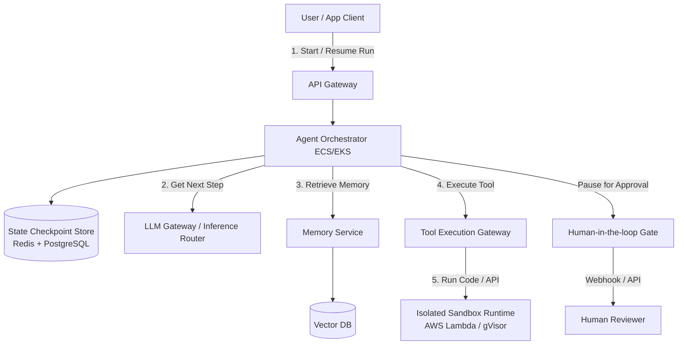
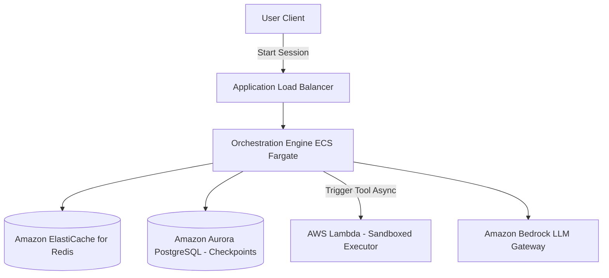

# AI Agent Framework System Design

This document details the production-grade system design for an enterprise **AI Agent Framework** (comparable to LangGraph, AutoGen, or CrewAI). The framework is optimized to build, execute, and monitor stateful, multi-agent systems with short/long-term memory integration, secure tool execution sandboxes, dynamic task planning loops, and robust human-in-the-loop (HITL) interception gates.

---

## 1. System Requirements

### Functional Requirements
* **Stateful Orchestration (Agent Loop):**
  * Support multiple orchestration patterns: ReAct (Reason + Action), Plan-and-Solve, Reflection, and Hierarchical Supervisor-Worker setups.
  * Define agents as state machines (DAGs / cyclic graphs) where transitions are decided dynamically by the LLM.
* **Memory Management:**
  * **Short-Term Memory:** Conversation context tracking (sliding window, summarizing older threads).
  * **Long-Term Memory:** Semantic recall of past experiences and metadata search via Vector Databases.
  * **Episodic Memory:** Structured audit trail logs of step-by-step reasoning runs.
* **Secure Tool Execution (Action Plane):**
  * Dynamic tool schema registration (JSON schema schemas exposed to LLM).
  * Secure, sandboxed runtime environment for executing tool code (e.g., Python execution, API requests, database updates).
* **Human-in-the-Loop (HITL) Interception:**
  * Support breakpoint gates for critical actions (e.g., executing a transaction, sending an email) that pause agent state waiting for human approval.
* **Multi-Agent Collaboration:**
  * Peer-to-peer or hierarchical communication channel enabling agents to delegate tasks, pass state messages, and aggregate results.

### Non-Functional Requirements
* **State Resiliency & Durability:** Agent execution states must survive network drops or container restarts (checkpoints saved at every state transition).
* **Low Latency Overhead:** Framework execution overhead must be $< 10\text{ms}$ per state transition (excluding LLM call time).
* **Security & Isolation:** Sandbox execution environment must prevent container break-out, network attacks, and unauthorized system access (malicious tool code execution).
* **Observability & Tracing:** Detailed execution traces (tokens used, tools called, latency per node, cost calculation) for developer debugging.

---

## 2. Capacity & Scale Estimation

### Assumptions
* **Daily Active Agent Sessions:** $100,000$ active runs/day
* **Average State Transitions per Run:** $20$ transitions (nodes visited in the execution graph)
* **Total Daily State Transitions:** $2 \text{ Million}$ transitions/day
* **Average State Payload Size:** $8 \text{ KB}$ (context, memory variables, tool history)

### Database Write/Read Throughput
* **Average Database Writes (State Checkpoints):**
  $$\frac{2,000,000 \text{ checkpoints}}{86,400 \text{ seconds}} \approx 23 \text{ writes/sec}$$
  * **Peak Writes (5x):** $\approx 115 \text{ writes/sec}$
* **Average Database Reads (Loading State):** Same as writes (approx. $23\text{–}115 \text{ reads/sec}$).

### State Storage Volume (Active Checkpoints)
* **Daily Storage Added:**
  $$2,000,000 \text{ checkpoints} \times 8 \text{ KB} = 16 \text{ GB / day}$$
* **Retention Policy:** Hot active state checkpoints archived to cold storage after 30 days. Active state store size $\approx 480 \text{ GB}$.

---

## 3. High-Level Architecture

The architecture decouples the stateful coordinator (State Engine) from the sandboxed environment executing client/agent tools.


### System Architecture Flowchart


---

## 4. Key Workflows & Engineering Details

### A. Stateful Agent Graph (Cyclic Workflows)

Unlike linear chains, complex agents require cyclic graphs (loops) to refine answers, correct code errors, and loop until a criteria is met.

```
                  ┌──────────────┐
                  │    START     │
                  └──────┬───────┘
                         ▼
                  ┌──────────────┐
                  │    PLAN      │
                  └──────┬───────┘
                         ▼
                  ┌──────────────┐
                  │  CALL TOOL   │◀──────────────┐
                  └──────┬───────┘               │
                         ▼                       │ (Invalid/Error)
                  ┌──────────────┐      No       │
                  │ VALIDATE?    │───────────────┘
                  └──────┬───────┘
                         │ Yes
                         ▼
                  ┌──────────────┐
                  │     END      │
                  └──────────────┘
```

#### State Persistence via Checkpointing
To guarantee resilience:
1. Every node transition (e.g., `PLAN` $\rightarrow$ `CALL TOOL`) acts as a database transaction.
2. The orchestrator dumps the entire execution state (variables, message histories) into a **State Checkpoint Store** as a new thread revision version.
3. If the container crashes mid-run, a replacement worker reads the latest checkpoint from the database and resumes execution from the exact transition node.

---

### B. Secure Tool Execution Sandbox

Executing LLM-generated code or APIs is highly dangerous. We isolate the execution using a **micro-virtualization** or container-sandboxing architecture:

```
[Tool execution Request]
         │
         ▼
[Micro-VM Sandbox (gVisor / Firecracker)]
    ├── Host OS kernel isolated (Syscall intercept)
    ├── Local read-only filesystem (base image)
    ├── Ephemeral tmpfs (512 MB RAM limit)
    ├── Outbound egress network limited (WAF IP filtering)
    └── Max execution timeout (e.g., 30s)
```

1. **gVisor / Firecracker:** Intercepts kernel syscalls from user code, preventing privilege escalation.
2. **Strict Timeouts:** Kills execution threads after 15–30 seconds to prevent infinite loops.
3. **Egress Firewall Rules:** Restricts network calls to a strict whitelist of API domains.

---

## 5. Database Schema & Segment Layout

### 1. `agent_threads` Table (PostgreSQL - Session Registry)

```sql
CREATE TABLE agent_threads (
    thread_id   UUID PRIMARY KEY DEFAULT gen_random_uuid(),
    user_id     UUID NOT NULL,
    status      VARCHAR(20) NOT NULL DEFAULT 'active', -- active, paused_hitl, completed, failed
    created_at  TIMESTAMP WITH TIME ZONE DEFAULT CURRENT_TIMESTAMP,
    updated_at  TIMESTAMP WITH TIME ZONE DEFAULT CURRENT_TIMESTAMP
);
```

### 2. `agent_checkpoints` Table (PostgreSQL - Versioned Graph State)

```sql
CREATE TABLE agent_checkpoints (
    checkpoint_id UUID PRIMARY KEY DEFAULT gen_random_uuid(),
    thread_id     UUID NOT NULL REFERENCES agent_threads(thread_id),
    version       INTEGER NOT NULL,
    current_node  VARCHAR(100) NOT NULL,              -- Name of the active graph node
    state_payload JSONB NOT NULL,                     -- Variables, messages history, tools outputs
    created_at    TIMESTAMP WITH TIME ZONE DEFAULT CURRENT_TIMESTAMP,
    CONSTRAINT unique_thread_version UNIQUE (thread_id, version)
);

CREATE INDEX idx_checkpoint_lookup ON agent_checkpoints (thread_id, version DESC);
```

---

## 6. AWS Cloud-Native Implementation

### AWS Cloud-Native Architecture Diagram


### AWS Service Mapping & Rationale
* **AWS Lambda (Sandboxed Execution):** Each tool run executes inside a highly ephemeral, isolated Lambda container configured with strict memory quotas (128-512MB) and network VPC egress filters.
* **Amazon Aurora PostgreSQL:** Stores the thread execution state and historic checkpoints. Uses JSONB fields for unstructured state payloads.
* **Amazon ElastiCache (Redis):** Handles active hot-thread caching and atomic graph locks.
