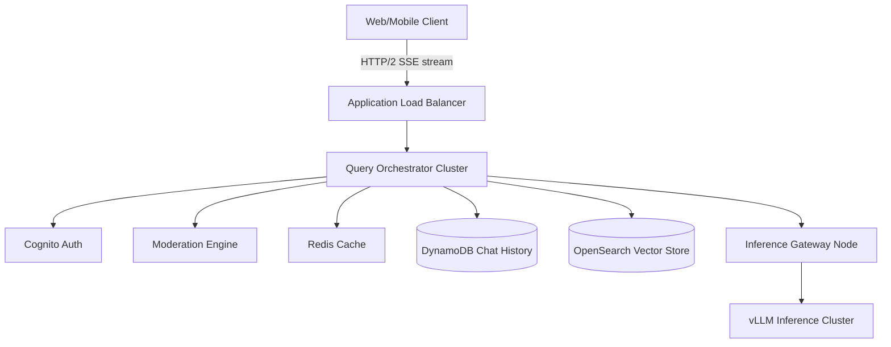
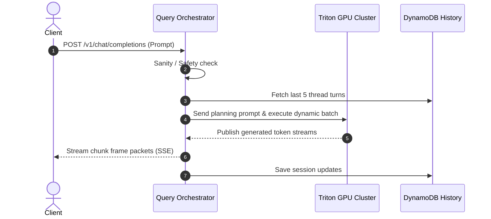

# ChatGPT System Design

This document outlines the system design for a real-time, low-latency conversational AI platform like **ChatGPT** (or Gemini). The system must ingest user queries, manage conversational context windows, perform safety checks, coordinate LLM inference endpoints, and stream responses back to users.

---

## 1. System Requirements

### Functional Requirements
* **Users:**
  * Create, delete, and rename chat threads.
  * Send text prompts (and attach documents/images for multimodal queries).
  * Receive real-time, streaming text responses (token by token).
  * View historical chat threads chronologically.
  * Rate answers (thumbs up/down) or copy responses.
* **Orchestration & Security:**
  * Moderate input prompts for safety, toxicity, and policy violations.
  * Retrieve contextually relevant documents (Retrieval-Augmented Generation / RAG).
  * Rate-limit users based on tier limits (e.g., Free vs. Plus plans).

### Non-Functional Requirements
* **Low Latency:** 
  * Time to First Token (TTFT) must be $< 200\text{ms}$.
  * Subsequent tokens must stream at a comfortable reading pace ($\approx 30\text{–}60 \text{ tokens/second}$).
* **High Concurrency:** Support millions of active users receiving streaming answers concurrently.
* **Durability:** Chat histories must be reliably stored and retrieved.
* **Fault Tolerance:** If an inference node or model host crashes, query requests must fail-over to healthy nodes without breaking the user session.

---

## 2. Capacity & Scale Estimation

Let's assume:
* **Daily Active Users (DAU):** $20 \text{ Million}$
* **Average Chats per User per Day:** $5 \text{ sessions}$
* **Average Messages per Session:** $10 \text{ messages}$
* **Total Daily Messages:** 
  $$20,000,000 \text{ users} \times 5 \text{ sessions} \times 10 \text{ messages} = 1 \text{ Billion messages/day}$$

### Throughput (QPS)
* **Average Request QPS:**
  $$\text{QPS} = \frac{1,000,000,000 \text{ messages}}{86,400 \text{ seconds}} \approx 11,574 \text{ QPS}$$
* **Peak Request QPS (3x average):** 
  $$11,574 \times 3 \approx 34,722 \text{ QPS}$$

### Storage Estimation (Chat History)
* Average message size (prompt + response): $1 \text{ KB}$ (approx. 500 words).
* Daily storage: 
  $$1,000,000,000 \text{ messages} \times 1 \text{ KB} = 1 \text{ TB / day}$$
* Annual Storage: 
  $$1 \text{ TB/day} \times 365 \text{ days} \approx 365 \text{ TB / year}$$

---

## 3. High-Level Architecture

The architecture utilizes an event-driven, stream-oriented model to guarantee rapid token delivery.


### System Architecture Flowchart


### Core Components
1. **Application Load Balancer (ALB):** Routes HTTP/2 SSE streaming connections.
2. **Query Orchestrator:** Stateless controller coordinating moderation, history, and RAG pipelines.
3. **Inference Gateway:** Distributes batch queues across vLLM engines.
4. **vLLM Inference Cluster:** Run GPU-level tensor parallel executions.

---

## 4. Component-Level Design

### A. Context Window Memory Management

Maintaining conversational history is vital. Since model context windows are limited, we implement a multi-tier memory strategy:

| Memory Tier | How It Works | Storage Medium | TTL / Lifecycle |
| :--- | :--- | :--- | :--- |
| **Hot Buffer** | Stores last 5 turns of conversation in raw token representation. | Redis Cache | 1 Hour |
| **Summarized Memory** | Older chat turns are compressed into a bullet-point summary. | Redis / DynamoDB | Session Lifecycle |
| **Long-Term Memory** | Entire history is embedded and stored in Vector Database. | OpenSearch | Indefinite |

---

### B. GPU Queueing and Dynamic Batching

Model execution requires batching inputs to maximize tensor cores efficiency:

```
[Incoming Request Streams]
     ├── Stream 1 ─▶ [Inference Gateway Queue] ─▶ Dynamic Batcher (2ms Window)
     ├── Stream 2 ─▶           │
     └── Stream 3 ─▶           ▼
                   [Batch of 32 Prompts] ──▶ GPU Tensor Core Execution
```

---

## 5. Database Schema & State Strategy

### 1. `chat_messages` Table (DynamoDB)
* **Partition Key:** `session_id` (String)
* **Sort Key:** `created_at` (Number)
* **Attributes:**
  * `message_id` (UUID)
  * `role` (String - user/assistant)
  * `content` (String)
  * `tokens_count` (Number)

### 2. Sharding & Scaling
* **DynamoDB Auto-Partitioning:** DynamoDB automatically splits partitions by `session_id` hash ranges when throughput exceeds limits, ensuring infinite horizontal scale.

---

## 6. API Design & Payloads

### 1. Stream Conversational Completion
* **Endpoint:** `POST /v1/chat/completions`
* **Response Header:** `Content-Type: text/event-stream`
* **Response Stream Chunk:**
```
data: {"choices": [{"delta": {"content": "Hello"}}]}
data: {"choices": [{"delta": {"content": " world"}}]}
data: [DONE]
```

---

## 7. End-to-End Workflow Sequence



---

## 8. Scalability & Resilience Strategies
* **PagedAttention Optimization:** Implement block-level cache partition tables to prevent memory fragmentation on GPU nodes hosting long-running conversational threads.
* **Toxicity Break Filter:** Stop GPU model token generation loops immediately if the output fails safety heuristics mid-generation.

---

## 9. Disaster Recovery & Multi-Region Failover Strategy
* **Active-Active Region Routing:** Global DNS routing redirects users to secondary regions during model cluster hardware failures.
* **Async Session Replication:** Chat history backups are updated across replication zones asynchronously with minimal write lag.

---

## 10. AWS Cloud-Native Implementation

### AWS Service Mapping & Rationale

| Generic Component | AWS Service | Design Details & Rationale |
| :--- | :--- | :--- |
| **API Gateway / Ingress** | **Application Load Balancer (ALB)** | Supports long-lived HTTP/2 chunked-transfer connections. |
| **Query Orchestrator** | **Amazon ECS on AWS Fargate** | Coordinates token streaming, RAG pipelines, and caching. |
| **Chat History** | **Amazon DynamoDB** | Persistent storage for chat messages, partitioned by session. |
| **Inference Nodes** | **Amazon EKS with GPU Instance Pools** | Hosts model servers on GPU-equipped EC2 instances. |

---

## 11. Technology Justification: Why We Use

### A. Amazon DynamoDB (Chat History)
* **Why We Use It:** Relational tables would fail to execute fast queries under millions of concurrent write tasks. DynamoDB's key-value partition model executes reads/writes in single-digit milliseconds at scale.

### B. Amazon EKS GPU Clusters (Inference Core)
* **Why We Use It:** Model execution requires scaling clusters dynamically based on GPU RAM utilization metrics. EKS handles complex container lifecycle policies across GPU instances.
