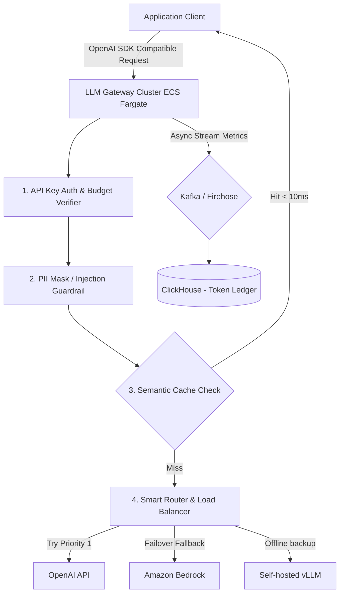
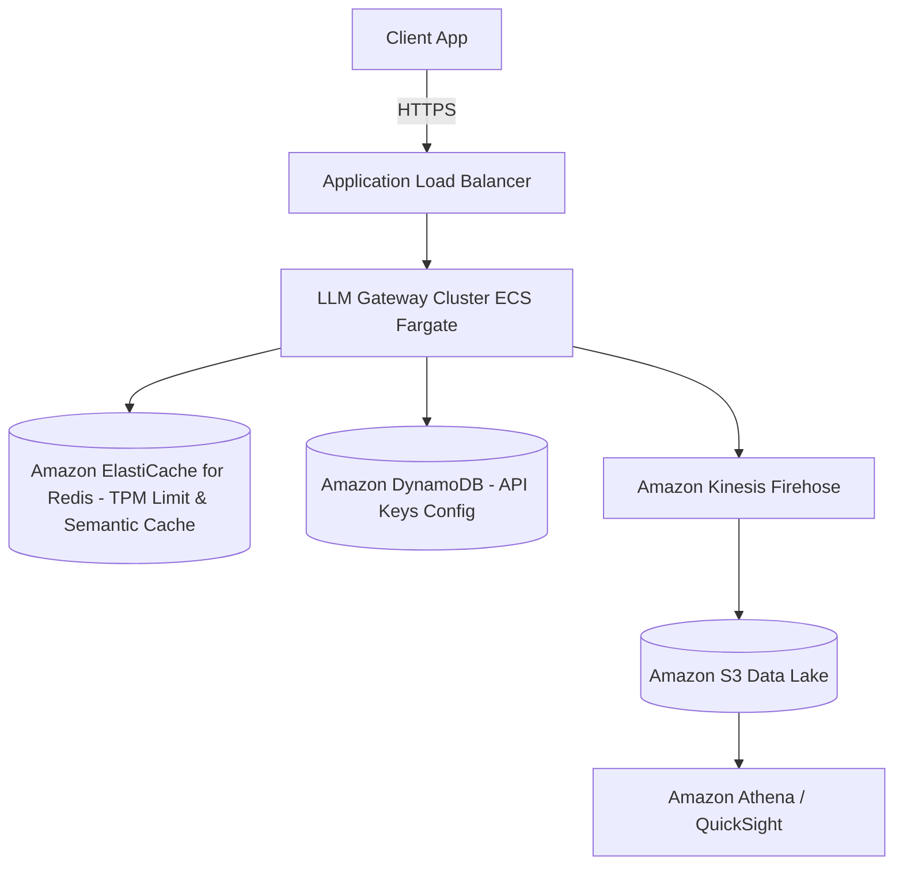

# LLM Gateway System Design

This document details the production-grade system design for an enterprise **LLM Gateway** (comparable to Portkey, LiteLLM, or Cloudflare AI Gateway). The gateway serves as a unified proxy layer between client applications and external/internal LLM APIs (OpenAI, Anthropic, Bedrock, self-hosted vLLM). It handles dynamic model routing, semantic caching, rate limiting (RPM/TPM tracking), token-based costing tracking, guardrails, and automated failover routing.

---

## 1. System Requirements

### Functional Requirements
* **Unified Interface (Proxy):**
  * Expose an OpenAI-compatible API interface (e.g., `/v1/chat/completions`) routing to multiple upstream model providers.
  * support streaming outputs (HTTP Server-Sent Events).
* **Smart Routing & Failover:**
  * Active-active load balancing across multiple provider keys.
  * Automatic failover to fallback models or alternative providers if the primary provider returns 5xx errors or hits rate limits.
  * Latency-based or cost-based routing.
* **Token & Cost Management:**
  * Track request metrics: Input tokens, output tokens, cost in USD per API Key, user ID, or team tenant.
  * Enforce budget ceilings (e.g., hard cap of $100/day for a development team).
* **Caching (Semantic Cache):**
  * Caches common prompts/responses using semantic similarity thresholds.
* **Security & Guardrails:**
  * PII Masking: Redact social security numbers, emails, and API keys before sending prompts to external providers.
  * Prompt Injection Mitigation: Basic checks for adversarial prompts.

### Non-Functional Requirements
* **Low Latency Overhead:** The gateway must add $< 5\text{ms}$ of latency overhead to the request cycle (excluding cache misses).
* **High Throughput:** Handle peak loads of $50,000+$ QPS of incoming proxy traffic.
* **Resiliency:** 99.999% availability of the proxy route. A failure in the gateway blocks all AI applications across the organization.

---

## 2. Capacity & Scale Estimation

### Assumptions
* **Daily Proxy Requests:** $10 \text{ Million}$ queries/day
* **Average TPM (Tokens Per Minute):** $50 \text{ Million}$ tokens/minute peak
* **Average Request Tokens:** $1,000$ input, $500$ output $\approx 1,500$ total
* **Query QPS:**
  $$\frac{10,000,000 \text{ queries}}{86,400 \text{ seconds}} \approx 115 \text{ QPS (average)}$$
  * **Peak QPS (5x):** $\approx 575 \text{ QPS}$

---

## 3. High-Level Architecture

The LLM Gateway is designed as a stateless proxy cluster backed by an in-memory caching and metrics store.


### System Architecture Flowchart


---

## 4. Key Workflows & Engineering Details

### A. Rate Limiting: Tokens Per Minute (TPM) & Requests Per Minute (RPM)

Standard rate limiters count requests. LLM providers rate limit on *Tokens*. The gateway tracks token counts dynamically using a Redis sliding-window token bucket algorithm.

```
Incoming Request (1000 estimated input tokens)
       │
       ▼
Check Redis: TPM consumed in last 60s + 1000 > Provider Limit?
       ├── Yes: Route request to alternative fallback provider
       └── No: Atomic INCR TPM by 1000, forward to primary provider
```

---

### B. Semantic Caching

To prevent paying for identical LLM prompts, the gateway caches results semantically:

```
User Prompt: "What is the capital of France?"
       │
       ▼
Vector Search: Cosine Similarity with cached keys
       ├── Similarity > 0.95 (Semantic Match): Return cached answer "Paris"
       └── Similarity < 0.95: Forward to LLM, cache new prompt/response pair
```

1. **Embedding generation:** Generate a lightweight embedding for the prompt (e.g., using a fast local embedding model or Redis vector index).
2. **Vector DB lookup:** Retrieve cached prompts within the similarity threshold (e.g., `threshold = 0.95`).
3. **Serve from cache:** Returns in $< 10\text{ms}$ avoiding API costs and LLM generation time.

---

## 5. Database Schema & Segment Layout

### 1. `api_keys` Table (PostgreSQL - Tenant Configuration)

```sql
CREATE TABLE api_keys (
    key_hash       VARCHAR(64) PRIMARY KEY,
    owner_team     VARCHAR(100) NOT NULL,
    rpm_limit      INTEGER DEFAULT 60,
    tpm_limit      INTEGER DEFAULT 50000,
    daily_budget   NUMERIC(10, 4) DEFAULT 10.0000,
    current_spend  NUMERIC(10, 4) DEFAULT 0.0000,
    is_active      BOOLEAN DEFAULT TRUE,
    created_at     TIMESTAMP WITH TIME ZONE DEFAULT CURRENT_TIMESTAMP
);
```

### 2. `token_ledger` Table (ClickHouse - Analytics & Billing)

```sql
CREATE TABLE token_ledger (
    team_id     LowCardinality(String),
    model       LowCardinality(String),
    provider    LowCardinality(String),
    input_tokens UInt32,
    output_tokens UInt32,
    cost_usd    Float32,
    latency_ms  UInt32,
    status_code UInt16,
    logged_at   DateTime
) ENGINE = MergeTree()
PARTITION BY toYYYYMM(logged_at)
ORDER BY (team_id, logged_at);
```

---

## 6. AWS Cloud-Native Implementation

### AWS Cloud-Native Architecture Diagram


### AWS Service Mapping & Rationale
* **Amazon ECS Fargate:** Hosts the stateless proxy containers. Fargate handles rapid auto-scaling based on ALB request targets.
* **Amazon ElastiCache for Redis:** Stores semantic cache vector maps and tracks active RPM/TPM sliding windows.
* **Amazon Kinesis Firehose:** Captures token counts and latencies asynchronously from the proxy stream, dumping them directly into S3 for storage costing analysis.
