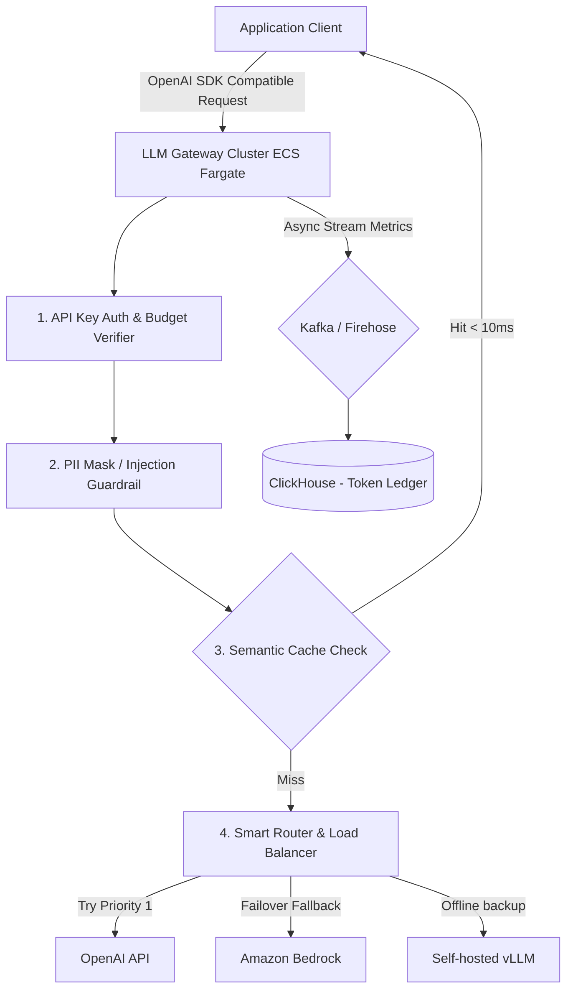
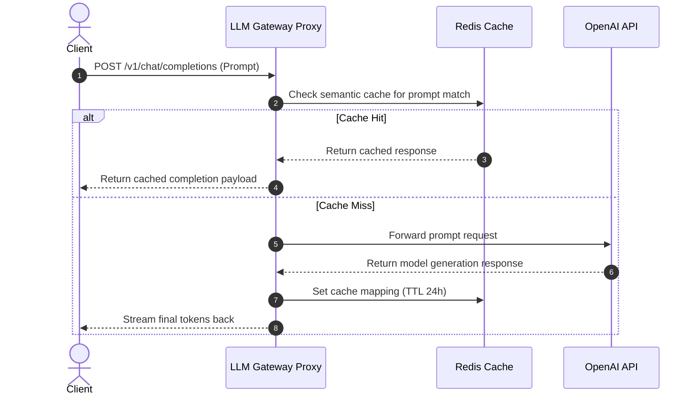

# LLM Gateway System Design

This document details the production-grade system design for an enterprise **LLM Gateway** (comparable to Portkey, LiteLLM, or Cloudflare AI Gateway). The gateway serves as a unified proxy layer between client applications and external/internal LLM APIs (OpenAI, Anthropic, Bedrock, self-hosted vLLM). It handles dynamic model routing, semantic caching, rate limiting (RPM/TPM tracking), token-based costing tracking, guardrails, and automated failover routing.

---

## 1. System Requirements

### Functional Requirements
* **Unified Interface (Proxy):**
  * Expose an OpenAI-compatible API interface (e.g., `/v1/chat/completions`) routing to multiple upstream model providers.
  * Support streaming outputs (HTTP Server-Sent Events).
* **Smart Routing & Failover:**
  * Active-active load balancing across multiple provider keys.
  * Automatic failover to fallback models or alternative providers if the primary provider returns 5xx errors or hits rate limits.
  * Latency-based or cost-based routing.
* **Token & Cost Management:**
  * Track request metrics: Input tokens, output tokens, cost in USD per API Key, user ID, or team tenant.
  * Enforce budget ceilings (e.g., hard cap of $100/day for a development team).
* **Caching (Semantic Cache):**
  * Caches common prompts/responses using semantic similarity thresholds.
* **Security & Guardrails:**
  * PII Masking: Redact social security numbers, emails, and API keys before sending prompts to external providers.
  * Prompt Injection Mitigation: Basic checks for adversarial prompts.

### Non-Functional Requirements
* **Low Latency Overhead:** The gateway must add $< 5\text{ms}$ of latency overhead to the request cycle (excluding cache misses).
* **High Throughput:** Handle peak loads of $50,000+$ QPS of incoming proxy traffic.
* **Resiliency:** 99.999% availability of the proxy route. A failure in the gateway blocks all AI applications across the organization.

---

## 2. Capacity & Scale Estimation

### Assumptions
* **Daily Proxy Requests:** $10 \text{ Million}$ queries/day
* **Average TPM (Tokens Per Minute):** $50 \text{ Million}$ tokens/minute peak
* **Average Request Tokens:** $1,000$ input, $500$ output $\approx 1,500$ total
* **Query QPS:**
  $$\text{Query QPS} = \frac{10,000,000 \text{ queries}}{86,400 \text{ seconds}} \approx 115 \text{ QPS (average)}$$
  * **Peak QPS (5x):** $\approx 575 \text{ QPS}$
* **Metrics Payload Size:** $\approx 500 \text{ bytes}$ per query event log.
* **Daily Metrics Storage:**
  $$10,000,000 \text{ queries} \times 500 \text{ bytes} \approx 5 \text{ GB / day}$$

---

## 3. High-Level Architecture

The LLM Gateway is designed as a stateless proxy cluster backed by an in-memory caching and metrics store.


### System Architecture Flowchart


### Core Components
1. **Gateway Proxy (Go / Rust Engine):** Low-overhead stateless proxy parsing HTTP/2 request/response streams.
2. **Semantic Cache Engine:** Integrates with Redis vector search to identify near-identical queries.
3. **Smart Router:** Handles load balancing weights, failover, and request retries.
4. **Guardrail Engine:** Run regex patterns and semantic scanners to scrub PII data.

---

## 4. Component-Level Design

### A. Routing Strategies

Choosing the model dispatch criteria determines gateway efficiency:

| Strategy | Metric Monitored | Failover Route | Best Use Case |
| :--- | :--- | :--- | :--- |
| **Cost-Optimized** | Price per token | Route to cheapest available model | Internal testing, bulk batches. |
| **Latency-Optimized** | Rolling P95 latency | Route to fastest responding provider | Real-time user chat interfaces. |
| **Reliability-Optimized ✅** | Error rates & rate limit counts | Immediate fallback to Bedrock/OpenAI alternative | Production-grade SLA compliance. |

---

### B. Rate Limiting: Tokens Per Minute (TPM) & Requests Per Minute (RPM)

Standard rate limiters count requests. LLM providers rate limit on *Tokens*. The gateway tracks token counts dynamically using a Redis sliding-window token bucket algorithm.

```
Incoming Request (1000 estimated input tokens)
       │
       ▼
Check Redis: TPM consumed in last 60s + 1000 > Provider Limit?
       ├── Yes: Route request to alternative fallback provider
       └── No: Atomic INCR TPM by 1000, forward to primary provider
```

---

## 5. Database Schema & Partitioning Strategy

### 1. `api_keys` Table (PostgreSQL)

```sql
CREATE TABLE api_keys (
    key_hash       VARCHAR(64) PRIMARY KEY,
    owner_team     VARCHAR(100) NOT NULL,
    rpm_limit      INTEGER DEFAULT 60,
    tpm_limit      INTEGER DEFAULT 50000,
    daily_budget   NUMERIC(10, 4) DEFAULT 10.0000,
    current_spend  NUMERIC(10, 4) DEFAULT 0.0000,
    is_active      BOOLEAN DEFAULT TRUE,
    created_at     TIMESTAMP WITH TIME ZONE DEFAULT CURRENT_TIMESTAMP
);
```

### 2. `token_ledger` Table (ClickHouse - Analytics & Billing)

```sql
CREATE TABLE token_ledger (
    team_id     LowCardinality(String),
    model       LowCardinality(String),
    provider    LowCardinality(String),
    input_tokens UInt32,
    output_tokens UInt32,
    cost_usd    Float32,
    latency_ms  UInt32,
    status_code UInt16,
    logged_at   DateTime
) ENGINE = MergeTree()
PARTITION BY toYYYYMM(logged_at)
ORDER BY (team_id, logged_at);
```

### 3. Partitioning Strategy
* **ClickHouse Ledger:** Partitioned monthly by `logged_at` time block. Retained for 12 months for corporate billing reports.

---

## 6. API Design & Payloads

### 1. Unified Completions Request
* **Endpoint:** `POST /v1/chat/completions`
* **Payload:**
```json
{
  "model": "gpt-4o",
  "messages": [{"role": "user", "content": "Hello"}],
  "temperature": 0.7
}
```
* **Response:**
```json
{
  "id": "chatcmpl-123",
  "choices": [{"message": {"role": "assistant", "content": "Hello there!"}}]
}
```

---

## 7. End-to-End Workflow Sequence



---

## 8. Scalability & Resilience Strategies
* **Dynamic Backoff Retries:** Automatically retry requests targeting secondary provider endpoints upon receiving `429 Too Many Requests` or `503 Service Unavailable`.
* **Budget Circuit Breakers:** If a tenant key's total billing exceeds daily budget limit, immediately cut access at the authentication filter stage.

---

## 9. Disaster Recovery & Multi-Region Failover Strategy
* **Active-Active Cross-Region Proxy Setup:** Run gateway instances in multiple global regions. If OpenAI experiences an outage in `us-east-1`, the gateway immediately shifts query routing to Bedrock in `eu-west-1`.

---

## 10. AWS Cloud-Native Implementation

### AWS Service Mapping & Rationale

| Generic Component | AWS Service | Design Details & Rationale |
| :--- | :--- | :--- |
| **Proxy Layer** | **Amazon ECS Fargate** | Stateful-less container deployment routing stream payloads. |
| **Budget Store** | **Amazon DynamoDB** | Stores tenant limits and usage counters. |
| **Analytics Pipeline** | **Amazon Kinesis Data Firehose** | Streams usage metrics directly from ECS to S3/Redshift without adding to query path latency. |
| **Cache Cluster** | **Amazon ElastiCache for Redis** | Serves as the token bucket counter store. |

---

## 11. Technology Justification: Why We Use

### A. ClickHouse (Ledger Analytics)
* **Why We Use It:** Relational databases are too slow for logging token usage aggregates across millions of transactions. ClickHouse stores metrics in columns, executing analysis queries (e.g. "total cost per team per day") across billions of rows in milliseconds.

### B. Redis (TPM Sliding-Window Rate Limiter)
* **Why We Use It:** Sub-millisecond reads/writes are needed to check if a client has exceeded token limit metrics before routing their prompt. Storing counter maps in disk databases would crash under proxy traffic volumes.
