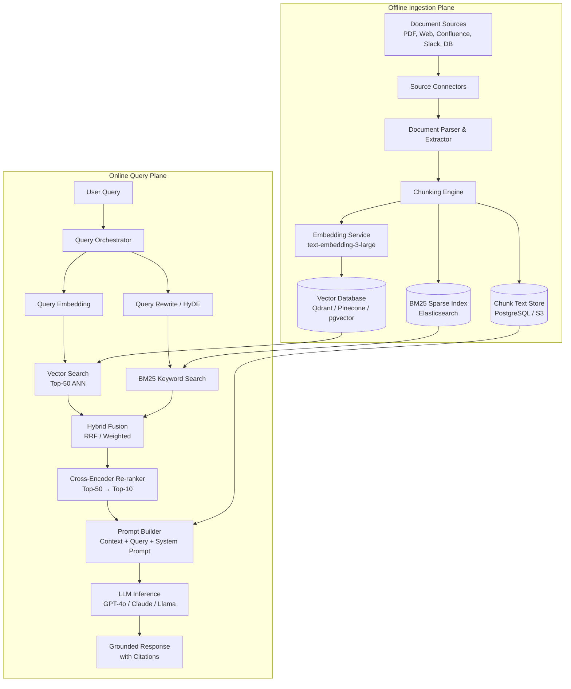
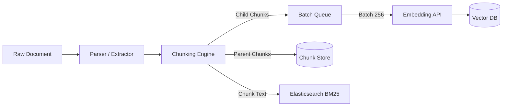
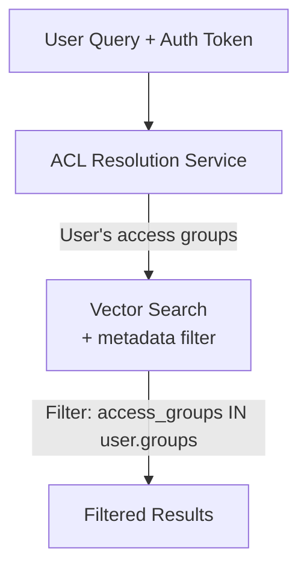
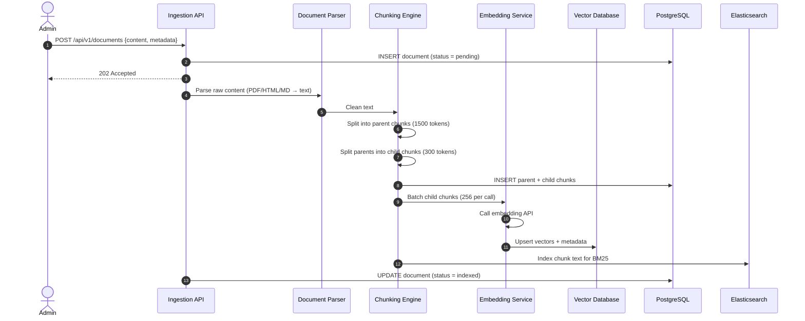
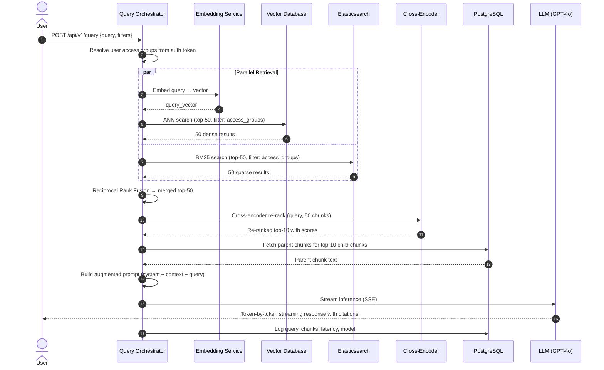
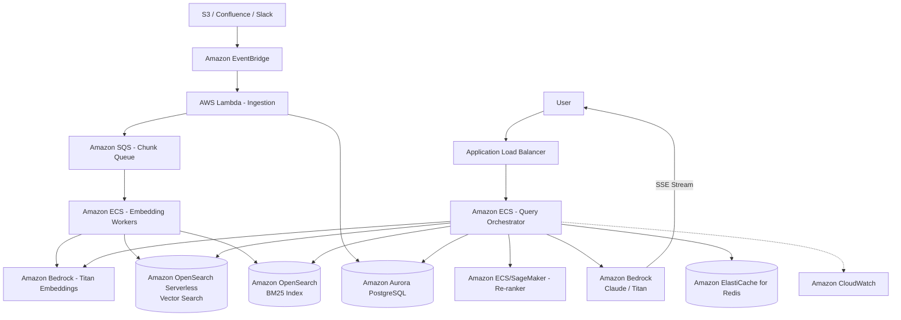

# RAG Pipeline System Design

This document outlines the production-grade system design for a **Retrieval-Augmented Generation (RAG)** pipeline — the backbone of modern knowledge-grounded AI systems like ChatGPT with web browsing, Perplexity AI, enterprise knowledge assistants, and customer support copilots. The system ingests unstructured documents, chunks and embeds them into a vector space, retrieves semantically relevant passages at query time, and augments LLM prompts to generate factual, grounded responses.

---

## 1. System Requirements

### Functional Requirements
* **Document Ingestion:**
  * Ingest documents from diverse sources: PDFs, web pages, Confluence/Notion wikis, Markdown files, Slack transcripts, databases, and API feeds.
  * Support incremental ingestion — add, update, and delete individual documents without re-indexing the entire corpus.
  * Handle structured (tables, JSON), semi-structured (HTML), and unstructured (prose) content.
* **Chunking & Embedding:**
  * Split documents into semantically meaningful chunks with configurable strategies (fixed-size, recursive, semantic-boundary).
  * Embed chunks into high-dimensional vectors using state-of-the-art embedding models (e.g., OpenAI `text-embedding-3-large`, Cohere Embed v3, open-source BGE/E5).
  * Store embeddings in a vector database with metadata filters.
* **Retrieval:**
  * Given a user query, retrieve the top-$k$ most semantically relevant chunks in $< 50\text{ms}$.
  * Support hybrid search: combine dense vector similarity with sparse keyword matching (BM25) for robust recall.
  * Support metadata filtering (by document source, date, author, department, access control).
* **Generation (Augmented):**
  * Construct an augmented prompt by injecting retrieved context into the LLM's input window.
  * Generate grounded, factual answers with inline citations linking to source documents.
  * Handle "I don't know" cases — if no relevant context is retrieved, the model should refuse to hallucinate.
* **Evaluation & Feedback:**
  * Track retrieval quality metrics (recall@k, precision@k, MRR).
  * Track generation quality (faithfulness, relevance, hallucination rate).
  * User feedback loop (thumbs up/down) for continuous improvement.

### Non-Functional Requirements
* **Low Latency:** End-to-end query-to-first-token latency must be $< 2\text{s}$ (including retrieval + LLM inference).
* **High Retrieval Recall:** The retrieval stage must surface relevant chunks in the top-$k$ results $\geq 90\%$ of the time.
* **Scalability:** Support corpora of $10\text{M}+$ document chunks across $1\text{M}+$ documents.
* **Freshness:** Newly ingested documents must be queryable within $< 5$ minutes.
* **Security:** Enforce document-level access control — users must only retrieve chunks from documents they are authorized to view.
* **Observability:** Full tracing of every query: what was retrieved, what was sent to the LLM, what was generated.

---

## 2. Capacity & Scale Estimation

### Assumptions
* **Total Documents:** $1 \text{ Million}$
* **Average Document Length:** $5,000 \text{ tokens}$ ($\approx 4$ pages)
* **Average Chunk Size:** $500 \text{ tokens}$ ($\approx 2,000 \text{ characters}$)
* **Chunks per Document:** $\approx 10$
* **Total Chunks:** $10 \text{ Million}$
* **Embedding Dimension:** $1536$ (OpenAI `text-embedding-3-large`)
* **Daily Queries:** $500,000$
* **Top-$k$ per Query:** $10$ chunks retrieved

### Storage Estimation

* **Vector Storage:**
  $$10,000,000 \text{ chunks} \times 1536 \text{ dimensions} \times 4 \text{ bytes (float32)} = 57.3 \text{ GB}$$
  With metadata overhead ($\approx 500$ bytes/chunk): $+5 \text{ GB} = \mathbf{62.3 \text{ GB}}$

* **Raw Chunk Text Storage:**
  $$10,000,000 \text{ chunks} \times 2,000 \text{ bytes} = 20 \text{ GB}$$

* **Total Index Size: $\approx 82 \text{ GB}$** — fits on a single high-memory node or a small cluster.

### Throughput (QPS)

* **Query QPS:**
  $$\frac{500,000 \text{ queries}}{86,400 \text{ seconds}} \approx 6 \text{ QPS (average)}$$
  * **Peak QPS (10x):** $\approx 60 \text{ QPS}$

* **Embedding QPS (Ingestion):**
  * During bulk ingestion of 1M documents: $10\text{M chunks} \div 3600\text{s} \approx 2,778 \text{ embeddings/sec}$
  * Requires batched embedding API calls (batch size 256–512).

### Latency Budget

| Stage | Budget | Description |
| :--- | :--- | :--- |
| **Query Embedding** | $50\text{ms}$ | Embed the user query into a vector |
| **Vector Search** | $30\text{ms}$ | ANN search over 10M vectors |
| **Re-ranking** | $100\text{ms}$ | Cross-encoder re-ranking of top-50 → top-10 |
| **Prompt Assembly** | $10\text{ms}$ | Construct augmented prompt with context |
| **LLM Inference (TTFT)** | $500\text{–}1500\text{ms}$ | Time to first token from the LLM |
| **Total (P99)** | $< 2\text{s}$ | End-to-end query-to-first-token |

---

## 3. High-Level Architecture

The RAG pipeline has two major planes: the **Offline Ingestion Plane** (indexing documents) and the **Online Query Plane** (serving user queries in real-time).


### System Architecture Flowchart


### Core Components

**Offline Ingestion Plane:**
1. **Source Connectors:** Adapters for each data source (S3 bucket watcher, Confluence API crawler, Slack event listener, web scraper). Each connector normalizes raw content into a canonical `Document` schema.
2. **Document Parser & Extractor:** Converts raw file formats into clean text. PDF extraction via `pdfplumber` / `unstructured.io`, HTML via `BeautifulSoup`, table extraction via layout-aware parsers.
3. **Chunking Engine:** Splits documents into retrieval-optimized chunks using configurable strategies (detailed in Section 4A).
4. **Embedding Service:** Batch-embeds chunks into dense vectors. Supports multiple embedding models behind a unified interface.
5. **Vector Database:** Stores embeddings with metadata for fast Approximate Nearest Neighbor (ANN) search.
6. **BM25 Sparse Index:** Elasticsearch index for keyword-based retrieval, complementing dense vector search.

**Online Query Plane:**
7. **Query Orchestrator:** The brain of the query path. Coordinates embedding, retrieval, re-ranking, prompt assembly, and LLM inference.
8. **Query Rewrite / HyDE:** Transforms user queries for better retrieval (query expansion, hypothetical document generation).
9. **Hybrid Fusion:** Merges results from vector search and BM25 into a unified ranked list using Reciprocal Rank Fusion (RRF).
10. **Cross-Encoder Re-ranker:** A secondary, more accurate (but slower) model that re-scores the top-50 candidates to select the best top-10.
11. **Prompt Builder:** Assembles the final LLM prompt by injecting retrieved chunks as context, applying formatting templates, and enforcing token budget limits.
12. **LLM Inference:** Generates the final response with streaming tokens (SSE).

---

## 4. Key Workflows & Engineering Details

### A. Chunking Strategies — The Most Critical Design Decision

Chunking quality directly determines retrieval quality. Bad chunks → irrelevant retrieval → hallucinated answers. Below is a comparison of chunking strategies:

| Strategy | How It Works | Best For | Weakness |
| :--- | :--- | :--- | :--- |
| **Fixed-Size** | Split every $N$ tokens with $M$-token overlap. | Simple documents, logs. | Cuts mid-sentence/paragraph; destroys semantic coherence. |
| **Recursive / Hierarchical** | Split by `\n\n` (paragraph) → `\n` (line) → `. ` (sentence) → token limit. | General-purpose prose, articles. | May produce very uneven chunk sizes. |
| **Semantic Boundary** | Use an embedding model to detect topic shifts; split at boundaries where cosine similarity between adjacent sentences drops below a threshold. | Long-form reports, research papers. | Expensive (requires embedding every sentence). |
| **Document-Structure-Aware** | Split by document structure: headings, sections, code blocks, tables. Preserves structural context. | Technical docs, API references, wikis. | Requires format-specific parsers. |
| **Parent-Child (Contextual)** ✅ | Chunk into small units (child) for precise retrieval, but store a larger surrounding context (parent) for LLM augmentation. | **Recommended default.** | More storage (2x: child + parent). |

#### **Recommended: Parent-Child Chunking**

```
┌──────────────────────────────────────────────────────────┐
│                    PARENT CHUNK                          │
│          (1500 tokens — full section/paragraph)          │
│                                                          │
│  ┌─────────────┐  ┌─────────────┐  ┌─────────────┐     │
│  │  Child       │  │  Child       │  │  Child       │    │
│  │  Chunk 1     │  │  Chunk 2     │  │  Chunk 3     │    │
│  │  (300 tokens)│  │  (300 tokens)│  │  (300 tokens)│    │
│  │  ← Embedded  │  │  ← Embedded  │  │  ← Embedded  │   │
│  │  ← Retrieved │  │  ← Retrieved │  │  ← Retrieved │   │
│  └─────────────┘  └─────────────┘  └─────────────┘     │
│                                                          │
│  ← Sent to LLM (full parent context)                    │
└──────────────────────────────────────────────────────────┘
```

**How it works:**
1. **Child Chunks (300 tokens):** Small, focused text segments. Embedded and indexed in the vector database. Optimized for precise retrieval — a smaller chunk is more likely to be semantically similar to a specific query.
2. **Parent Chunks (1500 tokens):** The larger surrounding context. Stored in the chunk text store (PostgreSQL/S3). When a child chunk is retrieved, the system fetches its parent and sends the parent to the LLM — giving the model more context to generate a complete answer.

This solves the fundamental chunk-size trade-off:
* **Small chunks** → better retrieval precision (semantically focused).
* **Large chunks** → better generation quality (more context for the LLM).
* **Parent-Child** → gets both.

---

### B. Embedding Pipeline (Offline)



**Design decisions:**

1. **Batched Embedding:** Embedding APIs have high per-call overhead. We batch 256 chunks per API call, reducing latency from $50\text{ms} \times 256 = 12.8\text{s}$ to $\approx 200\text{ms}$ per batch.
2. **Embedding Model Selection:**

   | Model | Dimensions | MTEB Score | Cost | Latency |
   | :--- | :--- | :--- | :--- | :--- |
   | OpenAI `text-embedding-3-large` | 1536 | 64.6 | $0.13 / 1M tokens | ~50ms |
   | Cohere Embed v3 | 1024 | 64.5 | $0.10 / 1M tokens | ~40ms |
   | BGE-large-en-v1.5 (open-source) | 1024 | 63.6 | Self-hosted | ~20ms (GPU) |

3. **Deduplication:** Before embedding, compute a content hash (SHA-256) of each chunk. Skip embedding if the hash already exists in the vector DB — prevents duplicate vectors from updated documents.
4. **Metadata Enrichment:** Each vector is stored with metadata for filtering:
   ```json
   {
     "doc_id": "doc_12345",
     "chunk_id": "chunk_67890",
     "parent_chunk_id": "parent_111",
     "source": "confluence",
     "title": "API Rate Limiting Guide",
     "author": "engineering-team",
     "department": "platform",
     "created_at": "2026-07-01",
     "access_groups": ["engineering", "devops"]
   }
   ```

---

### C. Hybrid Retrieval — Dense + Sparse Fusion

Neither dense vector search nor sparse keyword search is sufficient alone:


| Search Type | Strength | Weakness |
| :--- | :--- | :--- |
| **Dense (Vector)** | Captures semantic meaning ("car" matches "automobile"). | Fails on exact keyword matches, acronyms, error codes, proper nouns. |
| **Sparse (BM25)** | Exact keyword matching, great for IDs, codes, names. | No semantic understanding ("car" doesn't match "automobile"). |
| **Hybrid (Both)** ✅ | Combines semantic understanding with keyword precision. | Slightly more complex infrastructure. |

#### **Reciprocal Rank Fusion (RRF)**

RRF merges ranked lists from different retrieval systems into a single unified ranking:

$$\text{RRF\_score}(d) = \sum_{r \in \text{retrievers}} \frac{1}{k + \text{rank}_r(d)}$$

Where $k = 60$ is a constant that prevents top-ranked results from dominating.

```python
def reciprocal_rank_fusion(dense_results, sparse_results, k=60):
    scores = {}
    for rank, doc in enumerate(dense_results):
        scores[doc.id] = scores.get(doc.id, 0) + 1 / (k + rank + 1)
    for rank, doc in enumerate(sparse_results):
        scores[doc.id] = scores.get(doc.id, 0) + 1 / (k + rank + 1)
    
    return sorted(scores.items(), key=lambda x: x[1], reverse=True)
```

**Query flow:**
1. Embed the user query → vector search → top-50 dense results.
2. Simultaneously run BM25 keyword search → top-50 sparse results.
3. Merge via RRF → unified top-50 candidates.
4. Pass to cross-encoder re-ranker → final top-10.

---

### D. Re-ranking — Cross-Encoder Precision Boost

The initial retrieval (bi-encoder) is fast but approximate — it independently embeds query and chunks, then compares. A **cross-encoder** jointly processes the query-chunk pair through a single transformer, producing much more accurate relevance scores.

```
Bi-Encoder (Stage 1 — Fast, Approximate):
  Query  ──→ [Encoder] ──→ query_vector  ──→ cosine_similarity ──→ score
  Chunk  ──→ [Encoder] ──→ chunk_vector  ──→ ↗

Cross-Encoder (Stage 2 — Slow, Precise):
  [Query + Chunk] ──→ [Full Transformer] ──→ relevance_score (0.0 – 1.0)
```

| Stage | Model | Speed | Accuracy | Use |
| :--- | :--- | :--- | :--- | :--- |
| **Stage 1: Bi-Encoder** | Embedding model | 10M chunks in 30ms | Moderate | Retrieve top-50 candidates |
| **Stage 2: Cross-Encoder** | `cross-encoder/ms-marco-MiniLM-L6` | 50 pairs in 100ms | High | Re-rank top-50 → top-10 |

This two-stage approach gives us the speed of vector search with the accuracy of cross-attention — the best of both worlds.

---

### E. Query Enhancement Techniques

Raw user queries are often short, ambiguous, or poorly worded. Enhancement techniques dramatically improve retrieval quality:

#### 1. **HyDE (Hypothetical Document Embedding)**
Instead of embedding the short query directly, ask the LLM to generate a hypothetical answer, then embed that answer for retrieval.

```
User Query: "How does rate limiting work?"

HyDE Hypothetical Answer (generated by LLM):
"Rate limiting controls the number of API requests a client can make within
a time window. Common algorithms include Token Bucket, which maintains a
refilling token counter, and Sliding Window, which tracks requests in a
rolling time frame. Exceeding the limit returns HTTP 429..."

→ Embed the hypothetical answer → vector search → better retrieval
```

**Why it works:** The hypothetical answer is closer in embedding space to actual document chunks than a short 5-word query.

#### 2. **Multi-Query Expansion**
Generate multiple reformulations of the query and retrieve for each:
```
Original: "How does rate limiting work?"
Expansion 1: "What algorithms are used for API rate limiting?"
Expansion 2: "Token bucket vs sliding window rate limiter comparison"
Expansion 3: "How to implement rate limiting in distributed systems?"

→ Retrieve for all 4 queries → deduplicate → merge results
```

#### 3. **Step-Back Prompting**
For specific queries, first ask a broader question to retrieve background context:
```
Original: "Why did the payment service return error 5023?"
Step-back: "What are the common error codes in the payment service?"

→ Retrieve for step-back → retrieve for original → combine context
```

---

### F. Prompt Construction & Context Window Management

The augmented prompt sent to the LLM must be carefully constructed to maximize answer quality within the token budget:

```
┌──────────────────────────────────────────────────────────┐
│                  LLM INPUT PROMPT                        │
│                                                          │
│  ┌────────────────────────────────────────────────────┐  │
│  │ SYSTEM PROMPT (300 tokens)                         │  │
│  │ "You are a helpful assistant. Answer based ONLY    │  │
│  │  on the provided context. If the context doesn't   │  │
│  │  contain the answer, say 'I don't have enough      │  │
│  │  information.' Cite sources using [1], [2]..."     │  │
│  └────────────────────────────────────────────────────┘  │
│                                                          │
│  ┌────────────────────────────────────────────────────┐  │
│  │ RETRIEVED CONTEXT (3000–6000 tokens)               │  │
│  │                                                    │  │
│  │ [1] Source: API Rate Limiting Guide (2026-07-01)   │  │
│  │ "Token Bucket maintains a counter that refills..." │  │
│  │                                                    │  │
│  │ [2] Source: Platform Architecture Doc (2026-06-15) │  │
│  │ "Rate limiting is enforced at the API Gateway..."  │  │
│  │                                                    │  │
│  │ [3] Source: Incident Report #4521 (2026-07-10)     │  │
│  │ "The rate limiter was misconfigured, causing..."   │  │
│  └────────────────────────────────────────────────────┘  │
│                                                          │
│  ┌────────────────────────────────────────────────────┐  │
│  │ USER QUERY (50–500 tokens)                         │  │
│  │ "How does rate limiting work in our platform?"     │  │
│  └────────────────────────────────────────────────────┘  │
│                                                          │
│  Budget: System (300) + Context (6000) + Query (500)     │
│        + Generation (2000) = 8800 tokens                 │
└──────────────────────────────────────────────────────────┘
```

**Context window management rules:**
1. **Token Budget Allocation:** Reserve tokens for system prompt (300), user query (500), and generation output (2000). The remaining budget is allocated to retrieved context.
2. **Context Ordering:** Place the most relevant chunks first. LLMs attend more to content at the beginning and end of the context ("lost in the middle" problem).
3. **Deduplication:** If multiple child chunks from the same parent are retrieved, include the parent only once.
4. **Truncation:** If total context exceeds the budget, drop the lowest-ranked chunks.

---

### G. Document-Level Access Control (DLAC)

In enterprise RAG systems, users must only see information they're authorized to access:



**Implementation:**
1. Each document has an `access_groups` metadata field (e.g., `["engineering", "devops"]`).
2. When a user queries, the system resolves their group memberships from the identity provider (Okta, Azure AD).
3. The vector search includes a metadata filter:
   ```python
   results = vector_db.search(
       query_vector=query_embedding,
       filter={"access_groups": {"$in": user.groups}},
       top_k=50
   )
   ```
4. This filter is applied pre-retrieval (in the vector DB query), not post-retrieval — ensuring unauthorized chunks are never fetched.

---

### H. Evaluation Framework — RAG Triad

RAG systems must be continuously evaluated on three dimensions:

| Metric | What It Measures | How to Compute |
| :--- | :--- | :--- |
| **Context Relevance** | Are the retrieved chunks relevant to the query? | LLM-as-judge: "Rate the relevance of this context to the query (1–5)." |
| **Groundedness / Faithfulness** | Is the answer supported by the retrieved context? | LLM-as-judge: "Does the answer contain claims not supported by the context?" |
| **Answer Relevance** | Does the answer actually address the user's question? | LLM-as-judge: "Does this answer address the user's question? (1–5)" |

```
                    ┌──────────────┐
                    │   QUERY      │
                    └──────┬───────┘
                           │
              ┌────────────┼────────────┐
              ▼                         ▼
    ┌──────────────────┐     ┌──────────────────┐
    │  CONTEXT         │     │  ANSWER           │
    │  (Retrieved)     │────▶│  (Generated)      │
    └──────────────────┘     └──────────────────┘
              │                         │
    Context Relevance         Answer Relevance
    (Query ↔ Context)        (Query ↔ Answer)
                    │
              Groundedness
           (Context ↔ Answer)
```

**Automated evaluation pipeline:**
* Run nightly on a curated test set of 500+ query-answer pairs.
* Flag queries where any metric drops below threshold (e.g., faithfulness < 0.7).
* Route flagged queries to human reviewers for annotation.

---

## 5. Data Model & Schema Design

### 1. `documents` Table (PostgreSQL — Document Registry)

```sql
CREATE TABLE documents (
    doc_id       UUID PRIMARY KEY DEFAULT gen_random_uuid(),
    source       VARCHAR(50) NOT NULL,          -- confluence, slack, pdf, web
    source_url   TEXT,
    title        VARCHAR(500),
    author       VARCHAR(200),
    content_hash VARCHAR(64) NOT NULL,          -- SHA-256 for dedup
    access_groups TEXT[] DEFAULT '{}',           -- ACL groups
    status       VARCHAR(20) DEFAULT 'pending', -- pending, indexed, failed, deleted
    created_at   TIMESTAMP WITH TIME ZONE DEFAULT CURRENT_TIMESTAMP,
    updated_at   TIMESTAMP WITH TIME ZONE DEFAULT CURRENT_TIMESTAMP,
    indexed_at   TIMESTAMP WITH TIME ZONE
);

CREATE INDEX idx_doc_source ON documents (source, status);
CREATE INDEX idx_doc_hash ON documents (content_hash);
```

### 2. `chunks` Table (PostgreSQL — Chunk Text Store)

```sql
CREATE TABLE chunks (
    chunk_id        UUID PRIMARY KEY DEFAULT gen_random_uuid(),
    doc_id          UUID NOT NULL REFERENCES documents(doc_id),
    parent_chunk_id UUID,                       -- NULL if this IS the parent
    chunk_index     INTEGER NOT NULL,           -- Order within document
    content         TEXT NOT NULL,              -- Raw chunk text
    token_count     INTEGER NOT NULL,
    content_hash    VARCHAR(64) NOT NULL,       -- For dedup
    metadata        JSONB DEFAULT '{}',         -- Arbitrary metadata
    created_at      TIMESTAMP WITH TIME ZONE DEFAULT CURRENT_TIMESTAMP
);

CREATE INDEX idx_chunk_doc ON chunks (doc_id, chunk_index);
CREATE INDEX idx_chunk_parent ON chunks (parent_chunk_id);
CREATE INDEX idx_chunk_hash ON chunks (content_hash);
```

### 3. Vector Database Schema (Qdrant / Pinecone)

```json
{
  "collection": "document_chunks",
  "vector_config": {
    "size": 1536,
    "distance": "Cosine"
  },
  "points": [
    {
      "id": "chunk_67890",
      "vector": [0.0234, -0.0891, 0.0456, ...],
      "payload": {
        "doc_id": "doc_12345",
        "chunk_id": "chunk_67890",
        "parent_chunk_id": "parent_111",
        "source": "confluence",
        "title": "API Rate Limiting Guide",
        "department": "platform",
        "access_groups": ["engineering", "devops"],
        "created_at": "2026-07-01"
      }
    }
  ]
}
```

### 4. `query_logs` Table (PostgreSQL — Observability)

```sql
CREATE TABLE query_logs (
    query_id        UUID PRIMARY KEY DEFAULT gen_random_uuid(),
    user_id         UUID NOT NULL,
    query_text      TEXT NOT NULL,
    rewritten_query TEXT,
    retrieved_chunks UUID[],                    -- Ordered list of chunk IDs
    retrieval_scores FLOAT[],                   -- Corresponding relevance scores
    llm_model       VARCHAR(50),
    prompt_tokens   INTEGER,
    completion_tokens INTEGER,
    latency_ms      INTEGER,
    user_feedback   VARCHAR(10),                -- thumbs_up, thumbs_down, NULL
    created_at      TIMESTAMP WITH TIME ZONE DEFAULT CURRENT_TIMESTAMP
);

CREATE INDEX idx_query_user ON query_logs (user_id, created_at DESC);
```

### 5. Elasticsearch BM25 Index

```json
{
  "index": "document_chunks",
  "mappings": {
    "properties": {
      "chunk_id": { "type": "keyword" },
      "doc_id": { "type": "keyword" },
      "content": { "type": "text", "analyzer": "standard" },
      "title": { "type": "text", "analyzer": "standard" },
      "source": { "type": "keyword" },
      "access_groups": { "type": "keyword" },
      "created_at": { "type": "date" }
    }
  }
}
```

---

## 6. API Design & Payloads

### 1. Ingest Document
* **Endpoint:** `POST /api/v1/documents`
* **Payload:**
```json
{
  "source": "confluence",
  "source_url": "https://wiki.company.com/pages/rate-limiting",
  "title": "API Rate Limiting Guide",
  "content": "Rate limiting controls the number of API requests...",
  "access_groups": ["engineering", "devops"],
  "metadata": {
    "author": "platform-team",
    "department": "engineering"
  }
}
```
* **Response (202 Accepted):**
```json
{
  "doc_id": "d8f3a2b1-4c5e-6f7a-8b9c-0d1e2f3a4b5c",
  "status": "pending",
  "message": "Document accepted for processing. Indexing will complete within 5 minutes."
}
```

### 2. Query (RAG)
* **Endpoint:** `POST /api/v1/query`
* **Payload:**
```json
{
  "query": "How does rate limiting work in our platform?",
  "top_k": 10,
  "filters": {
    "source": ["confluence", "notion"],
    "date_from": "2026-01-01"
  },
  "stream": true,
  "include_sources": true
}
```
* **Stream Response (SSE):**
```
data: {"type": "sources", "sources": [
  {"chunk_id": "c1", "title": "API Rate Limiting Guide", "score": 0.94, "url": "https://..."},
  {"chunk_id": "c2", "title": "Platform Architecture Doc", "score": 0.87, "url": "https://..."}
]}

data: {"type": "token", "content": "Rate"}
data: {"type": "token", "content": " limiting"}
data: {"type": "token", "content": " in"}
data: {"type": "token", "content": " our"}
data: {"type": "token", "content": " platform"}
data: {"type": "token", "content": " uses"}
data: {"type": "token", "content": " a"}
data: {"type": "token", "content": " Token"}
data: {"type": "token", "content": " Bucket"}
data: {"type": "token", "content": " algorithm"}
data: {"type": "token", "content": " [1]."}
...
data: [DONE]
```

### 3. Feedback
* **Endpoint:** `POST /api/v1/query/{query_id}/feedback`
* **Payload:**
```json
{
  "feedback": "thumbs_down",
  "comment": "The answer referenced an outdated document."
}
```

### 4. Get Document Status
* **Endpoint:** `GET /api/v1/documents/{doc_id}`
* **Response:**
```json
{
  "doc_id": "d8f3a2b1-4c5e-6f7a-8b9c-0d1e2f3a4b5c",
  "title": "API Rate Limiting Guide",
  "source": "confluence",
  "status": "indexed",
  "chunk_count": 12,
  "indexed_at": "2026-07-21T06:35:00Z"
}
```

### 5. Delete Document (and all chunks/vectors)
* **Endpoint:** `DELETE /api/v1/documents/{doc_id}`
* **Response (204 No Content)**

---

## 7. End-to-End Workflow Sequences

### Document Ingestion Flow


### RAG Query Flow


---

## 8. Scalability & Resilience Strategies

### Vector Database Scaling
* **Sharding:** For corpora beyond 50M vectors, the vector DB is sharded across multiple nodes. Qdrant supports automatic sharding with configurable shard count. Queries are fanned out across shards and merged.
* **Quantization:** Reduce vector storage by 4x using scalar quantization (float32 → int8) with minimal recall loss ($< 1\%$). Enables 10M vectors in $\approx 15 \text{ GB}$ instead of 60 GB.
* **HNSW Tuning:** Increase `ef_construct` (build-time parameter) for higher recall at the cost of slower indexing. Increase `ef` (query-time parameter) for higher accuracy at the cost of higher latency.

### Embedding Service Scaling
* **GPU Inference Pool:** For self-hosted models (BGE, E5), run embedding inference on a pool of GPU instances. Auto-scale based on queue depth.
* **Caching:** Cache query embeddings in Redis with a 1-hour TTL. Identical or near-identical queries (normalized) skip the embedding step.

### LLM Inference Scaling
* **Model Router:** Route queries to different LLM tiers based on complexity:
  * Simple factual lookups → smaller/cheaper model (GPT-4o-mini, Claude Haiku).
  * Complex reasoning → full model (GPT-4o, Claude Sonnet).
* **Streaming:** Use Server-Sent Events (SSE) to stream tokens as they're generated, providing instant perceived responsiveness.

### Fault Tolerance
* **Retrieval Fallback:** If the vector DB is temporarily unavailable, fall back to BM25-only retrieval from Elasticsearch.
* **LLM Fallback:** If the primary LLM provider is down, fail over to a secondary provider (e.g., OpenAI → Anthropic → self-hosted Llama).
* **Circuit Breakers:** On embedding API timeouts, serve a graceful error or queue the request for retry.

---

## 9. Common RAG Failure Modes & Solutions

| Failure Mode | Symptom | Root Cause | Solution |
| :--- | :--- | :--- | :--- |
| **Hallucination** | Answer contains fabricated information not in the context. | LLM ignores context or insufficient retrieval. | Stronger system prompt; increase top-k; improve chunking. |
| **Lost in the Middle** | LLM ignores context chunks placed in the middle of a long prompt. | Transformer attention bias toward beginning/end. | Reorder: most relevant chunks at top and bottom; reduce total context length. |
| **Keyword Mismatch** | Query uses different terminology than documents. | Dense retrieval alone misses exact keywords. | Add BM25 hybrid search; query expansion; synonym injection. |
| **Stale Data** | Answer references outdated information. | Documents not re-indexed after updates. | Incremental indexing with change detection; TTL on chunks. |
| **Chunk Boundary Issues** | Retrieved chunk lacks context; answer is incomplete. | Important information split across chunk boundaries. | Parent-child chunking; increase overlap; document-structure-aware splitting. |
| **Over-Retrieval Noise** | Too many irrelevant chunks dilute context quality. | Low re-ranking threshold; no relevance filtering. | Cross-encoder re-ranker; minimum score threshold; reduce top-k. |
| **Access Control Leak** | User sees information from restricted documents. | ACL not enforced at retrieval time. | Pre-retrieval metadata filtering; never post-filter. |

---

## 10. AWS Cloud-Native Implementation

### AWS Cloud-Native Architecture Diagram


### AWS Service Mapping & Design Choices

| Generic Component | AWS Service | Design Details & Rationale |
| :--- | :--- | :--- |
| **Document Ingestion Trigger** | **Amazon EventBridge + Lambda** | EventBridge detects new S3 objects or webhook events. Lambda functions parse documents and queue chunks for embedding. Serverless — scales to zero when idle. |
| **Chunk Processing Queue** | **Amazon SQS** | Buffers chunks between parsing and embedding. SQS's visibility timeout prevents duplicate processing. Dead-letter queue captures failed chunks for debugging. |
| **Embedding Workers** | **Amazon ECS on Fargate** | Containerized workers pull chunks from SQS and batch-embed via Bedrock or self-hosted models. Auto-scales based on SQS queue depth. |
| **Embedding Model** | **Amazon Bedrock (Titan Embeddings v2)** | Managed embedding API — no GPU infrastructure to manage. Supports 1024-dimension vectors. For open-source models, deploy on SageMaker with GPU instances. |
| **Vector Database** | **Amazon OpenSearch Serverless (Vector Search)** | Managed vector search with automatic scaling. Supports HNSW indexing, metadata filtering, and hybrid search (vector + BM25) in a single service. |
| **BM25 Keyword Index** | **Amazon OpenSearch Service** | Full-text search with BM25 scoring. Runs alongside vector search for hybrid retrieval. |
| **Metadata & Chunk Store** | **Amazon Aurora PostgreSQL** | Stores document registry, chunk text, parent-child relationships, and query logs. Aurora auto-scales storage and provides Global Database for DR. |
| **Query Orchestrator** | **Amazon ECS on Fargate** | Stateless Go or Python service coordinating the query pipeline (embedding → retrieval → re-ranking → prompt building → LLM inference). |
| **Cross-Encoder Re-ranker** | **Amazon SageMaker Serverless Inference** | Deploys `cross-encoder/ms-marco-MiniLM-L6` as a serverless endpoint. Scales to zero when idle, auto-provisions on query spikes. |
| **LLM Inference** | **Amazon Bedrock (Claude / Titan)** | Managed LLM inference with streaming support (SSE). No GPU fleet management. Supports Anthropic Claude, Amazon Titan, and Meta Llama models. |
| **Query Cache** | **Amazon ElastiCache for Redis** | Caches query embeddings (1h TTL) and recent query results. Prevents redundant embedding API calls and vector searches for repeated queries. |
| **Monitoring** | **Amazon CloudWatch** | Tracks retrieval latency, re-ranker latency, LLM TTFT, cache hit rates, embedding throughput, and hallucination rate (via eval pipeline). |

---

## 11. Technology Justification: Why We Use

### A. Vector Database (Qdrant / OpenSearch / Pinecone)
* **Why We Use It:** Traditional databases cannot perform Approximate Nearest Neighbor (ANN) search over high-dimensional vectors efficiently. A full linear scan of 10M 1536-dim vectors would take $\approx 2\text{s}$ — unacceptable for real-time queries. Vector DBs use HNSW indices to achieve sub-30ms search.
* **Key Features Utilized:**
  * **HNSW Indexing:** Hierarchical Navigable Small World graphs provide logarithmic search complexity.
  * **Metadata Filtering:** Pre-filter vectors by access groups, source, and date before ANN search.
  * **Scalar Quantization:** 4x storage reduction with $< 1\%$ recall loss.

### B. Elasticsearch / OpenSearch (BM25 Sparse Search)
* **Why We Use It:** Dense vector search alone fails on exact keyword matches — error codes (`ERR_5023`), API names (`getOrderById`), and abbreviations (`CQRS`) are poorly captured by embedding models. BM25 inverted-index search handles these cases with precision.
* **Key Features Utilized:**
  * **BM25 Scoring:** Term-frequency / inverse-document-frequency ranking for keyword relevance.
  * **Hybrid Query:** OpenSearch supports combining vector search and BM25 in a single query.

### C. Cross-Encoder Re-ranker
* **Why We Use It:** Bi-encoder retrieval (independent query/chunk embedding) is fast but approximate. Cross-encoders jointly process query-chunk pairs through a full transformer, producing 10–20% higher accuracy. The tradeoff (100ms for 50 pairs) is acceptable because it only runs on the top-50 candidates, not the full corpus.

### D. PostgreSQL (Document & Chunk Store)
* **Why We Use It:** The document registry and chunk text store require relational queries (list chunks by document, find parent chunks, join with document metadata). PostgreSQL's JSON support (`JSONB`) and array types (`TEXT[]` for access groups) provide flexibility without sacrificing query performance.

### E. Kafka / SQS (Ingestion Pipeline)
* **Why We Use It:** Document ingestion is bursty (bulk uploads of 10K documents at once) and must not overwhelm the embedding service. A message queue buffers chunks and allows embedding workers to process at a sustainable rate with backpressure control.
