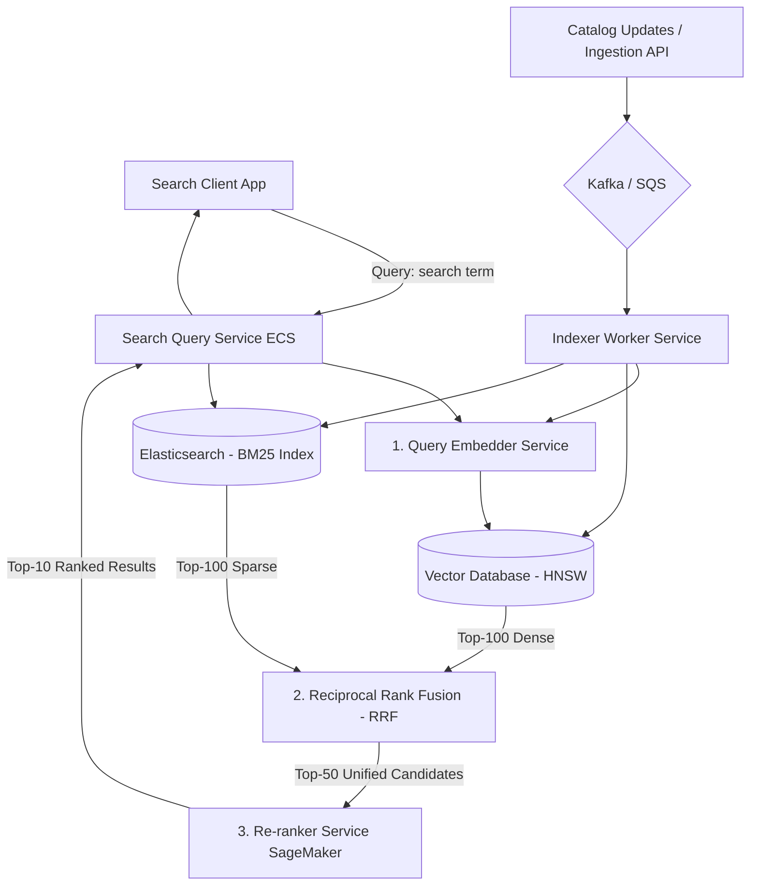
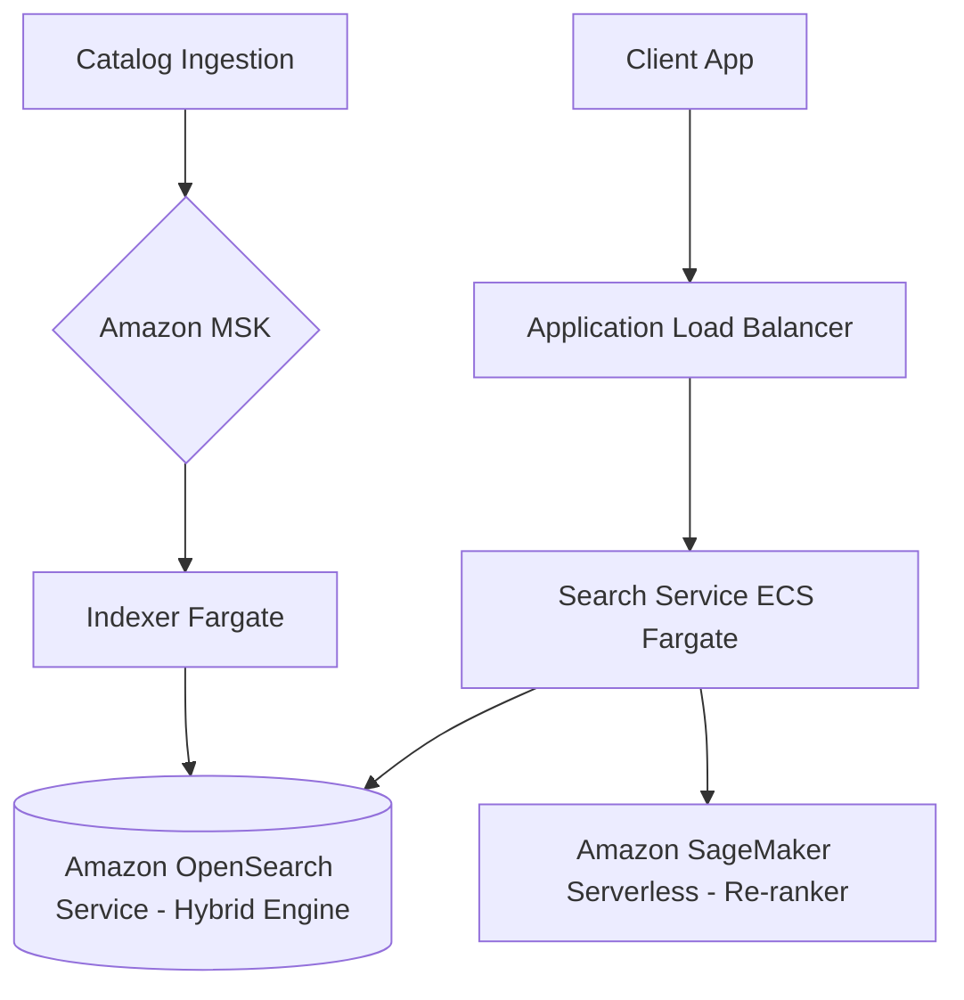

# Semantic Search System Design

This document details the production-grade system design for a high-scale **Semantic Search Engine**. The system moves beyond traditional syntactic keyword matching by converting queries and text documents into deep semantic vector representations, combining them with sparse indexes for hybrid retrieval, and scoring the results with cross-encoder re-rankers.

---

## 1. System Requirements

### Functional Requirements
* **Hybrid Search:**
  * Support keyword-based retrieval (BM25) and conceptual semantic-based retrieval (dense vector embeddings) in a single query loop.
  * Retrieve results in order of conceptual relevance, not just word matches.
* **Two-Stage Retrieval Pipeline:**
  * **Stage 1 (Recall):** Scan millions of items and return a top-100 candidate pool in $< 30\text{ms}$.
  * **Stage 2 (Precision):** Re-rank the candidates to select the top-10 most relevant results using deep attention models.
* **Language Support & Multimodality:**
  * Handle multi-lingual queries (cross-lingual retrieval: query in Spanish, retrieve English docs).
* **Dynamic Indexing:**
  * Ingest new documents, calculate embeddings, and update indexes with $< 10$ seconds propagation latency.

### Non-Functional Requirements
* **Low Latency:** End-to-end query response time must be $< 150\text{ms}$ (P95).
* **High Relevance (Recall/Precision):** Achieve higher Normalized Discounted Cumulative Gain (NDCG@10) compared to raw BM25 search.
* **High Scale:** support indexes containing up to $50\text{M}+$ documents with daily update patterns.

---

## 2. Capacity & Scale Estimation

### Assumptions
* **Total Document Catalog:** $10 \text{ Million}$ articles
* **Average Document Length:** $200 \text{ words}$ (Short product details, titles, descriptions)
* **Average Query Size:** $5 \text{ words}$
* **Throughput (QPS):** Average $500 \text{ QPS}$, Peak $2,500 \text{ QPS}$

---

## 3. High-Level Architecture

The semantic search architecture decouples document ingestion indexing from the low-latency search execution path.

### System Architecture Flowchart


---

## 4. Key Workflows & Engineering Details

### A. Late Interaction vs. Single Vector Representations

A key engineering trade-off is choosing the representation model:

```
Single Vector (Bi-Encoder):
Query ──▶ [Embedding] ──▶ Single Vector (1500 dim) ──▶ Cosine Match
* Extremely fast, low index storage overhead.

Late Interaction (ColBERT):
Query ──▶ [Multi-vector] ──▶ Matrix of vectors (vector per word token)
          ├── Matches query tokens against doc tokens dynamically
          └── LSE (MaxSim) operator
* Incredible detail, but requires 10x-20x more vector storage space.
```

* **Recommended Strategy:** A two-stage pipeline using **Single Vector representation (e.g., text-embedding-3-small) + BM25** in Stage 1, followed by a **Cross-Encoder model** in Stage 2.

---

### B. Two-Stage Search Execution

```
[User Query]
     │
     ▼
[Stage 1: Retrieval (Bi-Encoder + BM25)] ──▶ Scans 10M documents in parallel (ANN)
     │
     ▼ Returns Top-100 Candidates
     │
[Stage 2: Re-ranking (Cross-Encoder)]    ──▶ Joint attention scoring (MiniLM model)
     │
     ▼ Returns Top-10 High-Precision Results
[User Client]
```

---

## 5. Database Schema & Index Design

### 1. Elasticsearch Index Settings (Hybrid Schema)

```json
{
  "settings": {
    "index": {
      "number_of_shards": 4,
      "number_of_replicas": 1
    }
  },
  "mappings": {
    "properties": {
      "doc_id": { "type": "keyword" },
      "title": { "type": "text", "analyzer": "english" },
      "body_text": { "type": "text", "analyzer": "english" },
      "category": { "type": "keyword" },
      "vector_representation": {
        "type": "dense_vector",
        "dims": 768,
        "index": true,
        "similarity": "cosine"
      }
    }
  }
}
```

---

## 6. AWS Cloud-Native Implementation

### AWS Cloud-Native Architecture Diagram


### AWS Service Mapping & Rationale
* **Amazon OpenSearch Service (with Vector Engine):** Serves both BM25 inverted index lookups and dense vector search via KNN indices. This reduces storage cost and coordination overhead by keeping dense and sparse structures in a single engine.
* **Amazon SageMaker Serverless Inference:** Hosts the Cross-Encoder model (e.g. `bge-reranker-large`). It scales dynamically with query QPS spikes and keeps running costs low by scaling to zero during off-peak hours.
