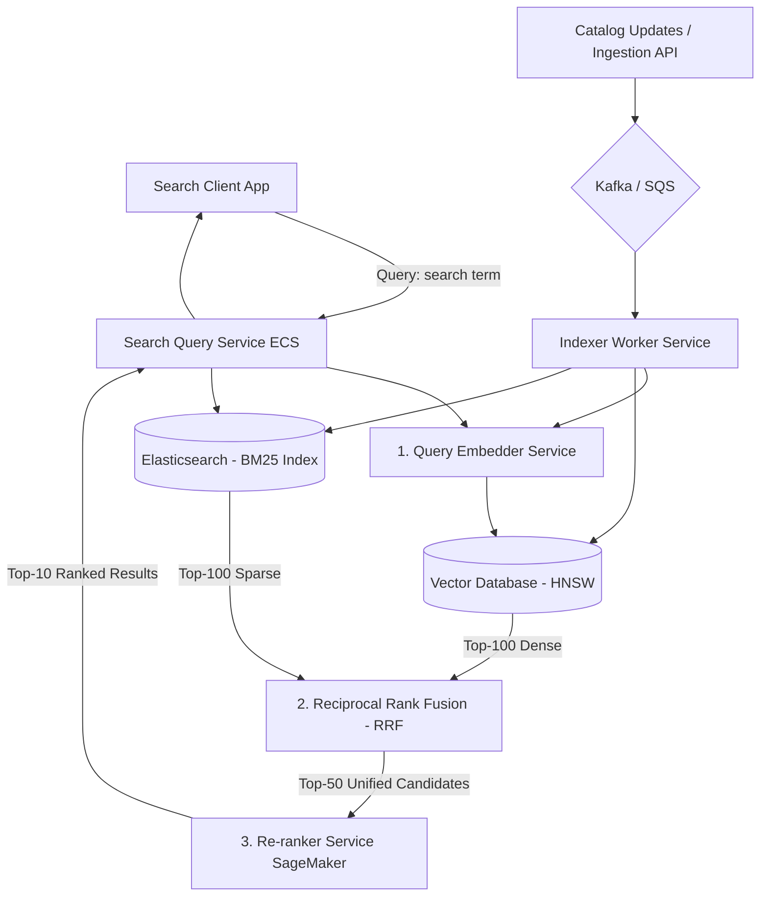
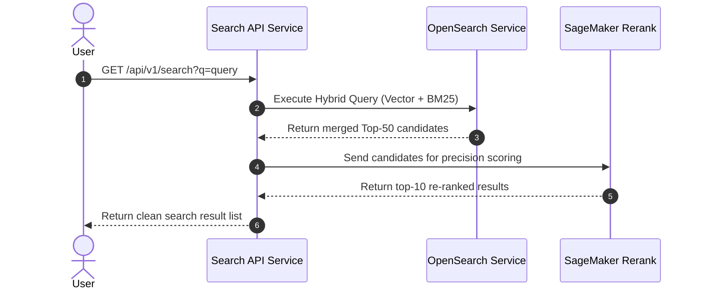

# Semantic Search System Design

This document details the production-grade system design for a high-scale **Semantic Search Engine**. The system moves beyond traditional syntactic keyword matching by converting queries and text documents into deep semantic vector representations, combining them with sparse indexes for hybrid retrieval, and scoring the results with cross-encoder re-rankers.

---

## 1. System Requirements

### Functional Requirements
* **Hybrid Search:**
  * Support keyword-based retrieval (BM25) and conceptual semantic-based retrieval (dense vector embeddings) in a single query loop.
  * Retrieve results in order of conceptual relevance, not just word matches.
* **Two-Stage Retrieval Pipeline:**
  * **Stage 1 (Recall):** Scan millions of items and return a top-100 candidate pool in $< 30\text{ms}$.
  * **Stage 2 (Precision):** Re-rank the candidates to select the top-10 most relevant results using deep attention models.
* **Language Support & Multimodality:**
  * Handle multi-lingual queries (cross-lingual retrieval: query in Spanish, retrieve English docs).
* **Dynamic Indexing:**
  * Ingest new documents, calculate embeddings, and update indexes with $< 10$ seconds propagation latency.

### Non-Functional Requirements
* **Low Latency:** End-to-end query response time must be $< 150\text{ms}$ (P95).
* **High Relevance (Recall/Precision):** Achieve higher Normalized Discounted Cumulative Gain (NDCG@10) compared to raw BM25 search.
* **High Scale:** Support indexes containing up to $50\text{M}+$ documents with daily update patterns.

---

## 2. Capacity & Scale Estimation

### Assumptions
* **Total Document Catalog:** $10 \text{ Million}$ articles
* **Average Document Length:** $200 \text{ words}$ (Short product details, titles, descriptions)
* **Average Query Size:** $5 \text{ words}$
* **Throughput (QPS):** Average $500 \text{ QPS}$, Peak $2,500 \text{ QPS}$
* **Vector Size per Doc (768 dimensions - float32):**
  $$768 \times 4 \text{ bytes} \approx 3 \text{ KB}$$
* **Catalog Storage Requirement:**
  $$10,000,000 \text{ documents} \times 3 \text{ KB} \approx 30 \text{ GB}$$

---

## 3. High-Level Architecture

The semantic search architecture decouples document ingestion indexing from the low-latency search execution path.


### System Architecture Flowchart


### Core Components
1. **Query Embedder:** Converts user queries into vector space using an embedding service.
2. **Dense Vector Database:** Stores HNSW vector graphs for semantic search lookup.
3. **Keyword Index (Elasticsearch):** Performs exact keyword (BM25) search.
4. **Re-ranker Service:** High-precision Transformer scoring module that reorganizes candidate lists.

---

## 4. Component-Level Design

### A. Late Interaction vs. Single Vector Representations

A key engineering trade-off is choosing the representation model:

| Model Type | Precision | Storage Cost | Indexing Latency | Best Use Case |
| :--- | :--- | :--- | :--- | :--- |
| **Single Vector (Bi-Encoder) ✅** | Moderate-High | Low (600 GB for 100M) | Low | Standard web & product search. |
| **Late Interaction (ColBERT)** | Very High | High (6 TB for 100M) | Medium-High | High-precision academic search. |

---

### B. Reciprocal Rank Fusion (RRF)

We merge dense and sparse results using the RRF algorithm to score each candidate document:

$$\text{RRF\_score}(d) = \sum_{r \in \text{retrievers}} \frac{1}{60 + \text{rank}_r(d)}$$

---

## 5. Database Schema & Partitioning Strategy

### 1. Elasticsearch Index Settings (Hybrid Schema)

```json
{
  "settings": {
    "index": {
      "number_of_shards": 4,
      "number_of_replicas": 1
    }
  },
  "mappings": {
    "properties": {
      "doc_id": { "type": "keyword" },
      "title": { "type": "text", "analyzer": "english" },
      "body_text": { "type": "text", "analyzer": "english" },
      "category": { "type": "keyword" },
      "vector_representation": {
        "type": "dense_vector",
        "dims": 768,
        "index": true,
        "similarity": "cosine"
      }
    }
  }
}
```

### 2. Sharding & Scaling
* **OpenSearch Shards:** Split catalog index into 4 primary shards mapped to separate compute nodes to distribute the search workload.

---

## 6. API Design & Payloads

### 1. Hybrid Search Query
* **Endpoint:** `GET /api/v1/search`
* **Query Params:** `q=machine+learning+tutorial&limit=10`
* **Response:**
```json
{
  "results": [
    {
      "doc_id": "doc_9988",
      "title": "ML Intro Guide",
      "score": 0.985
    }
  ]
}
```

---

## 7. End-to-End Workflow Sequence



---

## 8. Scalability & Resilience Strategies
* **Search Read Cache:** Cache common search queries and their final top-10 outputs in Redis for 10 minutes to shield downstream OpenSearch indices.
* **Batch Indexing:** Buffer ingestion changes in MSK Kafka before writing updates to indexing clusters.

---

## 9. Disaster Recovery & Multi-Region Failover Strategy
* **Cross-Region Replication:** Ingest catalog logs dynamically into multiple AWS regions simultaneously, maintaining two active search instances. If a primary region fails, DNS failover redirects client traffic.

---

## 10. AWS Cloud-Native Implementation

### AWS Service Mapping & Rationale

| Generic Component | AWS Service | Design Details & Rationale |
| :--- | :--- | :--- |
| **Search Engine** | **Amazon OpenSearch Service** | Handles both vector mappings and inverted text indexes. |
| **Re-ranker** | **Amazon SageMaker Serverless** | Deploys a Transformer model to re-score final query-candidate pairs. |
| **Ingestion Pipeline** | **Amazon MSK (Kafka)** | Queues metadata catalogs to indexers without search interference. |

---

## 11. Technology Justification: Why We Use

### A. Amazon OpenSearch (Hybrid Search Engine)
* **Why We Use It:** OpenSearch provides a production-grade inverted index for BM25 text searches and a vector engine for HNSW graph traversal. Using one tool avoids complex consistency sync loops.

### B. SageMaker Serverless Inference (Reranker)
* **Why We Use It:** Cross-encoder models are computationally expensive (require GPU or highly targeted CPU runs). SageMaker Serverless provides scaling, auto-provisioning, and zero idle cost.
