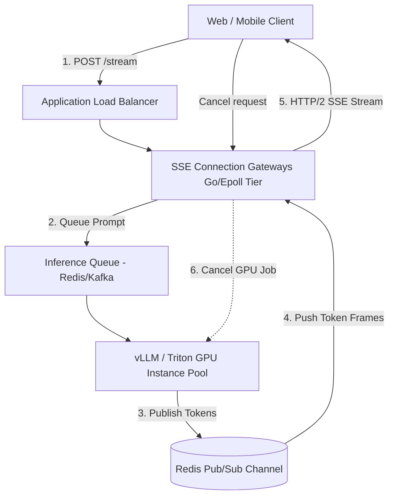
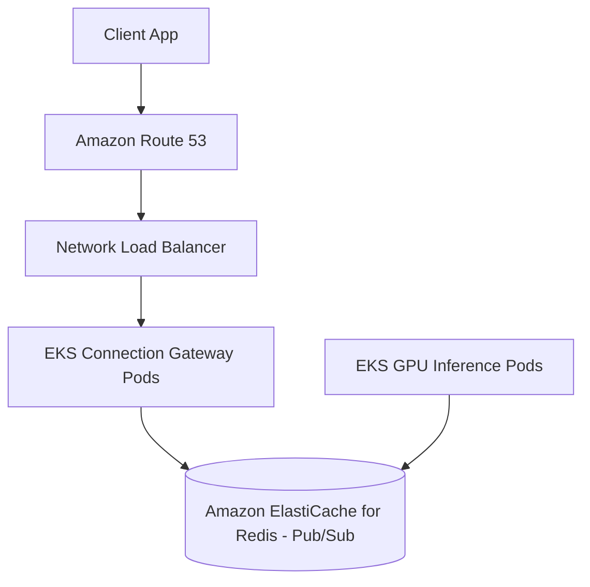

# Token Streaming System Design

This document details the production-grade system design for a high-concurrency **Token Streaming Service** (comparable to the streaming response backends used by ChatGPT, Claude, and Gemini). The service is optimized to stream LLM generation outputs token-by-token in real-time, maintain long-lived server-to-client connections at scale, handle network backpressure, and track metrics (TTFT, tokens/sec) asynchronously.

---

## 1. System Requirements

### Functional Requirements
* **Real-time Token Delivery:**
  * Stream response text character-by-character or token-by-token directly from inference engines to clients in real-time.
  * Support Server-Sent Events (SSE) as the primary streaming protocol over HTTP/2 and HTTP/3.
* **Metadata & Termination Frames:**
  * Deliver auxiliary frames (e.g., source citations, token cost stats, safety flags) alongside text tokens.
  * Send clean termination signals (`[DONE]`) to mark completion of stream generations.
* **Session Lifecycle:**
  * Support request cancellation (if a user clicks "Stop Generating", immediately signal and stop the backend GPU inference run to conserve resources).

### Non-Functional Requirements
* **Low Time-To-First-Token (TTFT):** First-token latency must be $< 100\text{ms}$ at the streaming layer.
* **Massive Concurrency:** Support $100,000+$ active concurrent streams without connection drops or thread exhaustion.
* **Resource Optimization (Backpressure Management):** If a client has a slow cellular network connection, buffer tokens gracefully without bloating server memory or blocking the GPU execution loop.
* **API Gateway Timeout Bypass:** Avoid standard gateway timeouts (usually 30s) by utilizing chunked HTTP transfer encoding.

---

## 2. Capacity & Scale Estimation

### Assumptions
* **Active Concurrent Streams:** $100,000$ users actively streaming
* **Token Generation Rate:** Average $40 \text{ tokens/sec}$ per stream
* **Average Token Payload Size:** $150 \text{ bytes}$ (JSON frame containing token text, position, and session ID)
* **Combined Ingress Throughput:**
  $$100,000 \text{ streams} \times 40 \text{ tokens/sec} = 4,000,000 \text{ token updates/sec}$$
* **Network Egress Bandwidth Needed:**
  $$4,000,000 \text{ updates/sec} \times 150 \text{ bytes} = 600 \text{ MB/s} \approx 4.8 \text{ Gbps}$$
  This requires a distributed tier of connection gateways scaled horizontally across high-bandwidth networks.

---

## 3. High-Level Architecture

The streaming architecture segregates the **Heavy Compute Tier** (GPU Inference Servers) from the **Persistent Connection Tier** (SSE Connection Gateways).

### System Architecture Flowchart


---

## 4. Key Workflows & Engineering Details

### A. Protocol Selection: SSE vs. WebSockets vs. gRPC

Choosing the client-facing transport protocol:

| Protocol | Protocol Overhead | Unidirectional / Bidirectional | Browser Native | Auto-Reconnect |
| :--- | :--- | :--- | :--- | :--- |
| **WebSockets** | High (Custom frame parsing) | Bidirectional (Full duplex) | Yes | No (requires custom wrapper) |
| **gRPC-Web** | Medium (Requires Envoy translation) | Bidirectional | No | No |
| **Server-Sent Events (SSE) ✅**| **Low (Text-based chunked streams)** | **Unidirectional (Server-to-client)**| **Yes (EventSource API)**| **Yes (Native browser support)** |

* **Why SSE Wins for LLM Delivery:** LLM generation is strictly unidirectional (the client submits a query once, then the server streams output for seconds or minutes). SSE runs natively over standard HTTP/2, bypassing proxy blocking issues, and handles reconnections automatically.

---

### B. Connection Concurrency (Go / Epoll Model)

Standard thread-per-connection models (like traditional Apache or basic Java threadpools) crash when handling 100k concurrent connections due to RAM exhaustion.
* **The Solution:** The Connection Gateways are built using Go or Rust with non-blocking I/O multiplexing (`epoll` on Linux, `kqueue` on macOS).
* **Memory footprint:** Each idle connection is represented by a tiny file descriptor state (~2–4 KB) rather than an active system thread (which costs ~1–2 MB), keeping gateway RAM footprint low (~400 MB RAM total for 100k concurrent idle clients).

---

### C. Backpressure Handling

If a client's network link is slow, the client cannot read TCP packets as fast as the GPU generates tokens.

```
[vLLM Engine] ──▶ generates 40 tokens/s ──▶ [In-Memory Channel Buffer (Ring Buffer)]
                                                       │
                                                       ├──▶ Client Reads Fast: Stream continues
                                                       └──▶ Client Reads Slow: Buffer fills up
                                                                     │
                                                                     ▼
                                                      Drop older tokens / Pause GPU stream 
                                                      generation for that worker thread
```

1. **Ring Buffer per Stream:** Each connection gateway maintains an in-memory ring buffer (e.g., 50 token slots).
2. **Buffer Overflow Strategy:** If the buffer fills, the gateway sends a pause signal back to the inference coordinator, letting the GPU release memory or prioritize other tasks.

---

## 5. Database Schema & API Payload

### 1. Unified Event Stream Payloads (SSE Packets)

```
data: {"type": "content", "token": "hello", "index": 0}

data: {"type": "content", "token": " world", "index": 1}

data: {"type": "metadata", "citations": [{"index": 1, "url": "https://company.wiki"}]}

data: {"type": "usage", "prompt_tokens": 12, "completion_tokens": 2, "cost_usd": 0.0003}

data: [DONE]
```

---

## 6. AWS Cloud-Native Implementation

### AWS Cloud-Native Architecture Diagram


### AWS Service Mapping & Rationale
* **Network Load Balancer (NLB):** Essential for maintaining hundreds of thousands of long-lived, high-throughput TCP connections. Application Load Balancers (ALBs) are prone to keep-alive limits at this scale.
* **Amazon EKS (EC2 C6g / C6i instances):** Runs the connection gateways. High CPU/Network bandwidth optimized nodes.
* **Amazon ElastiCache (Redis):** Pub/Sub model decouples GPU inference engines (which generate tokens) from the connection pods.
