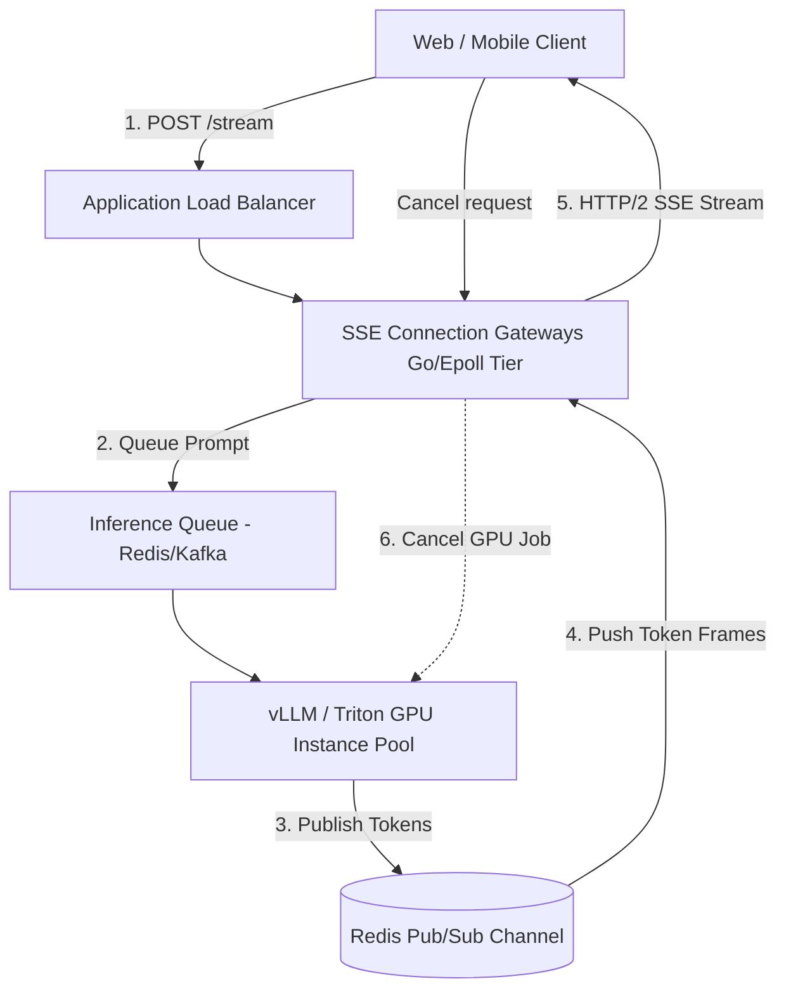
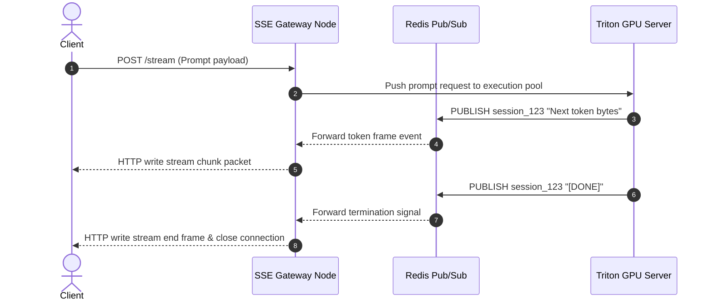

# Token Streaming System Design

This document details the production-grade system design for a high-concurrency **Token Streaming Service** (comparable to the streaming response backends used by ChatGPT, Claude, and Gemini). The service is optimized to stream LLM generation outputs token-by-token in real-time, maintain long-lived server-to-client connections at scale, handle network backpressure, and track metrics (TTFT, tokens/sec) asynchronously.

---

## 1. System Requirements

### Functional Requirements
* **Real-time Token Delivery:**
  * Stream response text character-by-character or token-by-token directly from inference engines to clients in real-time.
  * Support Server-Sent Events (SSE) as the primary streaming protocol over HTTP/2 and HTTP/3.
* **Metadata & Termination Frames:**
  * Deliver auxiliary frames (e.g., source citations, token cost stats, safety flags) alongside text tokens.
  * Send clean termination signals (`[DONE]`) to mark completion of stream generations.
* **Session Lifecycle:**
  * Support request cancellation (if a user clicks "Stop Generating", immediately signal and stop the backend GPU inference run to conserve resources).

### Non-Functional Requirements
* **Low Time-To-First-Token (TTFT):** First-token latency must be $< 100\text{ms}$ at the streaming layer.
* **Massive Concurrency:** Support $100,000+$ active concurrent streams without connection drops or thread exhaustion.
* **Resource Optimization (Backpressure Management):** If a client has a slow cellular network connection, buffer tokens gracefully without bloating server memory or blocking the GPU execution loop.
* **API Gateway Timeout Bypass:** Avoid standard gateway timeouts (usually 30s) by utilizing chunked HTTP transfer encoding.

---

## 2. Capacity & Scale Estimation

### Assumptions
* **Active Concurrent Streams:** $100,000$ users actively streaming
* **Token Generation Rate:** Average $40 \text{ tokens/sec}$ per stream
* **Average Token Payload Size:** $150 \text{ bytes}$ (JSON frame containing token text, position, and session ID)
* **Combined Ingress Throughput:**
  $$100,000 \text{ streams} \times 40 \text{ tokens/sec} = 4,000,000 \text{ token updates/sec}$$
* **Network Egress Bandwidth Needed:**
  $$4,000,000 \text{ updates/sec} \times 150 \text{ bytes} = 600 \text{ MB/s} \approx 4.8 \text{ Gbps}$$
  *This requires a distributed tier of connection gateways scaled horizontally across high-bandwidth networks.*

---

## 3. High-Level Architecture

The streaming architecture segregates the **Heavy Compute Tier** (GPU Inference Servers) from the **Persistent Connection Tier** (SSE Connection Gateways).


### System Architecture Flowchart


### Core Components
1. **Application Load Balancer (ALB):** Manages long-lived HTTP/2 TCP streams.
2. **SSE Connection Gateways:** High-concurrency Go/Rust handlers using Epoll to track active SSE connections.
3. **Inference Queue (Redis/Kafka):** Decouples request batches from active model runner nodes.
4. **GPU Inference Pool:** High-throughput cluster hosts Triton/vLLM engines.

---

## 4. Component-Level Design

### A. Protocol Comparison

Choosing the right client transport format determines connection scalability:

| Protocol | Overhead | Bidirectional Support | Browser Compatibility | Best Use Case |
| :--- | :--- | :--- | :--- | :--- |
| **WebSockets** | High | Yes | Native | Chat applications with heavy user inputs. |
| **Server-Sent Events (SSE) ✅**| **Low** | **No (Server-to-client only)**| **Native** | **Standard LLM streaming outputs.** |
| **gRPC-Web** | Medium | Yes | Requires proxy setup | Internal platform microservices. |

---

### B. Connection Concurrency (Go / Epoll Model)

Standard thread-per-connection models (like traditional Apache or basic Java threadpools) crash when handling 100k concurrent connections due to RAM exhaustion.
* **The Solution:** The Connection Gateways are built using Go or Rust with non-blocking I/O multiplexing (`epoll` on Linux, `kqueue` on macOS).
* **Memory footprint:** Each idle connection is represented by a tiny file descriptor state (~2–4 KB) rather than an active system thread (which costs ~1–2 MB), keeping gateway RAM footprint low (~400 MB RAM total for 100k concurrent idle clients).

---

## 5. Database Schema & State Strategy

### 1. Active Stream State (In-Memory Redis Hash)

```
Key: active_stream:{session_id}
Fields:
  - client_ip: "102.15.22.1"
  - gateway_node_id: "gateway-pod-12"
  - tokens_sent: 142
  - started_at: 1784616000
```

### 2. Sharding & Cache Tuning
* **Redis Pub/Sub Channels:** Message channels are sharded across a Redis Cluster according to `session_id` hash slots, ensuring single-node pub/sub broker load stays under 50k events/sec.

---

## 6. API Design & Payloads

### 1. HTTP Server-Sent Event Streams
* **Endpoint:** `POST /api/v1/chat/stream`
* **Response Headers:**
```
Content-Type: text/event-stream
Cache-Control: no-cache
Connection: keep-alive
```
* **Payload Packets:**
```
data: {"token": "The", "index": 0}
data: {"token": " quick", "index": 1}
data: [DONE]
```

---

## 7. End-to-End Workflow Sequence



---

## 8. Scalability & Resilience Strategies
* **Client Backpressure Handling:** Use bounded ring buffers (size 50 frames) for every active connection. If a slow network client falls behind, pause token consumption from Redis Pub/Sub for that thread.
* **Graceful Egress Sharding:** Scale gateway nodes behind a TCP Network Load Balancer (NLB) using round-robin routing.

---

## 9. Disaster Recovery & Multi-Region Failover Strategy
* **Anycast Global IP Failover:** Route streaming endpoints through Route 53 latency zones. If an AWS region drops, client SDKs immediately reconnect to active gateway endpoints in secondary regions.

---

## 10. AWS Cloud-Native Implementation

### AWS Service Mapping & Rationale

| Generic Component | AWS Service | Design Details & Rationale |
| :--- | :--- | :--- |
| **Load Balancer** | **Network Load Balancer (NLB)** | Handles millions of long-lived TCP sockets without the timeout limits of ALB. |
| **Gateway Nodes** | **Amazon EKS (EC2 C6g pods)** | Runs low-latency Go-epoll connection daemons. |
| **Decoupling Bus** | **Amazon ElastiCache for Redis** | High-performance Pub/Sub channel cluster. |

---

## 11. Technology Justification: Why We Use

### A. Network Load Balancer (NLB)
* **Why We Use It:** Streaming models need to bypass HTTP timeouts. ALB terminates TCP sessions and enforces a hard idle timeout (max 4000s, default 60s). NLB passes raw TCP packets directly to the EKS pods, allowing long streams to persist indefinitely.

### B. Redis (Pub/Sub Event Broker)
* **Why We Use It:** Decoupling inference GPU engines from proxy pods is necessary. If the GPU wrote directly to the proxy gateway container, proxy scaling shifts would break the network target pathways. Redis Pub/Sub bridges this dynamically.
