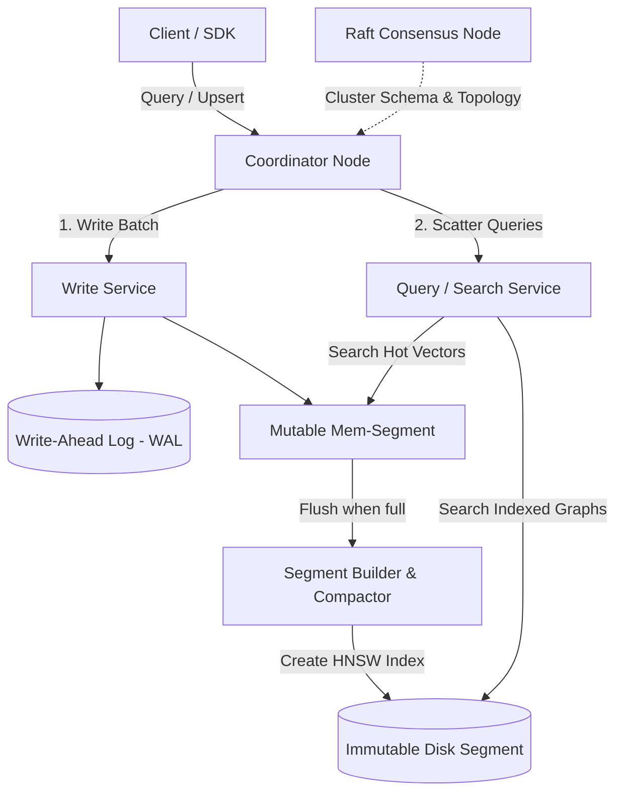
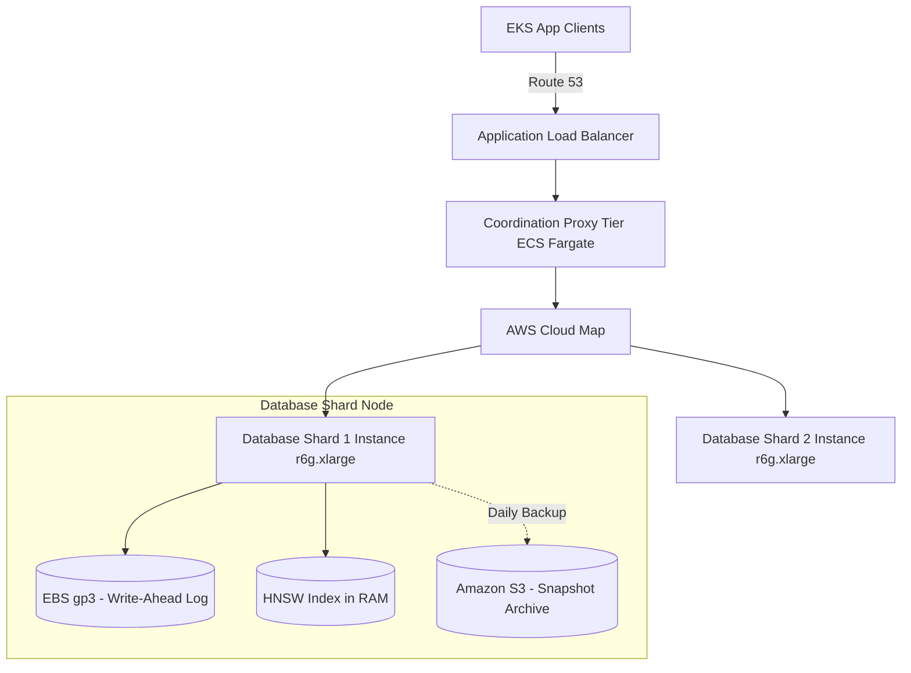

# Vector Database System Design

This document details the production-grade system design for a highly scalable, real-time **Vector Database** (comparable to Qdrant, Milvus, or Pinecone). The database is optimized to store, index, update, and search high-dimensional vector embeddings alongside scalar metadata payloads with sub-20ms search latency over billions of points.

---

## 1. System Requirements

### Functional Requirements
* **Insert / Update / Delete (Upsert):**
  * Support real-time ingestion of high-dimensional vectors (e.g., 512, 1024, or 1536 dimensions) with unique IDs and optional unstructured metadata payloads (JSON).
  * Fast update of vectors/payloads and support soft/hard deletes.
* **Vector Search (ANN):**
  * Query the database using a vector and return the top-$k$ Approximate Nearest Neighbors (ANN).
  * Support key distance metrics: Cosine Similarity, Dot Product, and L2 (Euclidean) Distance.
* **Filtered Search (Hybrid Filtering):**
  * Support metadata filtering (e.g., search for vectors where `price < 50` AND `category = "electronics"`).
  * Enforce *Pre-Filtering* (evaluating metadata filters *during* the graph traversal) rather than post-filtering to guarantee high recall.
* **Schema Management:**
  * Support dynamic schemas or strictly typed schemas for metadata fields.

### Non-Functional Requirements
* **Low Latency:** ANN queries must execute in $< 15\text{ms}$ (P95) for indexed segments.
* **High Recall:** The ANN index must achieve $\geq 95\text{–}98\%$ recall accuracy compared to exact flat search.
* **High Ingestion Throughput:** Efficient write-path handling batch upserts (e.g., 10k+ vectors/sec per node) using a Write-Ahead Log (WAL) and memory segment buffer.
* **Storage / Memory Efficiency:** Optimize memory footprint using quantization techniques (Scalar Quantization, Product Quantization) since vector indexes are extremely RAM-heavy.
* **Horizontal Scalability:** Support sharding and replication for multi-tenant, distributed workloads.

---

## 2. Capacity & Scale Estimation

### Assumptions
* **Dataset Size:** $100 \text{ Million}$ vectors
* **Dimensions:** $1536$ (OpenAI `text-embedding-3-large`)
* **Vector Data Type:** `float32` (4 bytes per scalar element)
* **Metadata Payload Size:** Average $256 \text{ bytes}$ per point
* **Index Type:** HNSW (Hierarchical Navigable Small World) with links parameter $M = 16$

### Raw Storage Estimation (Vector & Metadata)
* **Raw Vector Size per Point:**
  $$1536 \text{ dims} \times 4 \text{ bytes} = 6,144 \text{ bytes } (\approx 6 \text{ KB})$$
* **Total Raw Vector Data:**
  $$100,000,000 \text{ points} \times 6 \text{ KB} = 600 \text{ GB}$$
* **Total Metadata Payload Data:**
  $$100,000,000 \text{ points} \times 256 \text{ bytes} \approx 25.6 \text{ GB}$$

### HNSW Index Memory Overhead
HNSW constructs a multi-layer graph of linked points. The memory overhead is dominated by the adjacency list (neighbor pointers).
* Each node has an average of $M \times 2$ links (across layers). For $M = 16$: $32 \text{ pointers}$ of $8 \text{ bytes}$ each.
* Adjacency overhead per node:
  $$32 \text{ links} \times 8 \text{ bytes} = 256 \text{ bytes}$$
* **Total Memory Required (Raw Vector + Index Overhead) without Quantization:**
  $$100,000,000 \times (6,144 \text{ bytes} + 256 \text{ bytes}) \approx 640 \text{ GB RAM}$$

### Quantization Optimization (Scalar Quantization - SQ8)
By converting `float32` vectors (4 bytes per dim) into quantized `int8` representation (1 byte per dim):
* Quantized Vector Size: $1536 \text{ dims} \times 1 \text{ byte} = 1,536 \text{ bytes}$
* **Quantized Total Memory Required (Vector + Index):**
  $$100,000,000 \times (1,536 \text{ bytes} + 256 \text{ bytes}) \approx \mathbf{179.2 \text{ GB RAM}}$$
  *This is a **72% reduction** in memory, allowing the index to scale economically on standard memory-optimized instances.*

---

## 3. High-Level Architecture

The system splits read paths and write paths using a **Segment-Based LSM-Tree-like Architecture** optimized for vector indexes.


### System Architecture Flowchart


### Core Components

1. **Coordinator Node:** Entry point that handles cluster routing. For queries, it scatters searches across shards and aggregates results (gather). For writes, it routes batches to target shard primary nodes.
2. **Write-Ahead Log (WAL):** Persists all incoming upsert operations sequentially to local disk for crash recovery before acknowledging writes.
3. **Memtable (Mutable Segment):** In-memory buffer storing newly upserted vectors. Searches scan this segment linearly (flat exact search) since constructing an HNSW index on-the-fly is too slow.
4. **Segment Builder / Compactor:** Periodically flushes full Memtables to disk. It runs an offline background builder that constructs the HNSW index structure and outputs read-only, immutable disk segments.
5. **Immutable Disk Segments:** Read-only segments containing the optimized HNSW graph index, quantized vectors, and metadata tables mapped directly in-memory via `mmap`.

---

## 4. Key Workflows & Engineering Details

### A. Indexing Strategies — HNSW vs. IVF-PQ

Selecting the right indexing algorithm determines the recall/latency trade-off:

| Algorithm | How It Works | Query Latency | Recall Rate | Memory Footprint | Best Use Case |
| :--- | :--- | :--- | :--- | :--- | :--- |
| **Flat Index (Exact)** | Brute force linear scan ($\mathcal{O}(N)$). | High (slows down linearly) | $100\%$ (Exact) | Low | Small datasets (< 100k vectors) |
| **IVF-PQ (Inverted File)** | Clustered centroids (K-Means) + Product Quantization codebooks. | Medium ($10\text{–}30\text{ms}$) | $85\text{–}95\%$ | Very Low (up to 95% reduction) | Cost-sensitive billions-scale search |
| **HNSW (Graph-Based) ✅** | Multi-layer skip-list graphs where edges connect similar vectors. | Low ($< 5\text{ms}$) | **High ($95\text{–}99\%$)** | High (needs all graph nodes/links in memory) | **Default choice** for low-latency, high-accuracy RAG |

---

### B. pre-filtering vs. Post-Filtering

When searching vectors with scalar metadata filters, the execution order is critical.

```
Post-Filtering (Naive):
[Query Vector] ──▶ [HNSW ANN Search (Top-k)] ──▶ [Filter Metadata] ──▶ Return results (Recall drops if items filtered out)

Pre-Filtering / Single-Stage Search (Correct):
[Query Vector + Filter] ──▶ [Traverse HNSW Graph]
                                  │
                                  ├──▶ If neighbor matches filter: Add to candidate pool
                                  └──▶ If neighbor fails filter: Skip link, traverse next edge
```

* **Why Post-Filtering Fails:** If the HNSW search returns the top-10 nearest vectors, but 9 of them do not match the filter `category = "shoes"`, the client receives only 1 result instead of 10. The recall rate collapses.
* **Pre-Filtering (Single-Stage Filter Graph Search):** The metadata index is integrated directly into the graph traversal logic. When visiting nodes in the HNSW layers, neighbor links are skipped dynamically if they do not satisfy the filter constraints.

---

### C. Write & Flush Path

1. **Upsert Request:** Client sends a batch of vector points.
2. **WAL Append:** The write service appends the raw vector, ID, and payload to the Write-Ahead Log.
3. **Memtable Ingestion:** Point is inserted into the active memory segment (Memtable). An inverted index is updated in memory for metadata filters.
4. **Segment Flush:** When the Memtable reaches threshold capacity (e.g., 500,000 vectors), it is closed to new writes and a background thread is spawned:
   * It calculates the quantization metrics for the segment.
   * It builds the HNSW graph layers from scratch.
   * It serializes the HNSW links, quantized vectors, and payload blocks into a single immutable segment file on disk.

---

## 5. Database Schema & Segment Layout

To avoid loading entire file payloads into RAM, segment files are divided into separate block areas.

### 1. Disk Segment File Structure

```
┌────────────────────────────────────────────────────────┐
│ Segment Header (Magic bytes, format version, stats)   │
├────────────────────────────────────────────────────────┤
│ Quantized Vectors Block (Fast cosine/dot calculation)  │
├────────────────────────────────────────────────────────┤
│ HNSW Graph Links Block (Adjacency lists mapped via mmap)│
├────────────────────────────────────────────────────────┤
│ Metadata Key-Value Blocks (Protobuf/FlatBuffers payload)│
├────────────────────────────────────────────────────────┤
│ Payload Index (B-Tree/Bitmap indexes for filters)     │
└────────────────────────────────────────────────────────┘
```

### 2. Client API Schema (Upsert Payload)

```json
{
  "points": [
    {
      "id": "1a2b3c4d-5e6f-7a8b-9c0d-1e2f3a4b5c6d",
      "vector": [0.0123, -0.0456, 0.7891, 0.1234],
      "payload": {
        "title": "Introduction to RAG",
        "category": "articles",
        "view_count": 1420,
        "is_active": true
      }
    }
  ]
}
```

---

## 6. AWS Cloud-Native Implementation

For a production cloud deployment, the system uses memory-optimized nodes for the active querying segment layer and object storage for snapshot state persistence.

### AWS Cloud-Native Architecture Diagram


### AWS Service Mapping & Design Choices

| Component | AWS Service | Design Rationale |
| :--- | :--- | :--- |
| **Proxy / Coordinator** | **Amazon ECS Fargate** | Coordinates sharding maps and acts as the entry point. Stateless, auto-scales based on gateway connection load. |
| **Database Shards** | **Amazon EC2 (r6g / r6i instances)** | High memory-to-CPU ratio instances (e.g., `r6g.2xlarge` with 64 GB RAM) hosting the active index segment, vector calculations, and graph traversal logic. |
| **WAL Storage** | **Amazon EBS (gp3)** | High IOPS SSD volume mounted directly on EC2 shard nodes to handle sequential write streams to the WAL. |
| **Snapshot Cold Store** | **Amazon S3** | Inactive, compressed segments and cluster configurations are stored on S3. When a database node recovers, it pulls snapshots from S3 to rebuild its index state. |
