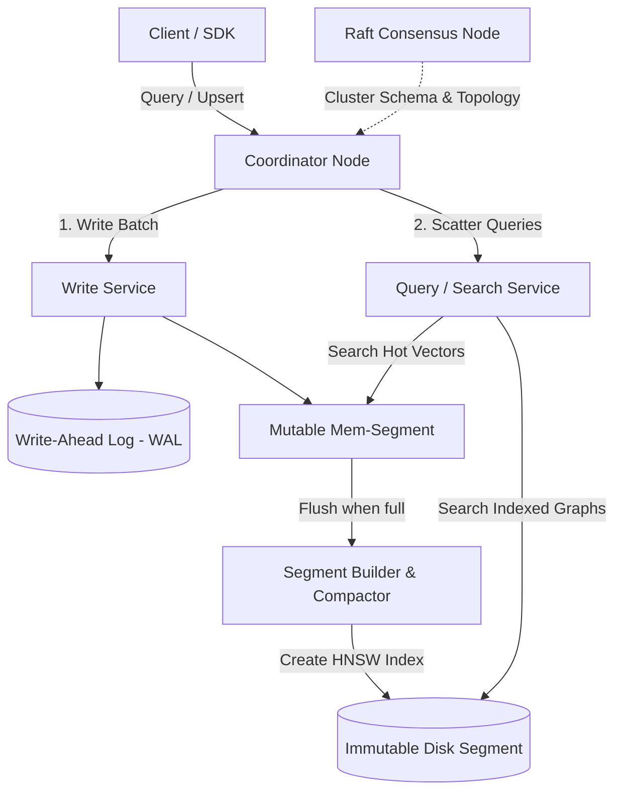
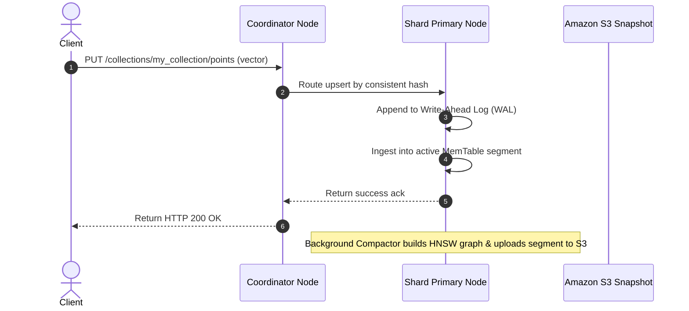

# Vector Database System Design

This document details the production-grade system design for a highly scalable, real-time **Vector Database** (comparable to Qdrant, Milvus, or Pinecone). The database is optimized to store, index, update, and search high-dimensional vector embeddings alongside scalar metadata payloads with sub-20ms search latency over billions of points.

---

## 1. System Requirements

### Functional Requirements
* **Insert / Update / Delete (Upsert):**
  * Support real-time ingestion of high-dimensional vectors (e.g., 512, 1024, or 1536 dimensions) with unique IDs and optional unstructured metadata payloads (JSON).
  * Fast update of vectors/payloads and support soft/hard deletes.
* **Vector Search (ANN):**
  * Query the database using a vector and return the top-$k$ Approximate Nearest Neighbors (ANN).
  * Support key distance metrics: Cosine Similarity, Dot Product, and L2 (Euclidean) Distance.
* **Filtered Search (Hybrid Filtering):**
  * Support metadata filtering (e.g., search for vectors where `price < 50` AND `category = "electronics"`).
  * Enforce *Pre-Filtering* (evaluating metadata filters *during* the graph traversal) rather than post-filtering to guarantee high recall.
* **Schema Management:**
  * Support dynamic schemas or strictly typed schemas for metadata fields.

### Non-Functional Requirements
* **Low Latency:** ANN queries must execute in $< 15\text{ms}$ (P95) for indexed segments.
* **High Recall:** The ANN index must achieve $\geq 95\text{–}98\%$ recall accuracy compared to exact flat search.
* **High Ingestion Throughput:** Efficient write-path handling batch upserts (e.g., 10k+ vectors/sec per node) using a Write-Ahead Log (WAL) and memory segment buffer.
* **Storage / Memory Efficiency:** Optimize memory footprint using quantization techniques (Scalar Quantization, Product Quantization) since vector indexes are extremely RAM-heavy.
* **Horizontal Scalability:** Support sharding and replication for multi-tenant, distributed workloads.

---

## 2. Capacity & Scale Estimation

### Assumptions
* **Dataset Size:** $100 \text{ Million}$ vectors
* **Dimensions:** $1536$ (OpenAI `text-embedding-3-large`)
* **Vector Data Type:** `float32` (4 bytes per scalar element)
* **Metadata Payload Size:** Average $256 \text{ bytes}$ per point
* **Index Type:** HNSW (Hierarchical Navigable Small World) with links parameter $M = 16$

### Raw Storage Estimation (Vector & Metadata)
* **Raw Vector Size per Point:**
  $$1536 \text{ dims} \times 4 \text{ bytes} = 6,144 \text{ bytes } (\approx 6 \text{ KB})$$
* **Total Raw Vector Data:**
  $$100,000,000 \text{ points} \times 6 \text{ KB} = 600 \text{ GB}$$
* **Total Metadata Payload Data:**
  $$100,000,000 \text{ points} \times 256 \text{ bytes} \approx 25.6 \text{ GB}$$

### HNSW Index Memory Overhead
HNSW constructs a multi-layer graph of linked points. The memory overhead is dominated by the adjacency list (neighbor pointers).
* Each node has an average of $M \times 2$ links (across layers). For $M = 16$: $32 \text{ pointers}$ of $8 \text{ bytes}$ each.
* Adjacency overhead per node:
  $$32 \text{ links} \times 8 \text{ bytes} = 256 \text{ bytes}$$
* **Total Memory Required (Raw Vector + Index Overhead) without Quantization:**
  $$100,000,000 \times (6,144 \text{ bytes} + 256 \text{ bytes}) \approx 640 \text{ GB RAM}$$

### Quantization Optimization (Scalar Quantization - SQ8)
By converting `float32` vectors (4 bytes per dim) into quantized `int8` representation (1 byte per dim):
* Quantized Vector Size: $1536 \text{ dims} \times 1 \text{ byte} = 1,536 \text{ bytes}$
* **Quantized Total Memory Required (Vector + Index):**
  $$100,000,000 \times (1,536 \text{ bytes} + 256 \text{ bytes}) \approx \mathbf{179.2 \text{ GB RAM}}$$

---

## 3. High-Level Architecture

The system splits read paths and write paths using a **Segment-Based LSM-Tree-like Architecture** optimized for vector indexes.


### System Architecture Flowchart


### Core Components
1. **Coordinator Node:** Manages cluster topology and maps queries to active node shards.
2. **Write-Ahead Log (WAL):** Durably commits vectors to local disk before memory insertion.
3. **Memtable (Mutable Segment):** In-memory buffer storing fresh unsorted vectors.
4. **Segment Compactor:** Runs background thread pools compiling closed segments into HNSW indices.

---

## 4. Component-Level Design

### B. pre-filtering vs. Post-Filtering

When searching vectors with scalar metadata filters, the execution order is critical.

| Filtering Type | Method | Recall Impact | Search Complexity |
| :--- | :--- | :--- | :--- |
| **Post-Filtering** | Run ANN search first, discard mismatches | Low recall (results truncated) | $\mathcal{O}(\log N)$ |
| **Pre-Filtering ✅** | Traverse graph, ignore mismatch links | **High recall (guaranteed target count)**| $\mathcal{O}(\log N)$ |

---

## 5. Database Schema & Segment Layout

To avoid loading entire file payloads into RAM, segment files are divided into separate block areas.

### 1. Disk Segment File Structure
```
┌────────────────────────────────────────────────────────┐
│ Segment Header (Magic bytes, format version, stats)   │
├────────────────────────────────────────────────────────┤
│ Quantized Vectors Block (Fast cosine/dot calculation)  │
├────────────────────────────────────────────────────────┤
│ HNSW Graph Links Block (Adjacency lists mapped via mmap)│
├────────────────────────────────────────────────────────┤
│ Metadata Key-Value Blocks (Payload dictionary)         │
├────────────────────────────────────────────────────────┤
│ Payload Index (B-Tree/Bitmap indexes for filters)     │
└────────────────────────────────────────────────────────┘
```

### 2. Client API Schema (Upsert Payload)
```json
{
  "points": [
    {
      "id": "1a2b3c4d-5e6f-7a8b-9c0d-1e2f3a4b5c6d",
      "vector": [0.0123, -0.0456, 0.7891, 0.1234],
      "payload": {
        "title": "Introduction to RAG",
        "category": "articles",
        "view_count": 1420,
        "is_active": true
      }
    }
  ]
}
```

---

## 6. API Design & Payloads

### 1. Upsert Points
* **Endpoint:** `PUT /collections/my_collection/points`
* **Response:**
```json
{
  "status": "acknowledged",
  "points_count": 1
}
```

---

## 7. End-to-End Workflow Sequence



---

## 8. Scalability & Resilience Strategies
* **Consistent Hash Sharding:** Distribute data shards horizontally using MurmurHash3 on Point UUID.
* **Quantized Distance Scoring:** Run SIMD instruction sets (AVX-512 / ARM Neon) to compute cosine distance directly on `int8` vectors, accelerating search loops by 4x.

---

## 9. Disaster Recovery & Multi-Region Failover Strategy
* **Raft-Based Shard Replication:** Shards are grouped in Raft replica sets (1 Leader, 2 Followers). If the leader node crashes, followers hold an election in $< 500\text{ms}$ and promote a new leader.

---

## 10. AWS Cloud-Native Implementation

### AWS Service Mapping & Rationale

| Generic Component | AWS Service | Design Details & Rationale |
| :--- | :--- | :--- |
| **Coordinator Proxy** | **Amazon ECS Fargate** | Coordinates sharding maps and handles route lookups. |
| **Compute Nodes** | **Amazon EC2 (r6g instances)** | High RAM instance pools hold HNSW indices in memory. |
| **WAL Storage** | **Amazon EBS (gp3)** | High IOPS SSD volumes mount to handle write queues. |
| **Segment Backup** | **Amazon S3** | Durable cold archive stores compiled index snapshots. |

---

## 11. Technology Justification: Why We Use

### A. Memory-Optimized EC2 Instances (r6g / r6i)
* **Why We Use It:** HNSW graph indices must live entirely in physical RAM to maintain sub-20ms latency. Normal compute instances lack the memory-to-core ratio, causing page faults during memory-mapped file scans.

### B. Amazon EBS gp3 (WAL Store)
* **Why We Use It:** Real-time ingestion requires low-latency disk flush triggers. `gp3` provides high IOPS and predictable throughput, ensuring database write queues do not cause thread starvation on ingest.
