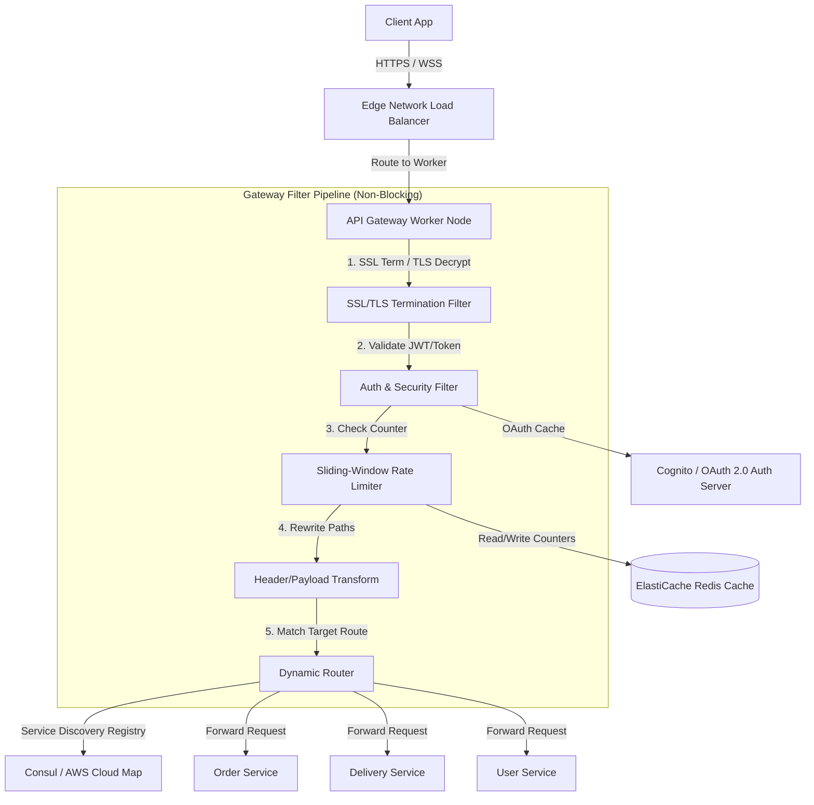
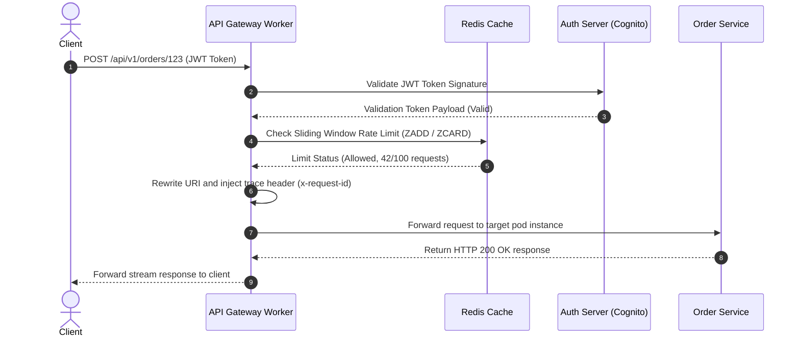

# API Gateway System Design

This document details the production-grade system design for a high-performance, distributed **API Gateway** (analogous to Envoy, Kong, or AWS API Gateway). The gateway serves as the single entry point for all client requests, routing traffic, enforcing security policies, managing rate limits, and collecting metrics across thousands of downstream microservices at a scale of 100,000+ requests per second (RPS).

---

## 1. System Requirements

### Functional Requirements
* **Dynamic Routing:** Route incoming HTTP/HTTPS, WebSockets, and gRPC requests to appropriate downstream microservices based on path, host, headers, or query parameters.
* **Authentication & Authorization:** Validate incoming JWT tokens, OAuth2 credentials, or API keys at the edge before requests reach internal services.
* **Request/Response Transformation:** Support header manipulation (adding/removing trace IDs, client IPs, security headers) and payload transformation.
* **Service Discovery Integration:** Automatically track downstream service instances by interfacing with a service registry (e.g., Consul or AWS Cloud Map).
* **Protocol Translation:** Support translating external HTTP/JSON requests into internal gRPC or custom binary payloads.

### Non-Functional Requirements
* **Low Latency Overhead:** Routing decisions and filter checks must add $< 5\text{ms}$ latency overhead (p99).
* **High Availability & Fault Tolerance:** $99.999\%$ uptime. The gateway is a single point of failure and must remain resilient during downstream outages.
* **High Throughput:** Handle 100,000+ concurrent requests per second (RPS) under peak load.
* **Security & DDoS Protection:** Block malicious payloads, enforce SSL/TLS termination, and support Web Application Firewall (WAF) integration.
* **Observability:** Generate distributed tracing tags (e.g., W3C Trace Context) and export high-resolution metrics.

---

## 2. Capacity & Scale Estimation

### Assumptions
* **Peak Concurrent Ingress Traffic:** $100,000 \text{ requests per second (RPS)}$
* **Average Request Payload Size:** $10 \text{ KB}$
* **Average Response Payload Size:** $50 \text{ KB}$
* **Internal Routing Rules Count:** $5,000 \text{ active route patterns}$

### Network Bandwidth Requirements
* **Ingress Data Rate (Requests):**
  $$100,000 \text{ RPS} \times 10 \text{ KB} = 1,000,000 \text{ KB/s} \approx \mathbf{1 \text{ GB/s (8 Gbps)}}$$
* **Egress Data Rate (Responses to clients):**
  $$100,000 \text{ RPS} \times 50 \text{ KB} = 5,000,000 \text{ KB/s} \approx \mathbf{5 \text{ GB/s (40 Gbps)}}$$
This requires high-throughput cloud network interfaces (e.g., AWS Elastic Network Adapter supporting 50 Gbps/100 Gbps).

### Memory Sizing (Route Registry & Active Sessions Cache)
* **Route Configuration Table:**
  $5,000 \text{ routes} \times 2 \text{ KB per config} = 10 \text{ MB}$ (kept entirely in memory on each gateway worker node for fast matching).
* **Rate Limiter Keys (1-minute sliding windows in Redis):**
  Assuming $10 \text{ Million}$ active user identifiers rate-limited at any time:
  $$10,000,000 \text{ keys} \times 128 \text{ bytes per Redis key} \approx \mathbf{1.28 \text{ GB RAM}}$$
  This easily fits on a small Redis replication group.

---

## 3. High-Level Architecture

The API Gateway uses a non-blocking, event-driven filter pipeline architecture to process requests asynchronously.


### System Architecture Flowchart


---

## 4. Component-Level Design

### A. Non-Blocking I/O Gateway Loop (Envoy-Style)

Traditional gateways allocate a dedicated operating system thread per connection. Under 100k+ concurrent connections, thread context-switching overhead crashes performance. 

This design uses **Non-Blocking I/O Multiplexing** (Linux `epoll` / macOS `kqueue`) running on a dedicated Event Loop per CPU core:

```
                  [ Network Sockets ]
                          │
                          ▼
            ┌───────────────────────────┐
            │       Linux epoll         │  (Handles 100k+ file descriptors)
            └───────────────────────────┘
                          │
          ┌───────────────┼───────────────┐
          ▼               ▼               ▼
   ┌─────────────┐ ┌─────────────┐ ┌─────────────┐
   │ Event Loop  │ │ Event Loop  │ │ Event Loop  │  (1 Loop per CPU Core)
   │   (Core 1)  │ │   (Core 2)  │ │   (Core 3)  │
   └─────────────┘ └─────────────┘ └─────────────┘
          │
          ▼
   [Filter Chain] ──▶ [Auth Cache] ──▶ [Rate Limiter] ──▶ [Downstream Forward]
```

### B. Filter Chain Pipeline
Each request passes through a configured pipeline of filters. If any filter fails (e.g., Auth fails or Rate Limit is exceeded), the request is short-circuited immediately and returned with an appropriate HTTP status code (e.g., `401 Unauthorized` or `429 Too Many Requests`).

---

## 5. Database Schema & Namespace Strategy

### 1. `routes` Config Schema (PostgreSQL - Configuration Registry)
```sql
CREATE TABLE gateway_routes (
    route_id       VARCHAR(64) PRIMARY KEY,
    path_pattern   VARCHAR(256) NOT NULL, -- e.g., /api/v1/orders/*
    target_service VARCHAR(128) NOT NULL, -- e.g., order_service
    strip_prefix   BOOLEAN DEFAULT TRUE,
    timeout_ms     INTEGER DEFAULT 3000,
    retry_count    INTEGER DEFAULT 3,
    is_active      BOOLEAN DEFAULT TRUE,
    updated_at     TIMESTAMP WITH TIME ZONE DEFAULT CURRENT_TIMESTAMP
);
```

### 2. Redis Rate Limiter Schema (Sliding Window Log)
To support precise sliding window rate limits, we use Redis Sorted Sets (`ZSET`).
* **Key:** `rate:limit:{client_id}:{endpoint_hash}`
* **Score:** Epoch millisecond timestamp of the request.
* **Value:** Unique request UUID.
* **Clean-up:** Remove elements older than window length (`ZREMRANGEBYSCORE`).

---

## 6. API Design & Payloads

### 1. Register Downstream Route
* **Endpoint:** `POST /api/v1/routes`
* **Payload:**
```json
{
  "route_id": "orders_route",
  "path_pattern": "/api/v1/orders/**",
  "target_service": "orders-internal-cluster",
  "strip_prefix": true,
  "timeout_ms": 2500,
  "retry_count": 2
}
```
* **Response:**
```json
{
  "status": "success",
  "route_id": "orders_route",
  "registered_at": "2026-07-21T14:10:00Z"
}
```

---

## 7. End-to-End Workflow Sequence



---

## 8. Scalability & Resilience Strategies
* **Client Connection Keep-Alive:** Gateway reuses persistent TCP/gRPC connection pools to downstream services to eliminate handshake overhead during routing.
* **Circuit Breaking:** Track error rates for every downstream service cluster. If errors exceed 50% in a 10s window, trip the circuit breaker and fail fast with `503 Service Unavailable` for 5 seconds.
* **Graceful Degradation:** Fallback to cached default responses or degraded payloads if non-essential downstream microservices are unreachable.

---

## 9. Disaster Recovery & Multi-Region Failover Strategy
* **Anycast Global Routing:** Expose gateway endpoints via AWS Route 53 latency routing or CloudFront Anycast IPs.
* **Active-Active Cross-Region Deployment:** Run identical API Gateway clusters in separate geographical regions. If an entire region encounters an outage, DNS health checks immediately pivot client traffic to the secondary region.

---

## 10. AWS Cloud-Native Implementation


### AWS Cloud-Native Architecture Flowchart

```mermaid
graph TD
    %% Ingress
    User[Client Application] -->|DNS Lookup| Route53[Amazon Route 53]
    Route53 --> WAF[AWS WAF Shield]
    WAF --> NLB[Amazon Network Load Balancer]

    %% VPC Core
    subgraph VPC ["AWS Virtual Private Cloud (VPC)"]
        %% Public ALB/GW Subnet
        subgraph GatewayCompute ["Private App Subnet"]
            NLB --> ECS[Amazon ECS Fargate - Envoy/Kong Pods]
        end

        %% Database/Cache Tier
        subgraph DatabaseTier ["Storage & Cache Subnet"]
            ECS -->|Validate Keys & Token Checks| Redis[(Amazon ElastiCache for Redis)]
            ECS -->|Dynamic Route Registries| DynamoDB[(Amazon DynamoDB)]
        end
    </g>

    %% Auth Validation External
    ECS -->|OAuth Token Validation| Cognito[Amazon Cognito JWT Store]
    
    %% Downstream Service Target Groups
    ECS -->|Route requests| DownstreamECS[Amazon ECS Microservice Tasks]
```

### AWS Service Mapping & Rationale

| Generic Component | AWS Service | Design Details & Rationale |
| :--- | :--- | :--- |
| **Edge Router** | **Network Load Balancer (NLB)** | Forwards millions of raw TCP connections directly to Fargate proxy workers without layer 7 latency overhead. |
| **Gateway Proxy** | **Amazon ECS Fargate** | Deploys Envoy-based or Go-based proxy containers. Scales automatically based on CPU limits. |
| **Token Validation** | **Amazon Cognito** | Validates user JWT claims at the edge cluster boundary. |
| **Rate Limit Store** | **Amazon ElastiCache for Redis** | High-performance in-memory cache supporting sliding window token registries. |
| **Registry Store** | **Amazon DynamoDB** | Holds dynamic mapping rules. Cached locally on Fargate nodes for microsecond routing lookups. |

---

## 11. Technology Justification: Why We Use

### A. Envoy/Kong over custom proxy code
* **Why We Use It:** Envoy is an industry-standard, high-performance C++ edge proxy. It provides built-in HTTP/2 connection pooling, protocol translation (HTTP to gRPC), and distributed tracing integration, saving thousands of engineering hours.

### B. Redis Sorted Sets (ZSET) for Sliding Window Rate Limiting
* **Why We Use It:** Simple counter rate limiters (e.g. fixed window) are vulnerable to bursting at window borders. Using `ZSET` allows us to record specific request timestamps and execute atomic operations (`MULTI`/`EXEC`) to measure exact sliding limits within sub-millisecond execution loops.
