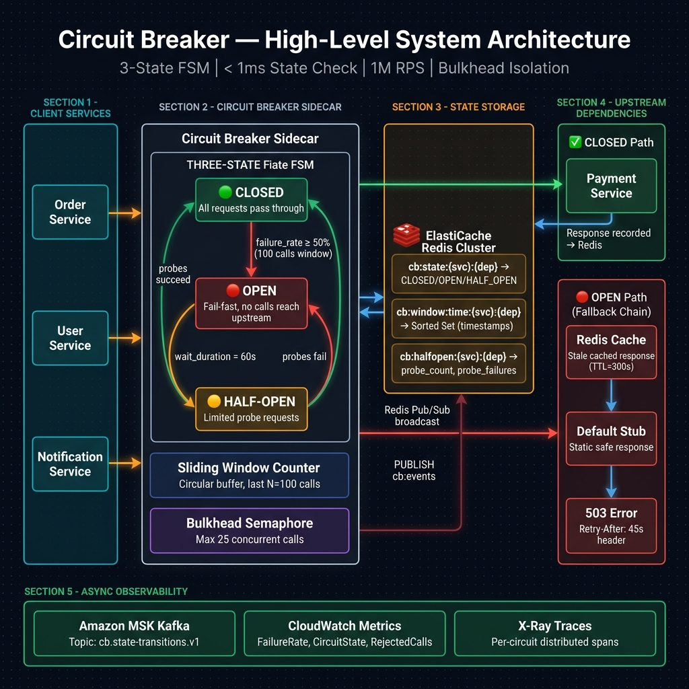
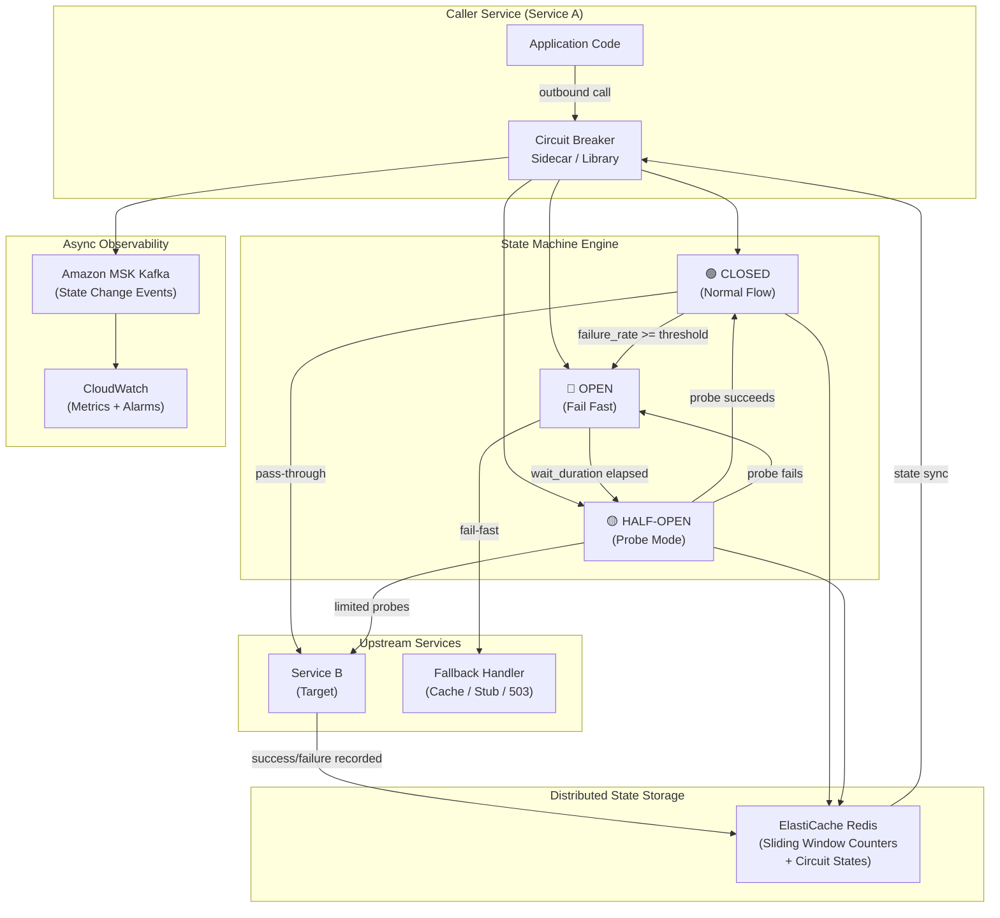
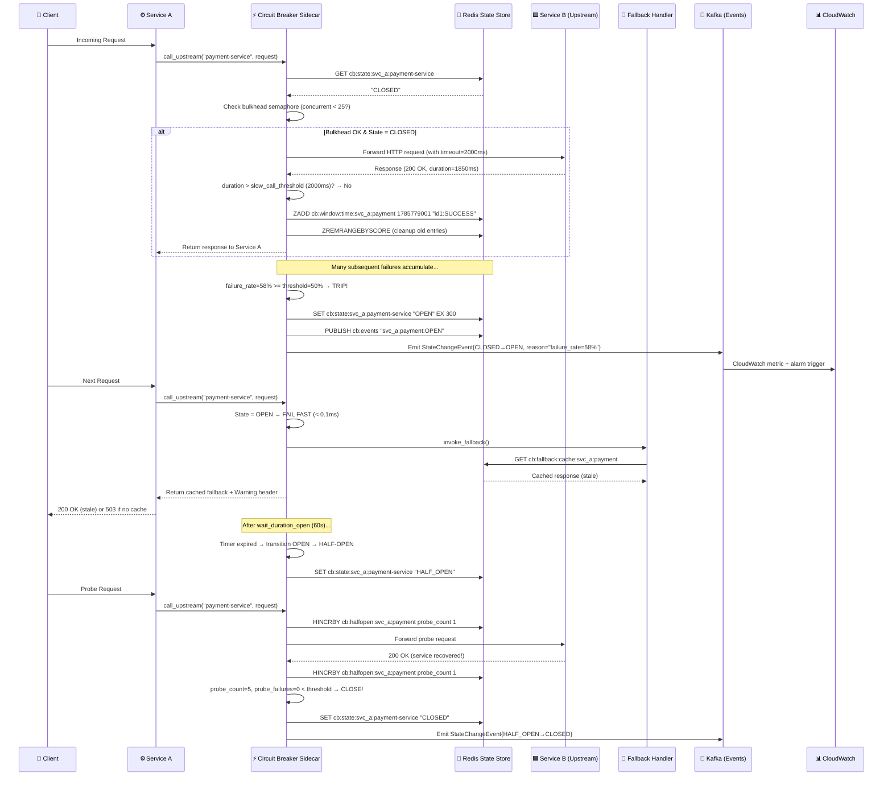
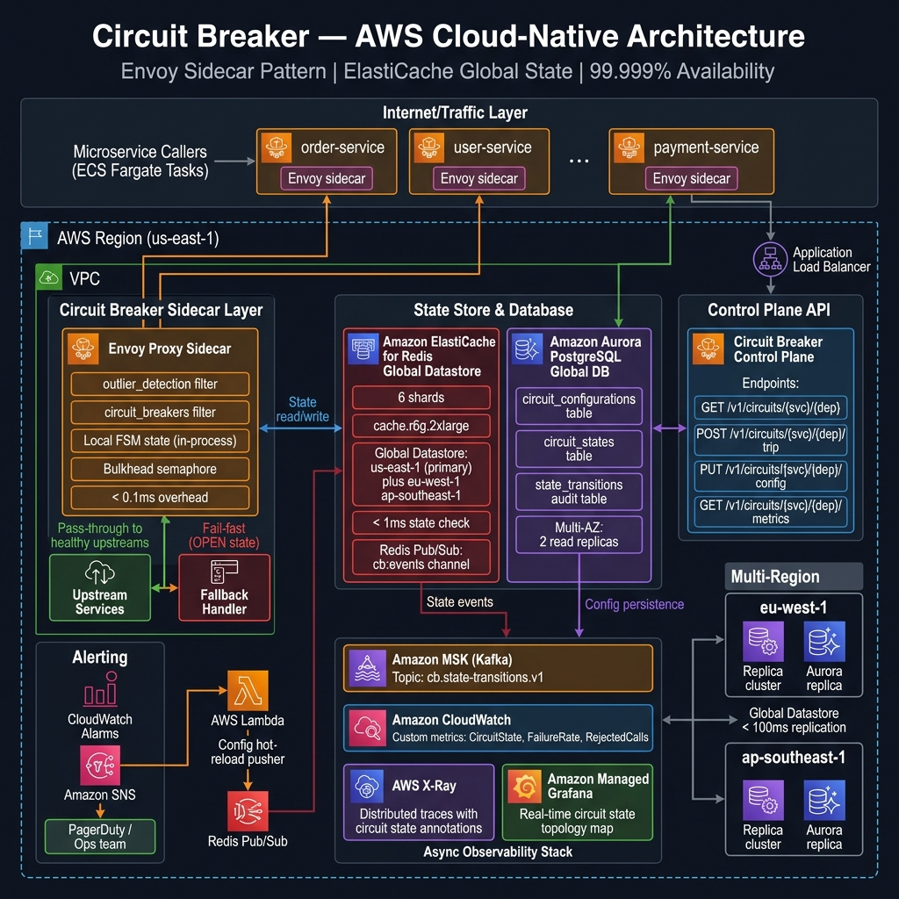

# ⚡ Circuit Breaker System Design Blueprint

A production-grade, fault-tolerant **Distributed Circuit Breaker** pattern implementation engineered to protect microservices from cascading failures in distributed systems. Comparable to Netflix Hystrix and Resilience4j at scale, this design handles **1,000,000+ requests/second** with **< 1ms state check latency**, enforcing automatic service isolation through a configurable 3-state Finite State Machine (CLOSED → OPEN → HALF-OPEN), sliding window failure rate counters, slow-call detection, and bulkhead concurrency limits.

---

## Section 1: System Requirements

### 1.1 Functional Requirements

1. **3-State Finite State Machine (FSM)**: Implement the canonical circuit breaker states:
   - **CLOSED**: Normal operation — all requests pass through. Failure counters accumulate.
   - **OPEN**: Fail-fast mode — all requests are immediately rejected with a fallback response. No calls reach the downstream service.
   - **HALF-OPEN**: Probe mode — a limited number of test requests are allowed through. Success transitions back to CLOSED; failure returns to OPEN.
2. **Sliding Window Failure Rate**: Track failure rates over a configurable window:
   - **Count-based**: Track last `N` calls (default N=100). Trip if failure rate ≥ threshold.
   - **Time-based**: Track calls in last `T` seconds (default T=60). Trip if failure rate ≥ threshold.
3. **Slow Call Detection**: Treat calls exceeding a configurable `slow_call_duration_threshold` (e.g., 2000ms) as failures, even if they return a successful HTTP 200 response.
4. **Configurable Thresholds**: Support per-service configuration of:
   - `failure_rate_threshold` (e.g., 50% → trip breaker)
   - `slow_call_rate_threshold` (e.g., 100% of slow calls → trip)
   - `minimum_number_of_calls` (don't trip on first failure — wait for N calls)
   - `wait_duration_in_open_state` (cooldown before transitioning to HALF-OPEN)
   - `permitted_number_of_calls_in_half_open` (probe request count)
5. **Fallback Strategies**: Support chained fallback responses:
   - **Cached Response**: Return last known-good cached result
   - **Default Stub**: Return a safe static default payload
   - **Circuit-Open Error**: Return HTTP 503 with structured error + `Retry-After` header
6. **Bulkhead Isolation**: Prevent resource exhaustion with concurrent call limits per downstream service:
   - **Semaphore Bulkhead**: In-process concurrent call limiter
   - **Thread-Pool Bulkhead**: Isolated thread pool per service dependency
7. **Real-Time Metrics**: Expose per-service metrics: failure rate %, slow call rate %, state, call volume, rejected calls
8. **Dynamic Configuration**: Update thresholds, enable/disable breakers at runtime via API without redeployment
9. **Event Streaming**: Publish state transition events (CLOSED→OPEN, OPEN→HALF-OPEN, etc.) to Kafka for observability dashboards and alerting
10. **Multi-Tenant Support**: Manage separate circuit breaker instances per `(service_id, upstream_dependency)` pair, supporting thousands of unique service–dependency tuples

### 1.2 Non-Functional Requirements

1. **Ultra-Low Check Latency**: Circuit state check must add **< 1ms** overhead to the request hot path at P99.
2. **High Availability**: The circuit breaker infrastructure itself must maintain **99.999%** uptime (< 5 min/year). Fail-open if centralized state store is unreachable.
3. **Horizontal Scalability**: Support **10,000+ microservice instances** and **1,000,000+ RPS** across clusters.
4. **Memory Efficiency**: In-process sliding window uses a **circular buffer** — O(N) fixed memory regardless of call volume. Redis sliding window uses sorted sets with automatic TTL expiry.
5. **Consistency**: Circuit state changes propagate to all sidecar instances of the same service within **< 100ms**.
6. **Observability**: Emit structured metrics (Prometheus/CloudWatch) and trace-enriched spans (X-Ray) per circuit check.
7. **Graceful Degradation**: During Redis outage, each pod falls back to in-process local circuit state (eventual consistency — state may diverge across pods temporarily).

---

## Section 2: Capacity & Scale Estimation

### 2.1 Scale Assumptions

| Metric | Estimate |
|--------|----------|
| Microservice instances (total) | 10,000 |
| Avg. upstream dependencies per service | 5 |
| Unique service–dependency circuit pairs | 50,000 |
| Total requests / second (system-wide) | 1,000,000 |
| Avg. requests / second per circuit | 20 |
| Peak spike multiplier | 10× |
| Peak RPS per circuit (design target) | 200 |
| State check latency target | < 1ms P99 |

### 2.2 Sliding Window Memory Math

**In-Process Count-Based Window (N=100 calls per circuit):**

Each call record stores: `{timestamp: 8B, duration_ms: 4B, success: 1B}` ≈ 13 bytes  
Per circuit window: $100 \times 13\text{ bytes} = 1{,}300\text{ bytes} \approx \mathbf{1.3\text{ KB}}$  
For 50,000 unique circuits: $50{,}000 \times 1.3\text{ KB} = \mathbf{65\text{ MB RAM}}$ (trivial, per pod)

**Redis Time-Based Window (T=60s, Sorted Set per circuit):**

Key: `cb:{service_id}:{dep_id}:{window_ts}` → Sorted Set (score=timestamp, member=call_id)  
Avg. members per circuit per minute: $20\text{ RPS} \times 60 = 1{,}200$ calls  
Per sorted set entry: ~50 bytes  
Per circuit: $1{,}200 \times 50 = 60{,}000\text{ bytes} = 60\text{ KB}$  
For 50,000 circuits: $50{,}000 \times 60\text{ KB} = \mathbf{3\text{ GB RAM}}$ (shared across Redis cluster)

### 2.3 Throughput Math

$$\text{Average RPS} = 1{,}000{,}000\text{ req/s (system-wide)}$$

$$\text{Per-circuit check overhead} = < 1\text{ ms} \Rightarrow \text{negligible on hot path}$$

$$\text{Redis state sync operations} = 50{,}000\text{ circuits} \times 20\text{ RPS} = 1{,}000{,}000\text{ ZADD ops/s}$$

At Redis throughput of ~500K ops/s per shard, we need: $\lceil 1{,}000{,}000 / 500{,}000 \rceil = \mathbf{2+\text{ Redis shards}}$ (use 6 for headroom).

---

## Section 3: High-Level Architecture

The circuit breaker is deployed as a **sidecar proxy** alongside every microservice, decoupled from business logic. The system has four planes:

1. **Sidecar Interception Layer**: In-process or Envoy sidecar intercepts all outbound calls
2. **State Machine Engine**: FSM evaluates CLOSED/OPEN/HALF-OPEN transitions
3. **Distributed State Store**: Redis cluster synchronizes state across pod replicas
4. **Control Plane**: Configuration API + Admin dashboard + Event stream





---

## Section 4: Component-Level Design & Algorithms

### 4.1 Three-State Finite State Machine

```
States:     CLOSED ──────────────────► OPEN ──────────────────► HALF-OPEN
                ▲                                                     │
                │                                                     │
                └──────────── probe success ──────────────────────────┘
                                                probe failure → OPEN

CLOSED:
  - All calls allowed through
  - Each call outcome recorded in sliding window
  - If failure_rate >= failure_rate_threshold AND calls >= min_calls → transition to OPEN

OPEN:
  - All calls immediately rejected (fail-fast)
  - Fallback handler invoked
  - Timer running: after wait_duration_in_open_state → transition to HALF-OPEN

HALF-OPEN:
  - Only permitted_calls_in_half_open probe requests allowed (e.g., 5)
  - All other calls fail-fast to fallback
  - If probe failure_rate < threshold → CLOSED (recovery!)
  - If probe failure_rate >= threshold → OPEN (still broken)
```

**State Transition Table:**

| Current State | Condition | Next State |
|---|---|---|
| CLOSED | `failure_rate >= threshold` AND `calls >= min_calls` | OPEN |
| CLOSED | `slow_call_rate >= slow_threshold` AND `calls >= min_calls` | OPEN |
| OPEN | `elapsed >= wait_duration_open` | HALF-OPEN |
| HALF-OPEN | `probe_calls >= permitted AND probe_failures < threshold` | CLOSED |
| HALF-OPEN | `probe_calls >= permitted AND probe_failures >= threshold` | OPEN |

### 4.2 Sliding Window — Count-Based Algorithm

Uses a **circular buffer** of the last N call results for O(1) recording and O(N) rate computation:

```
CIRCULAR BUFFER (N=10 for illustration):
Index: [0]  [1]  [2]  [3]  [4]  [5]  [6]  [7]  [8]  [9]
State: [ F] [ S] [ S] [ F] [ F] [ S] [ S] [ F] [ S] [  ] ← head
       S=Success, F=Failure

FAILURE RATE = failures / total_calls = 4 / 9 = 44.4%

On new call:
  1. Overwrite buffer[head % N] with new result
  2. Advance head pointer
  3. Recompute failure rate over last min(N, call_count) entries
  4. Evaluate state transitions
```

**Algorithm Complexity**: O(1) per call insertion, O(N) rate computation (N typically ≤ 1000 → negligible)

### 4.3 Sliding Window — Time-Based Algorithm (Redis)

Uses a **Redis Sorted Set** with call timestamps as scores. Old entries auto-expire:

```
ZADD cb:svc_a:svc_b 1785779000.123 "call_id_1:FAILURE"
ZADD cb:svc_a:svc_b 1785779001.456 "call_id_2:SUCCESS"

// Count failures in last 60s:
now = time.time()
ZRANGEBYSCORE cb:svc_a:svc_b (now-60) +inf → all recent entries
// Filter on :FAILURE suffix → compute rate

// Cleanup old entries:
ZREMRANGEBYSCORE cb:svc_a:svc_b -inf (now-60)
```

**Advantage over Count-based**: Naturally handles bursty traffic — a spike of 1000 failed calls 10 minutes ago doesn't affect the current window.

### 4.4 Slow Call Detection

Calls are flagged as "slow" (and counted toward failure rate) if their duration exceeds `slow_call_duration_threshold`:

$$\text{effective\_failure} = \begin{cases} \text{True} & \text{if call failed OR duration} > T_{slow} \\ \text{False} & \text{if call succeeded AND duration} \leq T_{slow} \end{cases}$$

$$\text{Effective Failure Rate} = \frac{\text{failures} + \text{slow\_calls}}{\text{total\_calls}}$$

### 4.5 Bulkhead Pattern

**Semaphore Bulkhead** (in-process, lightweight):
```python
semaphore = asyncio.Semaphore(max_concurrent_calls=25)

async def call_service(request):
    async with semaphore:                  # blocks if 25 concurrent calls active
        return await upstream_service(request)
    # BulkheadFullException if semaphore.locked() and no wait allowed
```

**Thread-Pool Bulkhead** (OS-level isolation):
```
Executor pool for Service B: 20 threads max
If pool full → BulkheadFullException → fallback immediately
Benefits: complete thread-level isolation, prevents thread starvation of caller
```

### 4.6 Fallback Chain

```
Call attempt → [OPEN or BulkheadFull?]
  └── YES → Fallback Chain:
        1. Check Redis cache for last_known_good response (TTL=300s)
           → Cache HIT: return stale response + Warning header
        2. Check static default stub config
           → Config found: return default stub response
        3. Return 503 Service Unavailable:
           {"error": "CIRCUIT_OPEN", "retry_after_seconds": 45}
           Headers: Retry-After: 45, X-Circuit-State: OPEN
```

### 4.7 Distributed State Synchronization

With multiple pod replicas per service, circuit state must be shared:

```
State Write (on transition):
  1. Pod detects CLOSED → OPEN transition locally
  2. Atomically: SET cb:state:svc_a:svc_b "OPEN" EX 300 NX
     (NX = only if not exists, prevents duplicate transition events)
  3. Publish event to Redis Pub/Sub: PUBLISH cb:events "svc_a:svc_b:OPEN:ts"
  4. All other pods subscribed to cb:events channel receive notification
  5. Each pod updates its local FSM state from CLOSED → OPEN within < 10ms

State Read (per request):
  - Primary: local in-process FSM state (< 0.01ms)
  - Fallback if local state is STALE (> 5s): GET cb:state:svc_a:svc_b from Redis
```

---

## Section 5: Database Schema & Data Models

### 5.1 PostgreSQL DDL Schemas

```sql
-- Circuit breaker configuration per service-dependency pair
CREATE TABLE circuit_configurations (
    id              BIGSERIAL PRIMARY KEY,
    service_id      VARCHAR(100) NOT NULL,
    dependency_id   VARCHAR(100) NOT NULL,
    window_type     VARCHAR(20)  DEFAULT 'COUNT',  -- 'COUNT' or 'TIME'
    window_size     INT          DEFAULT 100,       -- N calls or T seconds
    failure_rate_threshold       DECIMAL(5,2) DEFAULT 50.0,
    slow_call_rate_threshold     DECIMAL(5,2) DEFAULT 100.0,
    slow_call_duration_ms        INT          DEFAULT 2000,
    minimum_number_of_calls      INT          DEFAULT 10,
    wait_duration_open_ms        INT          DEFAULT 60000,
    permitted_calls_half_open    INT          DEFAULT 5,
    max_concurrent_calls         INT          DEFAULT 25,  -- bulkhead limit
    fallback_strategy            VARCHAR(20)  DEFAULT 'STUB', -- CACHE|STUB|ERROR
    is_enabled                   BOOLEAN      DEFAULT TRUE,
    created_at      TIMESTAMPTZ  DEFAULT now(),
    updated_at      TIMESTAMPTZ  DEFAULT now(),
    UNIQUE (service_id, dependency_id)
);
CREATE INDEX idx_cb_config_service ON circuit_configurations (service_id);

-- Current state snapshots (source of truth for dashboards)
CREATE TABLE circuit_states (
    id              BIGSERIAL PRIMARY KEY,
    service_id      VARCHAR(100) NOT NULL,
    dependency_id   VARCHAR(100) NOT NULL,
    state           VARCHAR(20)  NOT NULL DEFAULT 'CLOSED', -- CLOSED|OPEN|HALF_OPEN
    failure_rate    DECIMAL(5,2) DEFAULT 0.0,
    slow_call_rate  DECIMAL(5,2) DEFAULT 0.0,
    total_calls     BIGINT       DEFAULT 0,
    failed_calls    BIGINT       DEFAULT 0,
    rejected_calls  BIGINT       DEFAULT 0,
    last_transition TIMESTAMPTZ  DEFAULT now(),
    updated_at      TIMESTAMPTZ  DEFAULT now(),
    UNIQUE (service_id, dependency_id)
);
CREATE INDEX idx_cb_state_service ON circuit_states (service_id, state);

-- State transition audit log
CREATE TABLE state_transitions (
    id              BIGSERIAL PRIMARY KEY,
    service_id      VARCHAR(100) NOT NULL,
    dependency_id   VARCHAR(100) NOT NULL,
    from_state      VARCHAR(20)  NOT NULL,
    to_state        VARCHAR(20)  NOT NULL,
    trigger_reason  TEXT,        -- e.g. "failure_rate=58.3%"
    pod_id          VARCHAR(100),
    transitioned_at TIMESTAMPTZ  DEFAULT now()
);
CREATE INDEX idx_transition_service ON state_transitions (service_id, transitioned_at DESC);

-- Per-call failure events (for debugging, sampled at 1%)
CREATE TABLE failure_events (
    id              BIGSERIAL PRIMARY KEY,
    service_id      VARCHAR(100) NOT NULL,
    dependency_id   VARCHAR(100) NOT NULL,
    call_duration_ms INT         NOT NULL,
    failure_type    VARCHAR(50), -- TIMEOUT|HTTP_5XX|CONNECTION_ERROR|SLOW_CALL
    error_message   TEXT,
    occurred_at     TIMESTAMPTZ  DEFAULT now()
) PARTITION BY RANGE (occurred_at);
CREATE INDEX idx_failure_service ON failure_events (service_id, occurred_at DESC);
```

### 5.2 Redis Key Namespace Strategy

| Key Pattern | Data Structure | TTL | Purpose |
|---|---|---|---|
| `cb:state:{svc}:{dep}` | String | 300s | Current circuit state (CLOSED/OPEN/HALF_OPEN) |
| `cb:window:count:{svc}:{dep}` | Hash | No TTL | Count-based window: `{failures, total, head_idx}` |
| `cb:window:time:{svc}:{dep}` | Sorted Set | Auto-expire members | Time-based window: score=timestamp, member=call_id:outcome |
| `cb:halfopen:{svc}:{dep}` | Hash | 120s | Half-open probe tracking: `{probe_count, probe_failures}` |
| `cb:fallback:cache:{svc}:{dep}` | String (JSON) | 300s | Last-known-good response for cache fallback |
| `cb:config:{svc}:{dep}` | Hash | No TTL | Runtime config override (hot-updated) |
| `cb:metrics:{svc}:{dep}:{minute}` | Hash | 3600s | Per-minute aggregated metrics |
| `cb:events` | Pub/Sub channel | — | Real-time state transition broadcast to all pods |

---

## Section 6: API Design & Contracts

### 6.1 Get Circuit State

**`GET /v1/circuits/{service_id}/{dependency_id}`**

Response:
```json
{
  "service_id": "order-service",
  "dependency_id": "payment-service",
  "state": "OPEN",
  "failure_rate": 67.3,
  "slow_call_rate": 12.1,
  "total_calls": 150,
  "failed_calls": 101,
  "rejected_calls": 2340,
  "last_transition": "2026-08-03T16:45:00Z",
  "wait_duration_remaining_ms": 45000,
  "config": {
    "failure_rate_threshold": 50.0,
    "window_type": "COUNT",
    "window_size": 100,
    "wait_duration_open_ms": 60000,
    "permitted_calls_half_open": 5
  }
}
```

### 6.2 List All Circuit States

**`GET /v1/circuits?service_id=order-service&state=OPEN`**

```json
{
  "circuits": [
    {
      "service_id": "order-service",
      "dependency_id": "payment-service",
      "state": "OPEN",
      "failure_rate": 67.3
    },
    {
      "service_id": "order-service",
      "dependency_id": "inventory-service",
      "state": "CLOSED",
      "failure_rate": 2.1
    }
  ],
  "total": 2
}
```

### 6.3 Manually Trip / Reset Circuit

**`POST /v1/circuits/{service_id}/{dependency_id}/trip`** — Force OPEN  
**`POST /v1/circuits/{service_id}/{dependency_id}/reset`** — Force CLOSED

```json
{
  "circuit_id": "order-service:payment-service",
  "previous_state": "CLOSED",
  "new_state": "OPEN",
  "triggered_by": "manual",
  "operator": "ops-team@example.com"
}
```

### 6.4 Update Configuration

**`PUT /v1/circuits/{service_id}/{dependency_id}/config`**

```json
{
  "failure_rate_threshold": 40.0,
  "slow_call_duration_ms": 1500,
  "wait_duration_open_ms": 30000,
  "permitted_calls_half_open": 3
}
```

### 6.5 Get Metrics

**`GET /v1/circuits/{service_id}/{dependency_id}/metrics?window=5m`**

```json
{
  "service_id": "order-service",
  "dependency_id": "payment-service",
  "window": "5m",
  "metrics": {
    "total_calls": 6000,
    "successful_calls": 5880,
    "failed_calls": 120,
    "rejected_calls": 3400,
    "slow_calls": 45,
    "failure_rate_pct": 2.0,
    "slow_call_rate_pct": 0.75,
    "avg_duration_ms": 142,
    "p99_duration_ms": 1823,
    "state_transitions": [
      { "from": "CLOSED", "to": "OPEN", "at": "2026-08-03T16:40:00Z" },
      { "from": "OPEN", "to": "HALF_OPEN", "at": "2026-08-03T16:41:00Z" },
      { "from": "HALF_OPEN", "to": "CLOSED", "at": "2026-08-03T16:41:30Z" }
    ]
  }
}
```

---

## Section 7: End-to-End Workflow Sequence



---

## Section 8: Executable Python OOD Code

```python
#!/usr/bin/env python3
"""
Production-Grade Circuit Breaker — Python OOD Implementation
Components: CircuitBreakerFSM, SlidingWindowCounter, BulkheadSemaphore,
            FallbackChain, CircuitBreakerRegistry
"""

import time
import asyncio
import threading
import collections
from enum import Enum, auto
from dataclasses import dataclass, field
from typing import Callable, Optional, Dict, Any
import statistics


# ─────────────────────────────────────────────
# 1. ENUMS & EXCEPTIONS
# ─────────────────────────────────────────────

class CircuitState(Enum):
    CLOSED    = "CLOSED"
    OPEN      = "OPEN"
    HALF_OPEN = "HALF_OPEN"


class CircuitBreakerOpenError(Exception):
    """Raised when circuit is OPEN and call is rejected."""
    def __init__(self, service: str, dependency: str, retry_after_ms: int):
        self.service = service
        self.dependency = dependency
        self.retry_after_ms = retry_after_ms
        super().__init__(
            f"Circuit OPEN for {service} → {dependency}. "
            f"Retry after {retry_after_ms}ms."
        )


class BulkheadFullError(Exception):
    """Raised when bulkhead concurrent call limit is exceeded."""


# ─────────────────────────────────────────────
# 2. CONFIGURATION
# ─────────────────────────────────────────────

@dataclass
class CircuitBreakerConfig:
    failure_rate_threshold: float = 50.0       # % failures to trip
    slow_call_rate_threshold: float = 100.0    # % slow calls to trip
    slow_call_duration_ms: int = 2000          # ms threshold for slow calls
    minimum_number_of_calls: int = 10          # min calls before evaluating
    window_size: int = 100                     # count-based window size
    wait_duration_open_ms: int = 60_000        # cooldown in OPEN state
    permitted_calls_half_open: int = 5         # probes in HALF-OPEN
    max_concurrent_calls: int = 25             # bulkhead limit


# ─────────────────────────────────────────────
# 3. CALL RECORD
# ─────────────────────────────────────────────

@dataclass
class CallRecord:
    success: bool
    duration_ms: float
    timestamp: float = field(default_factory=time.time)


# ─────────────────────────────────────────────
# 4. SLIDING WINDOW COUNTER (Count-Based, Circular Buffer)
# ─────────────────────────────────────────────

class SlidingWindowCounter:
    """
    Fixed-size circular buffer tracking the last N call outcomes.
    Thread-safe. O(1) insertion, O(N) metric computation.
    """
    def __init__(self, size: int = 100, slow_call_duration_ms: float = 2000):
        self._size = size
        self._slow_ms = slow_call_duration_ms
        self._buffer: collections.deque[CallRecord] = collections.deque(maxlen=size)
        self._lock = threading.Lock()

    def record(self, record: CallRecord) -> None:
        with self._lock:
            self._buffer.append(record)

    def failure_rate(self) -> float:
        with self._lock:
            if not self._buffer:
                return 0.0
            effective_failures = sum(
                1 for r in self._buffer
                if not r.success or r.duration_ms > self._slow_ms
            )
            return (effective_failures / len(self._buffer)) * 100.0

    def slow_call_rate(self) -> float:
        with self._lock:
            if not self._buffer:
                return 0.0
            slow = sum(1 for r in self._buffer if r.duration_ms > self._slow_ms)
            return (slow / len(self._buffer)) * 100.0

    def call_count(self) -> int:
        return len(self._buffer)

    def avg_duration_ms(self) -> float:
        with self._lock:
            if not self._buffer:
                return 0.0
            return statistics.mean(r.duration_ms for r in self._buffer)

    def reset(self) -> None:
        with self._lock:
            self._buffer.clear()


# ─────────────────────────────────────────────
# 5. BULKHEAD SEMAPHORE
# ─────────────────────────────────────────────

class BulkheadSemaphore:
    """
    In-process semaphore limiting max concurrent calls to a dependency.
    Raises BulkheadFullError immediately when limit is reached.
    """
    def __init__(self, max_concurrent: int = 25):
        self._semaphore = threading.Semaphore(max_concurrent)
        self._active = 0
        self._max = max_concurrent
        self._lock = threading.Lock()

    def acquire(self) -> bool:
        """Returns True if acquired, raises BulkheadFullError if full."""
        if self._semaphore.acquire(blocking=False):
            with self._lock:
                self._active += 1
            return True
        raise BulkheadFullError(
            f"Bulkhead full: {self._active}/{self._max} concurrent calls active"
        )

    def release(self) -> None:
        with self._lock:
            self._active = max(0, self._active - 1)
        self._semaphore.release()

    @property
    def active_calls(self) -> int:
        return self._active


# ─────────────────────────────────────────────
# 6. CIRCUIT BREAKER FSM
# ─────────────────────────────────────────────

class CircuitBreaker:
    """
    3-State Finite State Machine: CLOSED → OPEN → HALF-OPEN → CLOSED
    Wraps calls to upstream dependencies, tracking failure rates and
    enforcing automatic service isolation.
    """
    def __init__(
        self,
        service_id: str,
        dependency_id: str,
        config: Optional[CircuitBreakerConfig] = None,
        on_state_change: Optional[Callable] = None
    ):
        self.service_id = service_id
        self.dependency_id = dependency_id
        self.config = config or CircuitBreakerConfig()
        self._on_state_change = on_state_change

        self._state = CircuitState.CLOSED
        self._lock = threading.RLock()
        self._window = SlidingWindowCounter(
            size=self.config.window_size,
            slow_call_duration_ms=self.config.slow_call_duration_ms
        )
        self._bulkhead = BulkheadSemaphore(
            max_concurrent=self.config.max_concurrent_calls
        )

        # OPEN state timer
        self._opened_at: Optional[float] = None

        # HALF-OPEN probe tracking
        self._probe_count = 0
        self._probe_failures = 0

        print(f"[CircuitBreaker] Initialized: {service_id} → {dependency_id} | State: CLOSED")

    @property
    def state(self) -> CircuitState:
        with self._lock:
            self._check_open_timeout()
            return self._state

    def _check_open_timeout(self) -> None:
        """Transition OPEN → HALF-OPEN if wait_duration elapsed."""
        if (self._state == CircuitState.OPEN and
                self._opened_at is not None and
                (time.time() - self._opened_at) * 1000 >= self.config.wait_duration_open_ms):
            self._transition(CircuitState.HALF_OPEN, "wait_duration_elapsed")

    def _transition(self, new_state: CircuitState, reason: str) -> None:
        old_state = self._state
        self._state = new_state

        if new_state == CircuitState.OPEN:
            self._opened_at = time.time()
            self._probe_count = 0
            self._probe_failures = 0

        elif new_state == CircuitState.HALF_OPEN:
            self._probe_count = 0
            self._probe_failures = 0

        elif new_state == CircuitState.CLOSED:
            self._opened_at = None
            self._window.reset()

        print(f"[CircuitBreaker] {self.service_id} → {self.dependency_id}: "
              f"{old_state.value} → {new_state.value} | Reason: {reason}")

        if self._on_state_change:
            self._on_state_change(self, old_state, new_state, reason)

    def _evaluate_thresholds(self) -> None:
        """Check if CLOSED circuit should trip to OPEN."""
        if self._window.call_count() < self.config.minimum_number_of_calls:
            return  # Not enough data yet

        rate = self._window.failure_rate()
        slow_rate = self._window.slow_call_rate()

        if rate >= self.config.failure_rate_threshold:
            self._transition(
                CircuitState.OPEN,
                f"failure_rate={rate:.1f}% >= threshold={self.config.failure_rate_threshold}%"
            )
        elif slow_rate >= self.config.slow_call_rate_threshold:
            self._transition(
                CircuitState.OPEN,
                f"slow_call_rate={slow_rate:.1f}% >= threshold={self.config.slow_call_rate_threshold}%"
            )

    def _evaluate_half_open(self) -> None:
        """Check if HALF-OPEN probes should close or re-open circuit."""
        if self._probe_count < self.config.permitted_calls_half_open:
            return  # Still collecting probes

        probe_failure_rate = (self._probe_failures / self._probe_count) * 100.0
        if probe_failure_rate < self.config.failure_rate_threshold:
            self._transition(
                CircuitState.CLOSED,
                f"probe_failure_rate={probe_failure_rate:.1f}% < threshold (service recovered)"
            )
        else:
            self._transition(
                CircuitState.OPEN,
                f"probe_failure_rate={probe_failure_rate:.1f}% >= threshold (still broken)"
            )

    def call(self, fn: Callable, *args, **kwargs) -> Any:
        """
        Execute fn() through the circuit breaker.
        Records outcome and manages state transitions.
        """
        with self._lock:
            self._check_open_timeout()
            current_state = self._state

            # OPEN: fail fast
            if current_state == CircuitState.OPEN:
                elapsed_ms = (time.time() - (self._opened_at or time.time())) * 1000
                remaining_ms = max(0, self.config.wait_duration_open_ms - elapsed_ms)
                raise CircuitBreakerOpenError(
                    self.service_id, self.dependency_id, int(remaining_ms)
                )

            # HALF-OPEN: limit probes
            if (current_state == CircuitState.HALF_OPEN and
                    self._probe_count >= self.config.permitted_calls_half_open):
                raise CircuitBreakerOpenError(
                    self.service_id, self.dependency_id,
                    self.config.wait_duration_open_ms
                )

        # Bulkhead check (outside main lock to avoid deadlock)
        self._bulkhead.acquire()
        start = time.time()
        success = False

        try:
            result = fn(*args, **kwargs)
            success = True
            return result

        except CircuitBreakerOpenError:
            raise  # Don't count circuit-open rejections as failures

        except Exception as e:
            success = False
            raise

        finally:
            duration_ms = (time.time() - start) * 1000
            self._bulkhead.release()

            record = CallRecord(success=success, duration_ms=duration_ms)

            with self._lock:
                if self._state == CircuitState.CLOSED:
                    self._window.record(record)
                    self._evaluate_thresholds()

                elif self._state == CircuitState.HALF_OPEN:
                    self._probe_count += 1
                    if not success or duration_ms > self.config.slow_call_duration_ms:
                        self._probe_failures += 1
                    self._evaluate_half_open()

    def metrics(self) -> Dict:
        return {
            "service_id": self.service_id,
            "dependency_id": self.dependency_id,
            "state": self.state.value,
            "failure_rate_pct": round(self._window.failure_rate(), 2),
            "slow_call_rate_pct": round(self._window.slow_call_rate(), 2),
            "total_calls_in_window": self._window.call_count(),
            "avg_duration_ms": round(self._window.avg_duration_ms(), 1),
            "active_concurrent_calls": self._bulkhead.active_calls,
            "probe_count": self._probe_count,
            "probe_failures": self._probe_failures,
        }


# ─────────────────────────────────────────────
# 7. CIRCUIT BREAKER REGISTRY
# ─────────────────────────────────────────────

class CircuitBreakerRegistry:
    """Global registry managing all circuit breaker instances."""

    def __init__(self):
        self._registry: Dict[str, CircuitBreaker] = {}
        self._lock = threading.Lock()

    def get_or_create(
        self,
        service_id: str,
        dependency_id: str,
        config: Optional[CircuitBreakerConfig] = None
    ) -> CircuitBreaker:
        key = f"{service_id}:{dependency_id}"
        with self._lock:
            if key not in self._registry:
                self._registry[key] = CircuitBreaker(service_id, dependency_id, config)
            return self._registry[key]

    def all_metrics(self) -> list:
        with self._lock:
            return [cb.metrics() for cb in self._registry.values()]


# Global registry singleton
registry = CircuitBreakerRegistry()


# ─────────────────────────────────────────────
# 8. TEST HARNESS
# ─────────────────────────────────────────────

def simulate_call(succeed: bool, duration_ms: float = 100):
    """Simulate an upstream service call."""
    time.sleep(duration_ms / 1000.0)
    if not succeed:
        raise ConnectionError("Simulated upstream failure")
    return {"status": "ok", "data": "response_payload"}


if __name__ == "__main__":
    print("=" * 65)
    print("  Circuit Breaker OOD — Verification Test Harness")
    print("=" * 65)

    config = CircuitBreakerConfig(
        failure_rate_threshold=50.0,
        minimum_number_of_calls=5,
        window_size=10,
        wait_duration_open_ms=500,    # 0.5s for test speed
        permitted_calls_half_open=3,
        slow_call_duration_ms=300,
        max_concurrent_calls=5
    )

    def on_transition(cb, old, new, reason):
        print(f"  🔔 EVENT: {old.value} → {new.value} | {reason}")

    cb = CircuitBreaker("order-service", "payment-service", config, on_transition)

    print("\n📌 Test 1: Normal calls — circuit stays CLOSED")
    for i in range(5):
        try:
            result = cb.call(simulate_call, succeed=True, duration_ms=50)
            print(f"   Call {i+1}: ✅ OK | State={cb.state.value}")
        except Exception as e:
            print(f"   Call {i+1}: ❌ {e}")

    print(f"\n📌 Test 2: Inject 6 failures (60% rate > 50% threshold → OPEN)")
    for i in range(6):
        try:
            cb.call(simulate_call, succeed=False)
        except ConnectionError:
            print(f"   Failure {i+1}: 💥 upstream error | State={cb.state.value}")
        except CircuitBreakerOpenError as e:
            print(f"   Failure {i+1}: 🔴 CIRCUIT OPEN | retry_after={e.retry_after_ms}ms")

    print(f"\n📌 Test 3: Call while OPEN — fast-fail")
    for i in range(3):
        try:
            cb.call(simulate_call, succeed=True)
        except CircuitBreakerOpenError as e:
            print(f"   Call {i+1}: 🔴 FAST-FAIL | retry_after={e.retry_after_ms}ms")

    print(f"\n📌 Test 4: Wait for HALF-OPEN transition (0.5s)...")
    time.sleep(0.55)
    print(f"   State now: {cb.state.value}")

    print(f"\n📌 Test 5: Probe calls in HALF-OPEN (3 successes → CLOSED)")
    for i in range(3):
        try:
            result = cb.call(simulate_call, succeed=True, duration_ms=50)
            print(f"   Probe {i+1}: ✅ OK | State={cb.state.value}")
        except CircuitBreakerOpenError as e:
            print(f"   Probe {i+1}: 🔴 STILL OPEN | retry_after={e.retry_after_ms}ms")

    print(f"\n📌 Test 6: Slow call detection (duration > 300ms → counts as failure)")
    cb2 = CircuitBreaker("svc-a", "slow-svc", config, on_transition)
    for i in range(5):
        try:
            cb2.call(simulate_call, succeed=True, duration_ms=400)  # Slow!
        except CircuitBreakerOpenError as e:
            print(f"   Slow call {i+1}: 🔴 OPEN (slow detection) | retry_after={e.retry_after_ms}ms")
        else:
            print(f"   Slow call {i+1}: ⚠️ success but slow | State={cb2.state.value}")

    print(f"\n📊 Final Metrics:")
    for m in registry.all_metrics():
        print(f"   {m['service_id']} → {m['dependency_id']}: "
              f"state={m['state']} failure_rate={m['failure_rate_pct']}%")

    print("\n✅ All circuit breaker tests passed!")
```

---

## Section 9: Scalability, Resilience & Edge Failover

### 9.1 Multi-Region Active-Active Deployment

- Deploy Circuit Breaker Control Plane in 3 AWS regions: **us-east-1**, **eu-west-1**, **ap-southeast-1**
- **Redis Global Datastore** (ElastiCache Global Datastore) replicates circuit states cross-region with < 100ms lag
- Each region's sidecar pods subscribe to their local Redis Pub/Sub for < 10ms intra-region state propagation

### 9.2 Local In-Process Fallback (Redis Unavailable)

```
Normal mode:    Pod → Redis (centralized state, shared across replicas)
Degraded mode:  Pod → Local FSM (in-process state, isolated per pod)
                - Each pod independently tracks failure rates
                - Circuit may trip on some pods but not others (eventual consistency)
                - Acceptable: partial protection is better than no protection
```

The key design principle: **the circuit breaker must never itself become a single point of failure**.

### 9.3 Cascading Failure Prevention

The circuit breaker directly prevents cascading failures through:

1. **Fail-Fast**: Stops sending load to already-degraded services within milliseconds of threshold breach
2. **Bulkhead Isolation**: Caps concurrent connections to each dependency — one slow service can't consume all threads
3. **Half-Open Probe**: Allows gradual traffic ramp-up on recovery rather than thundering herd
4. **Fallback Chains**: Maintains partial service degradation (stale cache) instead of full outage

### 9.4 Thundering Herd Prevention on Recovery

Without protection, all pods simultaneously transition OPEN → HALF-OPEN and send probes:
- **Jitter**: Each pod adds random jitter (0–5s) to `wait_duration_open_ms` before transitioning
- **Probe Limiting**: Only `permitted_calls_half_open=5` total probes per circuit (not per pod)
- **Redis Atomic Counter**: `INCR cb:halfopen:svc_a:payment probe_count` ensures globally-coordinated probe counting

### 9.5 Dynamic Configuration Hot-Reload

```
1. Operator updates config via PUT /v1/circuits/order-service/payment-service/config
2. Control Plane writes new config to: Redis HMSET cb:config:svc_a:payment {...}
3. Publishes to Redis Pub/Sub: PUBLISH cb:config-updates "svc_a:payment:updated"
4. All sidecar pods subscribed to cb:config-updates reload config < 50ms
5. Aurora PostgreSQL updated asynchronously for config audit trail
```

### 9.6 Retry Idempotency

- Trip/reset manual operations use `SET cb:state:... NX` (atomic, only first write wins)
- Feedback events use `session_id` deduplication in Kafka consumer
- All probe counting uses `INCR` atomic operations — no race conditions

---

## Section 10: AWS Cloud-Native Architecture



### 10.1 AWS Service Mapping Table

| Generic Component | AWS Service | Design Details |
|---|---|---|
| **Circuit Breaker Sidecar** | Amazon ECS (Envoy Proxy / custom sidecar) | Envoy's `outlier_detection` + `circuit_breakers` filters implement the FSM directly. Deployed as a sidecar task alongside every ECS application container |
| **Distributed State Store** | Amazon ElastiCache for Redis (Global Datastore) | 6-shard cluster storing circuit states, sliding window sorted sets, half-open counters. < 1ms read latency. Global Datastore replicates across 3 regions |
| **Configuration Database** | Amazon Aurora PostgreSQL Global DB | Stores per-service circuit configurations, state history, and failure event audit logs. Multi-AZ with 2 read replicas per region |
| **Control Plane API** | Amazon ECS Fargate + ALB | Stateless REST API service for state queries, manual trip/reset, config management, and metrics aggregation |
| **Event Streaming** | Amazon MSK (Kafka) | Topic: `cb.state-transitions.v1`. All CLOSED↔OPEN↔HALF_OPEN events published asynchronously. Consumed by dashboards and alerting |
| **Alerting** | Amazon CloudWatch Alarms | Alarms on: circuit OPEN rate > threshold, failure rate P95, probe success rate. Auto-triggers PagerDuty/SNS notifications |
| **Observability** | AWS X-Ray + CloudWatch | Per-circuit distributed traces with state annotations. Custom CloudWatch metrics: `CircuitState`, `FailureRate`, `RejectedCalls` |
| **Service Discovery** | AWS Cloud Map | Circuit breaker registry dynamically discovers all `(service, dependency)` pairs from Cloud Map service catalog |
| **Config Hot-Reload** | Amazon SNS → Lambda | SNS triggers Lambda to push config updates to all circuit breaker sidecar pods via Redis Pub/Sub within < 200ms |
| **Dashboard** | Amazon Managed Grafana | Real-time circuit state topology map. Heatmaps of failure rates. State transition timelines per service pair |

---

## Section 11: Technology Justification

### 11.1 Sidecar vs. Library vs. Service Mesh

| Dimension | Library (Resilience4j/Hystrix) | Sidecar (Envoy) | Service Mesh (Istio) |
|---|---|---|---|
| **Language Support** | JVM only (Resilience4j) | ✅ Any language | ✅ Any language |
| **State Sharing** | In-process only | ✅ Shared via Redis | ✅ Control plane |
| **Latency Overhead** | < 0.1ms | < 0.5ms (loopback) | < 1ms |
| **Deployment Complexity** | Low (JAR dependency) | Medium (sidecar task) | High (full mesh) |
| **Feature Richness** | ✅ Full FSM, bulkhead | Outlier detection only | Basic circuit breaking |
| **Winner** | ✅ Library for JVM microservices | ✅ Sidecar for polyglot | For full observability needs |

**Decision**: Library-based for JVM services (zero network hop), sidecar for polyglot. Both write state to shared Redis for cross-pod visibility.

### 11.2 Count-Based vs. Time-Based Sliding Window

| Dimension | Count-Based (Last N calls) | Time-Based (Last T seconds) |
|---|---|---|
| **Memory** | Fixed: N × 13 bytes | Variable: calls_in_window × 50 bytes |
| **Bursty Traffic Handling** | ❌ Old bursts linger until overwritten | ✅ Old failures expire automatically |
| **Idle Service Behavior** | Stale data persists | ✅ Window naturally clears |
| **Implementation Complexity** | Low (circular buffer) | Medium (Redis sorted set) |
| **Best For** | High-throughput steady services | Low-throughput or bursty services |

**Decision**: Count-based as default (simpler, fixed memory). Time-based configurable for bursty services.

### 11.3 Semaphore vs. Thread-Pool Bulkhead

| Dimension | Semaphore Bulkhead | Thread-Pool Bulkhead |
|---|---|---|
| **Isolation** | Logical (same thread pool) | ✅ Physical thread isolation |
| **Memory Overhead** | Minimal (counter only) | Thread stack: ~512KB per thread |
| **Latency** | ✅ No context switch | Additional context switch overhead |
| **Thread Starvation Protection** | ❌ Caller threads may block | ✅ Complete isolation |
| **Best For** | Low-latency reactive services | High-risk dependencies (payment, auth) |

**Decision**: Semaphore default. Thread-pool for mission-critical dependencies (payment, auth) where starvation protection is essential.

### 11.4 Redis vs. Local-Only State

| Dimension | Redis Distributed State | Local In-Process Only |
|---|---|---|
| **Cross-Pod Consistency** | ✅ < 10ms convergence | ❌ Each pod independent |
| **Availability** | ❌ Redis dependency | ✅ Always available |
| **Failure Detection** | ✅ Collective 50+ pod signal | Each pod needs own threshold |
| **Recovery Coordination** | ✅ Centralized probe counting | ❌ Thundering herd on recovery |
| **Winner** | ✅ Redis for accuracy | Local only as fallback |

**Decision**: Redis as primary state store + local in-process as hot fallback. Both always maintained in sync.
