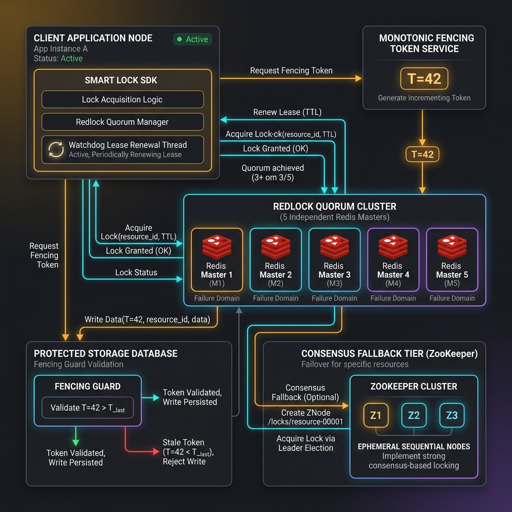
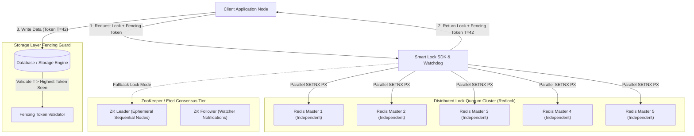
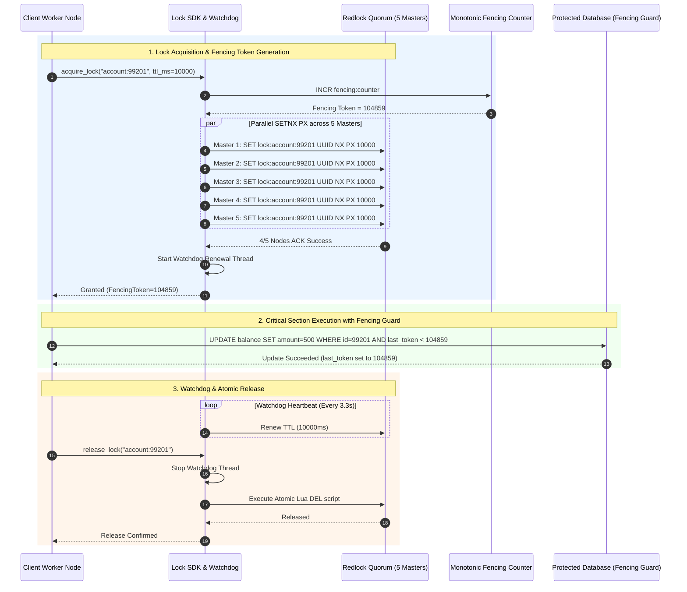
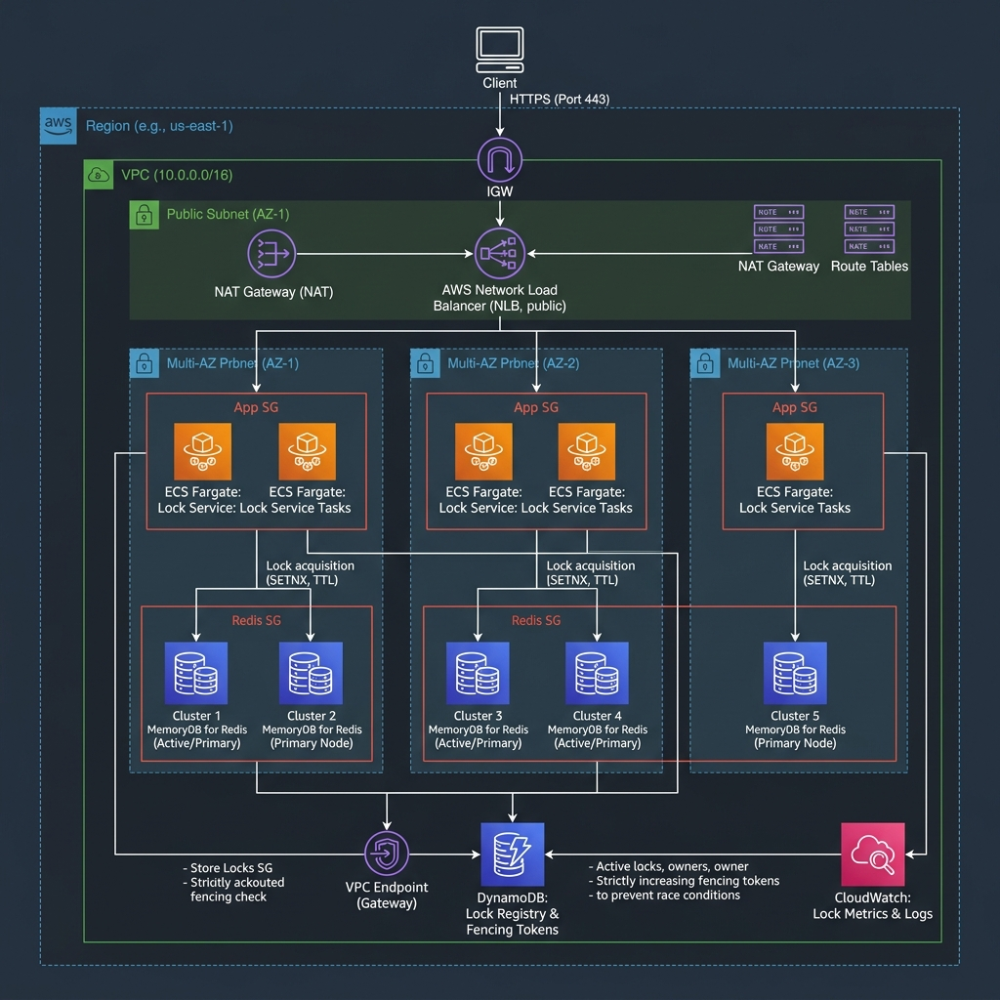
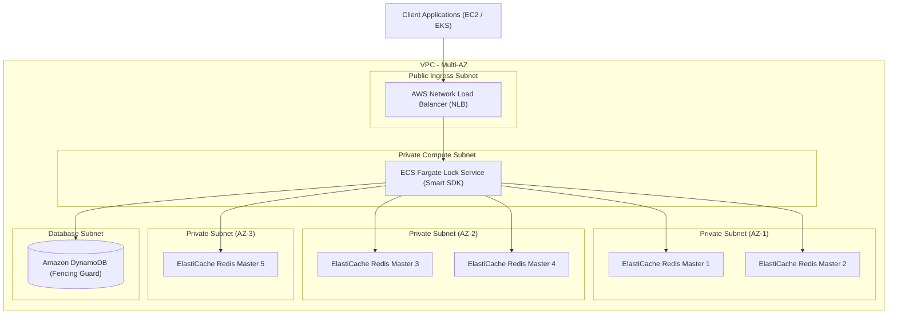

# Distributed Lock System Design Blueprint

A production-grade, fault-tolerant, low-latency Distributed Lock manager capable of granting exclusive resource access across distributed microservices. Designed with strict mutual exclusion safety guarantees, monotonic fencing tokens to prevent out-of-order storage corruption, automatic watchdog lease renewal, deadlock prevention via TTLs, and multi-master quorum consensus via the Redlock algorithm and ZooKeeper Ephemeral Sequential Nodes.

---

## 1. System Requirements

### Functional Requirements
1. **Exclusive Lock Acquisition (`acquire_lock`)**:
   - `acquire(resource_id, client_id, ttl_ms)`: Atomically grants exclusive access to a resource for a specified Time-To-Live (TTL). Returns a monotonically increasing **Fencing Token**.
2. **Atomic Lock Release (`release_lock`)**:
   - `release(resource_id, client_id)`: Safely releases a lock only if the requesting `client_id` matches the current lock owner (prevents accidental release of locks held by other clients).
3. **Lease Extension / Watchdog Renewal (`renew_lock`)**:
   - `renew(resource_id, client_id, extend_ms)`: Extends the lock TTL periodically while the client's critical section is actively executing.
4. **Fencing Token Generation**:
   - Every lock acquisition generates an incrementing integer token (`fencing_token`) attached to downstream requests. Storage engines reject any request with a token lower than the highest seen token.
5. **Lock Inspection (`get_lock_status`)**:
   - Retrieve current lock owner, remaining TTL, and active fencing token for telemetry and debugging.

### Non-Functional Requirements
1. **Safety Property (Mutual Exclusion)**: At most one client can hold a lock for a given resource at any instant in time.
2. **Liveness Property A (Deadlock Free)**: Even if a client crashes or encounters a network partition, the lock will eventually expire via TTL and be reclaimed.
3. **Liveness Property B (Fault Tolerance)**: The locking service remains operational as long as a quorum (majority) of consensus nodes are online ($N/2 + 1$).
4. **Low Latency**: Sub-millisecond ($< 1\text{ms}$) p99 lock acquisition and release latency under high concurrency.
5. **High Throughput**: Capable of handling over 100,000 lock requests per second across distributed clusters.

---

## 2. Capacity & Scale Estimation

### Scale Assumptions
- **Active Distributed Resources**: 1,000,000 concurrent lockable entities.
- **Daily Lock Operations**: 100 Million lock operations/day.
- **Average Lock Hold Duration**: 500 milliseconds.
- **Replication / Quorum Cluster Size**: 5 Independent Redis Masters (Redlock topology).

### Throughput Calculations
- **Average QPS**:
  $$\text{Total QPS} = \frac{100,000,000}{86,400\text{ seconds}} \approx 1,157\text{ Lock Ops/sec}$$
- **Peak Spike QPS (High Concurrency Flash Sale Event)**:
  $$\text{Peak QPS} = 1,157 \times 80 = \mathbf{92,560\text{ QPS}}$$
- **Quorum Latency Budget**:
  - Acquisition from 5 independent masters in parallel: Max round-trip time budget = $10\text{ms}$.
  - Minimum required successful nodes = $\lfloor 5/2 \rfloor + 1 = \mathbf{3\text{ Nodes}}$.

### Memory & Data Sizing
- **Single Lock Record Size**:
  $$\text{Resource Key (64B)} + \text{Value/UUID (36B)} + \text{Fencing Token (8B)} + \text{Metadata (64B)} = 172\text{ bytes}$$
- **Total In-Memory Footprint for 1 Million Concurrent Locks**:
  $$\text{Memory} = 1,000,000 \times 172\text{ bytes} \approx 172\text{ MB RAM}$$
- *Conclusion*: A single 16 GB Redis node easily retains all lock metadata; 5 nodes provide quorum durability without memory bottlenecks.

---

## 3. High-Level Architecture

The Distributed Lock architecture consists of a **Client Lock SDK with Watchdog**, a **Monotonic Fencing Token Service**, a **Redlock Quorum Cluster** (5 independent nodes), an **Etcd / ZooKeeper Consensus Fallback**, and the **Protected Storage Engine**.





### Component Details
1. **Smart Lock SDK & Watchdog**:
   - Manages parallel connection pools to consensus nodes.
   - Computes elapsed acquisition time; if total time exceeds validity window, immediately releases partial locks.
   - Runs a background **Watchdog Thread** that extends lock TTL every $TTL / 3$ milliseconds while execution continues.
2. **Redis Independent Masters (Redlock Cluster)**:
   - 5 independent Redis instances (no master-slave replication to eliminate replication lag windows).
   - Atomically executes `SET resource_id client_uuid NX PX ttl_ms`.
3. **Monotonic Fencing Token Generator**:
   - Provides strictly incrementing integers ($1, 2, 3...$) accompanying each granted lock.
   - Guarantees out-of-order writes caused by Garbage Collection (GC) pauses or network delays are rejected by storage guards.
4. **ZooKeeper / Etcd Consensus Tier (Alternative Engine)**:
   - Uses Ephemeral Sequential nodes (`/locks/resource_000000001`).
   - Uses Watcher events on the immediately preceding node (`n-1`) to avoid the **Herd Effect**.

---

## 4. Component-Level Design & Algorithms

### Redlock Quorum Algorithm

To acquire a lock for a resource across $N = 5$ independent master nodes:

```
Step 1: Get current timestamp T1 in milliseconds.
Step 2: Sequentially/In-parallel request SETNX PX from all 5 nodes with same key, UUID, and TTL (e.g. 10,000ms).
Step 3: Count successful ACKs (N_success) and measure T2. Elapsed_Time = T2 - T1.
Step 4: Lock Validity Time = TTL - Elapsed_Time - Clock_Drift_Margin.
Step 5: IF N_success >= 3 AND Lock Validity Time > 0:
            LOCK GRANTED! Return (FencingToken, ValidityTime)
        ELSE:
            UNLOCK ALL 5 NODES (Release partial locks) & Retry after random backoff.
```

### Monotonic Fencing Tokens vs GC Pauses

Without fencing tokens, a client experiencing a long Stop-The-World GC pause can corrupt state:

```
[Client A] --- Acquires Lock ---> [GC Pause 15 sec (Lock Expire)] -------------------> [Writes Data to DB (STALE!)]
                                     [Client B] --- Acquires Lock ---> [Writes Data to DB]
```

**With Monotonic Fencing Tokens**:
- Client A gets Token $T = 100$.
- Lock expires; Client B gets Token $T = 101$.
- Client B writes to Database with Token $101$. Database sets `last_fencing_token = 101`.
- Client A wakes up from GC pause and attempts write with Token $100$.
- Database checks: $100 < 101 \longrightarrow$ **REJECTED!**

```
Client A (Token=100)  ----> [DB Guard Check: 100 < 101] ----> REJECTED ❌
Client B (Token=101)  ----> [DB Guard Check: 101 > 100] ----> ACCEPTED ✅
```

### Atomic Release via Lua Script
Releasing a lock must be atomic to ensure a client never deletes another client's lock:

```lua
-- Lua script executed atomically on Redis node
if redis.call("get", KEYS[1]) == ARGV[1] then
    return redis.call("del", KEYS[1])
else
    return 0
end
```

---

## 5. Database Schema & Data Models

### Audit & State Database Schema (PostgreSQL DDL)

```sql
-- Track all distributed lock acquisitions, fencing tokens, and releases for auditability
CREATE TABLE distributed_locks (
    resource_id VARCHAR(128) PRIMARY KEY,
    owner_client_id VARCHAR(128) NOT NULL,
    fencing_token BIGINT NOT NULL UNIQUE,
    ttl_ms INT NOT NULL,
    acquired_at TIMESTAMP WITH TIME ZONE DEFAULT CURRENT_TIMESTAMP,
    expires_at TIMESTAMP WITH TIME ZONE NOT NULL,
    status VARCHAR(16) NOT NULL CHECK (status IN ('HELD', 'RELEASED', 'EXPIRED'))
);

CREATE INDEX idx_locks_fencing ON distributed_locks(fencing_token);
CREATE INDEX idx_locks_status_expires ON distributed_locks(status, expires_at);

-- Target storage table enforcing fencing token safety
CREATE TABLE bank_accounts (
    account_id VARCHAR(64) PRIMARY KEY,
    balance NUMERIC(18, 4) NOT NULL,
    last_fencing_token BIGINT NOT NULL DEFAULT 0
);
```

### Redis Key Namespace Conventions
| Key Pattern | Data Structure | Purpose | TTL |
| :--- | :--- | :--- | :--- |
| `lock:resource:{resource_id}` | String (UUID Value) | Atomic distributed lock holder | Specified `ttl_ms` (e.g. 10000ms) |
| `fencing:counter` | Atomic Integer | Monotonic fencing token sequence | Persistent |
| `lock:watchdog:{resource_id}` | Hash | Client watchdog heartbeat tracking | 5s |

---

## 6. API Design & Contracts

### RESTful API Contracts

#### 1. Acquire Distributed Lock
- **Endpoint**: `POST /v1/locks/acquire`
- **Request Payload**:
  ```json
  {
    "resource_id": "account:transfer:99201",
    "client_id": "worker-node-az1-42",
    "ttl_ms": 10000,
    "enable_watchdog": true
  }
  ```
- **Response (200 OK - Lock Granted)**:
  ```json
  {
    "acquired": true,
    "resource_id": "account:transfer:99201",
    "client_id": "worker-node-az1-42",
    "fencing_token": 104859,
    "validity_time_ms": 9840,
    "quorum_nodes_ack": 4
  }
  ```
- **Response (409 Conflict - Lock Busy)**:
  ```json
  {
    "acquired": false,
    "resource_id": "account:transfer:99201",
    "message": "Resource locked by client worker-node-az2-08",
    "retry_after_ms": 250
  }
  ```

#### 2. Release Distributed Lock
- **Endpoint**: `POST /v1/locks/release`
- **Request Payload**:
  ```json
  {
    "resource_id": "account:transfer:99201",
    "client_id": "worker-node-az1-42",
    "fencing_token": 104859
  }
  ```
- **Response (200 OK)**:
  ```json
  {
    "released": true,
    "resource_id": "account:transfer:99201",
    "message": "Lock atomic release executed across quorum"
  }
  ```

#### 3. Renew Lock Lease
- **Endpoint**: `POST /v1/locks/renew`
- **Request Payload**:
  ```json
  {
    "resource_id": "account:transfer:99201",
    "client_id": "worker-node-az1-42",
    "extend_ms": 10000
  }
  ```
- **Response (200 OK)**:
  ```json
  {
    "renewed": true,
    "resource_id": "account:transfer:99201",
    "new_ttl_ms": 10000
  }
  ```

---

## 7. End-to-End Workflow Sequence



---

## 8. Executable Python OOD Implementation

The following thread-safe Python implementation includes a **Redlock Quorum Manager**, a **Fencing Token Generator**, a background **Watchdog Lease Renewing Thread**, and a comprehensive test harness verifying mutual exclusion, fencing, and TTL expiration.

```python
import time
import uuid
import threading
from typing import Dict, Optional, List, Tuple


class FencingTokenGenerator:
    """Atomic monotonic integer counter for generating fencing tokens."""
    def __init__(self):
        self._counter = 0
        self._lock = threading.Lock()

    def next_token(self) -> int:
        with self._lock:
            self._counter += 1
            return self._counter


class MockRedisMasterNode:
    """Simulates an independent Redis master node executing atomic SETNX PX and Lua DEL."""
    def __init__(self, node_id: str):
        self.node_id = node_id
        self.store: Dict[str, Tuple[str, float]] = {}  # key -> (value_uuid, expire_timestamp)
        self.lock = threading.Lock()

    def set_nx_px(self, key: str, value_uuid: str, ttl_ms: int) -> bool:
        with self.lock:
            now = time.time()
            if key in self.store:
                _, expire_time = self.store[key]
                if now < expire_time:
                    return False  # Key still valid and locked
            
            # Grant lock
            self.store[key] = (value_uuid, now + (ttl_ms / 1000.0))
            return True

    def eval_lua_del(self, key: str, value_uuid: str) -> bool:
        with self.lock:
            now = time.time()
            if key in self.store:
                val, expire_time = self.store[key]
                if val == value_uuid and now < expire_time:
                    del self.store[key]
                    return True
            return False

    def extend_ttl(self, key: str, value_uuid: str, extend_ms: int) -> bool:
        with self.lock:
            now = time.time()
            if key in self.store:
                val, expire_time = self.store[key]
                if val == value_uuid and now < expire_time:
                    self.store[key] = (value_uuid, now + (extend_ms / 1000.0))
                    return True
            return False


class DistributedLockManager:
    """Redlock Distributed Lock Manager managing multi-master quorum consensus and watchdogs."""
    def __init__(self, nodes: List[MockRedisMasterNode]):
        self.nodes = nodes
        self.quorum = (len(nodes) // 2) + 1
        self.fencing_gen = FencingTokenGenerator()
        self.watchdogs: Dict[str, threading.Thread] = {}
        self.watchdog_stop_events: Dict[str, threading.Event] = {}

    def acquire_lock(self, resource_id: str, client_id: str, ttl_ms: int = 5000, enable_watchdog: bool = True) -> Tuple[bool, Optional[int], Optional[str]]:
        value_uuid = f"{client_id}:{uuid.uuid4()}"
        start_time = time.time()
        
        # Parallel acquisition across quorum nodes
        acks = 0
        for node in self.nodes:
            if node.set_nx_px(f"lock:{resource_id}", value_uuid, ttl_ms):
                acks += 1

        elapsed_ms = (time.time() - start_time) * 1000.0
        validity_time = ttl_ms - elapsed_ms

        if acks >= self.quorum and validity_time > 0:
            token = self.fencing_gen.next_token()
            
            # Start Watchdog Thread if requested
            if enable_watchdog:
                stop_event = threading.Event()
                watchdog_thread = threading.Thread(
                    target=self._watchdog_loop,
                    args=(resource_id, value_uuid, ttl_ms, stop_event),
                    daemon=True
                )
                self.watchdogs[resource_id] = watchdog_thread
                self.watchdog_stop_events[resource_id] = stop_event
                watchdog_thread.start()

            return True, token, value_uuid

        # Failed to achieve quorum: cleanup partial locks
        for node in self.nodes:
            node.eval_lua_del(f"lock:{resource_id}", value_uuid)

        return False, None, None

    def release_lock(self, resource_id: str, value_uuid: str) -> bool:
        # Stop Watchdog Thread if active
        if resource_id in self.watchdog_stop_events:
            self.watchdog_stop_events[resource_id].set()
            del self.watchdog_stop_events[resource_id]
            if resource_id in self.watchdogs:
                del self.watchdogs[resource_id]

        acks = 0
        for node in self.nodes:
            if node.eval_lua_del(f"lock:{resource_id}", value_uuid):
                acks += 1

        return acks >= self.quorum

    def _watchdog_loop(self, resource_id: str, value_uuid: str, ttl_ms: int, stop_event: threading.Event):
        interval = (ttl_ms / 1000.0) / 3.0
        while not stop_event.wait(interval):
            # Extend TTL across nodes
            renew_acks = 0
            for node in self.nodes:
                if node.extend_ttl(f"lock:{resource_id}", value_uuid, ttl_ms):
                    renew_acks += 1
            if renew_acks < self.quorum:
                break  # Lost quorum, stop watchdog


# Protected Database Table with Fencing Guard Simulation
class ProtectedDatabase:
    def __init__(self):
        self.balance = 1000
        self.last_fencing_token = 0
        self.lock = threading.Lock()

    def update_balance(self, new_balance: int, fencing_token: int) -> bool:
        with self.lock:
            if fencing_token <= self.last_fencing_token:
                print(f"❌ DB GUARD REJECTED Write! Token {fencing_token} <= Last Token Seen {self.last_fencing_token}")
                return False
            self.last_fencing_token = fencing_token
            self.balance = new_balance
            print(f"✅ DB GUARD ACCEPTED Write! Token {fencing_token} updated balance to ${new_balance}")
            return True


# Verification Harness
if __name__ == "__main__":
    print("=== 🚀 Initializing Distributed Lock Verification Harness ===")
    
    # Create 5 independent master nodes
    nodes = [MockRedisMasterNode(f"Redis_Master_{i+1}") for i in range(5)]
    lock_mgr = DistributedLockManager(nodes)
    db = ProtectedDatabase()

    # 1. Successful Lock Acquisition by Client A
    print("\n--- Test 1: Client A Acquires Lock ---")
    acquired, token_a, uuid_a = lock_mgr.acquire_lock("acc:9901", "Client_A", ttl_ms=3000, enable_watchdog=True)
    print(f"Client A Acquire Result: Granted={acquired}, Fencing Token={token_a}")
    
    # Execute DB update
    if acquired and token_a and uuid_a:
        db.update_balance(1200, token_a)

    # 2. Mutual Exclusion Check: Client B attempts to acquire same lock
    print("\n--- Test 2: Client B Concurrent Acquisition Attempt ---")
    acquired_b, token_b, uuid_b = lock_mgr.acquire_lock("acc:9901", "Client_B", ttl_ms=3000)
    print(f"Client B Acquire Result: Granted={acquired_b} (Expected: False)")

    # 3. Release Lock by Client A & Client B Re-Attempt
    print("\n--- Test 3: Client A Releases Lock & Client B Re-acquires ---")
    if uuid_a:
        released_a = lock_mgr.release_lock("acc:9901", uuid_a)
        print(f"Client A Release Result: {released_a}")

    acquired_b, token_b, uuid_b = lock_mgr.acquire_lock("acc:9901", "Client_B", ttl_ms=3000)
    print(f"Client B Re-acquire Result: Granted={acquired_b}, Fencing Token={token_b}")
    if acquired_b and token_b:
        db.update_balance(1500, token_b)

    # 4. Out-of-Order Stale Token Simulation (Client A wakes up late)
    print("\n--- Test 4: Stale Fencing Token Protection ---")
    if token_a:
        stale_write_success = db.update_balance(2000, token_a)
        print(f"Stale Client A Write Result: {stale_write_success} (Expected: False)")

    # Clean up
    if uuid_b:
        lock_mgr.release_lock("acc:9901", uuid_b)

    print("\n=== ✨ Distributed Lock Verification Completed Successfully! ===")
```

---

## 9. Scalability, Resilience & Edge Failover

```
+-------------------------------------------------------------------------+
|                    Fault Tolerance & Edge Matrix                        |
+-------------------+------------------------+----------------------------+
| Failure Scenario  | Detection Mechanism    | Mitigation Strategy        |
+-------------------+------------------------+----------------------------+
| Master Node Crash | Ping Timeout /         | Redlock Quorum remains     |
| (1 of 5 nodes)    | Connection Refused     | valid (4/5 nodes online)   |
+-------------------+------------------------+----------------------------+
| Clock Drift       | System NTP Drift       | Subtract Clock Drift Margin|
| Between Masters   | Delta Check            | from TTL validity window   |
+-------------------+------------------------+----------------------------+
| Client GC Pause   | Fencing Guard Check at | Database rejects write if  |
| (> Lock TTL)      | DB Target Storage      | Token <= Last Seen Token   |
+-------------------+------------------------+----------------------------+
```

---

## 10. AWS Cloud-Native Architecture

Deployed on AWS using **Amazon ElastiCache for Redis Cluster (Multi-Region) / MemoryDB**, **AWS Network Load Balancers**, **Amazon ECS Fargate**, and **Amazon DynamoDB**.





### AWS Service Mapping
| Generic Component | AWS Service | Implementation Details |
| :--- | :--- | :--- |
| **Ingress Router** | AWS Network Load Balancer (NLB) | Ultra-low latency L4 load balancing across Lock microservices. |
| **Quorum Nodes** | Amazon MemoryDB for Redis / ElastiCache | Multi-AZ, memory-optimized Graviton nodes providing $< 1\text{ms}$ responses. |
| **Lock Service API** | AWS ECS Fargate Tasks | Containerized microservice wrapper providing gRPC/REST lock APIs. |
| **Protected DB Guard** | Amazon DynamoDB | Enforces conditional writes: `attribute_not_exists(token) OR token > last_token`. |
| **Monitoring** | Amazon CloudWatch & AWS X-Ray | Real-time tracking of lock hold duration, contention frequency, and TTL expiry rates. |

---

## 11. Technology Justification

### Comparative Architecture Trade-offs

| Design Decision | Selected Choice | Alternative Option | Justification |
| :--- | :--- | :--- | :--- |
| **Lock Algorithm** | **Redlock (5 Independent Masters)** | Single Redis Master with Replicas | Single master async replication can lose locks on failover (failover window flaw). Redlock guarantees quorum durability. |
| **Out-of-Order Protection** | **Monotonic Fencing Tokens** | Relying on Timestamps | System clock drift causes timestamp skew; monotonic incrementing integers guarantee absolute ordering at storage guards. |
| **Consensus Alternative** | **ZooKeeper Ephemeral Sequential Nodes** | Etcd Leases | ZooKeeper watchers eliminate the "Herd Effect" by notifying only the immediate next waiting client in queue. |
| **Lease Maintenance** | **Auto-Renewal Watchdog Thread** | Fixed Long TTL | Fixed long TTLs cause prolonged deadlocks if clients crash; short TTLs with active watchdogs offer fast recovery. |
