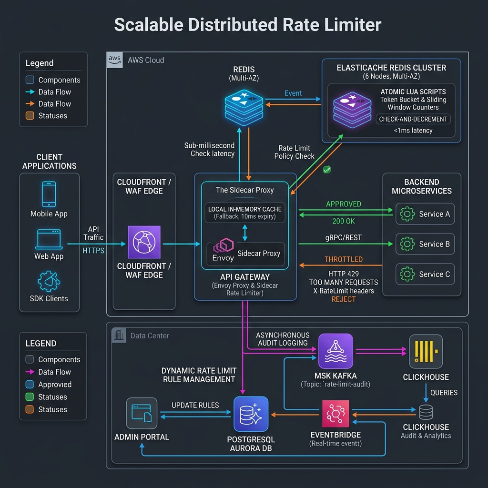
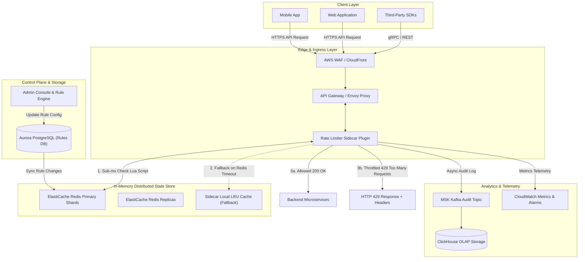
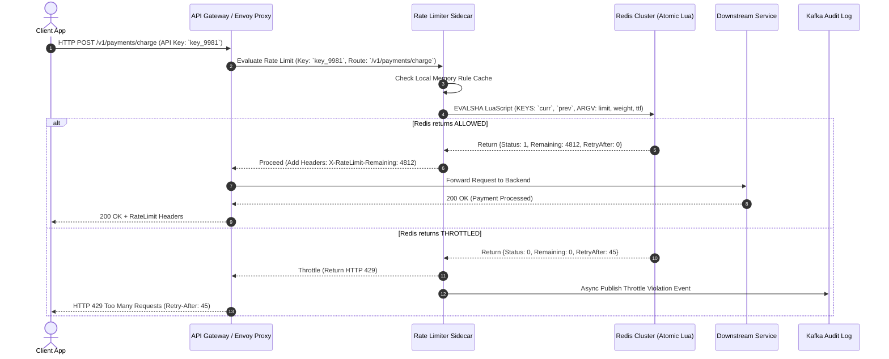
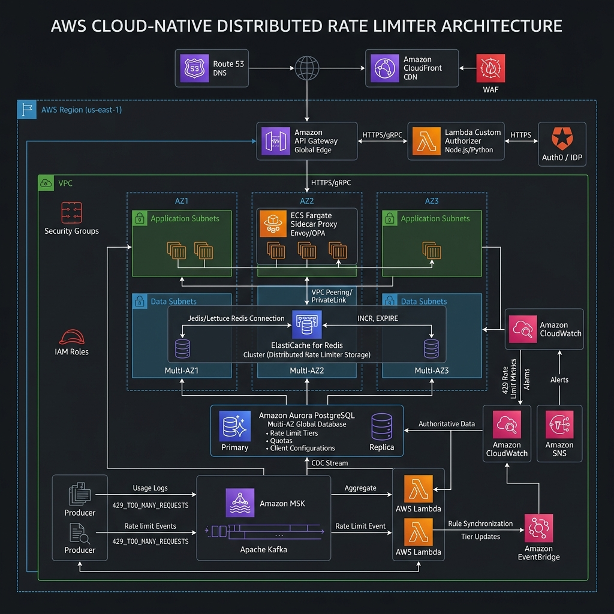

# 🚦 Distributed Rate Limiter System Design Blueprint

A production-grade, highly available, low-latency **Distributed Rate Limiter** architecture designed to process **1,000,000+ peak requests per second (QPS)** with **< 2ms latency overhead**. This system enforces traffic control, prevents Denial of Service (DoS/DDoS) attacks, protects downstream microservices from cascading overloads, and enforces monetization quotas across multi-tenant environments.

---

## Section 1: System Requirements

### 1.1 Functional Requirements

1. **Multi-Dimension Key Identification**: Rate limit requests based on flexible dimensions:
   - **Client IP Address** (unauthenticated public endpoints).
   - **User ID / Account ID** (authenticated session endpoints).
   - **API Key / App ID** (developer platform & multi-tenant SaaS tiers).
   - **Route / HTTP Endpoint & Method** (e.g., POST `/v1/payments` vs GET `/v1/products`).
2. **Multi-Tier Quota Rules**: Enforce distinct rate limits based on customer subscription tiers (e.g., *Free*: 100 req/min; *Pro*: 5,000 req/min; *Enterprise*: 100,000 req/min).
3. **Standardized HTTP Response Headers**: Return standard RFC-compliant HTTP headers on every response:
   - `X-RateLimit-Limit`: Maximum requests allowed within the current window.
   - `X-RateLimit-Remaining`: Number of requests remaining in the current window.
   - `X-RateLimit-Reset`: Unix epoch timestamp indicating when the current window resets.
   - `Retry-After`: Seconds to wait before retrying (included when throttled).
4. **HTTP 429 Throttle Response**: Reject excess traffic with HTTP status code `429 Too Many Requests` containing a structured JSON error body detailing the quota breach.
5. **Dynamic Rule Management**: Support real-time configuration changes (adding/updating rate limits or blacklisting IPs) without service restarts or deployment pipelines.
6. **Shadow / Audit Mode**: Allow operators to deploy new rate limiting rules in "dry-run" mode, logging policy violations to telemetry without blocking incoming traffic.

### 1.2 Non-Functional Requirements

1. **Ultra-Low Latency Overhead**: The rate limiting check must add **< 2 ms** overhead to the request hot path at $P_{99.9}$.
2. **High Availability & Fault Tolerance**: System availability target of **99.999%** (five nines). If the centralized rate limiter storage fails or partitions, the edge sidecar must fail-open (or switch to local fallback counters) to avoid dropping legitimate user traffic.
3. **Linear Horizontal Scalability**: Scale compute and cache clusters seamlessly to handle over **1,000,000 peak QPS**.
4. **High Accuracy & Race Condition Immunity**: Prevent rate limit bypass or false throttling caused by concurrent request race conditions in distributed environments.
5. **Memory Efficiency**: In-memory storage footprint per tracked key must stay below **100 bytes**, allowing hundreds of millions of concurrent client keys to be maintained in Redis clusters.

---

## Section 2: Capacity & Scale Estimation

### 2.1 Scale Assumptions

- **Daily Active Users (DAU)**: $50,000,000$ active users / API callers.
- **Total Requests / Day**: $1,000,000,000$ ($1\text{ Billion}$) daily API calls.
- **Average QPS**:
  $$\text{Average QPS} = \frac{1,000,000,000\text{ requests}}{86,400\text{ seconds}} \approx 11,574\text{ QPS}$$
- **Peak Traffic Multiplier**: $10\times$ surge spike factor.
  $$\text{Peak QPS} = 11,574 \times 10 \approx 115,740\text{ QPS (Design for } 1,000,000\text{ QPS surge peak)}$$

### 2.2 Memory Footprint & Storage Math

We evaluate memory usage for the **Sliding Window Counter** algorithm stored in Redis:

- **Key Size**: `rl:{tenant_id}:{user_id}:{endpoint}:{window_timestamp}` $\approx 45\text{ bytes}$.
- **Value Size**: Hash map with two sub-key counters (`prev_count`, `curr_count`) $\approx 35\text{ bytes}$.
- **Redis Overhead per Entry**: $\approx 40\text{ bytes}$ (Redis dict entry overhead).
- **Total Memory per Active Key**: $45 + 35 + 40 = 120\text{ bytes}$.
- **Concurrent Active Keys**: Assuming $100,000,000$ unique active keys tracked across a 1-hour window:
  $$\text{Total RAM Required} = 100,000,000 \times 120\text{ bytes} = 12,000,000,000\text{ bytes} \approx 12\text{ GB RAM}$$
- **With $3\times$ Cluster Replication Factor & Buffer**: $12\text{ GB} \times 3 \times 1.5 \approx \mathbf{54\text{ GB RAM}}$ (Easily accommodated across a 6-node AWS ElastiCache for Redis cluster).

---

## Section 3: High-Level Architecture

The rate limiting system is decoupled into an **Edge Gateway Sidecar Evaluator** (hot path), an **In-Memory Distributed Cache Cluster** (atomic state store), a **Rule Configuration Engine** (control plane), and an **Asynchronous Audit & Telemetry Pipeline**.





---

## Section 4: Component-Level Design & Algorithms

### 4.1 Comparison of Rate Limiting Algorithms

| Algorithm | Latency | Memory per Key | Race Condition Handling | Pros | Cons |
| :--- | :--- | :--- | :--- | :--- | :--- |
| **Token Bucket** | $< 1\text{ ms}$ | $\approx 32\text{ bytes}$ | Lua script atomic refill & decrement | Handles traffic bursts well; memory efficient | Complex to synchronize multi-datacenter refill clocks |
| **Leaky Bucket** | $< 1\text{ ms}$ | $\approx 48\text{ bytes}$ | Redis FIFO queue / Lua script | Smooths out traffic burstiness; steady egress rate | May delay critical requests in queue during spikes |
| **Fixed Window Counter** | $< 1\text{ ms}$ | $\approx 16\text{ bytes}$ | Atomic `INCR` command | Extremely simple; minimal memory footprint | $2\times$ burst spike problem at window boundary |
| **Sliding Window Log** | $5\text{–}10\text{ ms}$ | $\approx 1\text{ KB}\text{–}10\text{ KB}$ | Redis Sorted Set (`ZADD` + `ZREMRANGEBYSCORE`) | 100% boundary accuracy | High memory & computation overhead for burst traffic |
| **Sliding Window Counter** *(Chosen)* | $< 1.5\text{ ms}$ | $\approx 64\text{ bytes}$ | Atomic Lua script weighted math | High accuracy, smooths boundary spikes, highly memory efficient | Approximation based on linear traffic assumption |

### 4.2 Mathematical Formulation of Sliding Window Counter

Let $W$ be the fixed window length (e.g., $60\text{ seconds}$).
Let $T$ be the current Unix timestamp in seconds.
Let $C_{\text{curr}}$ be the request counter in the current window interval.
Let $C_{\text{prev}}$ be the request counter in the immediately preceding window interval.
The position weight coefficient $P$ of the current request within the current window is:

$$P = \frac{T \pmod W}{W}$$

The estimated request count $N_{\text{est}}$ for the rolling window is computed as:

$$N_{\text{est}} = C_{\text{prev}} \times (1 - P) + C_{\text{curr}}$$

If $N_{\text{est}} < \text{Threshold}$, the request is **ACCEPTED** and $C_{\text{curr}}$ is atomically incremented by $1$.
Otherwise, the request is **REJECTED** with status `429`.

### 4.3 Redis Lua Script for Atomic Rate Limiting

To eliminate race conditions between checking counters and incrementing values, the sidecar executes the following atomic Lua script on the Redis cluster:

```lua
-- Redis Lua Script: Sliding Window Counter
-- KEYS[1]: Current window key (e.g., "rl:usr_123:60:1785338400")
-- KEYS[2]: Previous window key (e.g., "rl:usr_123:60:1785338340")
-- ARGV[1]: Max requests allowed in window (e.g., 100)
-- ARGV[2]: Weight factor (1 - P) float (e.g., 0.35)
-- ARGV[3]: Window TTL in seconds (e.g., 120)

local curr_key = KEYS[1]
local prev_key = KEYS[2]
local limit = tonumber(ARGV[1])
local weight = tonumber(ARGV[2])
local ttl = tonumber(ARGV[3])

local curr_count = tonumber(redis.call('GET', curr_key) or "0")
local prev_count = tonumber(redis.call('GET', prev_key) or "0")

local estimated_count = math.floor(prev_count * weight + curr_count)

if estimated_count < limit then
    local new_curr = redis.call('INCR', curr_key)
    if new_curr == 1 then
        redis.call('EXPIRE', curr_key, ttl)
    end
    local remaining = limit - (estimated_count + 1)
    return {1, remaining, 0} -- Allowed: {status, remaining, retry_after}
else
    local retry_after = math.ceil(ttl / 2)
    return {0, 0, retry_after} -- Throttled: {status, remaining, retry_after}
end
```

---

## Section 5: Database Schema & Data Models

### 5.1 Relational Schema (PostgreSQL Aurora)

```sql
-- Client Subscription Tiers
CREATE TABLE client_tiers (
    tier_id VARCHAR(32) PRIMARY KEY,
    tier_name VARCHAR(64) NOT NULL,
    default_qps_limit INT NOT NULL,
    default_burst_limit INT NOT NULL,
    created_at TIMESTAMPTZ DEFAULT CURRENT_TIMESTAMP
);

-- Rate Limit Rules Table
CREATE TABLE rate_limit_rules (
    rule_id UUID PRIMARY KEY DEFAULT gen_random_uuid(),
    rule_name VARCHAR(128) NOT NULL,
    tenant_id VARCHAR(64) NOT NULL,
    client_tier VARCHAR(32) REFERENCES client_tiers(tier_id),
    target_route VARCHAR(256) NOT NULL, -- e.g., "/v1/checkout/*"
    http_method VARCHAR(10) NOT NULL DEFAULT '*',
    time_window_seconds INT NOT NULL DEFAULT 60,
    max_requests INT NOT NULL,
    algorithm VARCHAR(32) NOT NULL DEFAULT 'SLIDING_WINDOW_COUNTER',
    action_type VARCHAR(16) NOT NULL DEFAULT 'REJECT', -- 'REJECT', 'SHADOW'
    is_active BOOLEAN DEFAULT TRUE,
    created_at TIMESTAMPTZ DEFAULT CURRENT_TIMESTAMP,
    updated_at TIMESTAMPTZ DEFAULT CURRENT_TIMESTAMP
);

CREATE INDEX idx_rules_lookup ON rate_limit_rules(tenant_id, target_route, is_active);

-- Client Quota Overrides (Custom tier per user/API key)
CREATE TABLE client_quota_overrides (
    override_id UUID PRIMARY KEY DEFAULT gen_random_uuid(),
    client_identifier VARCHAR(128) NOT NULL UNIQUE, -- IP, User ID, or API Key
    rule_id UUID REFERENCES rate_limit_rules(rule_id),
    custom_max_requests INT NOT NULL,
    expiration_time TIMESTAMPTZ,
    created_at TIMESTAMPTZ DEFAULT CURRENT_TIMESTAMP
);

CREATE INDEX idx_quota_client ON client_quota_overrides(client_identifier);
```

### 5.2 Redis Key Namespace Strategy

| Key Pattern | Data Type | TTL | Purpose |
| :--- | :--- | :--- | :--- |
| `rl:{tenant}:{client_id}:{route}:{window_ts}` | `String (Int)` | $2 \times \text{Window}$ | Current window request count for given client & route. |
| `tb:{tenant}:{client_id}:{route}` | `Hash` | $1 \times \text{Hour}$ | Token bucket state (`tokens`, `last_refill_time`). |
| `rule:cache:{tenant}:{route}` | `String (JSON)` | $300\text{ s}$ | Cached rule config object evaluated by Envoy/Sidecar. |
| `bl:{client_ip}` | `String` | Configurable | Global IP blacklist flag for abusive callers. |

---

## Section 6: API Design & Contracts

### 6.1 Evaluate Rate Limit Request (Internal Sidecar Interceptor API)

**Endpoint**: `POST /v1/rate-limit/check`

#### Request Headers
```http
Host: ratelimiter-internal.service.local
Content-Type: application/json
X-Correlation-ID: corr-88f912a7-3310-47b2-9d8a
```

#### Request Payload
```json
{
  "tenant_id": "tenant_acme_corp",
  "client_identifier": "api_key_live_99812a4b",
  "client_ip": "198.51.100.42",
  "route": "/v1/payments/charge",
  "http_method": "POST",
  "timestamp": 1785338415
}
```

#### Response Payload (HTTP 200 - Allowed)
```json
{
  "status": "ALLOWED",
  "rule_id": "7f8b912c-4411-4a8e-9901-2a2b3c4d5e6f",
  "algorithm": "SLIDING_WINDOW_COUNTER",
  "limit": 5000,
  "remaining": 4812,
  "reset_timestamp": 1785338460,
  "shadow_mode": false
}
```

#### Response Payload (HTTP 429 - Throttled)
```json
{
  "status": "THROTTLED",
  "error_code": "TOO_MANY_REQUESTS",
  "message": "Rate limit exceeded. Maximum 5000 requests per 60 seconds allowed.",
  "rule_id": "7f8b912c-4411-4a8e-9901-2a2b3c4d5e6f",
  "limit": 5000,
  "remaining": 0,
  "reset_timestamp": 1785338460,
  "retry_after_seconds": 45
}
```

---

## Section 7: End-to-End Workflow Sequence



---

## Section 8: Executable Python OOD Code

Below is a complete, production-ready, thread-safe Python implementation of the **Distributed Rate Limiter** supporting both **Token Bucket** and **Sliding Window Counter** algorithms with atomic lock synchronization and test harness verification.

```python
import time
import threading
import math
from typing import Dict, Tuple, Optional, Any
from dataclasses import dataclass
from enum import Enum


class AlgorithmType(Enum):
    TOKEN_BUCKET = "TOKEN_BUCKET"
    SLIDING_WINDOW_COUNTER = "SLIDING_WINDOW_COUNTER"


@dataclass
class RateLimitResult:
    allowed: bool
    limit: int
    remaining: int
    reset_timestamp: int
    retry_after: int


@dataclass
class RateLimitRule:
    rule_id: str
    tenant_id: str
    target_route: str
    max_requests: int
    window_seconds: int
    algorithm: AlgorithmType = AlgorithmType.SLIDING_WINDOW_COUNTER


class MemoryRedisMock:
    """Thread-safe mock representing atomic Redis operations and Lua script executions."""

    def __init__(self):
        self._store: Dict[str, float] = {}
        self._lock = threading.Lock()

    def get(self, key: str) -> Optional[float]:
        with self._lock:
            return self._store.get(key)

    def set(self, key: str, value: float) -> None:
        with self._lock:
            self._store[key] = value

    def eval_sliding_window(
        self, curr_key: str, prev_key: str, limit: int, weight: float, ttl: int
    ) -> Tuple[int, int, int]:
        with self._lock:
            curr_count = self._store.get(curr_key, 0.0)
            prev_count = self._store.get(prev_key, 0.0)

            estimated_count = math.floor(prev_count * weight + curr_count)

            if estimated_count < limit:
                new_curr = curr_count + 1.0
                self._store[curr_key] = new_curr
                remaining = int(limit - (estimated_count + 1))
                return (1, remaining, 0)
            else:
                retry_after = math.ceil(ttl / 2)
                return (0, 0, retry_after)

    def eval_token_bucket(
        self, bucket_key: str, max_tokens: int, refill_rate: float, now: float
    ) -> Tuple[int, int, int]:
        with self._lock:
            data = self._store.get(bucket_key)
            if data is None:
                tokens = float(max_tokens)
                last_refill = now
            else:
                tokens, last_refill = data

            # Calculate refilled tokens
            delta = max(0.0, now - last_refill)
            tokens = min(float(max_tokens), tokens + delta * refill_rate)

            if tokens >= 1.0:
                tokens -= 1.0
                self._store[bucket_key] = (tokens, now)
                return (1, int(tokens), 0)
            else:
                self._store[bucket_key] = (tokens, last_refill)
                needed = 1.0 - tokens
                retry_after = math.ceil(needed / refill_rate)
                return (0, 0, retry_after)


class DistributedRateLimiter:
    """High-performance distributed rate limiter engine."""

    def __init__(self, redis_client: MemoryRedisMock):
        self.redis = redis_client
        self.rules: Dict[str, RateLimitRule] = {}

    def register_rule(self, rule: RateLimitRule) -> None:
        key = f"{rule.tenant_id}:{rule.target_route}"
        self.rules[key] = rule

    def evaluate(
        self, tenant_id: str, client_identifier: str, route: str, timestamp: Optional[float] = None
    ) -> RateLimitResult:
        now = timestamp if timestamp is not None else time.time()
        rule_key = f"{tenant_id}:{route}"
        rule = self.rules.get(rule_key)

        if not rule:
            # Default fallback rule if specific route is not registered
            rule = RateLimitRule(
                rule_id="default-rule",
                tenant_id=tenant_id,
                target_route=route,
                max_requests=100,
                window_seconds=60,
                algorithm=AlgorithmType.SLIDING_WINDOW_COUNTER,
            )

        if rule.algorithm == AlgorithmType.SLIDING_WINDOW_COUNTER:
            return self._evaluate_sliding_window(rule, client_identifier, now)
        else:
            return self._evaluate_token_bucket(rule, client_identifier, now)

    def _evaluate_sliding_window(
        self, rule: RateLimitRule, client_id: str, now: float
    ) -> RateLimitResult:
        window = rule.window_seconds
        curr_window_ts = int(now // window) * window
        prev_window_ts = curr_window_ts - window

        curr_key = f"rl:{rule.tenant_id}:{client_id}:{rule.target_route}:{curr_window_ts}"
        prev_key = f"rl:{rule.tenant_id}:{client_id}:{rule.target_route}:{prev_window_ts}"

        window_offset = now - curr_window_ts
        weight = max(0.0, 1.0 - (window_offset / window))

        allowed_int, remaining, retry_after = self.redis.eval_sliding_window(
            curr_key=curr_key,
            prev_key=prev_key,
            limit=rule.max_requests,
            weight=weight,
            ttl=window * 2,
        )

        reset_ts = curr_window_ts + window
        return RateLimitResult(
            allowed=bool(allowed_int == 1),
            limit=rule.max_requests,
            remaining=remaining,
            reset_timestamp=reset_ts,
            retry_after=retry_after,
        )

    def _evaluate_token_bucket(
        self, rule: RateLimitRule, client_id: str, now: float
    ) -> RateLimitResult:
        bucket_key = f"tb:{rule.tenant_id}:{client_id}:{rule.target_route}"
        refill_rate = rule.max_requests / rule.window_seconds

        allowed_int, remaining, retry_after = self.redis.eval_token_bucket(
            bucket_key=bucket_key,
            max_tokens=rule.max_requests,
            refill_rate=refill_rate,
            now=now,
        )

        reset_ts = int(now) + retry_after
        return RateLimitResult(
            allowed=bool(allowed_int == 1),
            limit=rule.max_requests,
            remaining=remaining,
            reset_timestamp=reset_ts,
            retry_after=retry_after,
        )


# Verification Test Harness
if __name__ == "__main__":
    print("==================================================")
    print("🚦 Running Distributed Rate Limiter Test Harness")
    print("==================================================")

    redis_mock = MemoryRedisMock()
    limiter = DistributedRateLimiter(redis_mock)

    # Register rule: Max 5 requests per 10 seconds for payment route
    limiter.register_rule(
        RateLimitRule(
            rule_id="rule-payment-101",
            tenant_id="acme",
            target_route="/v1/payments",
            max_requests=5,
            window_seconds=10,
            algorithm=AlgorithmType.SLIDING_WINDOW_COUNTER,
        )
    )

    client_id = "user_subscriber_42"
    base_time = 1785338400.0

    print("\n--- Test Phase 1: Sending 5 Sequential Requests ---")
    for i in range(1, 6):
        res = limiter.evaluate("acme", client_id, "/v1/payments", timestamp=base_time + (i * 0.5))
        status_str = "ALLOWED" if res.allowed else "THROTTLED"
        print(f"Request #{i}: Status={status_str}, Remaining={res.remaining}, ResetIn={res.reset_timestamp - int(base_time)}s")
        assert res.allowed is True

    print("\n--- Test Phase 2: Sending 6th Request (Expecting Throttle) ---")
    res_throttled = limiter.evaluate("acme", client_id, "/v1/payments", timestamp=base_time + 3.0)
    print(f"Request #6: Allowed={res_throttled.allowed}, Remaining={res_throttled.remaining}, RetryAfter={res_throttled.retry_after}s")
    assert res_throttled.allowed is False
    assert res_throttled.retry_after > 0

    print("\n--- Test Phase 3: Concurrency Race Condition Test ---")
    threads = []
    success_count = [0]
    lock = threading.Lock()

    def worker():
        r = limiter.evaluate("acme", "user_concurrent", "/v1/payments", timestamp=base_time)
        if r.allowed:
            with lock:
                success_count[0] += 1

    for _ in range(10):
        t = threading.Thread(target=worker)
        threads.append(t)
        t.start()

    for t in threads:
        t.join()

    print(f"Concurrent requests allowed: {success_count[0]} / 10 (Limit: 5)")
    assert success_count[0] == 5

    print("\n✅ ALL RATE LIMITER VERIFICATION TESTS PASSED SUCCESSFULLY!")
```

---

## Section 9: Scalability, Resilience & Edge Failover

### 9.1 Multi-Region Synchronization Strategy

In global deployments spanning multiple regions (e.g., `us-east-1`, `eu-central-1`, `ap-southeast-1`), synchronizing counters in real time across continents over high-latency WAN links is prohibitively expensive. We implement a **Hierarchical Hybrid Sync**:

1. **Local Regional Counter Evaluation**: Requests are evaluated against the local region's ElastiCache Redis cluster with sub-millisecond latency.
2. **Asynchronous Batch Quota Sync**: Edge sidecars asynchronously push local request delta aggregations every $1\text{ second}$ to a global Kafka cluster.
3. **Global Quota Adjustment**: A global worker calculates regional usage splits and dynamically adjusts regional limits (e.g., allocating 60% quota to US and 40% to EU based on real-time traffic proportions).

### 9.2 Resilience & Fail-Open Behavior

- **Redis Connection Timeout**: If the Redis check times out ($> 5\text{ ms}$), the sidecar falls back to a local in-memory LRU cache with conservative limits.
- **Circuit Breaker Trip (Fail-Open Policy)**: If the central Redis cluster experiences complete outage, the rate limiter trips open to `FAIL_OPEN` mode, allowing traffic through to downstream services while alerting operators via PagerDuty to prevent a self-inflicted global outage.

---

## Section 10: AWS Cloud-Native Architecture



### AWS Service Mapping

| Generic Component | AWS Service | Operational Details & Configuration |
| :--- | :--- | :--- |
| **Edge Ingress / CDN** | Amazon CloudFront & AWS WAF | Performs basic IP rate limiting at CloudFront edge (AWS WAF rate-based rules) before requests enter VPC. |
| **API Gateway / Sidecar** | Amazon API Gateway & ECS Fargate | Envoy Proxy running sidecar container on ECS Fargate executes atomic rate limit checks via gRPC filter. |
| **In-Memory Cache Cluster** | Amazon ElastiCache for Redis | Sharded multi-AZ Redis 7.x cluster running atomic Lua scripts for sub-millisecond counter management. |
| **Relational Metadata Store**| Amazon Aurora PostgreSQL Global DB | Stores authoritative client subscription tiers, custom API quotas, and dynamic endpoint rules. |
| **Event Stream Logging** | Amazon MSK (Managed Streaming for Kafka) | Streams raw rate limit violation events asynchronously for audit logging and real-time security telemetry. |
| **Metrics & Monitoring** | Amazon CloudWatch | Captures rate-limit metrics (`429_ThrottledCount`, `RateLimitCheckLatency`) and triggers auto-scaling alarms. |
| **Event Routing** | Amazon EventBridge | Routes rule configuration update events from Aurora CDC (AWS DMS) to flush Redis cache keys. |

---

## Section 11: Technology Justification

### 11.1 Why Redis + Lua over SQL Databases
- **Performance**: Relational databases (PostgreSQL/MySQL) incur heavy disk I/O, lock contention, and connection overhead under 1,000,000 QPS. Redis runs entirely in memory, serving key lookups in $< 0.5\text{ ms}$.
- **Atomicity**: Executing Lua scripts within Redis guarantees single-threaded, isolated execution without requiring distributed locks.

### 11.2 Why Sliding Window Counter over Sliding Window Log
- **Memory Consumption**: Sliding Window Log requires storing a timestamp entry for every single request (e.g., $10,000$ timestamps $\approx 80\text{ KB}$ per user key). Sliding Window Counter requires only two integer counters ($\approx 64\text{ bytes}$), representing a **$1,250\times$ memory footprint reduction**.
- **CPU Overhead**: Redis `ZREMRANGEBYSCORE` runs in $O(\log N + M)$ time complexity, whereas Sliding Window Counter Lua script runs in constant $O(1)$ time complexity.
