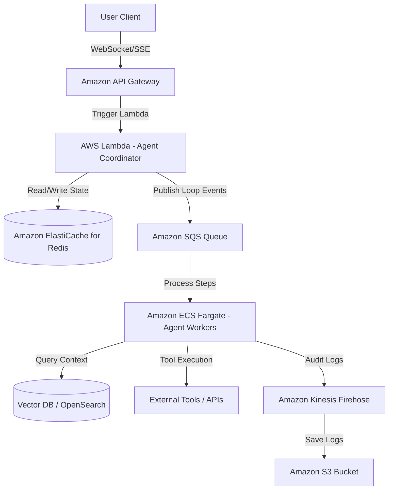
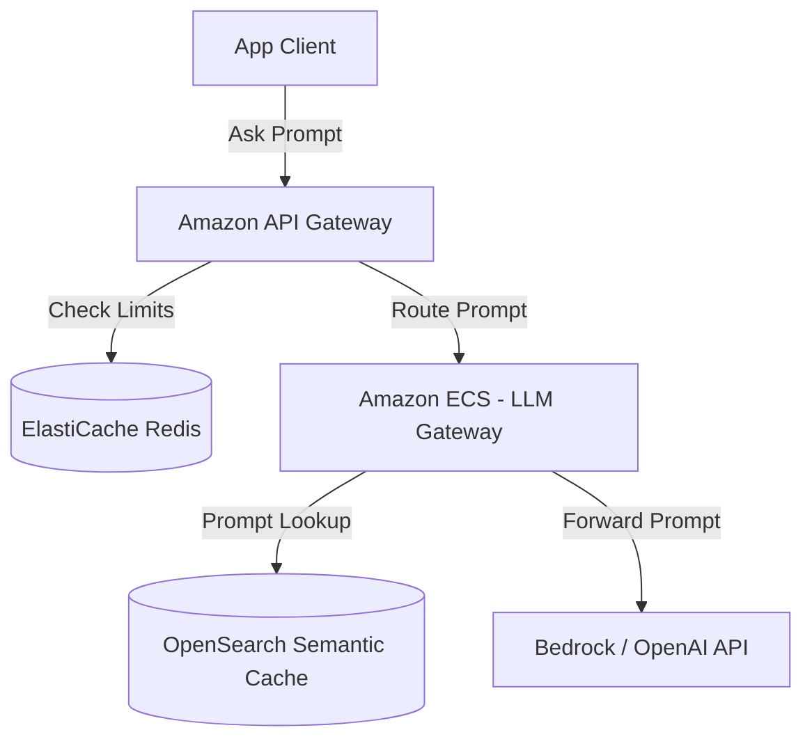

# I Built a Live Interactive Simulator for 14 System Design Blueprints. Here’s What I Learned.

### How to bridge the gap between abstract boxes, production-grade cloud infrastructure, and real-time query simulation.

---

System design is often taught through dry, text-heavy manuals or static diagrams filled with abstract boxes. While these resources are useful for passing the initial rounds of a conceptual interview, they leave a massive gap when it comes to actual, production-ready engineering.

When you are task-managing a migration, designing a high-scale service, or interviewing for a Staff-level engineering position at a FAANG company, high-level hand-waving like *"we use a database here"* or *"a cache goes there"* is not enough. You need to know:
1. **Infrastructure Mapping:** How do these concepts translate into real **AWS Cloud-Native components** and copy-pasteable **Terraform resource configurations**?
2. **API Data Flow:** What do the real-time **JSON request/response payloads** look like as they pass through your services?
3. **Query Trajectory:** How does query traffic route across public subnets, private subnets, caching tiers, and multi-region databases in real-time?

To solve this, I built **[System Design Blueprints](https://github.com/udaysinghkushwah/system-design-blueprints)**—a repository mapping 14 production-grade architectures. Along with it, I deployed a live **[Interactive Architecture Explorer](https://udaysingh-system-design.web.app)** that lets you simulate and inspect traffic flows dynamically in-browser.

Here is the story of how I built it, the architectural considerations for key systems, and the technical lessons learned.

---

## ⚡ The Interactive Explorer: Making Systems Feel "Alive"

Static PNGs don't capture the dynamic behavior of distributed systems. The **[Interactive Explorer](https://udaysingh-system-design.web.app)** was built to make these designs tactile:

* **glowing "New Era" Theme:** Inspired by modern design canvas engines (like Eraser.io and IcePanel), the dashboard renders high-fidelity system diagrams set on a professional dark grid background.
* **Ambient Hover Halos:** Hovering over any node (such as an Application Load Balancer or DynamoDB cluster) triggers a soft glowing border highlight indicating it is interactive.
* **Laser-Guided Simulation:** Toggle the **"Simulate Query Flow"** button in the sidebar, and the connection paths illuminate with flowing neon dash streams, letting you trace visual packets as they navigate through VPC subnets.
* **Node Inspector:** Clicking a node opens a side panel displaying the exact operational description, real-world JSON schemas, and matching **AWS Terraform infrastructure-as-code** blocks.

---

## 📂 Deep Dive: Breakdown of Key Architectural Blueprints

Let’s look at three highly requested systems featured in the explorer, illustrating the depth of details provided for each design.

### Case Study 1: The Stateful AI Agent Framework (AI Systems)
Most AI agent tutorials focus on single-file Python scripts running locally. In production, however, state management, long-running agent loops, and token streaming require a robust distributed engine.



* **State Tracking:** We use **Amazon ElastiCache for Redis** to store the agent's short-term execution memory (such as dialog history, active tool runs, and step iteration tokens) with sub-millisecond latencies.
* **Worker Queue:** An agent's execution loop can take minutes. Instead of blocking HTTP connections, requests are serialized and pushed to an **Amazon SQS** queue. Dedicated **ECS Fargate workers** consume from the queue, execute tools, and notify the user client asynchronously.
* **Audit Trail:** To debug agent decision chains, execution steps are captured via **Amazon Kinesis Firehose** and stored in **Amazon S3** for offline analysis.

---

### Case Study 2: Smart Parking Lot (Distributed Locks & Concurrency)
Designing a system to manage 50,000 parking spots sounds simple until multiple gates request an allocation for the *same* parking space at the *same* fraction of a second.

```text
[ Gate 1 & 2 Concurrent Allocations ]
                 │
                 ▼
   ┌───────────────────────────┐
   │  Redis Distributed Lock   │  <-- Step 1: Prevents double allocation
   │    SET lock:spot NX EX 1  │
   └───────────────────────────┘
                 │
                 ▼
 ┌───────────────────────────────────┐
 │ DB Optimistic Concurrency Check   │  <-- Step 2: Database integrity shield
 │   UPDATE spots SET status='RESERVED',
 │   version=version+1               │
 │   WHERE id=102 AND version=current_v
 └───────────────────────────────────┘
```

The blueprint maps out a two-tiered safety net:
1. **Redis Distributed Lock (Redlock):** Prior to checking database availability, workers attempt to acquire a distributed lock in Redis with a short TTL (`SET lock:spot_102 NX EX 3`).
2. **Optimistic Concurrency Control (OCC) in Database:** When saving the reservation in **Amazon Aurora PostgreSQL**, we check the spot's `version` field. The query will only succeed if the database row's version matches the read version:
   ```sql
   UPDATE spots 
   SET status = 'RESERVED', version = version + 1 
   WHERE id = 102 AND version = :current_version;
   ```
   If another worker updated the row in the meantime, the version check fails, triggering an automatic retry.

---

### Case Study 3: LLM Gateway / Proxy (AI Infrastructure)
When scaling LLM-backed applications, gateway proxies are required to enforce safety rules, cache common prompts, and handle token rate limits.



* **Semantic Caching:** If a user submits a prompt that is semantically identical to a previous query (e.g. *"how do I reset my password"* vs. *"steps to restore password"*), the LLM Gateway intercepts the query. It computes an embedding vector and searches **Amazon OpenSearch Service**. If a high-similarity match is found, the cached response is returned immediately, bypassing the expensive LLM provider call.
* **Token Rate Limiting:** We record sliding-window token counts in **Amazon ElastiCache for Redis** using Redis sorted sets (ZADD) to track user token consumption rates and enforce strict rate limits before queries reach the model endpoint.

---

## 🛠️ The Tech Stack Behind the Explorer

To host this interactive application at zero cost and without relying on heavy frontend frameworks, I designed a lightweight, vanilla tech stack:
* **Core & Layout:** Vanilla HTML5 and CSS3 (Flexbox/Grid). I avoided Tailwind CSS and React to keep the bundle footprint minimal and loading speeds instant.
* **Diagrams:** Scalable Vector Graphics (SVG) styled dynamically with CSS transitions and filter keyframes for neon glow animations.
* **Markdown Parser:** **Marked.js** to compile standard markdown files in real-time.
* **Flowcharts & Math:** **Mermaid.js** and **KaTeX** dynamically loaded via CDN to parse complex ASCII/Unicode box-drawing strings and LaTeX equations inside document files.
* **Deployment:** Hosted on **Firebase Hosting**'s global CDN to ensure sub-second response times worldwide.

---

## 🚀 Explore the Blueprints Yourself

All code, markdown designs, and SVG diagrams are fully open-source.

* **💻 Live Dashboard:** [https://udaysingh-system-design.web.app](https://udaysingh-system-design.web.app) 🌐
* **🐙 GitHub Repository:** [github.com/udaysinghkushwah/system-design-blueprints](https://github.com/udaysinghkushwah/system-design-blueprints) ⭐️

If you are preparing for system design interviews or building distributed systems at your job, explore the designs, click the nodes to copy their Terraform modules, and test out the interactive simulator!

*If you found this helpful, support my work by **[Buying Me a Chai ☕](https://www.buymeachai.in/toudaysinghkushwah)**!*

---

### About the Author
**Uday Singh** is a software engineer specializing in high-scale distributed systems and cloud architectures.
* 📬 **Email:** [toudaysinghkushwah@gmail.com](mailto:toudaysinghkushwah@gmail.com)
* 🐙 **GitHub:** [github.com/udaysinghkushwah](https://github.com/udaysinghkushwah)
* 🌐 **Live Portfolio:** [udaysingh-system-design.web.app](https://udaysingh-system-design.web.app)
