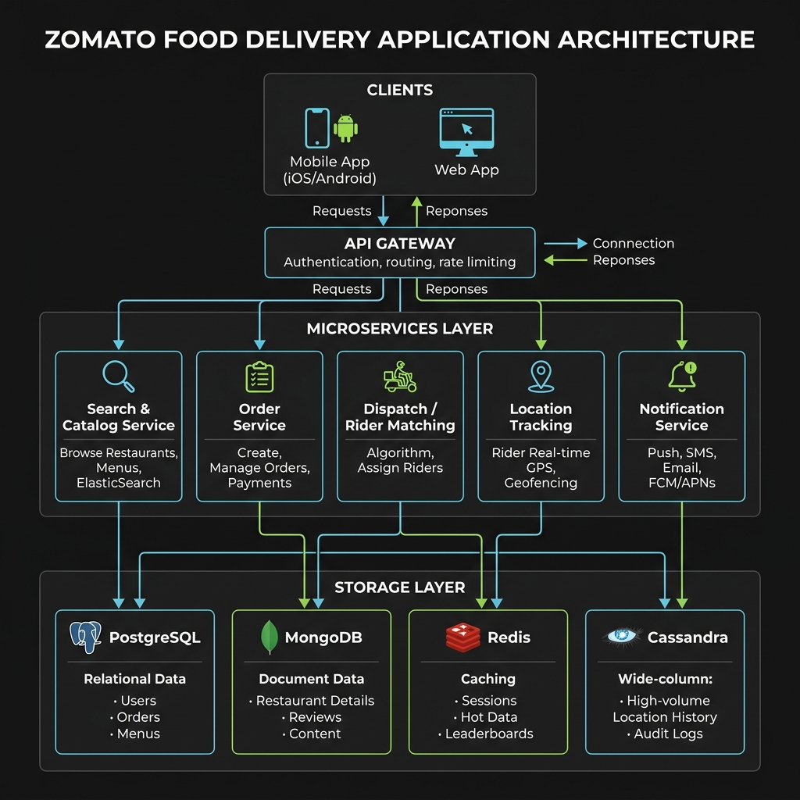
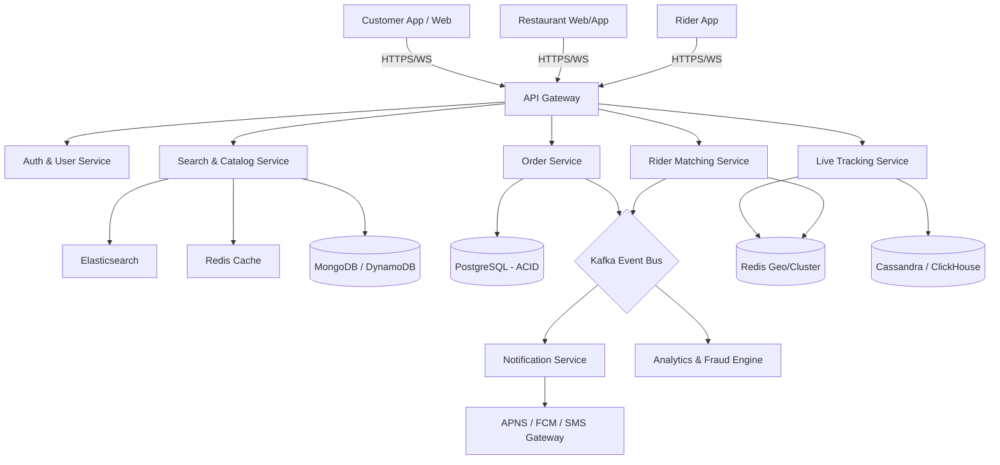
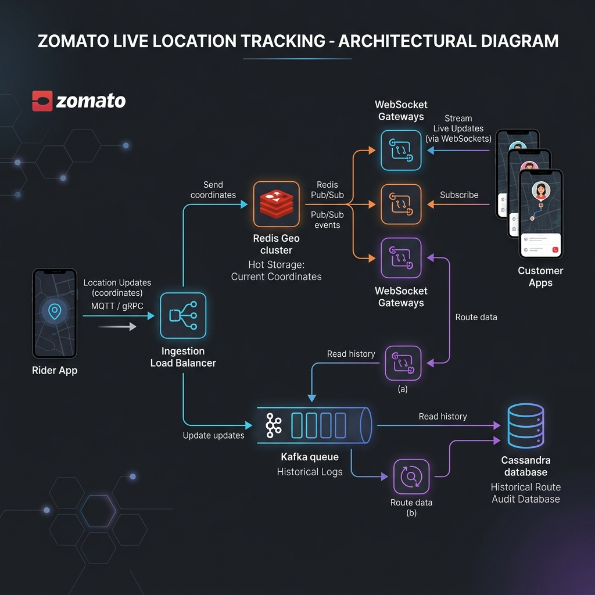
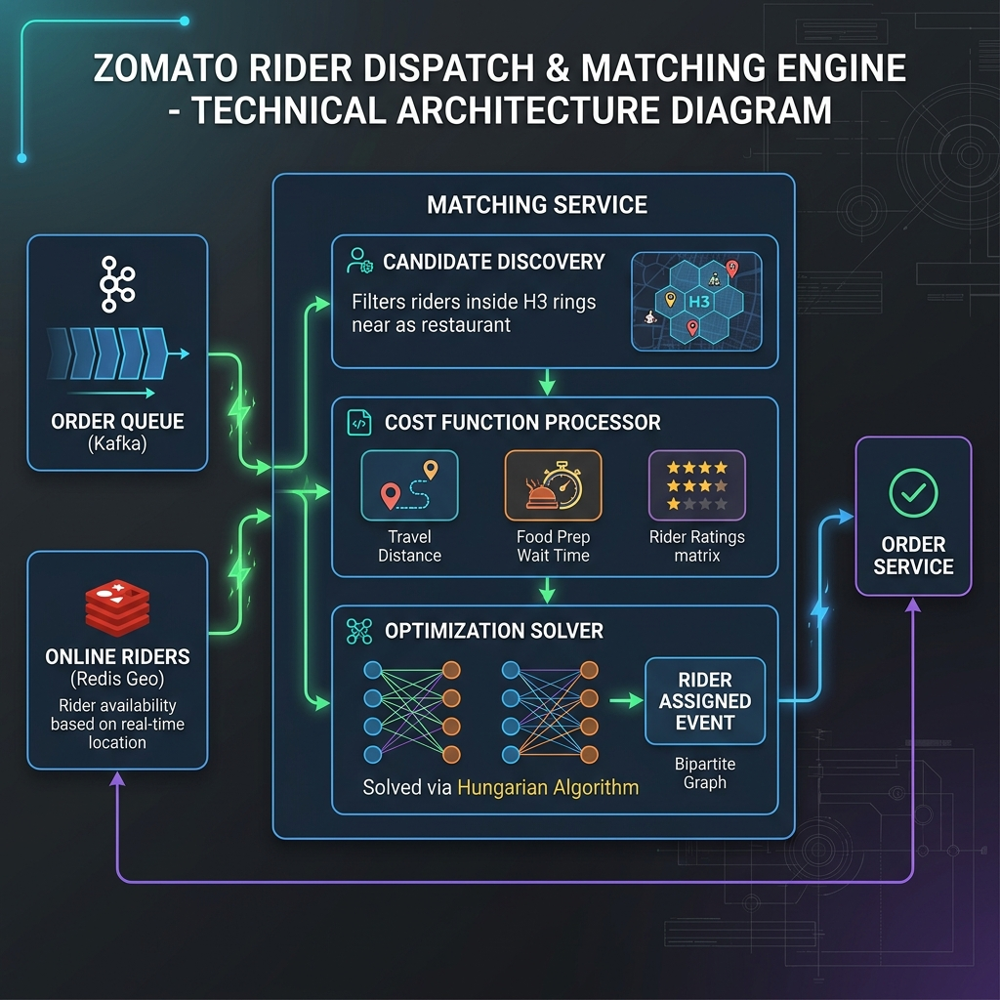
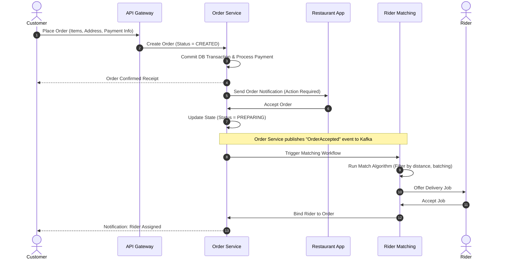

# Zomato System Design

This document details the end-to-end system design for a high-scale food delivery platform like **Zomato** (or UberEats). The platform connects three major entities: **Customers**, **Restaurants**, and **Delivery Partners (Riders)**.

---

## 1. System Requirements

### Functional Requirements
* **Customers:**
  * Search for restaurants by location, cuisine, dish name, and ratings.
  * Browse restaurant menus, add items to a cart, and place orders.
  * Pay securely through multiple payment modes.
  * Track order preparation and rider location in real-time.
  * Review and rate restaurants and delivery partners.
* **Restaurants:**
  * Onboard, manage profiles, edit menus (items, pricing, availability).
  * Receive, accept, or reject incoming orders.
  * Update order status (e.g., *Preparing*, *Food Ready*).
* **Delivery Partners (Riders):**
  * Receive delivery requests and accept/reject them based on location and payout.
  * Navigate to the restaurant for food pickup and to the customer's address for delivery.
  * Send continuous GPS coordinates for live location tracking.

### Non-Functional Requirements
* **High Availability:** The search, catalog, and checkout flows must have 99.99% availability.
* **Low Latency:**
  * Search and catalog rendering should be $< 200\text{ms}$.
  * Live location tracking latency must be sub-second to prevent "laggy" map tracking.
* **Consistency:** 
  * Transactions (payments, order states, rider assignment) must be strictly consistent (ACID).
  * Menu updates can be eventually consistent (within a few minutes).
* **Scalability:** The system must gracefully handle daily peak hours (lunch and dinner traffic spikes).

---

## 2. Capacity & Scale Estimation

Let's establish a base model for traffic and storage calculations:

* **Daily Active Users (DAU):** $10 \text{ Million}$
* **Total Daily Orders:** $2 \text{ Million}$
* **Average Order Value:** $\$15$
* **Active Delivery Partners (Riders) at Peak:** $100,000$

### Query Per Second (QPS)
* **Order Placement QPS:** 
  $$\text{Average Orders/sec} = \frac{2,000,000 \text{ orders}}{86,400 \text{ seconds}} \approx 23 \text{ orders/sec}$$
  * During peak hours (e.g., dinner time), traffic spikes up to 5x:
  $$\text{Peak Orders/sec} \approx 23 \times 5 = 115 \text{ orders/sec}$$
* **Search / Browse QPS:** 
  * Typically, search/browse-to-order ratio is around $15:1$.
  $$\text{Average Search QPS} = 23 \times 15 \approx 345 \text{ QPS}$$
  $$\text{Peak Search QPS} = 115 \times 15 \approx 1,725 \text{ QPS}$$
* **Live Location Updates (Write QPS):**
  * $100,000$ active riders sending location pings every $4 \text{ seconds}$.
  $$\text{Location Update QPS} = \frac{100,000}{4} = 25,000 \text{ write requests/sec}$$

### Storage Estimation (Order History)
* Each order contains metadata: Customer ID, Restaurant ID, Rider ID, Order Items, Cost, Payment Status, Timestamps, and Delivery Address.
* Size per order record: $\approx 2 \text{ KB}$.
* Daily Storage: 
  $$2,000,000 \text{ orders} \times 2 \text{ KB} = 4 \text{ GB / day}$$
* Annual Storage (without history compression): 
  $$4 \text{ GB/day} \times 365 \text{ days} \approx 1.46 \text{ TB / year}$$

---

## 3. High-Level Architecture

The platform uses a microservices architecture to ensure loose coupling, fault isolation, and independent scalability.



### System Architecture Flowchart


### Core Architecture Components

1. **API Gateway:** Exposes RESTful APIs and WebSocket endpoints. Manages rate-limiting (Token Bucket), authentication/authorization tokens (JWT), SSL termination, and routing to downstream services.
2. **Search & Catalog Service:** Handles restaurant listings, menus, reviews, and search operations. Uses **Elasticsearch** to provide autocomplete, fuzzy matches, and geolocation filters (e.g., "restaurants within 5km").
3. **Order Service:** Manages the core transactional order lifecycle. Built using a relational database (e.g., **PostgreSQL**) to ensure ACID consistency for state transitions.
4. **Rider Matching Service (Dispatch Engine):** An asynchronous engine that finds the optimal rider for an accepted order. Matches based on distance, pickup time, vehicle type, and rider status.
5. **Live Tracking Service:** Ingests rider coordinate streams, stores the latest position in an in-memory database (**Redis**), updates the history in a time-series database, and broadcasts updates to the customer client.
6. **Notification Service:** Handles push notifications, emails, and SMS updates to keep the customer, restaurant, and rider informed of state changes.

---

## 4. Component-Level Design

### A. Search & Geospatial Catalog
To search for restaurants "near me," the system must perform spatial queries efficiently. A naive SQL query with a `HAVING distance < 5` clause using the Haversine formula requires a full table scan ($\mathcal{O}(N)$), which fails to scale to millions of active restaurants and customer queries.
Instead, we index the physical space using a geospatial indexing system. Here is a comparison of the three primary technologies:

| Feature | Geohash | Google S2 | Uber H3 (Recommended) |
| :--- | :--- | :--- | :--- |
| **Cell Shape** | Rectangular / Square | Square (projected from cube) | Hexagonal |
| **Neighbor Distance** | Varies (diagonal neighbors are further than cardinal neighbors). | Varies slightly due to distortion. | Uniform (all 6 adjacent neighbors are exactly equidistant). |
| **Hierarchical Structure** | Yes (Prefix-based matching) | Yes (Quadtree-based mapping) | Yes (Approximate nesting hierarchy) |
| **Best Use Case** | Basic proximity lookups, simple string indexes. | Complex polygon intersections, geofencing. | Radius/distance-based search, dynamic delivery pricing zones. |

#### **Geospatial Workflow with H3:**
1. **Restaurant Indexing:** Every onboarded restaurant’s coordinates are mapped to a resolution-8 (or 9) H3 hexagon (edge length $\approx 460\text{m}$). This cell ID (e.g., `88618c268dfffff`) is stored in the PostgreSQL database and indexed in Elasticsearch.
2. **Customer Querying:** When a customer searches, their coordinate is converted to an H3 index. Using H3 library functions (like `k_ring(cell_id, k)`), the service retrieves adjacent cells within a radius $k$.
3. **Elasticsearch Filter:** Elasticsearch queries matches only within these cell IDs, avoiding heavy mathematical calculations during the read path:
   ```json
   {
     "query": {
       "bool": {
         "filter": [
           { "terms": { "h3_index": ["88618c268dfffff", "88618c268d0ffff"] } },
           { "term": { "is_active": true } }
         ]
       }
     }
   }
   ```

### B. Order State Machine & Transaction Flow
Orders progress through a strict state machine with concurrency protections.

1. **State Machine Transitions:**
   - `CREATED` $\rightarrow$ `ACCEPTED` $\rightarrow$ `PREPARING` $\rightarrow$ `READY` $\rightarrow$ `DISPATCHED` $\rightarrow$ `DELIVERED`.
2. **Concurrency Control:**
   During peak hours, multiple riders might try to accept the same order delivery offer, or a restaurant might attempt to accept an order while the customer is cancelling it.
   - **Optimistic Locking:** The `orders` table includes a `version` integer column. Updates increment `version` and assert the previous state:
     ```sql
     UPDATE orders 
     SET order_status = 'ACCEPTED', version = version + 1 
     WHERE order_id = :order_id AND version = :expected_version;
     ```
     If the query returns `0` affected rows, a concurrent update occurred, and the transaction is aborted/retried.
   - **Pessimistic Locking:** For critical financial/allocation paths, we lock the rows during the transaction:
     ```sql
     SELECT * FROM orders WHERE order_id = :order_id FOR UPDATE;
     ```
3. **Transaction Reliability (Transactional Outbox Pattern):**
   To guarantee that order status updates in the database always synchronize with external actions (like pushing notifications or invoking matching logic), we write both the order record and an event message to the same database under a single transaction. A separate Outbox Poller service reads this queue table and publishes events to **Kafka** reliably (guaranteeing at-least-once delivery).

### C. Live Location Tracking Architecture



* **Ingestion Pipeline:** 
  Riders stream coordinates via lightweight **MQTT** (preferred for low-bandwidth cellular connections) or **gRPC** (over HTTP/2) every 4 seconds.
  The ingestion layer writes to:
  1. **Redis Geo (Active Store):** Uses `GEOADD riders:active <lon> <lat> <rider_id>` with a low Time-to-Live (TTL) of 15 seconds. If a rider goes offline or drops connectivity, their coordinates expire naturally, preventing the matching engine from querying dead connections.
  2. **Kafka Event Stream:** For historical recording. A consumer group reads from Kafka and writes to a time-series column family database like **Cassandra** partitioned by `(rider_id, date)` with a clustering key of `timestamp DESC`.
* **Egress Pipeline (Pub/Sub):**
  Customers track deliveries via a persistent WebSocket connection. WebSockets are handled by a scalable tier of **WebSocket Gateways** (Node.js/Go).
  1. Customer client establishes a WebSocket connection: `ws://api.zomato.com/v1/track?order_id=xyz`.
  2. The gateway subscribes to a Redis Pub/Sub channel specific to the assigned rider: `SUBSCRIBE rider_location:rider_123`.
  3. As location updates ingest, they publish to Redis Pub/Sub: `PUBLISH rider_location:rider_123 "<payload>"`.
  4. The WebSocket gateway pushes the coordinates down to the connected customer.

---

## 5. Database Schema & Partitioning Strategy

### 1. `users` Table (PostgreSQL)
Tracks customer account information.
```sql
CREATE TABLE users (
    user_id UUID PRIMARY KEY DEFAULT gen_random_uuid(),
    name VARCHAR(100) NOT NULL,
    email VARCHAR(100) UNIQUE NOT NULL,
    phone_number VARCHAR(15) UNIQUE NOT NULL,
    created_at TIMESTAMP WITH TIME ZONE DEFAULT CURRENT_TIMESTAMP
);
```

### 2. `restaurants` Table (PostgreSQL)
Tracks restaurant core metadata.
```sql
CREATE TABLE restaurants (
    restaurant_id UUID PRIMARY KEY DEFAULT gen_random_uuid(),
    name VARCHAR(150) NOT NULL,
    lat NUMERIC(9, 6) NOT NULL,
    lon NUMERIC(9, 6) NOT NULL,
    h3_index VARCHAR(15) NOT NULL, -- Uber H3 Spatial Index
    is_active BOOLEAN DEFAULT TRUE,
    rating NUMERIC(2, 1) DEFAULT 0.0,
    created_at TIMESTAMP WITH TIME ZONE DEFAULT CURRENT_TIMESTAMP
);
```

### 3. `menus` & `menu_items` (MongoDB Document)
Menus change dynamically, making NoSQL ideal.
```json
{
  "_id": "menu_restaurant_id_12345",
  "restaurant_id": "restaurant_id_uuid",
  "categories": [
    {
      "category_name": "Starters",
      "items": [
        {
          "item_id": "item_1",
          "name": "Garlic Bread",
          "price": 5.99,
          "is_veg": true,
          "is_available": true
        }
      ]
    }
  ]
}
```

### 4. `orders` Table (PostgreSQL)
Captures transactions and states.
```sql
CREATE TABLE orders (
    order_id UUID PRIMARY KEY DEFAULT gen_random_uuid(),
    user_id UUID REFERENCES users(user_id),
    restaurant_id UUID REFERENCES restaurants(restaurant_id),
    rider_id UUID, -- NULL initially, assigned later
    order_status VARCHAR(30) NOT NULL, -- CREATED, ACCEPTED, PREPARING, READY, SHIPPED, DELIVERED, CANCELLED
    total_amount NUMERIC(10, 2) NOT NULL,
    delivery_address TEXT NOT NULL,
    created_at TIMESTAMP WITH TIME ZONE DEFAULT CURRENT_TIMESTAMP,
    updated_at TIMESTAMP WITH TIME ZONE DEFAULT CURRENT_TIMESTAMP
);
```

### 5. `rider_location` (Redis Schema)
* **Key:** `riders:active` (Type: Geo Spatial Set)
* **Values:** `[lon, lat, rider_id]`
* **Rider Status Hash:** `rider:metadata:{rider_id}` containing fields `status` (Online/Offline/Busy), `vehicle_type` (Bike/Car).

### 6. Relational Database Sharding & Archiving
Because the `orders`, `order_items`, and `payment_ledgers` tables grow exponentially, they must be partitioned and sharded.

* **Sharding Key:** We shard the `orders` database by `user_id` using a consistent hashing algorithm.
  - **Pros:** All orders placed by a single user reside on the same database shard. Customer order histories can be fetched with a single query without cross-shard joins.
  - **Cons:** Queries listing all orders for a specific restaurant require cross-shard scattering. To solve this, we stream order events to a secondary read-only database sharded by `restaurant_id` or query an Elasticsearch index for restaurant portal tools.
* **Archiving Policy:** Orders older than 90 days are archived out of the transactional PostgreSQL shards and moved to cold stores (Parquet format on S3 / Google Cloud Storage) to keep the active DB index size in-memory.

---

## 6. Rider Matching & Routing Algorithm

Matching riders to orders is a dynamic optimization problem solved by the **Rider Dispatch Service**.



### The Matching Core Loop
Instead of greedily assigning the first available rider to an order (which leads to sub-optimal global dispatch times), the Dispatch Service uses **Batch Matching** (runs every 10–15 seconds in a discrete time window).

1. **Candidate Discovery:**
   - Gather all unpaid or preparing orders ready for dispatch in a geohash region.
   - Retrieve all online, idle riders in that geohash and neighboring cells (using Redis `GEORADIUS`).
2. **Objective/Cost Function:**
   Compute a cost matrix between each order $i$ and candidate rider $j$.
   $$\text{Cost}_{i,j} = w_1 \cdot \text{TravelDistance}_{i,j} + w_2 \cdot \text{WaitTime}_{i,j} + w_3 \cdot \text{RiderRating}_{j}$$
   Where:
   - $\text{TravelDistance}_{i,j}$: Estimated route distance from rider $j$ to restaurant $i$ (using Road Network API).
   - $\text{WaitTime}_{i,j}$: The difference between the rider's ETA at the restaurant and the food preparation completion ETA:
     $$\text{WaitTime} = \max(0, \text{FoodReadyTime} - \text{RiderETA})$$
   - $w_1, w_2, w_3$: Weights tuned by machine learning models to prioritize delivery speed or minimize food cooling time.
3. **Solving the Optimization:**
   The dispatch service models this as a **Bipartite Matching Problem** and solves it using the **Hungarian Algorithm** (Min-Cost Max-Flow) to maximize global matching efficiency.

### Batching & Multi-Delivery Optimization
If two orders are placed near the same restaurant and have close delivery destinations, the system batches them to a single rider:
- Routes are generated using an A* search or contraction hierarchies over open road network graphs (OSRM).
- The cost function is updated to compare single-delivery vs. batched-delivery routes.

---

## 7. API Design & Payloads

The standardized API schema definition can be viewed in the [zomato_api_spec.yaml](./zomato_api_spec.yaml) OpenAPI specification. A runnable mock server is available in [mock_server.py](./mock_server.py) (run using `python3 mock_server.py` to start a local listener on port `8080`).

Below are the key endpoints and core payload examples:

### 1. Search Restaurants
* **Endpoint:** `GET /api/v1/search`
* **Query Params:** `lat=12.9716&lon=77.5946&query=pizza&limit=10`
* **Response:**
```json
{
  "results": [
    {
      "restaurant_id": "8c6b7384-2be9-4a3c-b26a-543884d4da1c",
      "name": "Pizza Roma",
      "rating": 4.5,
      "distance_meters": 1200,
      "h3_index": "88618c268dfffff",
      "avg_preparation_time_mins": 25,
      "promotions": ["Free Delivery"]
    }
  ]
}
```

### 2. Place Order
* **Endpoint:** `POST /api/v1/orders`
* **Payload:**
```json
{
  "user_id": "4e7c7a52-b886-4cf3-90d5-b6d8a39a2d3b",
  "restaurant_id": "8c6b7384-2be9-4a3c-b26a-543884d4da1c",
  "items": [
    {
      "item_id": "item_123",
      "quantity": 2,
      "customizations": ["Extra Cheese"]
    }
  ],
  "delivery_address_coords": {
    "lat": 12.9698,
    "lon": 77.5932
  },
  "payment_method": "UPI",
  "total_amount": 18.50
}
```
* **Response:**
```json
{
  "order_id": "f5b8398e-49b8-4c8d-b108-c831341be5e2",
  "order_status": "CREATED",
  "estimated_delivery_time": "2026-07-20T18:15:00Z"
}
```

### 3. Rider Location Update (Ingestion)
* **Endpoint:** `POST /api/v1/riders/location` (or MQTT packet)
* **Payload:**
```json
{
  "rider_id": "993a4bc2-88ef-417d-815d-8b091cb528cc",
  "latitude": 12.97345,
  "longitude": 77.59567,
  "bearing": 180.5,
  "timestamp": 1784634288
}
```

---

## 8. End-to-End Workflow Sequence

The diagram below details the step-by-step transaction flow from placing an order to delivery partner matching.



---

## 9. Scalability & Resilience Strategies

### Peak Traffic Handling (Flash Crowds)
* **Write Cushioning via Message Queues:** During major events (e.g., sports finals), order placement spikes. We push orders to a buffer queue (Kafka) to process them asynchronously without crashing the transactional database.
* **Read-Replica Scaling:** Restaurant searching and menu viewing are read-heavy. We set up read-replicas for PostgreSQL databases and cache heavily in Redis (TTL ~ 15 minutes) to deflect traffic from master nodes.
* **Rate Limiting:** Protect backend systems using client rate-limit profiles at the API Gateway based on IP/User ID.

### Fault Tolerance & High Availability
* **Database Sharding:** Shard the relational database on `user_id` or `order_id` to distribute write throughput across multiple database instances.
* **Circuit Breakers:** Implement circuit breakers (e.g., using Resilience4j) on outbound HTTP requests, such as payment gateways, to gracefully fail-back or use backup providers.
* **Active-Active Cross-Region Deployment:** Run multi-region active instances. In case of a major cloud outage, load balancers shift traffic to secondary regions.

### Location Tracking Optimization
* **Kalman Filtering:** Mobile phone GPS pings are noisy. We run a Kalman filter on the client app or tracking ingest server to smooth out jumpy routes.
* **Batching Pings:** Instead of writing every 1 coordinate immediately to the db, the rider app batches 3-4 location points and sends them in a single network request to reduce API calls.

---

## 10. Disaster Recovery & Multi-Region Failover Strategy

To survive complete cloud region outages (e.g., AWS `us-east-1` going entirely dark), the system incorporates a multi-region active-passive or active-active disaster recovery topology.

### A. Global Traffic Routing
* **Anycast DNS / Geo-Routing:** We use Cloudflare or AWS Route 53 latency-based routing policies to route customers and riders to the nearest operational region.
* **Health Checks:** The DNS provider checks backend gateway health endpoints (`/health`) every 10 seconds. If a region fails health checks for 3 consecutive intervals, DNS is automatically updated to withdraw the failed region's IP blocks.

### B. Multi-Region Database Topologies
Replicating state across geographically separated regions requires trade-offs between consistency and latency:

1. **Transactional Data (Orders, Payments):**
   * **Active-Passive with Aurora Global Database:** The primary database lives in Region A (e.g., AP-South-1), writing synchronously to local replicas. It replicates asynchronously to Region B (e.g., AP-Southeast-1) with a replication lag of $< 1\text{ second}$.
   * **Region Failover Runbook:** If Region A crashes, we execute an automated database failover. Region B is promoted to primary (takes $\approx 30\text{ms}$ to $1\text{ min}$). To avoid split-brain issues, writes to Region A are fenced off at the network layer during the failover window.
2. **Catalog & Menu Data (MongoDB):**
   * **Multi-Region Clusters (Atlas):** MongoDB Atlas replicates menu and restaurant documents across 3 regions. Writes are targeted to the primary region, while read queries are served from the nearest local replica with eventual consistency.
3. **Event Streams (Kafka):**
   * **MirrorMaker 2.0:** Replicates Kafka topics (like `order-accepted`, `rider-coordinates`) asynchronously across regional clusters. Consumer group offsets are synchronized, allowing secondary consumer instances to pick up processing seamlessly in the event of failover.

### C. Mitigation of Failover Scenarios

* **Cache Stampede Prevention:** If a primary cache (Redis) goes offline or is flushed during failover, downstream databases would be hit by a stampede of queries. To prevent this, database queries are bounded by a **Resilience4j Rate Limiter & Semaphore**, and cache keys use randomized TTL jitter.
* **Idempotency in Handlers:** Due to asynchronous replication lags, identical Kafka events or API calls might be retried during a failover window. Every write operation (e.g., `create_order`, `deduct_payment`) validates against an **Idempotency Key** stored in the database's primary shard to avoid duplicate charges or duplicate order creations.

